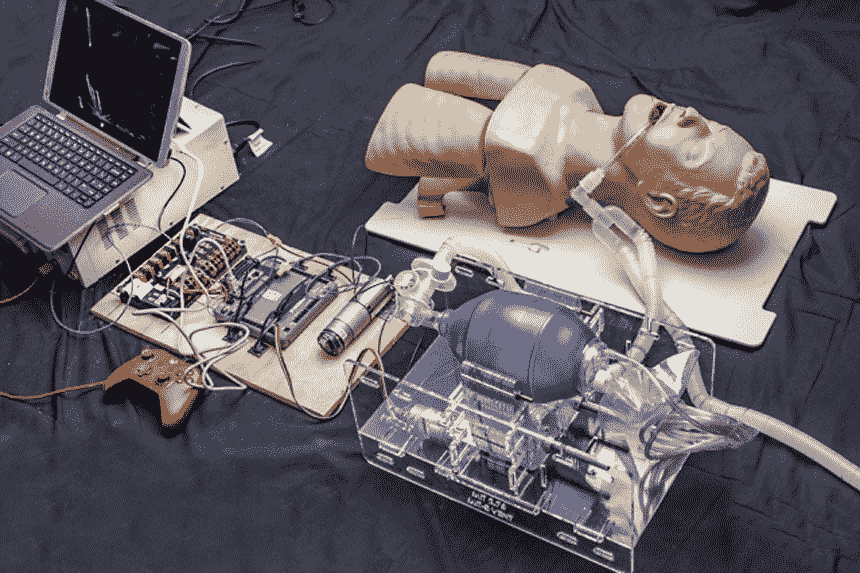
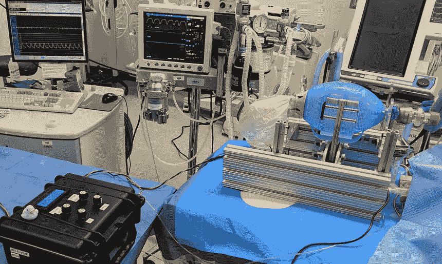

# 麻省理工学院正在为新冠肺炎危机制造一个开源呼吸机

> 原文：<https://thenewstack.io/mit-is-making-an-affordable-open-source-ventilator-for-the-covid-19-crisis/>

除了口罩、手套和其他个人防护设备的短缺，正在进行的新冠肺炎疫情最令人担忧的不确定性之一是如何解决通风设备的短缺。作为最后的手段，这些救生机器帮助危重病人在他们病得不能自己呼吸时进行机械呼吸。

然而，随着越来越多的人感染冠状病毒，对呼吸机的需求已经迅速超过了世界各地的供应，导致医生做出令人心痛的决定，即哪些病人将被连接到可用的呼吸机上——并有可能存活——以及[哪些病人不会，因此可能会死亡](https://www.nytimes.com/2020/03/31/us/coronavirus-covid-triage-rationing-ventilators.html)。但问题是，即使在最好的情况下，这些专用设备的制造成本也很高，每台大约 3 万美元。

这就是[开源](https://thenewstack.io/tag/open-source/)模型可能填补空白的地方，正如麻省理工学院附属的专家志愿者团队现在正在做的 [E-Vent](https://e-vent.mit.edu/) ，这是一种开源的“紧急呼吸机”，十年前作为原型开发，作为一门叫做医疗设备设计的课程的一部分。用当时大约 100 美元的零件建造，今天只需要 500 美元。尽管它在几年前那门课结束后被封存，但现在一个由科学家、医生、工程师和软件开发人员组成的新的跨学科团队正在围绕该项目进行整合，以针对新冠肺炎危机复兴和更新该项目，并正在寻求 FDA 批准该项目的最新版本，作为一种可以大规模部署的经济高效的生命支持设备。

## 开源解决方案

根据之前麻省理工学院团队的[论文](https://e-vent.mit.edu/wp-content/uploads/2020/03/DMD-2010-MIT-E-Vent.pdf)，第一个 E-Vent 原型最初是为无法获得机械化机器或可靠电力的偏远农村地区以及在大规模紧急情况下对通风机需求激增可能成为问题的更发达地区设计的。

“在发达国家，储备充足的医疗中心随处可见，但问题的性质不同，”该团队写道。“虽然有足够的呼吸机供日常使用，但缺乏对大规模伤亡情况的准备，如流感大流行、自然灾害和大规模有毒化学品释放。在发达国家，为大规模伤亡事故储备和部署最先进的机械呼吸机的成本高得令人望而却步。”

为了解决这个问题，最初的设计是基于[袋阀面罩](https://en.wikipedia.org/wiki/Bag_valve_mask)(也称为 Ambu 袋)，这是一种廉价的自动充气塑料袋，可以由训练有素的医护人员手动挤压，以便手动帮助患者呼吸，因为空气是通过插入用户呼吸道的连接管泵入患者肺部的。

可以想象，普通的手动操作气囊式面罩有明显的缺点。首先，它需要在手动调节每个泵送周期的时间间隔和压力方面受过良好训练的人持续操作。其次，这种手动方法会有相当大的误差，这可能最终对患者的健康结果产生负面影响——特别是当使用人工呼吸的两周治疗过程中估计需要 100 万个周期时。第三，虽然在医院里可以找到大量的急救包，但它们相对脆弱，所以在设备操作过程中不损坏它们是至关重要的。

为了克服这些缺点，十年前 E-Vent 原型的初始设计集成了一个电机驱动系统，该系统使用一个机械化的枢转凸轮臂，无需人工操作，并具有用户友好的可调输入旋钮，可调节各种参数，如潮气量和每分钟呼吸次数，以及辅助控制模式和过压警报。

在初步测试中的早期 E-Vent 原型。

为了升级之前的原型，使其能够应对新冠肺炎疫情目前的挑战，目前的团队正在夜以继日地合作，完善设计和底层代码，以确保该设备在运行期间不会发生灾难性的故障。到目前为止，他们一直在测试他们的改进，并在他们的[网站](https://e-vent.mit.edu/)上提供关于呼吸机制造和临床使用的重要指南和所需规范。

该团队警告说，在更大的开源规模上建造这些便携式呼吸机不应该由 DIY 爱好者来完成，而是由那些对 FDA 法规的要求有明确想法的人来完成。这种机器也应该由训练有素的临床医生操作。

正在进行测试的最新版本的 E-Vent 之一。

该团队在[新闻稿](http://news.mit.edu/2020/ventilator-covid-deployment-open-source-low-cost-0326)中表示:“随着设计指南的开发和记录，我们将在滚动的基础上发布设计指南(临床、机械、电气/控制、测试)。“我们鼓励有能力的临床工程团队在遵循主要规范和安全信息的同时，利用当地资源开展工作，并欢迎其他团队提供任何意见。”

可能还需要一段时间，电子事故的批准版本才能在医院正式出现。然而，开发一种短期解决方案，如 E-Vent——这将为更多重症新冠肺炎患者释放传统呼吸机——从长远来看，这是一个最终非常有意义的想法，而且它可能会在未来的紧急情况下再次被证明是有用的。

*要了解更多信息，请访问[麻省理工学院紧急呼吸机(E-Vent)项目](https://e-vent.mit.edu/)。*

*图片:麻省理工学院*

<svg xmlns:xlink="http://www.w3.org/1999/xlink" viewBox="0 0 68 31" version="1.1"><title>Group</title> <desc>Created with Sketch.</desc></svg>