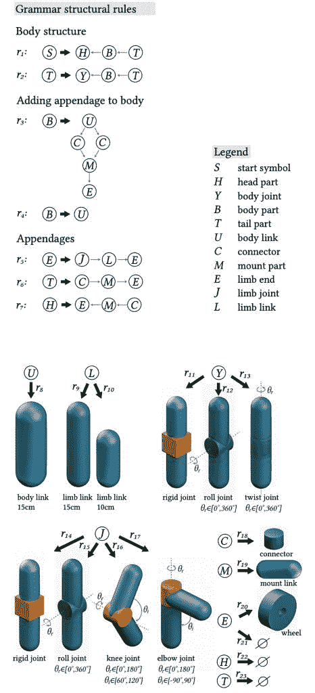
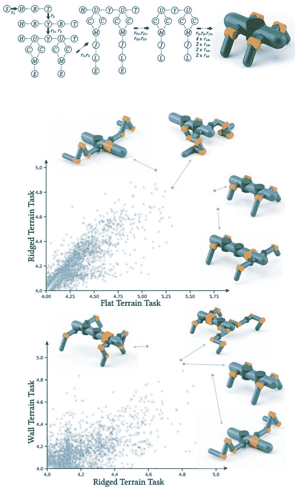

# 麻省理工学院机器学习使用“图形语法”来自动化和优化机器人设计

> 原文：<https://thenewstack.io/mit-machine-learning-uses-graph-grammar-to-automate-and-optimize-robot-design/>

在过去的几年里，我们已经看到机器人领域出现了不少有趣的项目。从通过熔化自己的关节来变形的多功能机器人到 T2 的多功能软机器人和 T4 的纳米级 DNA 机器人，似乎有可能为几乎任何情况创造某种机器人解决方案。当然，一些专家指出，这些高度定制化的方法可能会导致机器人进化中的一种零敲碎打:每次设计机器人时，不同的团队都在“重新发明轮子”，创造出不同种类的硬件和软件。作为回应，一些人建议使用类似于[模块化机器人系统](https://thenewstack.io/mits-fiberbots-collaborate-for-robotic-swarm-construction/)的替代方案，甚至更广泛的[开源方法](https://thenewstack.io/robotics-operating-system-brings-open-source-approach-to-robotics-development/)来设计机器人。

由字母表示的语法结构“规则”，以及它们所表示的实际机器人组件。

在麻省理工学院，研究人员提出了另一种可能的行动方案:使用一种“机器人语法”系统来创造机器人，这些机器人可以根据当前的需要和不同的地形自动优化。

该系统被称为 [RoboGrammar](https://github.com/allanzhao/RoboGrammar) ，它基于所谓的[图语法](https://www.sciencedirect.com/science/article/pii/089812219290124Z)，这是一种从计算机科学借来的技术，其中一系列相关对象——或“图”——通过算法转换成新的“图”,从而生成遵循一套转换规则的新抽象，就像语法规则如何影响人类语言的结构一样。图语法本质上提供了用于生成、操纵和分析这种结构的基于规则的机制。

“RoboGrammar 是一个为不同地形寻找专门机器人设计的框架，”Allan Zhao 解释道，他是麻省理工学院[计算机科学和人工智能实验室](https://www.csail.mit.edu/)(CSAIL)Wojciech Matusik 教授小组的一名博士生，也是该论文的第一作者。“我们使用‘图形语法’来表达设计，这限制了机器人部件如何组装在一起，并有助于避免无意义的设计。”

## 灵活创新的语法系统

RoboGrammar 背后的想法是利用机器学习算法来寻找更多创新的机器人设计，并根据任何需要的地形自动优化它们。但是为了使这个过程更有效率，可能的结果和安排的数量受到一小组规则的限制。例如，基于语法的系统可以规定机器人原型的腿段应该通过关节连接起来，而不是连接到一只手臂或另一条腿。

根据该团队的说法，RoboGrammar 系统最初的灵感来自节肢动物的形式——带有外骨骼的分节生物，包括昆虫、蜘蛛和龙虾等标本。从进化角度来说，这些生物是地球上最成功的生物之一，因为它们占已知动物物种的 80%以上。因此，这里的概念是采用一些自然界最好的设计思想，同时仍然允许新的方案出现，而不是浪费时间开发从长远来看可能不可行的原型。

“其他现有的机器人设计系统并不限制部件的组合方式，这意味着很少有可能的组合能够工作，”赵说。“图形语法有助于减少需要搜索的组合数量，同时还为创造力留下了空间。”

## 缩小可能性

特别是，该团队的系统使用了他们所谓的“图形启发式搜索”(graph heuristic search)，这是一种有效搜索充满许多不同可能组合的设计空间的新方法，并优先探索最有希望的选项，同时还绘制出任何不完整的设计，以及通过进一步开发它们可能达到的最佳性能水平。

“我们的图启发式搜索受到了 [A-star 算法](https://www.geeksforgeeks.org/a-search-algorithm/)(路径查找和图遍历中使用的最佳技术之一)的启发，并借鉴了一些强化学习的思想，”赵解释道。“我们使用基于[图形神经网络](https://medium.com/dair-ai/an-illustrated-guide-to-graph-neural-networks-d5564a551783)的学习启发式函数来决定在每次迭代中尝试哪种设计。在获得设计的性能后，我们使用[反向传播](http://neuralnetworksanddeeplearning.com/chap2.html)来更新启发式函数。这个想法是，随着时间的推移，启发式函数将变得更加准确，并将搜索范围缩小到设计空间中更有前途的分支。”

总的来说，RoboGrammar 系统首先定义问题——注意存在什么样的地形，它有多滑等等——然后在选择最佳解决方案之前，生成可能的机器人设计。人类用户也可以在这个过程中输入其他因素，比如指定有多少机器人组件，如手臂、腿、轮子和马达。通过这样做，系统可以提供成千上万种可能性，人类用户可以选择进一步开发。

但是机器人不会自己移动。它也需要一个系统来控制它。因此，除此之外，该团队还使用了一种称为模型预测控制的算法，该算法根据每个机器人的特定形式定制控制系统，从而快速优化控制系统，使其朝着稳定的前进步态前进，无论其形状如何。

为了测试他们的系统，该团队生成了模拟机器人，并发现通常情况下，最好的设计解决方案来自四足动物。“这并不令人惊讶，但许多最好的设计最终都有四条腿。也许四条腿在稳定性和重量之间提供了很好的平衡，”赵推测道。

该团队的目的是提供 RoboGrammar 作为一种工具，帮助机器人工程师简化他们的设计过程，但可能还有其他潜在的应用。

“在设计机器人的早期阶段，当试图确定一个通用的形式时，这可能是有用的，”赵补充说。“但是它也可以被用来在虚拟世界中快速繁殖许多不同的生物。到目前为止，结果只是基于模拟，将它们转化到现实世界将是合乎逻辑的下一步，这是我们目前正在努力的。语法还可以扩展到包括更多种类的形式，比如海洋生物。”

一个由 RoboGrammar 的系统生成的原型，以及两个显示几个不同原型在两种地形中的表现的图表。

*在这里阅读团队论文[，或者在](https://people.csail.mit.edu/jiex/papers/robogrammar/paper.pdf) [GitHub](https://github.com/allanzhao/RoboGrammar) 上下载代码。*

<svg xmlns:xlink="http://www.w3.org/1999/xlink" viewBox="0 0 68 31" version="1.1"><title>Group</title> <desc>Created with Sketch.</desc></svg>