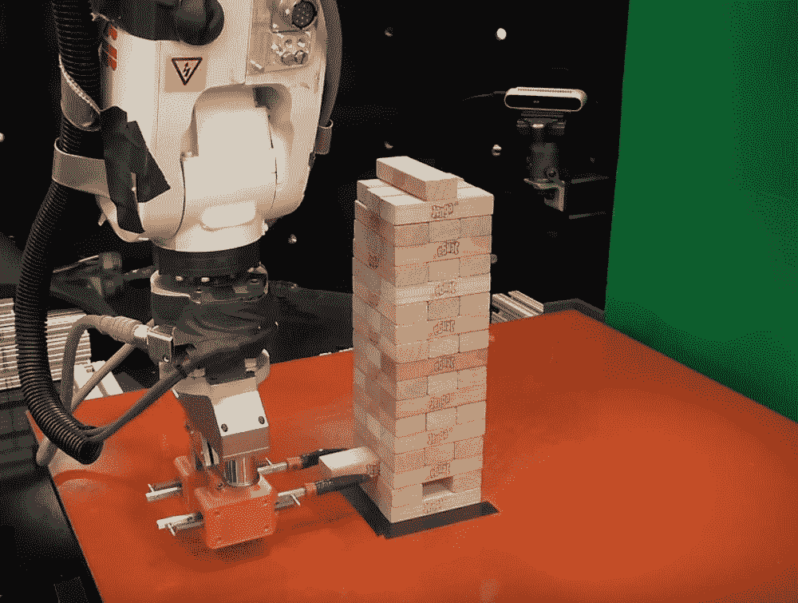
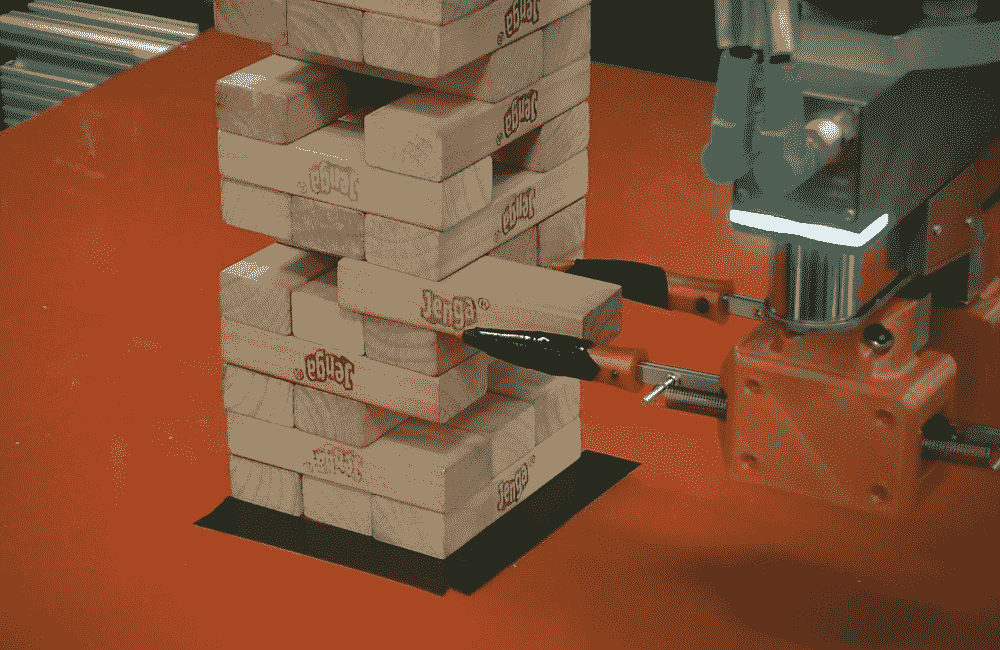
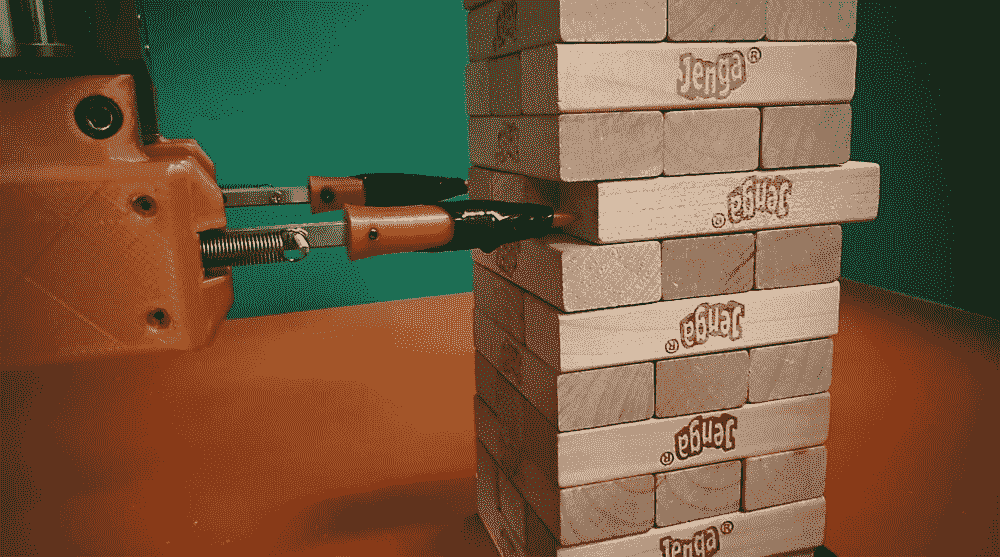

# 麻省理工学院机器人使用触觉推理人工智能像人类一样玩叠人偶

> 原文：<https://thenewstack.io/mit-robot-uses-tactile-reasoning-ai-to-play-jenga-like-a-human/>

越来越明显的是，在执行专门的认知任务时，机器具有优势(或者至少正在迅速赶上)，比如在国际象棋中控制人类，在 T2 围棋中控制人类，或者在 T4 扑克游戏中学习如何虚张声势。虽然能够完成各种任务的全面的、类似人类的人工通用智能还有一段路要走，但智能机器还有其他领域要征服——例如掌握叠人龙。

为此，麻省理工学院的研究人员现在开发了一种机器人，它可以使用类似人类的分层学习模型来玩 Jenga。虽然对我们来说这看起来并不复杂，但是对于机器来说，叠树实际上很难理解。以斯瓦希里语单词 *kujenga* 命名，意思是“建造”，jenga 是一种需要玩家处理大量触觉信息的游戏，因为他们试图通过逐步提取和堆叠棋子来仔细重新排列它们，而不推翻越来越不稳定的结构。这是一个有趣的挑战，大多数人可以在几场比赛内学会玩得相当好，但看看团队的机械臂是如何表现的:

[https://www.youtube.com/embed/o1j_amoldMs?feature=oembed](https://www.youtube.com/embed/o1j_amoldMs?feature=oembed)

视频

麻省理工学院的机器人让它看起来很容易，但实际上在引擎盖下有很多事情要做。对于大多数机器人来说，学习玩好叠人偶很困难，因为它们并不特别擅长所谓的触觉推理，即利用从身体接触和与物体互动中收集的线索来执行任务的能力。

“与更纯粹的认知任务或游戏(如国际象棋或围棋)不同，玩叠人龙游戏还需要掌握物理技能，如探测、推、拉、放置和排列棋子，”麻省理工学院工程学教授阿尔伯托·罗德里格斯解释道，他也是发表在[科学机器人学](http://robotics.sciencemag.org/content/4/26/eaav3123)上的研究报告的合著者。“它需要交互式感知和操作，你必须去触摸塔，以了解如何以及何时移动砖块。这很难模拟，所以机器人必须在现实世界中学习，通过与真实的叠木塔互动。关键的挑战是通过利用关于物体和物理的常识，从相对较少的实验中学习。”

## 结合视觉和触觉推理

为了建造一个具有更发达触觉推理能力的机器人，该团队创建了一个人工智能模型，模拟人类可能如何实现这一壮举——首先通过短暂的试错期来学习游戏，然后使用之前尝试的触觉和视觉数据来推断未来的行动可能如何影响积木的行为。

更具体地说，该团队使用了 ABB IRB 120 机械臂，此外还有一个[贝叶斯模型](https://en.wikipedia.org/wiki/Bayesian_network)。每当机器人肢体试图推动和重新定位一块积木时，系统都会记录下视觉和触觉测量结果，以及尝试是否成功。然后，系统将根据它当前的动作和它做出的推断来调整它的行为。与可能需要通过数万次方块操作尝试来训练的传统人工智能模型相比，该团队的模型仅在大约 300 次尝试中得到了足够的训练，这要归功于它对某些方块行为的数据以及相关物理信息进行“聚类”的能力。

根据该团队的说法，这种数据聚类技术通过允许机器人根据以前的经验对可能的结果进行分组，从而提高了机器人学习游戏的效率，因此使它能够使用当前的视觉和触觉数据预测它是否能够成功移动特定的块。

“机器人建立集群，然后学习每个集群的模型，而不是学习一个捕捉所有可能发生的事情的模型，”麻省理工学院研究生兼主要作者尼玛·法泽利指出。

当在模拟中测试他们的模型与其他机器学习算法时，该团队发现其他模型需要“数量级更多的塔”才能成功学习游戏。该团队甚至将他们的系统与人类志愿者进行了对比，发现机器人手臂的表现几乎与人类一样好，尽管在他们的机器人能够与人类叠罗汉冠军进行战略性竞争之前，仍有一些改进的空间。

然而，拥有一个不仅能看，还能从动作中“感觉”的机器人，在除了玩游戏之外的其他应用中是必不可少的。例如，这种灵巧的机器人军队将非常适合组装微小的电子部件或协助[外科手术](https://thenewstack.io/autonomous-robot-surgical-cuts-better-human-surgeon/)——尽管这种实现无疑将加速已经在进行的[机器人接管](https://thenewstack.io/will-happen-robots-take-jobs/)。

在 [*科学机器人*](http://robotics.sciencemag.org/content/4/26/eaav3123) 阅读论文。

图片:麻省理工学院

<svg xmlns:xlink="http://www.w3.org/1999/xlink" viewBox="0 0 68 31" version="1.1"><title>Group</title> <desc>Created with Sketch.</desc></svg>