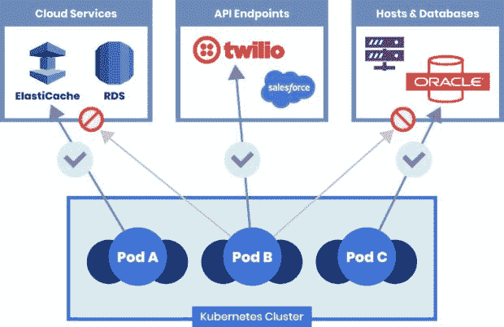

# 米特 ATT 和 CK 框架:识别威胁行动者的心态

> 原文：<https://thenewstack.io/mitre-attck-framework-discerning-a-threat-actors-mindset/>

想象一个军队试图入侵敌人的领土。一旦士兵渗透进了反对派，他们会怎么做？他们会躲起来，等待合适的时机发动攻击。同样，在网络犯罪中，攻击者会花时间来确保他们避开任何类型的防御措施。防御闪避是 ATT T2 CK 框架 T1 的第五阶段。在本文中，我将探讨第五个阶段，以及第六到第九个阶段，并提供一些关于如何减轻相关攻击技术的建议。

## 交付和开发策略

### 防御规避

许多安全解决方案提供了广泛的功能来检测和跟踪容器中的恶意行为。防御规避技术旨在混淆这些工具，以便坏人所做的一切看起来是合法的。

防御规避的一个例子包括直接在主机上构建容器映像，而不是从公共或私有注册中心获取。还有更难识别的规避技术，例如基于反向取证的技术。攻击者使用这些技术来删除与其恶意活动相关的所有日志和事件，以便安全、安全信息和事件管理(SIEM)或可观察性工具的管理员不知道发生了未经授权的事件或过程。

为了防止防御规避，您将需要一个容器安全解决方案，它可以在运行时检测恶意软件，并提供威胁检测和阻止功能。这方面的两个例子是防止恶意软件的运行时威胁防御和捕获恶意参与者和活动的蜜罐。

### 凭证访问

如果在采用防御性规避技术后，攻击者未能成功获取敏感数据，他们可能会查看帐户、密码和其他凭据，以访问他们正在寻找的数据。

攻击者可以通过多种方式获得他们需要的凭证，例如社会工程、鱼叉式网络钓鱼、暴力和网络嗅探。在基于 Kubernetes 的环境中，需要 API 的访问令牌来授权发生在 Kubernetes API 服务器和容器进程之间的 API 通信(OAuth 2.0)。如果这些令牌遭到破坏，任何攻击者都可以作为授权用户运行 Kubernetes 命令。

### 发现

对于攻击者和组织(防御者)来说，这都是一个关键阶段。一旦对手从这一阶段获得了足够的关于所有资源的信息，例如 pod、节点、图像等。，他们就有了整个应用程序的大致蓝图。这些信息可用于计划如何从一个工作负载转移到另一个工作负载，直到达到期望的结果。大多数威胁参与者和团队在此阶段花费了大量时间。

为了挫败攻击者，您需要一个具有[零信任](https://link.tigera.io/ueMDb)工作负载访问的解决方案，该解决方案在攻击的发现阶段提供以下缓解策略:

*   DNS 策略和工作负载访问控制来限制对资源的访问。
*   基于身份的微分段可减少攻击面，防止敏感工作负载被发现。

## 安装和传播策略

### 横向运动

使用公共云服务带来的一系列好处以及云原生应用程序的架构方式都有一个缺点:横向通信。传统上，我们会看到进出网络边界的流量多于未触及边界防火墙的流量(东西向流量)。随着现代云原生应用的出现，这个数字发生了逆转。

在基于 Kubernetes 的微服务应用程序中，我们往往会看到服务之间和 pod 内部的高流量。虽然 [MITRE 框架](https://thenewstack.io/mitre-attck-frameworks-get-a-handle-on-kubernetes-security-defense/)将“横向移动”作为一种策略，但它并没有解决横向流动的数据平面或用户流量。

横向移动是容器安全的一个重要方面，因为它可以规避传统的安全工具，而这些工具不是为部署在基于 Kubernetes 的应用程序中而设计的。

这就是[零信任工作负载安全](https://link.tigera.io/ueRR8)原则发挥作用的地方:您将希望对用户流量使用[最低特权访问](https://thenewstack.io/key-concepts/zero-trust-security/)。对工作负载应用 DNS 策略有助于确保基于工作负载的功能控制和过滤单元间通信等粒度访问。

图 1:零信任工作负载安全性

## 指挥和控制策略

### 影响

任何对手或不良行为者的最终目标可能是以下一项或多项:

*   窃取敏感数据
*   持有窃取的数据以获取赎金(勒索软件)
*   窃取计算资源以挖掘加密货币(加密劫持)
*   国家支持的网络恐怖主义摧毁公共基础设施

组织最担心的是通过命令和控制活动丢失关键数据，包括内部和客户信息。任何安全系统，无论它在检测漏洞或威胁活动方面有多好，都必须能够阻止敏感数据从组织内部传输到外部参与者。

在容器化的环境中，这意味着当工作负载与集群内的其他工作负载、集群外的外部应用程序和工作负载以及最终用户通信时，要对工作负载应用最小特权原则。

通过使用一套零信任安全策略、[微分段](https://link.tigera.io/ueMDd)来限制攻击的爆炸半径、全局默认拒绝策略以及异常检测警报，您可以保护工作负载免受攻击的严重影响。

## 结论

本文探讨了网络犯罪分子破坏组织的思维模式和策略。集装箱安全解决方案应该通过投资于为集装箱和 Kubernetes 量身定制的安全方法来领先罪犯一步。DevOps 和平台团队的理想解决方案将是 Kubernetes native，并采用稳固的纵深防御策略。

*Calico Cloud 在构建、部署和运行时为容器提供基于零信任的安全性。*[*【14 天试用】免费试用印花布云*](https://link.tigera.io/ueRRW) *。*

<svg viewBox="0 0 68 31" version="1.1" xmlns:xlink="http://www.w3.org/1999/xlink"><title>Group</title> <desc>Created with Sketch.</desc></svg>