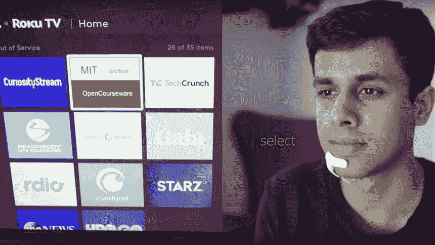

# 麻省理工学院的 AlterEgo 耳机可以让你安静地与声控设备交谈

> 原文：<https://thenewstack.io/mits-alterego-headset-lets-you-silently-converse-with-voice-controlled-devices/>

用一个人的声音告诉计算机做什么的想法在科幻类型中很常见，但这也是我们现在在 Siri、Alexa 和 Cortana 等声控助手中实际看到的东西。但这些平台的一大缺点是，它们不是私人交易所；那些在听力范围内的人也可以听到您与您的设备进行的任何对话。

但是随着 T2 麻省理工学院媒体实验室的研究人员正在开发的一种设备，这种情况可能会改变。被称为 [AlterEgo](https://www.media.mit.edu/projects/alterego/overview/) 的这款隐形工具允许用户使用可以无声地用语言表达的命令与计算机进行交互，通过解释一个人自言自语时下巴和面部的神经肌肉信号。观察它在日常生活中的应用:

[https://www.youtube.com/embed/RuUSc53Xpeg?feature=oembed](https://www.youtube.com/embed/RuUSc53Xpeg?feature=oembed)

视频

“这样做的动机是建立一个智能设备——一个智能增强设备，”[说](http://news.mit.edu/2018/computer-system-transcribes-words-users-speak-silently-0404) [Arnav Kapur](https://www.media.mit.edu/people/arnavk/overview/) ，麻省理工学院研究生和[研究论文](https://dam-prod.media.mit.edu/x/2018/03/23/p43-kapur_BRjFwE6.pdf)的主要作者之一。“我们的想法是:我们能不能有一个更内在的计算平台，在某些方面融合人类和机器，感觉像我们自己认知的内部延伸？”

AlterEgo 被设想为“可穿戴的无声语音界面”，用户不仅可以用自然语言发出命令和查询，还可以无声地听到回答。这个设计利用了所谓的[默读](https://en.wikipedia.org/wiki/Subvocalization)，或者一个人在阅读时通常参与的“无声语言”的自然过程。这种在语音变成可听见的声音之前发音的无声动作在喉部和其他肌肉中产生微小的运动，产生可以被机器检测到的电信号。为了跟踪这些微小的电子信号，AlterEgo 设备采用了四个电极，这些电极放置在沿着面部和下巴一侧的战略点(如下所示)，这些信号可以被可靠地拾取。

这些来自用户内部语言的电脉冲然后由卷积神经网络处理，该网络已经被训练来将这些信号分类并翻译成单词。然后，AlterEgo 也可以用自然语言做出回应，通过振动到用户内耳的骨传导耳机，让他们听到答案，而不会淹没用户环境中的其他听觉信息。此外，界面的神经网络可以重新训练自己，以适应每个用户的神经生理学的特质。

该团队在 10 名参与者中测试了他们的原型，让他们使用该设备完成特定任务，即算术计算和下棋，使用标准记数系统报告游戏棋盘上的移动。研究人员特别选择了这些任务，因为这些任务可以在相对有限的词汇范围内完成。平均而言，该设备能够在 92%的时间内准确转录信号，平均延迟时间为 0.427 秒。

无论如何，这里有很多有趣的可能性:我们不仅能够在没有任何人窃听的情况下与我们的机器私下交谈，这样的界面将创造一个更加无缝的用户体验。例如，人们不必在智能手机上输入或切换应用程序，而是可以与自己的设备静静地交谈来执行任务，而不必过多地转移对周围环境的注意力。

这种更顺畅的机器工作流程不仅可以用于与各种应用程序、物联网或智能设备进行交互，还可以用于在与[协作机器人](https://thenewstack.io/collaborative-robots-will-help-human-workers-not-replace/)一起工作时需要一些听觉判断力的工作场所，如医疗领域或军事行动。

从更广的层面来看，AlterEgo 的创造者们设想了其他一些完全浮现的事物。面对可能在生活的许多领域超越人类的超级智能机器的崛起，AlterEgo 等工具可以通过显著增强人类的能力、创造更自然的“人机共生”和推进“无声计算”领域来帮助创造公平的竞争环境。

“AlterEgo 旨在将人类和计算机结合起来——这样计算、互联网和人工智能将作为‘第二个自我’融入人类个性，并增强人类的认知和能力，”研究小组说。

其他人，如埃隆·马斯克，已经提出了类似的脑机接口，这将允许人类获得更大的计算能力和人类的集体知识。然而，AlterEgo 可能是达到同样目的的一种侵入性较小的方法。

人类和机器交织在一起的共生“第二自我”的想法还很遥远，但与此同时，我们仍然没有完全解开这种可能性的所有伦理和哲学含义。目前，Kapur 表示，目标是通过更多的训练数据来进一步提高系统的性能，这也将有助于开发更通用的无声语音识别模型，并建立更大词汇量的更广泛的应用程序。最终，我们的计划是对其进行改进，使界面更接近对话水平——这意味着有一天，这种设备很可能会让我们许多人定期自言自语。

阅读其余的[纸](https://dam-prod.media.mit.edu/x/2018/03/23/p43-kapur_BRjFwE6.pdf)。

图片:麻省理工学院媒体实验室

通过 Pixabay 的特征图像。

<svg xmlns:xlink="http://www.w3.org/1999/xlink" viewBox="0 0 68 31" version="1.1"><title>Group</title> <desc>Created with Sketch.</desc></svg>