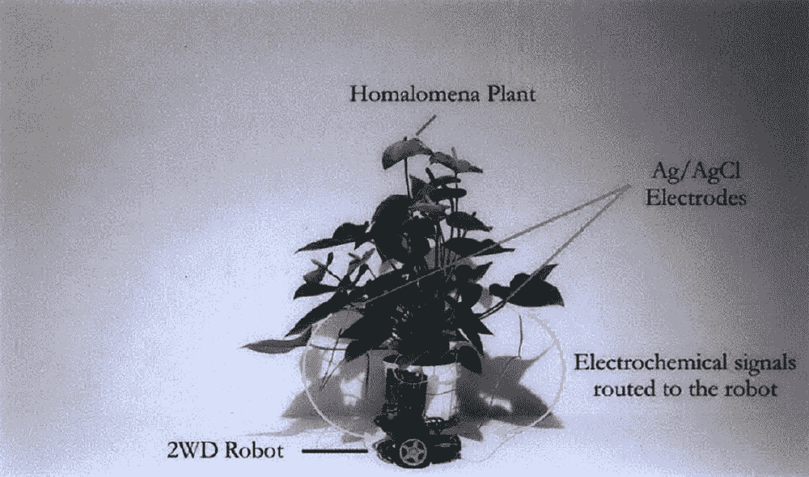
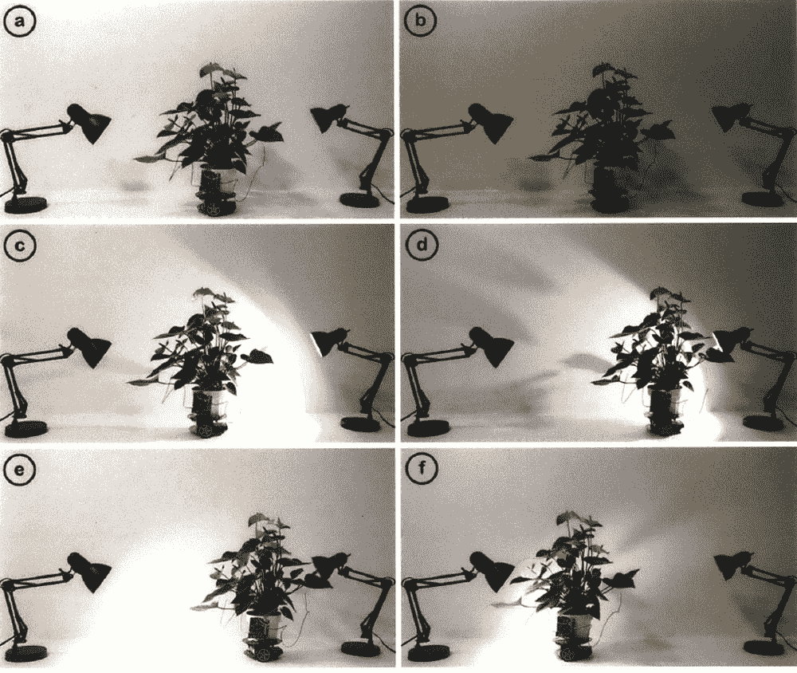
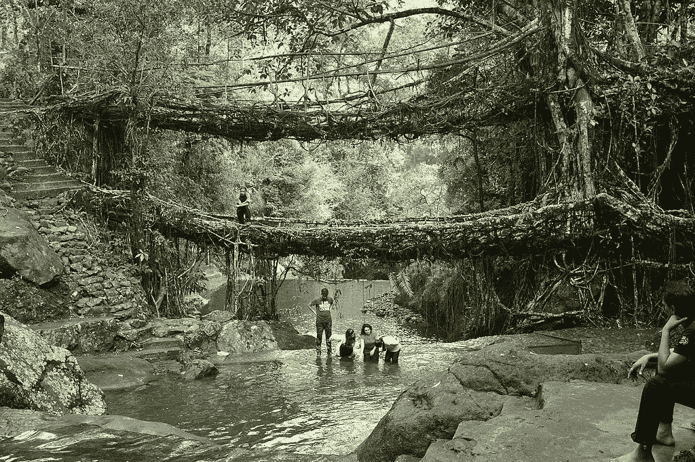

# 麻省理工学院的电子工厂可以将自己移动到光线中生存

> 原文：<https://thenewstack.io/mits-cyborg-plant-can-move-itself-into-the-light-to-survive/>

对我们这些两足肉袋来说，大多数植物看起来像是相对被动的有机体，悲惨地扎根在原地，被迫忍受扔给它们的任何气候条件。但仔细观察，我们会发现植物实际上非常神奇，经常表现出令人惊叹的能力，如光合作用、生物发光，甚至是几百万年进化的结果。

所以，是的，植物是非常整洁的——但是总的来说仍然是静止的生命形式。但是如果植物和机器合并会怎么样呢？

这似乎是一个疯狂的想法，但是用机器人技术增强生物的概念并不新鲜。现在，来自麻省理工学院媒体实验室的研究人员正在提出一种他们称之为“半机器人植物学”的东西，在这种植物中，植物被增强了传感器和致动器，以创造一种“半植物，半机器”，这样它就可以自己行动，在这种情况下，朝着光源移动。看看这种植物-机器的混合体:

[https://www.youtube.com/embed/rptKlKZc7cs?feature=oembed](https://www.youtube.com/embed/rptKlKZc7cs?feature=oembed)

视频

昵称为 [Elowan](https://www.media.mit.edu/projects/elowan-a-plant-robot-hybrid/overview/) 的这个控制论工厂通过一系列银电极与一组机器人轮子连接，这些银电极检测来自工厂的生物电化学信号，这些信号是对光线、重力、刺激、温度、损害和其他因素等变化的自然反应。虽然植物会以最大限度地暴露在赋予生命的光线下的方式自然而缓慢地生长，但在这种情况下，Elowan 能够通过自主转向光线，根据自己的生物电化学脉冲——如果你愿意，可以称之为“植物大脑”——采取行动。

为了实现这一点，Elowan 的自然电信号在团队的实验中被放大，这个控制论设备被放置在两个光源之间，在开和关之间交替。当一盏灯关闭，另一盏灯打开时，Elowan 的气孔打开，细胞去极化。电极感测信号的这些变化，这些信号通过仪表放大器放大并传送到机器人微控制器，该微控制器已被编程为通过以下方式做出反应:将车轮转向正确的方向，旋转其 2WD 驱动机器人底座远离熄灭的灯，然后移向照亮的光源。一种祖母绿宝石(*千年健*)植物被选中，因为它的叶子大且呈蜡状，电信号输出强。

## 植物是活跃的信号网络

这里的想法是建立在植物的自然特性上，想象一个更可持续的世界，在那里生物杂交可能是规范，植物和机器可以共生共存。

“植物是主动信号网络，是大规模的自我供电、自我制造和自我再生系统，”[写道](https://dspace.mit.edu/handle/1721.1/114063#files-area)项目研究员 Harpreet Sareen。“它们拥有电子设备所能承载的最佳功能。新范式不是建立完全离散的系统，而是指向利用植物(和自然界)中存在的能力，并与我们的数字世界创造混合体。”

> “植物是主动信号网络，是大规模的自我供电、自我制造和自我再生系统，”–harp reet Sareen

但是“半机器人植物学”的想法并没有停留在能够按照自己的意愿移动的自主生物杂交体上。萨林还设想，这种扩大的植物有朝一日可以形成一种“自动化树木建筑”的基础，在这种建筑中，植物被用来创造一种新型的自我生长、自我修复的建筑。就像在印度看到的古老的根桥一样，基于植物的建筑和基础设施可以根据需要生长和改造，从而带来更加自给自足和更具弹性的城市，产生一种融合了植物和机器优点的“替代生态”。我们可能还会有“[电子人花园](https://thenewstack.io/flora-robotica-let-robots-tend-gardens/)”，在那里可食用的植物能够自我培养，这样我们就可以在以后收获它们作为食物。

该项目指出，在未来，可以通过使用注射纳米材料来收集更精细的感官数据。“纳米材料也可以作为效应器，通过电磁波触发元素释放，”萨林解释道。“这样的研究将是建立双向数字生物学桥梁的一步；将我们的生态与数字系统相结合。”

最终，这项工作表明，一个更可持续的未来在于创造一个新的“技术植物”社会，萨林说:“作为我们设计过程的一部分，一个增强的自然只是一个开始。工厂和机器的合并将使我们能够实现我们在单独的硅世界中永远无法实现的能力。”

要了解更多，请阅读[论文](https://dspace.mit.edu/handle/1721.1/114063#files-area)，并访问[项目页面](https://www.media.mit.edu/projects/elowan-a-plant-robot-hybrid/overview/)。

图片:Chiranjeeb Baul(CC BY-SA 4.0)；麻省理工学院媒体实验室

<svg xmlns:xlink="http://www.w3.org/1999/xlink" viewBox="0 0 68 31" version="1.1"><title>Group</title> <desc>Created with Sketch.</desc></svg>