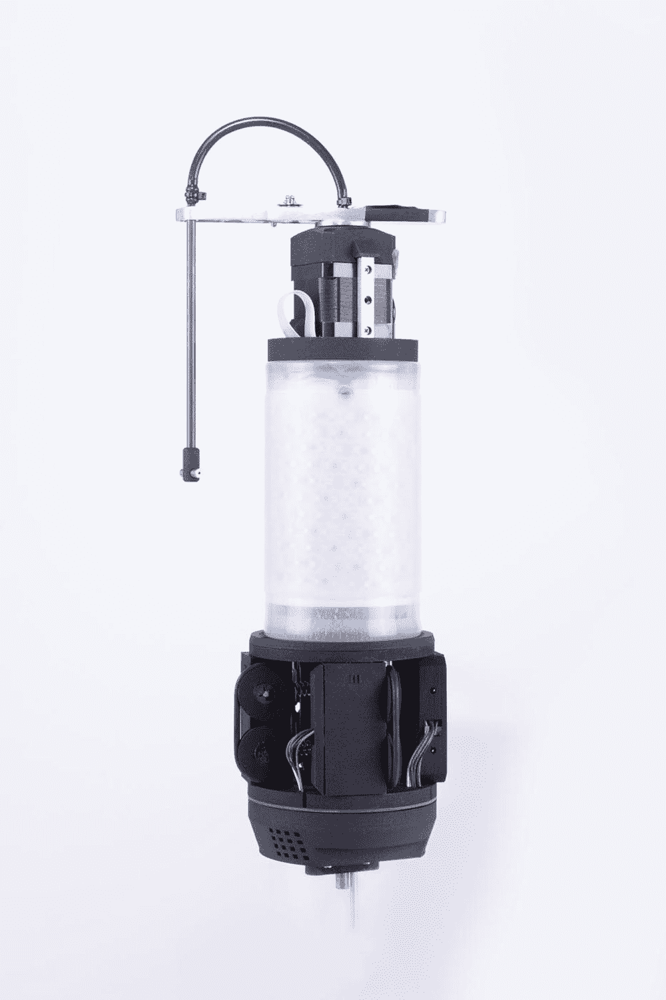
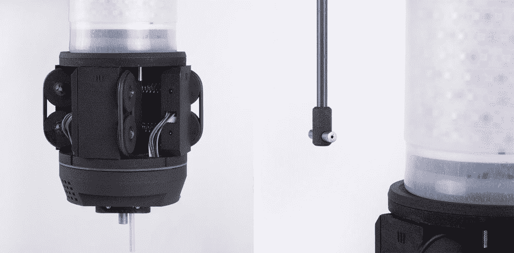
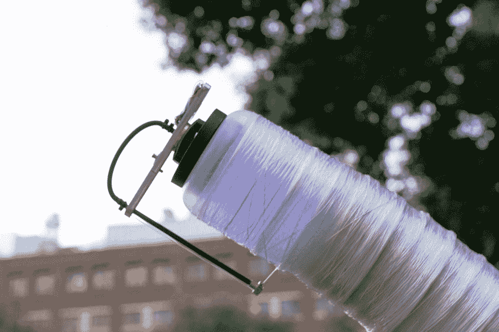
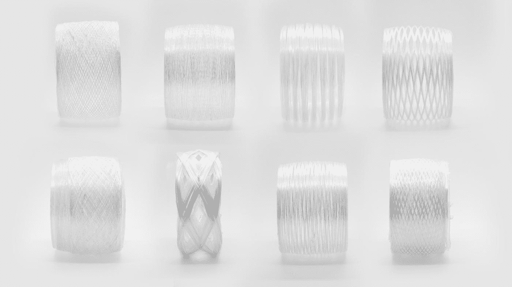
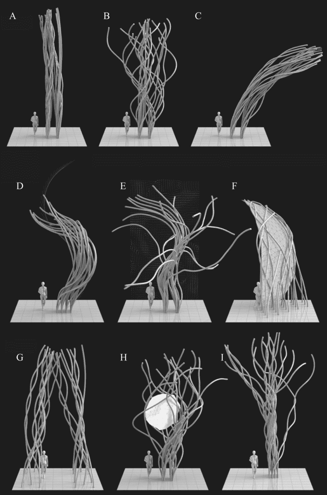

# 麻省理工学院的纤维机器人合作进行机器人“群体建设”

> 原文：<https://thenewstack.io/mits-fiberbots-collaborate-for-robotic-swarm-construction/>

尽管我们对即将到来的机器人接管持保留态度，各种各样的智能机器正在各个领域让人们知道它们的存在:创造出令人惊讶的好的 T2 音乐和 T4 文学，帮助人类外科医生提高建筑工地的生产力。

但是想象一下，如果这些机器人也能协同工作，就像一群蜜蜂在蜂巢中一起工作，或者一队蚂蚁把食物带回蚁群一样，它们会取得什么样的成就？分散的、自组织的群体智能概念在自然界中依然存在，一些人正在新兴的群体机器人领域中重新采用这些原则。麻省理工学院的中介物质小组最近就这样做了，推出了 [Fiberbots](https://www.media.mit.edu/projects/fiberbots/overview/) ，这是一个数字制造平台，利用一系列小型机器人合作创建基于纤维的结构，或者可能是手边的任何东西。手表:

https://vimeo.com/mediatedmattergroup/fiberbots

每个 Fiberbot 都由一个电动底座和一个旋转臂组成，以及一个由硅树脂制成的薄膜，可以充气。当这种薄膜膨胀后，机器人可以将自己附着在正在建造的结构上，然后玻璃纤维丝和树脂的混合物通过机器人的旋转臂送入，并在其喷嘴中混合。

然后，机器人将这种湿纤维围绕自身旋转，创造出高强度的管状结构，并用紫外线固化。一旦纤维外壳的最顶端部分固化，机器人就可以收缩自己，以便从该部分分离，并利用其电动底座在管中向上移动，以构建下一部分。

机器人能够改变方向，允许它一点一点地构建复杂的曲线。这些机器人能够彼此无线通信，并遵循用户确定的预编程轨迹。随着他们的成长，机器人的导航系统使用一种定制的算法，使他们能够独立或集体工作，但也防止了潜在的碰撞。

在团队的测试中，16 个纤维机器人被部署来建造一系列 15 英尺高的管状结构。设置系统和实际的建造过程花了大约 12 个小时，整个秋天和冬天建筑本身都在外面。该团队预测，这些机器人可能会被用于灾难情况下，它们可以从上面空投，并在几个小时内自动建造紧急避难所、桥梁或其他支撑结构。

## “群体方法”

这些小型机器人代表了其他形式的自动化建设的替代方案，即快速制造(RF)和快速制造(RM)。虽然这些系统已经存在了几十年，但是它们受到许多因素的限制，例如容纳打印机设备的台架的尺寸。这就是像纤维机器人这样的群体技术的用武之地。

“制造的群体方法可以通过数字化制造结构材料从根本上改变数字化建筑；产生大于其台架尺寸的产品和物体；并通过提供机器人编织和自由形式印刷等新型制造工艺来支持非分层结构，”研究人员解释道。“[快速制造和快速生产]方法有助于功能生成，但是，不容易扩展到大型系统。有了群体感应和驱动，系统对环境条件的反应和适应能力会更强。效仿自然，蜂群通过分布式任务、并行驱动和冗余来提供可靠性和效率。”

快速制作和快速制造方法还通常使用液体基、粉末基或固体材料，这些材料不一定是结构性的，因此不适合建筑应用。但是，从长远来看，更新更具创新性的材料和技术，比如这个项目中看到的材料和技术，很可能会改变建筑物的建造方式，或者说是旋转方式。

“纤维是未来的砖块，”建筑师、教授和中介物质小组的领导人内里·奥克斯曼告诉*。“我们将看到光纤无处不在，跨越尺度和应用，包括在身体、建筑物和环境之间携带和传输数据。就纤维机器人而言，我们选择玻璃纤维作为基本的结构材料进行实验，但我们目前正在考虑由天然材料制成的智能纤维，这种纤维不仅在结构上有前途，而且对环境友好。具体来说，玻璃纤维可以为建筑围护结构提供节能、绿色、可持续的解决方案。由于其组成，它具有相对较低的内含能量，并且可以成形为在多个方向上承载负载。”*

 *图片:麻省理工学院中介物质小组

<svg xmlns:xlink="http://www.w3.org/1999/xlink" viewBox="0 0 68 31" version="1.1"><title>Group</title> <desc>Created with Sketch.</desc></svg>*