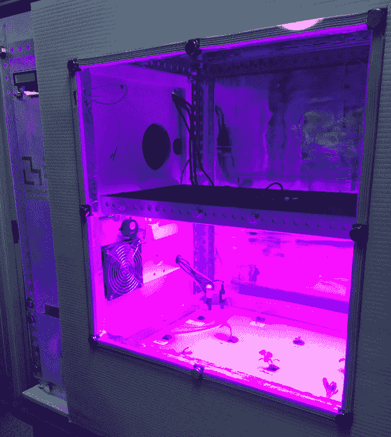
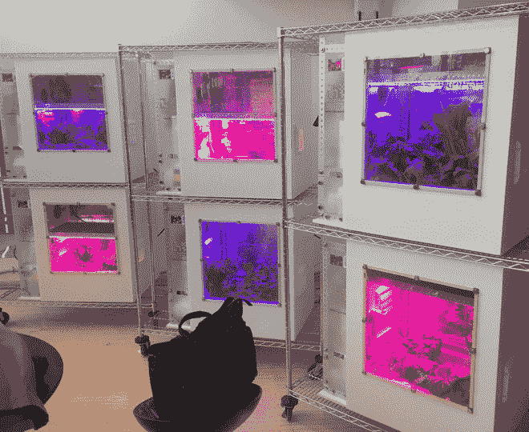
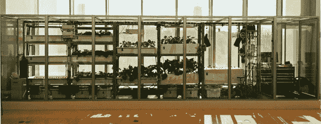

# 麻省理工学院的食品计算机为开源农业创造了条件

> 原文：<https://thenewstack.io/mits-food-computers-sets-stage-open-source-agriculture/>

我们大多数人可能不会过多考虑我们在超市买的食物。但在幕后，今天的粮食生产系统依赖于一个集中的、工业规模的供应链，而我们的大多数粮食作物仍然依赖于基于土壤的农业。

在许多情况下，这意味着食物必须经过很长的距离才能从农场到达餐桌，这意味着食物在到达你的餐桌时已经失去了很多新鲜度和营养价值。人们也越来越意识到这种模式是不可持续的:不断增长的城市化和可耕地的丧失、不断增长的人口以及由气候变化引起的干旱和洪水等极端天气事件日益频繁的压力，意味着我们将不得不缓慢但肯定地改变我们种植食物的方式。

这种转变有一些迹象:城市屋顶农场的出现，对自动化水培系统的兴趣激增。所有这些系统的问题在于，它们的平台都是专有的，它们之间缺乏一个公共平台，这意味着它们不一定能够纵向扩展。

这就是麻省理工学院的食品计算机可能会稍微改变现状的地方。作为在[麻省理工学院媒体实验室](https://www.media.mit.edu/)的[开放农业(OpenAG)倡议](http://openag.media.mit.edu/)的一部分，食品计算机是一个开源平台，它使用机器人系统在定制设计的孵化室中创建一个受控的水培食品生长环境。从这些粮食种植单位收集的数据在全球用户之间共享，鼓励基于计算的可访问和协作的粮食系统。

请看麻省理工学院 [OpenAG Initiative](http://openag.media.mit.edu/) 首席研究科学家 Caleb Harper 解释食品计算机是如何工作的，以及为什么它们可能是农业的未来:

https://youtu.be/LEx6K4P4GJc

## 分享“气候食谱”

食品计算机将允许监测和调整能源使用、二氧化碳、温度、湿度、溶解氧、潜在氢甚至电导率等变量，以优化生长条件。更有趣的是，这些变量还可以根据“气候配方”进行调整，这种配方可以复制特定地区的生长条件。

例如，如果你喜欢西班牙草莓的味道，你可以给食品计算机编程创造同样的条件，在你自己的家里生产味道和营养都一样的草莓。

根据研究人员的说法，你甚至可以“对生物和非生物压力进行编程，如诱导干旱，以创建所需的植物表达。”例如，对于味道更甜的生菜，你通过降低一个变量来给植物施加压力，作为回应，它会产生更多的糖来保护自己。

通过食品计算机的传感器网络不断收集关于植物生长和发育的数据点，每个生长周期平均每株植物收集 350 万个数据点。这些丰富的数据被聚集并共享在一个开放的数据库中，在那里，机器学习算法对其进行筛选，以创建那些定制的“气候食谱”。

世界各地的任何人都可以下载、修改和使用这些食谱。这里的想法是利用以这样一种开放的方式分享数据带来的优势，来彻底改变一个不适应当今环境、经济和社会现实的食品系统。

哈珀对[*【IEEE Spectrum*](http://spectrum.ieee.org/computing/embedded-systems/mits-food-computer-the-future-of-urban-agriculture)表示:“【网络农业】目前的状态是非常一次性的。“每个人都为工厂、仓库农场或垂直农场设计了自己独特的小型‘数据中心’。他们说它超级特别，并试图创造知识产权。他们不会让人进去，因为他们不想让其他人窃取他们的好主意。这就是我现在所在行业的问题。他们没有意识到这背后有一个系统。除非有一个通用的平台，否则它无法扩展。”

基于食物变成数字化数据的想法，食品计算机有三种尺寸:一种桌面大小的个人食品计算机，面向业余爱好者和学校；一个集装箱大小的食物服务器，为研究机构和餐馆设计；和一个仓库规模的食品数据中心，可以细分为不同作物的工业生产。

There’s no doubt that our current agricultural and distribution paradigm needs to change. In the future, we might look forward to not only widespread food computing, but also [distributed robot gardens](https://thenewstack.io/flora-robotica-let-robots-tend-gardens/) that combine machine intelligence with that of plants to build truly green and sustainable cities. At the very least, data-driven initiatives like OpenAG and its Food Computers will make agriculture ‘cool’ again, inspiring people to not only innovate, collaborate and to think creatively outside of the box, but also empowering them to change the way they feed themselves.

Images: MIT

<svg xmlns:xlink="http://www.w3.org/1999/xlink" viewBox="0 0 68 31" version="1.1"><title>Group</title> <desc>Created with Sketch.</desc></svg>