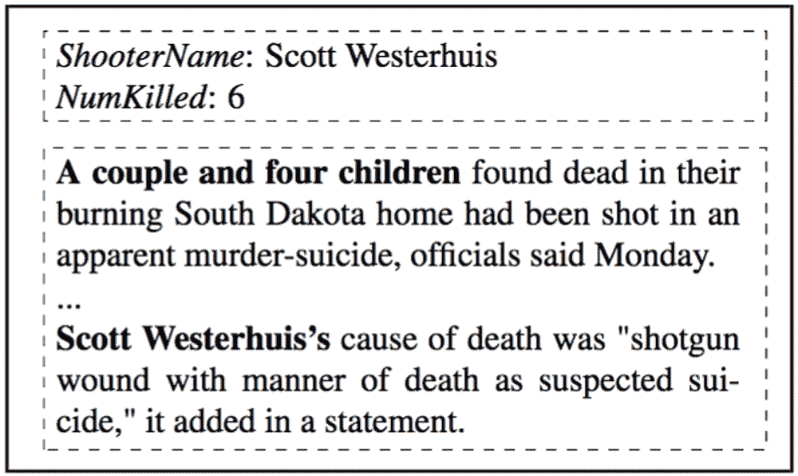
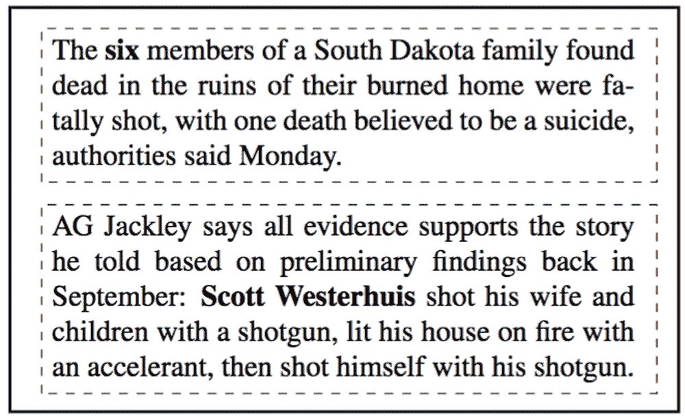

# 麻省理工学院的新人工智能数据提取系统通过网上冲浪自学

> 原文：<https://thenewstack.io/mits-new-ai-data-extraction-system-teaches-surfing-web/>

我们生活在一个网络上有大量数据的时代。问题在于，从所有这些信息中筛选出任何被认为相关的信息，是一项极其耗时的任务。但这可能很快会变得更容易，因为麻省理工学院的研究人员最近在一篇论文中透露，该论文介绍了一种新的人工智能系统，该系统能够自主学习，从在线资源中提取有用的信息。

最近在奥斯汀举行的[计算语言学协会](https://www.aclweb.org/)[自然语言处理经验方法会议](http://www.emnlp2016.net/)上，研究人员的[论文](https://arxiv.org/abs/1603.07954)描述了一种新的[信息提取](https://en.wikipedia.org/wiki/Information_extraction)系统，它能够从非结构化的机器可读文档中自动提取结构化信息。简而言之，该程序可以做人类擅长的事情:当面临信息空白或我们不理解的东西时，我们会去搜索另一个文档来消化，这将增加我们的理解或加深我们的知识。

“在信息提取中，传统上，在自然语言处理中，给你一篇文章，你需要尽一切努力从这篇文章中正确提取，”Regina Barzilay 教授和新论文的高级作者说。“这与你或我会做的事情非常不同。当你在读一篇你看不懂的文章时，你会去网上找一篇你能看懂的。”

## 人工智能自己填补信息空白

这就是这种新的人工智能与其前辈的区别，因为与以前的模型相比，它以一种非传统的方式运行。通常，机器学习模型在狭窄定义的参数内工作，并且在它能够以某种程度的成功解决问题之前，必须用许多训练示例“教授”它。然而，这种新的模型是在很少的数据上训练出来的，然后自行填补空白。

与其他模型类似，该过程涉及人工智能为其数据分类分配一个“置信度得分”，该得分表明与从训练数据中确定的模式相比，分类是否正确的统计概率。与以前的系统相比，如果置信度得分没有达到某个阈值，这个新模型将自动执行网络搜索以获得更多相关信息。然后，它将从新文本中提取相关数据，并将其与以前的提取内容进行整合。如果信心得分仍然太低，循环将再次开始。

“我们使用了一种叫做[强化学习](https://en.wikipedia.org/wiki/Reinforcement_learning)的技术，系统通过奖励的概念进行学习，”研究生 [Karthik Narasimhan](http://people.csail.mit.edu/karthikn/) 解释道，他是该论文关于 [*数字趋势*](http://www.digitaltrends.com/cool-tech/ai-surfs-the-web-learning/) 的合著者之一。“因为在被合并的数据中有很多不确定性，特别是在有相反信息的地方，我们根据数据提取的准确性给予奖励。通过对我们提供的训练数据执行这一操作，系统学习到能够以最佳方式合并不同的预测，因此我们可以获得我们寻求的准确答案。”

## 分析枪击和受污染的食物

研究人员采用了所谓的[深度 Q 网络](https://www.quora.com/Artificial-Intelligence-What-is-an-intuitive-explanation-of-how-deep-Q-networks-DQN-work) (DQN)，它“被训练来优化反映提取准确性的奖励函数，同时惩罚额外的努力。”

他们在两项任务中分别测试了信息提取系统。第一个是分析美国大规模枪击事件的数据集合(我们知道这很可怕，但如果人们正在研究枪支管制法的影响，这很有用)，系统必须提取枪手的名字、位置、受伤人数和死亡人数。第二项任务涉及检查一组关于食品污染事件的数据，以提取关于食品类型、污染物类型和位置的信息。在这两种情况下，研究小组发现，新系统比传统训练的信息提取员高出约 10%。

一个枪击案的新闻文章样本，其中包含枪手的姓名和死亡人数，但这两条信息都需要复杂的提取工具来分析。

信息提取系统检索到的关于同一枪击案的另外两篇文章。第一篇文章给出了死亡人数，而第二篇文章以一种容易提取的形式确定了枪手。

新系统可能有助于加速研究任务，这些任务以前可能需要更多乏味的人工努力。像这样的系统不仅可以节省时间，还可以拯救生命:研究人员预测，这样的系统可以被医疗保健提供商用作在更统一的结构下汇总患者历史的工具，这将提高患者接受的护理质量。

在更大的计划中，该系统朝着建立所谓的[人工通用智能](https://thenewstack.io/alphagos-win-human-go-champion-means-ai/)迈出了一步，能够像人类一样掌握任何数量的任务，而不是仅仅成为一个领域的专家。

特色图片:以斯帖的愚蠢，奥斯汀得克萨斯州。其他图片:麻省理工。

<svg xmlns:xlink="http://www.w3.org/1999/xlink" viewBox="0 0 68 31" version="1.1"><title>Group</title> <desc>Created with Sketch.</desc></svg>