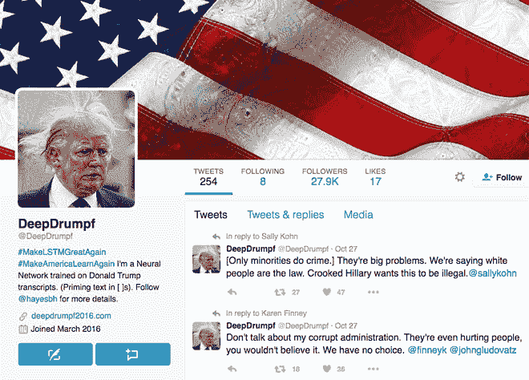

# 麻省理工学院的推特机器人用人工智能模仿特朗普

> 原文：<https://thenewstack.io/mits-twitter-bot-uses-ai-imitate-trump-now-running-president/>

在似乎是一个非常漫长的选举年，美国总统候选人唐纳德·川普在推特上发表了许多煽动性的言论，从[贬低共和党同僚](http://www.nytimes.com/interactive/2016/01/28/upshot/donald-trump-twitter-insults.html)，到指责偏见和[威胁媒体](http://variety.com/2016/biz/news/donald-trump-libel-suit-threats-1201877962/)，到在早上 5:30 疯狂[羞辱前环球小姐](http://www.nbcnews.com/politics/2016-election/analysis-how-trump-s-tweet-storm-alicia-machado-points-deeper-n657466)。

但现在，唐纳德很可能被一个推特机器人 [@DeepDrumpf](https://twitter.com/DeepDrumpf) 击败，这个机器人使用深度学习算法来帮助它学习和模仿共和党总统候选人的即兴言论，具有一种诡异的不可思议性。这个机器人的名字是对最近一个【上周 10】今晚片段的巧妙暗指，在这个片段中，喜剧演员主持人约翰·奥利弗令人信服地让人们“重塑”特朗普，用他家族的祖传姓氏 Drumpf 称呼他。

@DeepDrumpf 是由麻省理工学院计算机科学和人工智能实验室的机器人研究员布拉德利·海斯于三月份发起的，现在它也在运行自己的模拟总统竞选。但它实际上是出于一个良好的原因，因为它的秘密和崇高的目标是为编写代码的[女孩筹集 25，000 美元，这是一个旨在增加计算机科学领域女孩和妇女数量的非营利组织。](https://girlswhocode.com/)

“我想选择一个非政治性的慈善机构，致力于让孩子们更多地参与到计算机科学中来，”[T21·海斯说，他认为科技领域的性别差距是个问题。他的想法是通过使用@DeepDrumpf 作为(相当具有煽动性的)诱饵，让孩子们对机器学习感兴趣。看看这个人工智能机器人提供的这些特朗普式的鸡块:](https://www.inverse.com/article/22314-deepdrumpf-for-president)

## 递归神经网络

乍一看，这很有说服力，这要归功于不断输入@DeepDrumpf 的数据——即从候选人的演讲和辩论中挑选出来的数小时的文字记录。

[T2·海斯解释说:“该算法本质上是从它获得的所有数据中学习一种底层结构，然后提出反映它被教授的结构的不同数据组合。”。](https://www.csail.mit.edu/deepdrumpf)

该机器人使用所谓的递归神经网络，其中以前的输出被反馈到系统中，以产生下一个输出。

例如，当机器人被喂食或“启动”像“M”这样的特定字母时，随着机器人一遍又一遍地运行排列，下一个最有可能跟随的字母将是“A”、“K”和“E”，最终形成“MAKE”，这最有可能由构成特朗普竞选口号其余部分的字母来完成:“美国再次伟大”，以及其他选择花絮，如“建造一堵墙”和“我们别无选择”。

由于这些口号在文字记录数据中重复如此之多，更有可能的是，机器人会安排其单词进行匹配，然后它会继续这种概率性的字母查找过程，直到它填满了推文的 140 个字符的限制。

在[机器学习](https://thenewstack.io/how-machine-learning-works-an-overview/)领域，深度学习算法被用来‘训练’人工神经网络，这些算法受到人脑结构和功能的启发。它们可以用于自然语言处理、[图像识别](https://thenewstack.io/deep-learning-neural-networks-google-deep-dream/)、[语言翻译](https://thenewstack.io/smart-wearable-ear-device-translates-foreign-languages-almost-instantly/)、[写音乐](https://thenewstack.io/artificial-intelligence-todays-newest-hitmaker/)和[玩游戏](https://thenewstack.io/google-ai-beats-human-champion-complex-game-ever-invented/)，不一而足。

根据 Hayes 的说法，@DeepDrumpf 最初是作为一个“附带项目”开始的，研究一些与机器人相关的统计建模技术。

“事实证明，DeepDrumpf 背后的相同技术在许多机器人领域都有效，因为它是一种试图学习序列信息或序列数据结构的建模技术，”海斯告诉 *[逆](https://www.inverse.com/article/12418-donald-trump-artificial-intelligence-neural-network)* 。“自然语言是顺序数据的一个很好的例子，句子的结构相当一致:有规则，你得到的所有数据都有底层结构。”

## 莎士比亚对特朗普

碰巧的是，Hayes 受到了之前关于一种[训练模型](http://karpathy.github.io/2015/05/21/rnn-effectiveness/)的工作的启发，这种模型可以产生莎士比亚风格的诗句，以及无数的语音分析报告，这些报告将 Trump 对语法和词汇的使用置于七年级和三年级学生之间的水平——这将使训练人工神经网络变得容易得多。

“特朗普的语言倾向于更加简单化，所以我认为，作为一个建模问题，他将是最容易研究的候选人，”海斯说。

虽然 Haye 的项目有科学价值，但@DeepDrumpf 的赤裸裸的机器逻辑表达也可能指向隐藏在候选人咆哮之下的真正更令人不安的东西。由于它是在一个许多人说是机会主义的煽动者的语言上训练的，很可能@DeepDrumpf 说的正是特朗普可能隐瞒的东西——一个从字里行间解读的推特机器人，而*真的*说的是实话。距离极具争议的选举只有几天了，@DeepDrumpf 的厚颜无耻的声明让这一切听起来更加不祥。

在 [CSAIL](https://www.csail.mit.edu/deepdrumpf) 、 [@DeepDrumpf](https://twitter.com/DeepDrumpf) 和 [Deep Drumpf 2016](http://www.deepdrumpf2016.com/) 阅读更多内容。

图片来自@DeepDrumpf

<svg xmlns:xlink="http://www.w3.org/1999/xlink" viewBox="0 0 68 31" version="1.1"><title>Group</title> <desc>Created with Sketch.</desc></svg>