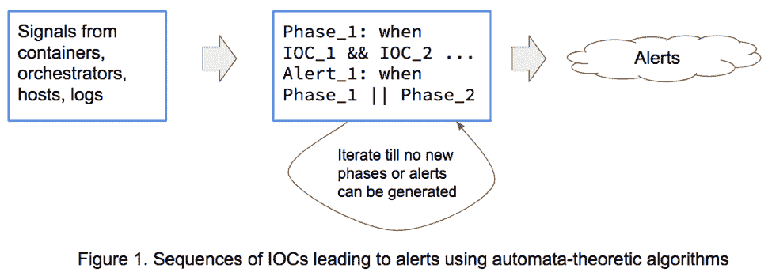
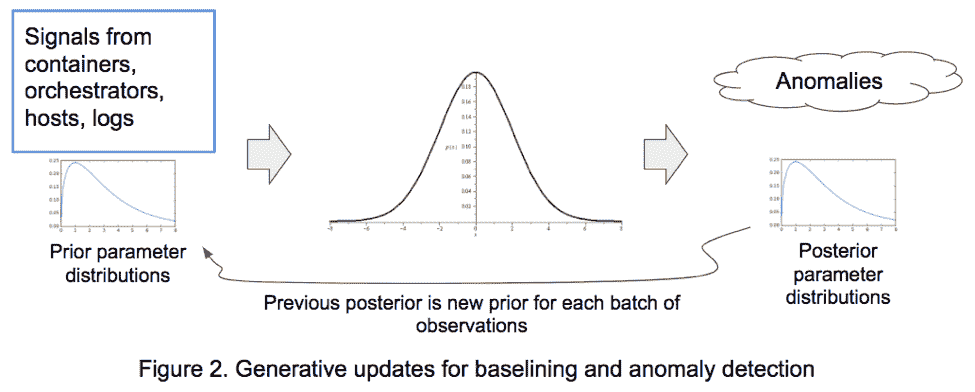
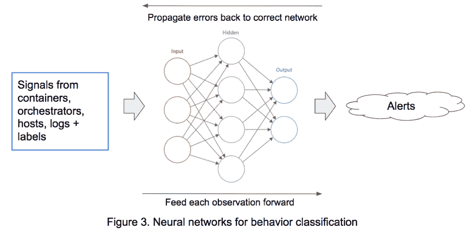
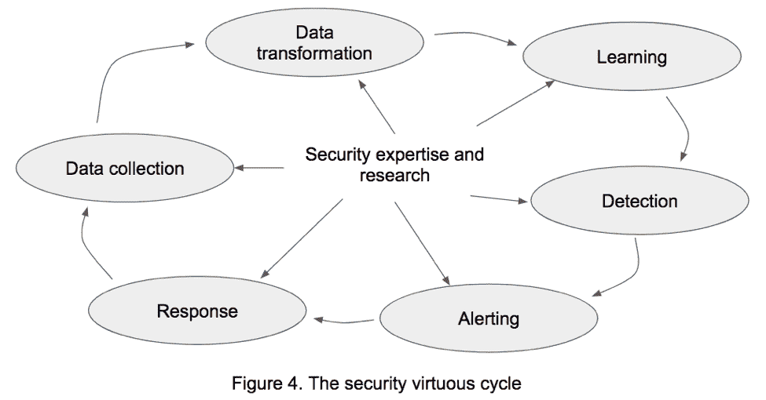

# 机器学习及其他:安全中的算法检测

> 原文：<https://thenewstack.io/ml-beyond-algorithmic-detection-security/>

 [Vishwanath Raman，StackRox

Vishwanath Raman 是 stack rox 的首席科学家，从事机器学习和检测方面的工作。他的经验涵盖了一系列领域，包括机器学习、自动机学习、安全性、静态程序分析、使用符号方法的程序探索、形式综合、图像处理和车内驾驶员辅助对话系统。闲暇时，Vishwa 喜欢骑自行车、摄影和烹饪。](https://www.stackrox.com/) 

本文讨论了在安全的各个方面使用算法检测的方法。我们将算法检测定义为使用[自动机理论](https://en.wikipedia.org/wiki/Automata_theory)或统计算法来感知威胁、分析威胁并将其置于情境中的能力。

为了使算法检测成功，我们需要一流的安全专业知识和一组足以实现有效防御的算法。知道没有一个尺寸适合所有人的方法，我们想要的是一个算法的集合，每个算法都调整为以高检测精度检测最大的攻击相位集；非常少的误报和高成功率的检测。

在本文中，我们将描述算法的几个类别，有效数据收集和标记的重要性，以及安全专业知识和研究在我们称之为“安全良性循环”中发挥的核心作用，以实现算法检测。

## 介绍

算法很便宜，但数据很贵。在过去的几十年里，随着开源软件越来越流行，我们有了成熟的代码贡献和自由许可证，涵盖了算法和语言的所有领域；如果你想要一个用于非加密散列的 Golang 库，比如 brunh hash，或者一个用于线性代数的[Java 库，或者一个用于判别训练](http://commons.apache.org/proper/commons-math/userguide/linear.html)的[c++库，或者一个用于深度神经网络](https://github.com/JohnLangford/vowpal_wabbit/wiki)的 Python 库，仅举几个例子，开源就是你的答案。这导致了算法的民主化，避免了重新发明轮子的需要，同时能够专注于构建使用现成的复杂实现的更复杂的系统。

然而，数据是一个不同的故事。如果我们有一个反铲挖土机，那么我们可以从互联网上抓取尽可能多的数据，一直到支持云中应用程序服务的各个容器。但是有标签的数据呢？那是昂贵的！只需看看 [Luis von Ahn 和 ESP 游戏](https://en.wikipedia.org/wiki/ESP_game)，一个通过出色的社会心理学众包标记图像的平台，以极大地改善谷歌图像搜索，就可以了解收集标记数据所需的工作。

但是我们太超前了。让我们更深入地研究一下安全算法。他们长什么样，他们的类别是什么？首先，这是我们对人工智能安全性的看法。社区中有很多关于人工智能安全性的讨论。一方面，人们可以对人工智能进行广泛的定义，包括从带有推理引擎的基于规则的系统到人工智能类别下的复杂统计模型的一切。另一方面，人们可以狭义地将其定义为通过[图灵测试](https://en.wikipedia.org/wiki/Turing_test)的系统，这些系统在感知、学习、抽象和推理能力方面与人类没有区别。我们的立场是专注于手头的问题，并使用最简洁和实用的算法，在不妨碍高性能数据收集和转换的情况下，为我们提供高检测精度。

## 算法检测

在高层次上，我们提出的每个算法都是在解决一个搜索问题。在生成统计模型的情况下，它正在搜索模型参数值，这些参数值为我们提供了观察结果的精确摘要。在判别统计模型的情况下，它是搜索模型的参数值，通过优化损失函数来帮助我们区分不同类别的观察值。

在自动机理论模型的情况下，它搜索导致恶意行为的路径，在云生态系统的模型上合成攻击者策略，搜索指示攻击特定阶段的一系列危害指标(IOC ),等等。但是这些算法在引擎盖下做什么呢？为了回答这个问题，让我们更深入地看看这些算法类别。

### 自动机理论算法

把[有限状态自动机](https://en.wikipedia.org/wiki/Automata_theory)想象成有向图，节点代表状态，边描述一个或多个终端状态的转换。终端状态可以是接受或拒绝。检查 IOC 序列是否形成警报相当于从起始状态开始遍历自动机，获取序列中下一个 IOC 标记的边，如果到达接受状态则生成警报，否则丢弃该序列。

对这种转换图进行操作的算法属于自动机理论算法的范畴。在上面的例子中，他们依靠安全专家为 IOC 构建模式识别器，并使用规则来识别 IOC 序列，如图 1 所示。这类算法有广泛的应用，包括安全协议综合、易受攻击行为的形式可达性分析，以及在两人回合博弈图上使用零和目标的攻击者策略综合。

### 生成算法

生成算法属于统计算法的范畴。它们通过形成应用程序行为的基线(也称为[生成模型](https://en.wikipedia.org/wiki/Generative_model))来用于异常检测，然后将与这些基线的偏差检测为异常。他们依靠安全专业知识来确定哪些信号总体上是系统行为的良好代理，以及对最佳观察模型的数据分布的选择。

在技术层面上，数据分布的参数，例如正态分布数据的均值和方差，不是被建模为点估计，而是被建模为来自称为参数分布的分布。图 2 中的[贝叶斯更新算法](https://towardsdatascience.com/probability-concepts-explained-bayesian-inference-for-parameter-estimation-90e8930e5348)在学习过程中使用批量观察值更新数据分布的参数。在生产中，如果一个观察结果不能被学习的模型合理地产生，那么它被认为是一个异常。

### 鉴别算法

许多判别算法也属于统计算法的范畴，用于建立[判别模型](https://en.wikipedia.org/wiki/Discriminative_model)。它们用于区分多类行为。他们依靠安全专业知识来确定哪些信号是系统行为的代理，更重要的是，创建带标签的观察数据集，其中每个观察都有一个标签，给出其成员类别。深度神经网络鉴别算法在如图 3 所示的网络结构上工作。

这里起作用的学习原理是通过网络向前馈送观察值，并且在给定标签的情况下，通过网络向回传播网络正确分类观察值的能力中的错误。这个[反向传播](https://mattmazur.com/2015/03/17/a-step-by-step-backpropagation-example/)步骤调整网络参数以减少再次犯同样错误的可能性。一旦网络训练有素，并不断适应数据的变化，它就可以有效地分类生产行为，特别是恶意行为。

### 我们对安全算法的期望

受国防高级研究计划局(DARPA )的 John Launchbury 发布的一段视频的启发，涵盖了一些有用的安全算法类别，以下是我们希望算法在网络安全方面具有的能力；感知、学习、抽象和推理。

自动机理论算法涵盖了感知和推理，能够模拟攻击者意图，并针对零和安全目标综合攻击者策略。统计算法涵盖感知和学习，生成算法可用于威胁搜索，判别算法可用于识别攻击阶段。

这些算法类别的融合使我们有可能探索抽象，不是通用的类似人工智能的抽象，而是在有限的安全领域中，让我们将上下文适应作为一种安全策略。语境适应是系统为现实世界中的各类现象构建语境解释模型的能力。在安全领域，这使我们不仅能够检测，而且能够使用警报上下文，即生成警报的 IOC 周围的元数据，来预测攻击者的行为并相应地调整我们的响应。为了让这一切运转起来，有效而协调地工作，我们还需要最后一个要素。我们称之为安全良性循环。

## 安全良性循环

以谷歌语音短信为例。对于一个人说的每一句话，系统都会进行转录，并向说话者重复转录。当发言者确认转录是正确的，信息被发送。否则，会提示说话者再次重复该消息。说话者获取正确信息的自身利益是谷歌在全球范围内收集标记数据的动机！在这种情况下，以及在使用 [ESP 游戏](https://en.wikipedia.org/wiki/ESP_game)进行图像标记的情况下，游戏中的激励模型确保收集高质量的标记数据。

在安全环境中，这个角色由安全研究人员和白帽黑客扮演。他们的激励模式是预测并智胜不断演变的攻击者的作案手法。为此，除了创建现实的应用程序堆栈，安全研究还负责构建对它们的攻击、收集信号、筛选具有辨别能力的信号、转换信号以用于学习、检测、警报和报告、响应以及最终通过接种容器、服务、应用程序、协调器和主机进行缓解。当所有这些因素协调一致时，我们就实现了我们所说的安全良性循环。

如果没有这一关键因素，就无法实现上下文适应的崇高目标，即我们不仅要检测，还要不断预测攻击者的行动，并通过资源和算法的动态再投资来挫败他们。除此之外，我们还需要尽可能少地使用可用的集群资源，同时仍然保证高检测精度，我们不仅需要在算法选择上节省，还需要在收集策略、数据转换策略和响应策略上节省。

## 结论

我们留给读者两个适合这个博客的想法；算法是廉价的，而数据是昂贵的，扭曲的训练数据会造成适应不良(引自 [John Launchbury](https://www.darpa.mil/attachments/AIFull.pdf) )。强大的安全专业知识和安全研究是解决这两个问题的关键！如果没有这方面的专业知识，通过算法检测来实现安全环境适应的崇高目标将是不可能的。

重要的是，我们针对实际的应用程序堆栈和攻击，通过适当选择具有强大研究贡献信号、标记观察和算法选择的简约算法，来优化性能、收集和转换以及检测准确性。通过情境化学习攻击者的意图来挫败攻击者的适应性策略将是未来几年安全的强大驱动力！

[StackRox](https://www.stackrox.com/) 赞助了这个故事。

通过 Pixabay 的特征图像。

<svg xmlns:xlink="http://www.w3.org/1999/xlink" viewBox="0 0 68 31" version="1.1"><title>Group</title> <desc>Created with Sketch.</desc></svg>