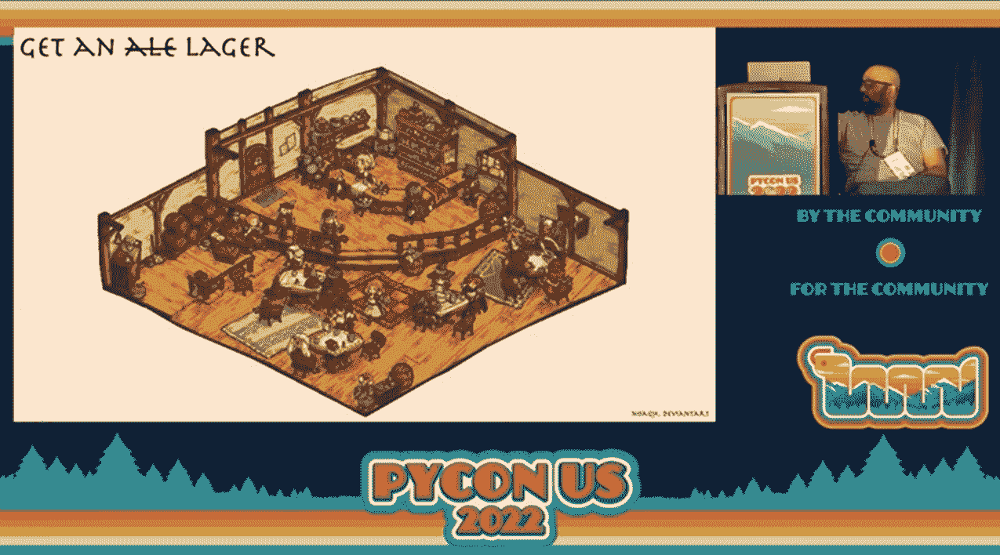
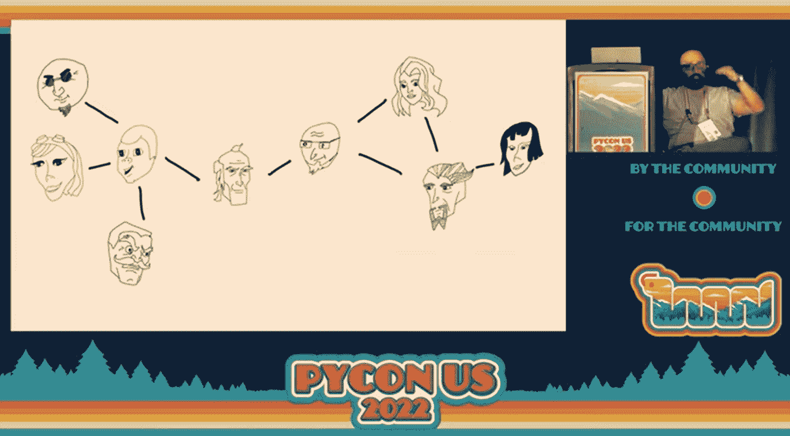

# ML 工程师用龙与地下城教图形算法

> 原文：<https://thenewstack.io/ml-engineer-teaches-graph-algorithms-with-dungeons-dragons/>

“这个演讲将采用故事的形式，”[描述读作](https://us.pycon.org/2022/schedule/presentation/16/)，“讲述在酒馆相遇的冒险者，并使用图形算法追捕[一个麦戈芬](https://en.wikipedia.org/wiki/MacGuffin)。”

于是开始了一场学习的[冒险，其中](https://github.com/jehan60188/grokking_graph_algorithms/blob/main/DnDnG.pdf)[地下城&龙](https://dnd.wizards.com/)角色扮演被部署来呈现“对常见图形算法的直觉优先理解”，软件工程师 [Mohammad Athar](https://www.linkedin.com/in/mohammad-athar-5173326) 解释道。Athar 目前是 TackleAI 的高级机器学习工程师。

“在我的许多许多兴趣中，我真的认为图表是整洁的，”阿萨告诉观众。

阿萨也喜欢在《龙与地下城》游戏中担任解说员——或者“地下城主”。Athar 找到了一种方法，在今年的 PyCon 2022 上把这两种兴趣结合成一个单一的演讲，PyCon 2022 是由非营利组织 Python 软件基金会赞助的年度 Python 大会。

在它结束之前，Athar 带领观众进行了一次旋风式的旅行，展示了图形的所有主要算法。

[https://www.youtube.com/embed/t2EUocx3vGQ?feature=oembed](https://www.youtube.com/embed/t2EUocx3vGQ?feature=oembed)

视频

## 麦芽酒太恶心了

像许多龙与地下城的游戏一样，阿萨的谈话开始于一个酒馆。"你想要一杯啤酒，因为啤酒太恶心了."但不幸的是，酒馆里有多条路——有时桌子之间的路会被酒馆的顾客堵住。然后 Athar 指出，如果你把每一个十字路口都看作是一个图的节点，那么你穿过酒馆的路线“自然会变成一个图”。

这允许你使用你的第一个算法——标准的图遍历模式，称为[深度优先搜索](https://en.wikipedia.org/wiki/Depth-first_search)。

Athar 异想天开地将其介绍为“一个很好的简单递归算法，你知道，实现很快，很容易使用，等等。”

具体来说，它沿着每条路径尽可能远地行进，然后返回尝试下一条可用路径，直到其中一条路径到达期望的端点。在酒馆喝啤酒的例子表明，该算法在普通情况下广泛适用——提供了一个易于掌握和直观的例子，说明何时可以使用它。

但是可能会有一个探索开始吗？

"当你点啤酒时，一个街头小顽童向你走来，向你寻求帮助……"阿萨告诉观众。显然，在下水道上锁的格栅后面有什么令人不安的东西——顽童告诉你从爱丽丝或鲍勃那里拿到钥匙。

“这是一个奇怪的小镇——每个人的名字都是按字母顺序排列的，”阿萨指出。爱丽丝让你去找卡门和戴夫，而艾伦从鲍勃那里得到了推荐……寻找钥匙的行动开始向多方向蔓延。

算法来拯救——但这一次，它是被称为[广度优先搜索](https://en.wikipedia.org/wiki/Breadth-first_search)的算法。(也就是说，在深入探索之前，先在每一条可行的道路上迈出一步。)

它最大的优势？你可以一边走一边收集数据(不需要知道它最终会有多深。)这种算法可以让你避免额外的搜索，而这种搜索可能会涉及到探索每一条可能的路径，直到它的终点。

这将大大加快你寻找下水道钥匙的速度…

阿萨在演讲结束时回来赞美他们。“如果你今天没有带走任何其他算法，请检查一下广度优先搜索。真的很有用。你可以用它做很多不同的事情。”

在这一点上，阿萨假装意识到他的时间不多了，然后脱口而出一个更短的总结:“伙计们，广度优先搜索很棒。做吧。”

然后继续讲述 D&D 的冒险…

这个顽童知道一条通往下水道尽头的更短的路径，这让你大吃一惊——这要感谢“一个名叫迪克斯特拉的巫师”观众笑了，知道接下来会发生什么:介绍[迪克斯特拉的算法](https://en.wikipedia.org/wiki/Dijkstra%27s_algorithm)

阿萨指出，虽然广度优先算法可能确保最少数量的连接，但这并不总是你想要的。

有时，许多短距离连接可以组合成一条比另一条连接更少但更长的路径更短的整体路径。这就是 Dijkstra 算法的优势所在，它高效地计算出每条可能路径的距离。

阿萨解释说，有了这种确保效率的算法，你的神奇探索就会继续，以某种方式到达下水道的尽头。"然后你走进那个邪恶家伙的巢穴，发出蝙蝠侠的声音."

## 明显的应用

除了阐述常见的算法之外，这个演讲对 Python 程序员听众有明显的应用价值。Athar 在演讲开始时提醒听众，使用 Python 数据结构有几种表示图形的方式。

仅举一个例子，有一个矩阵的通用数据结构，Athar 后来将其定义为“实际上只是一个数字表。”

图中的每个节点在该表中都有一行，用于计算该节点与其他每个节点的连接。每个节点也有自己的列。

向下阅读这些列可以看作是另一种视图，它不计算“来自”一个节点的连接，而是计算一个节点的“到”连接。它们通常是相同的——除非你的图的连接有时是单向的。

Python 中表示图形的另一种方法是列出所有连接的节点对。

Athar 还提出了称为字典的 Python 数据结构——在其他语言中称为关联数组——其中查找“键”会传递其对应/关联的值。

对于一个图，键可以是节点本身，关联的值是它连接到的所有节点的列表。

Athar 甚至展示了一种使用面向对象编程的方法——使用节点对象。当然，Python 也有一个库来简化这一点 NetworkX 包。

但是在所有这些技术细节上，阿萨在整个演讲中保持了活泼、低调的风格。Athar 指出，算法的一个重要部分是跟踪哪些图节点已经被访问过，“所以当 Carmen 最终告诉你去访问 Bob 时，你会说‘哈，我已经处理好了！别绊倒了，伙计。"

很快我们的探索达到了戏剧性的结局。在下水道的尽头。原来你发现了一个心腹，给一个邪恶网络的成员传递消息。

Athar 随后演示了如何绘制收件人之间的关系，然后轻松地寻找可操作的模式。例如，您可以扫描图中的“[关节点](https://www.geeksforgeeks.org/articulation-points-or-cut-vertices-in-a-graph/)”——基本上是单点故障，移除它会将图分成两个不相连的部分。您还可以尝试计算每个节点的连接数…

但是这些技术中的一个会把你引向头坏人，“所以你去制造更多蝙蝠侠的声音，”阿萨告诉观众，并补充道，“你会得到一大包钱。”

这导致了最后一个问题——如何分配你从恶棍巢穴中掠夺的所有钱财。

当然，这是一个可以用另一种算法解决的问题…

* * *

# WebReduce

<svg viewBox="0 0 68 31" version="1.1" xmlns:xlink="http://www.w3.org/1999/xlink"><title>Group</title> <desc>Created with Sketch.</desc></svg>