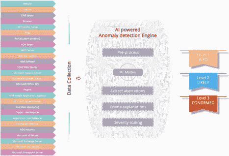
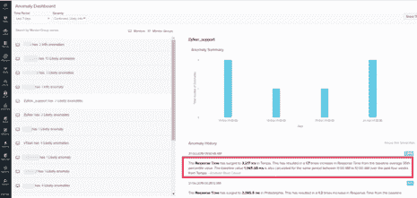
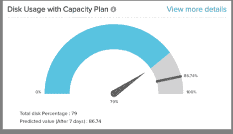

# ML 驱动的预测分析是保持客户满意度的关键

> 原文：<https://thenewstack.io/ml-powered-predictive-analytics-can-be-a-key-to-maintaining-customer-satisfaction/>

[Murali Krishnan](https://www.site24x7.com/)

[Murali Krishnan 是 Site24x7 的产品经理，site 24x7 是 Zoho Corporation 为开发运营和 IT 运营提供的一体化监控服务。Murali 在 Zoho 工作了超过 12 年，开发软件产品包括公司的内部网络监控工具、WebNMS SNMP 代理工具包和 Site24x7 服务器监控代理。目前，他专注于 Site24x7 AIOps、基础设施监控和移动应用。](https://www.site24x7.com/)

随着全球疫情期间商店关门，许多零售商的电子商务网站流量激增。在 3 月 12 日和 13 日这两个特别恐慌的日子里，琳琅满目的杂货店的网上销售额猛增了 325%。每当这种程度的意外流量袭击零售商的网站时，他们必须保持应用程序正常运行并让客户满意。否则，客户会迅速转向竞争对手的网站。

预测像当前疫情这样的事件即使不是不可能，也是很困难的。但是，通过训练您的基础设施来识别异常活动并做出适当的调整，您可以让您的客户满意。根据我们的经验，最大化在线销售并确保客户满意度的一个特别有效的方法是利用有效的 ML 支持的预测分析工具。有了这样的工具，您可以发现问题，降低平均修复时间(MTTR)，并确保您的系统保持正常运行。

## 使用机器学习缩短 MTTR

作为一个快速的警告，你的 ML 工具只能和你提供给它的数据一样好；一般来说，您为工具提供的数据越多，它的性能就越好。对数据进行注释以显示目标或您希望回答的问题是很重要的。此外，您希望定期检查 ML 算法的结果以确保准确性。就算法决策而言，维护高质量的数据至关重要。如果您的数据在模型被训练之前没有被正确地标记和检查，您将会遇到问题。

一个有效的 ML-powered 工具将了解您的基线活动是什么样子的，然后它将使用该基线来标记任何异常活动。在上述超负荷工作的网站的情况下，机器学习工具会在 3 月 12 日向系统管理员发送警报；这样，即使零售商的网站崩溃，MTTR 也会缩短。

异常检测显然不仅限于像全球流行病这样的灾难性事件。机器学习支持的预测分析工具应该在一年中的每一天使用；此类工具持续监控访问您网站的人数，同时计算这些客户的位置以及他们访问网站的时间。例如，如果北美客户通常在上午 9 点到下午 5 点访问给定的网站，而某一天在上午 6 点有一个活动高峰，这种行为将被标记。同样，如果网站流量通常发生在工作日，周六的流量激增将被标记。

## 考虑季节性

在训练你的最大似然算法时，创建一个考虑季节性的基准是很重要的。例如，您希望将每个星期一上午的数据发送到训练数据集，以便与过去四周的星期一上午的值进行比较；然后，您会希望通过移除尖峰来平滑数据，通常是值的前 5%。将每小时 95%的值与您的训练数据进行比较后，您可以生成事件，并查看哪些事件最有可能异常。

## 让你的算法发挥作用

在从各种来源获取数据后，配备单变量和多变量分析算法的人工智能异常检测引擎将提取异常，提供解释，并根据感知的严重程度对异常进行评分。

## 异常评分

根据事件与前几周活动的偏差程度，事件可以分为“确认异常”、“可能异常”或“信息”，这实质上是一种通知，提醒您可能需要密切关注，以防将来出现问题。异常情况可以按 0-10 分制评分。

如果在给定的受监控组中发现一个事件，异常分值会更高。例如，如果您的基础架构使用五台不同的服务器，您会希望将它们组合在一起，如果该组中的多台服务器出现问题，那么您的异常分值将会增加。当然，IT 团队会根据相应异常的严重性来响应警报。

## 无阈值异常检测

使用基于 ML 的预测工具(可能是同时使用单变量和多变量算法的工具)，您可以在没有阈值的情况下检测异常。不需要建立全面的静态阈值，例如每当 CPU 使用率超过 75%时发出警报。事实上，您将希望移除所有静态阈值，以便它可以考虑季节性和更细微的活动。

举一个过于简单的例子，您的工具将确保在黑色星期五销售期间有足够的服务器可用。在数据量增加期间，后端基础设施将自动扩展，ML 支持的分析工具将自动调整阈值，有助于避免不必要的错误警报。重要的是，这将减少不必要的票据，否则会占用技术人员的宝贵时间。

## 促进事件关联

鉴于所有电子商务公司面临的激烈竞争，DevOps 团队最终将更新他们的网站，以考虑竞争对手已经到位的功能，这是不可避免的。有时，DevOps 人员会使用容器和微服务来加速他们的部署。

在操纵你的预测分析工具的同时，机器学习组件不断研究基础设施；它不断评估哪个服务器连接到哪个微服务，以及哪个容器属于哪个应用。在复杂的环境中，很难确定问题发生在哪里。哪个应用程序、微服务、容器或服务器导致网站运行缓慢？任何给定的应用都可能由几个不同的微服务组成，其中一个微服务的中断可能会导致级联效应。

通过持续的自动化监控，可以轻松发现问题的根本原因，同时缩短 MTTR，提高应用程序的响应速度。一个有效的工具应该不断地学习基础设施，包括它的应用程序、依赖项，以及何时有持续集成和持续部署(CI/CD)。这种工具有助于 IT 人员快速诊断和跟踪问题的根本原因。

### 最近的一个用例:一个位于佛罗里达州的杂货连锁店的电子商务网站

在冠状病毒疫情席卷全球之前，在线杂货店的销售额已经在增长。2019 年，美国在线杂货销售额比上一年增长了 22%。现在，在 COVID 之后，美国在线杂货店的销售额预计将再增长 40%。电子商务流量如此迅猛的增长是许多杂货商没有预料到的，许多网站也没有做好准备。佛罗里达州坦帕市的一家杂货连锁店就是这样一家杂货店。

## 噪声降低

这家杂货连锁店能够通过人工智能驱动的引擎找到问题的根源。

他们的企业有一个包含数百台服务器的数据中心，几年前，每当出现问题时，它都会发送警报；但是，他们的 IT 人员被警报淹没了，这造成了警报疲劳，并导致重要的警报被忽略和无法解决。

安装了基于 ML 的工具后，杂货商能够过滤和整合警报。它们降低了警报噪音，因此 IT 人员只有在实际出现问题时才会收到警报。

## 事件关联

通过异常检测设备每 15 分钟从数据收集代理收集一次指标，该工具可以捕捉总体趋势，说明季节性，并且不受无关紧要的峰值和异常的影响。例如，在 2019 年 10 月，该杂货连锁店收到了一系列警报，其中一个警报称他们的 URL 监视器的响应时间增加了；这被标记为“可能的异常”，因为 URL 监视器已经激增到基线平均值的 1.7 倍。

在这个特殊的例子中，出现了两个问题。首先，有一个区域性响应时间下降的问题，这是 ISP 的问题，而不是 DoS 攻击。其次，存在内存峰值，这是由于服务器流量的增加。

通过区分异常趋势和正常趋势，IT 人员能够将异常追溯到导致异常的相关资源。

## 预测

该算法还为杂货商提供预测；事实上，企业立即意识到流量的涌入不可能很快平息。

在流量大的时候，公司服务器的磁盘使用量通常每天增加 1GB 但是，现在磁盘使用量增加了 5GB/天。磁盘使用率飙升至 79%，预计七天后将达到 87%。异常检测被触发，警报被发送，IT 管理员能够相应地进行规划。

尽管佛罗里达州杂货商的基础设施复杂，但他们的算法提供了警报，有助于事件关联，并最终减少了 IT 团队的 MTTR。

最近，在 COVID 期间，杂货店的伙计们可以放心，因为他们知道他们的 ML 支持的预测分析解决方案可以快速识别是否出现支付故障或网站崩溃。在这样的压力时期，供应链出现瓶颈，客户陷入恐慌，他们的机器学习工具不仅有助于保持他们的网站和降低 MTTR，而且还有助于维持积极的客户体验。

## 结论

在你的电子商务网站上保持良好的客户体验是至关重要的。虽然传统的阈值配置技术可以警告您性能出现问题，但支持事件关联和问题诊断的 ML-powered 工具将显著减少故障排除时间。全面监控解决方案中的机器学习不仅应该促进自动化应用程序发现和依赖关系映射，还应该在主动诊断和优先处理异常后提出可能的补救措施。

简而言之，在复杂的业务生态系统中，确定问题的根本原因可能非常耗时。然而，借助人工智能支持的预测分析工具，您可以在不影响 IT 响应时间的情况下识别和修复问题，这对于保持积极的客户体验至关重要。

通过 Pixabay 的特色图片。

<svg xmlns:xlink="http://www.w3.org/1999/xlink" viewBox="0 0 68 31" version="1.1"><title>Group</title> <desc>Created with Sketch.</desc></svg>