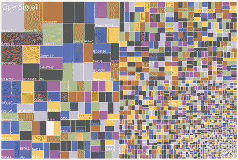
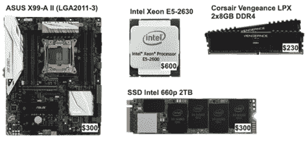
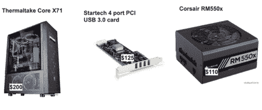
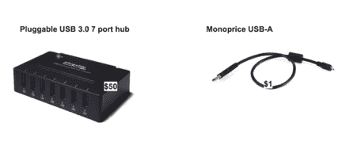
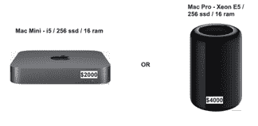
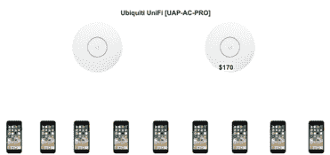
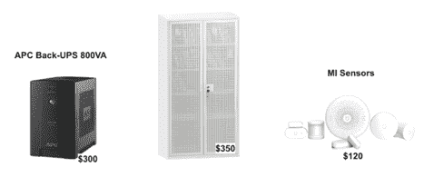

# 移动设备农场:建还是不建？

> 原文：<https://thenewstack.io/mobile-device-farms-to-build-or-not-to-build/>

[Alexey Khursevich](https://www.solvd.com/)

[Alexey Khursevich 是 Solvd 公司的首席执行官，在过去的六年里，他一直在为测试自动化构建基础设施。他最感兴趣的项目包括 Qaprosoft 的 MCloud 用于测试自动化的移动设备场，以及 Qaprosoft 的 Zafira 自动化结果可视化解决方案。Alexey 是 SeleniumCamp 和 Delex 等会议的活跃发言人。最近，他一直在研究 TestOPS 和 GitOPS 问题。](https://www.solvd.com/)

当选择一个测试自动化策略时，总是有一些共同的挑战需要考虑。例如，您使用什么框架进行测试实现？什么应该自动化，你如何确保测试过程稳定和快速。本文将提供关于如何构建一个测试自动化基础设施的指导，这将允许您创建一个快速、安全的自动化过程，并回答类似莎士比亚的问题，“构建还是不构建？”—这是每个开发人员在开始新项目之前必须回答的问题。

根据您的项目规模和投资基础设施的预算，您有两种不同的选择来塑造 QA 自动化的基础设施:1 .付费云服务如 [Browserstack](https://www.browserstack.com/) 、[酱实验室](https://saucelabs.com/)或 [Zebrunner、](https://zebrunner.com/)或 2。构建内部移动设备农场。

如果你是一家小型创业公司，并且对测试移动设备的全矩阵感兴趣，你可能会对平均每月每台设备 150 美元的云解决方案感兴趣。然而，当您达到业务增长和自动化覆盖范围增加的点时，您将需要更多专用设备来支持您的 CI/CD 管道需求。正是在这一点上，您应该考虑投资您自己的移动农场基础设施，完全专用于您的团队，并隔离到您的 VPN 空间。

基于我们持续参与 QA 基础设施的经验，我们将我们的知识与外部专家的意见相结合，得出了以下关于构建内部移动农场优势的结论:

*   支持高容量测试。与通过云提供商执行的测试相比，大量测试的运行速度会更快。
*   没有排队等待，没有会话限制。
*   快速农场基础设施部署(几小时内)。
*   支持与物联网设备集成。
*   针对 SecOPS 限制云使用的公司的安全解决方案。
*   从长远来看，比云提供商更便宜。
*   开源文档。
*   活跃的社区和支持渠道。

移动农场也有一些缺点:

*   对创业公司和小企业来说成本很高(短期内)。
*   维护费用(设备/组件更新、定期检查、现场支持专家)。
*   保持设备的相关性(通常两年都是最新的)

您已选择建立移动设备场；你应该从哪里开始？首先你要分析你的项目需求:设备数量和实际型号。根据我们的经验，定义模型最可靠的方法是您的分析工具。数据分析有助于更好地了解客户最常用的移动设备。

图表根据收集的分析显示了最受欢迎的设备。

一旦你有了这些信息，根据你的预算选择前 10 名、20 名或 50 名进行测试，并从你当地的供应商那里购买。确保您拥有原始保修服务支持非常重要，这样您就可以在合理的时间内解决问题。我们发现最稳定的自动化供应商如下:三星、LG 和各代谷歌 Nexus 设备。其他品牌往往需要更多的维护工作。此外，不要忘记为你的苹果用户分析所有相同的统计数据，为你的内部农场选择最受欢迎的 iPhones 和 iPads。

现在是时候购买服务器和外围设备来开发自己的云了。为 Android 和 iOS 构建两个独立的服务器很重要，因为它们使用不同的技术。

先说安卓服务器。我们建议在支持强大至强处理器的 LGA2011-3 插槽上构建服务器；配置如下:

*   华硕 X99-A II 主板
*   固态硬盘英特尔 660p 2TB
*   英特尔至强 E5-2630
*   海盗船复仇 LPX 2x8GB DDR4

良好的电源也是必要的，USB 总线的外部 PCI 卡也是必要的。整个配置安装在 Thermaltake 全塔式机箱上(但您可以选择自己喜欢的)。

*   Thermaltake Core X71
*   Startech 4 端口 PCI USB 3.0 卡
*   Corsair RM550x

当所有组件都就位后，就该考虑外围设备了:USB 集线器和电缆。我们已经测试了不同供应商的各种 USB 集线器，我们发现可插拔 USB 3.0 7 端口集线器结合单价 USB-A 电缆是最稳定的。这个集线器有一个外部 60W 电源适配器，可以毫无问题地为手机和平板电脑充电。此外，它支持稳定的 USB 数据传输，这有助于加快您的测试自动化任务。

现在，让我们转到 iOS 服务器配置。这里的选择更加有限；您可以选择带有自定配置的 Mac Mini 或 Mac Pro。根据我们的经验，定制的 Mac Mini 性价比更高；它可以轻松支持多达五个 iOS 设备同时连接。使用最新一代的 i5 CPUs 非常重要，它具有四个板载内核和 16 GB 内存。

总之，当谈到服务器配置时，需要注意的是，具有四个 USB 集线器的一般 Android 服务器将能够管理多达 30 个连接的设备，而 iOS 配置可以轻松地将四至五个设备直接连接到 Mac Mini。

## 网络配置呢？

另一个需要强调的重要话题是网络配置。我们强烈建议通过以太网电缆将所有服务器连接到互联网，并将所有移动设备连接到 WiFi。作为接入点，我们推荐 Ubiquiti UniFi[UAP-AC-PRO]——将至少两台设备连接到一个集群。该群集能够平衡网络负载，从而提供稳定的互联网连接。

当您在同一个地方托管数十个移动设备时，您应该记住一个非常重要的安全问题。只要所有设备都通过 USB 电缆全天候连接，它们的电池就会承受巨大的压力，并且不时地，您将不得不执行技术检查并更换一些蓄电池。当这种情况发生时，我们强烈建议将整个装置放置在空调良好的金属架上，以防止办公室或数据中心发生火灾。此外，我们建议使用小米智能家居传感器，这些传感器将在烟雾或异常温度的情况下触发。万一发生电击，APC Back-UPS 800VA 可以保护您的硬件免受电击损坏，非常有价值。如果您使用金属搁板，请确保它已接地！

我希望您现在已经掌握了做出明智决策所需的信息，同时为您的移动自动化基础设施选择正确的解决方案。最终，这将取决于您的规模和范围，以及投资机会，以确定哪种变体最适合您的特定需求。

图片由作者提供。

<svg xmlns:xlink="http://www.w3.org/1999/xlink" viewBox="0 0 68 31" version="1.1"><title>Group</title> <desc>Created with Sketch.</desc></svg>