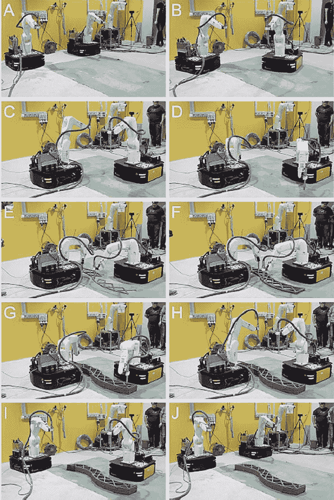
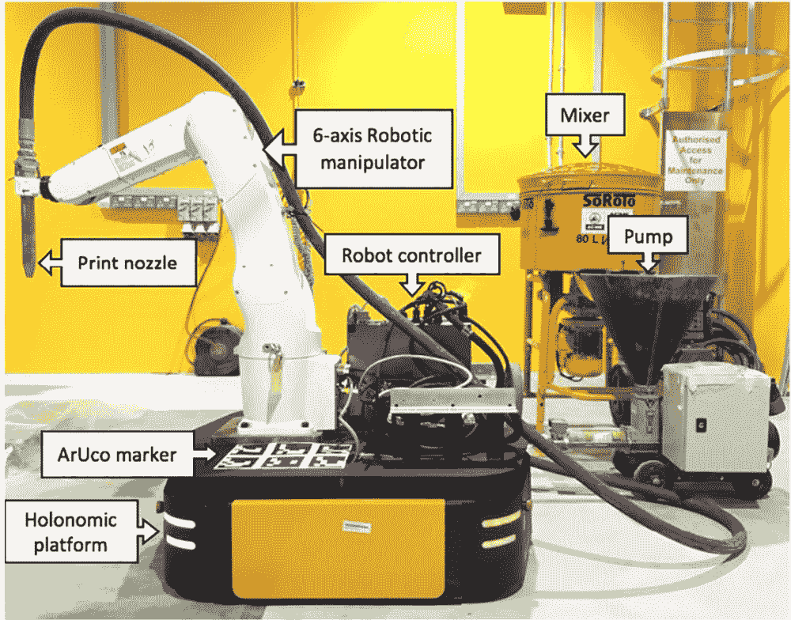
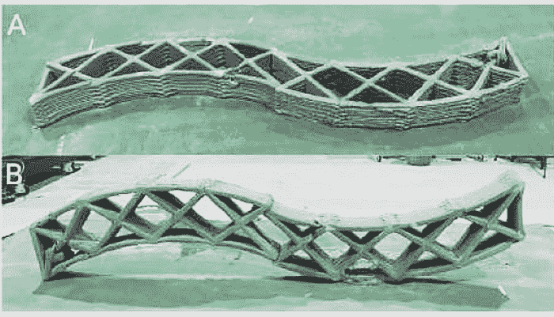

# 移动机器人“群体打印”3D 大型结构

> 原文：<https://thenewstack.io/mobile-robots-swarm-print-3d-large-scale-structures/>

从[打印定制电路板](https://thenewstack.io/voltera-3d-prints-circuit-boards-minutes/)、[衍射神经网络](https://thenewstack.io/3d-printed-diffractive-neural-network-processes-data-at-speed-of-light/)或[营养食品](https://thenewstack.io/delicious-and-nutritious-3d-printed-food-represents-a-new-way-of-eating/)，到用于 [AR 辅助互动建模](https://thenewstack.io/interactive-robotic-modeling-assistant-combines-augmented-reality-3-d-printing/)，我们都听说过三维(3D)打印如何有潜力改变许多领域的游戏。将某种添加制造技术整合到建筑和建筑业中是另一个明显的步骤，尽管我们已经看到了一些非常酷的 3D 打印可居住结构的原型(如这个用泥土制成的[经济适用房](https://thenewstack.io/wasp-3d-printing-affordable-mud-housing-for-the-developing-world/)和这个用盐制成的[),但还没有太多大规模的 3D 打印建筑的例子。](https://thenewstack.io/emerging-objects-3d-printing-pioneers-will-build-houses-salt/)

造成这种可悲状况的原因在于 3D 打印机本身。为了打印一些东西，该物体需要在打印机喷嘴的范围内，无论是在典型的[方形 3D 打印机](https://thenewstack.io/printer-mit-can-see-print-views/)内还是使用[龙门系统](https://thenewstack.io/3d-printed-buildings-made-by-robots-for-the-earth-moon-and-mars/)的打印机内。但即使这些也只能有这么大——正如人们可能猜测的那样，拥有比建筑本身更大的 3D 打印机是不切实际的。另一种可能性是单独打印建筑的各个部分，然后将它们组装在一起，但这可能是一个复杂的物流难题，并且存在这些部分组装的点不牢固的危险。

但是可能有更好的方法:来自新加坡[南洋理工大学](http://www.ntu.edu.sg/) (NTU)的研究人员提出了一个解决方案，其中涉及一组移动机器人，这些机器人可以被编程为以敏捷和合作的方式 3D 打印一个结构。手表:

[https://www.youtube.com/embed/p_jcG25tUoo?feature=oembed](https://www.youtube.com/embed/p_jcG25tUoo?feature=oembed)

视频

## 群体印刷

根据该团队的说法，这种由多个移动机器人协调进行的 3D 打印形式可能更好地被称为群体打印。“我们(在视频中)看到的是两个移动机器人同时打印一个混凝土结构，”NTU 助理教授范广聪在 [*数字趋势*](https://www.digitaltrends.com/cool-tech/3d-print-collaborative-robot-arms/) 节目中解释道。“这两个机器人首先从它们的基站导航到打印地点，然后以协调的方式通过一层一层地沉积一种特殊类型的水泥来打印，最后返回它们的基站。整个过程都是自主完成的，没有人类的遥控操作。”

这个团队的软件是整个实验的关键。根据他们在[*Automation in Construction*](https://www.sciencedirect.com/science/article/pii/S0926580518304011)发表的研究，该团队的方法是让机器人提前在指定的施工区域内规划它们的运动，并为它们的路径选择预定的开始和结束位置。为了实现这一点，建筑设计的 3D 模型被上传到系统中，然后机器人使用运动规划、同步定位和地图绘制(SLAM)以及自适应蒙特卡罗定位(AMCL)算法来导航、构建和更新其环境的地图，包括其他机器人的位置，以便它们不会相互碰撞。

实验中使用的机器人本身非常整洁——由安装在全向(完整)移动平台上的 6 轴机械臂组成，有传感器和立体摄像机为其提供视觉输入，还有一个打印喷嘴(连接到手臂上)，用于泵出水泥状材料。

正如视频中所见，机器人快速打印出了一个相对弯曲的样本，这是其他传统 3D 打印机难以实现的。正如研究人员在他们的论文中指出的那样，这一块是由两个机器人同时打印出来的，因为一部分一部分地打印会影响固化时间，因此可能会在新块与之前打印的块的连接处存在结构弱点。

显然，这处于开发的早期阶段，因为机器人在打印时不会移动，而且可能很难像现在这样将机器人部署到实际的建筑工地上。研究人员现在正在努力提高机器人的准确性和自主性，并进一步扩大系统，可能会将平台与剪式升降机结合起来。如果一切顺利，有一天我们可能会在众所周知的低效建筑和建筑业中看到更多的自动化，并有可能看到建筑物建在对人类不利的地方，如月球或火星上。

在这里看报纸[。](https://www.sciencedirect.com/science/article/pii/S0926580518304011)

图片:南洋理工大学。

<svg xmlns:xlink="http://www.w3.org/1999/xlink" viewBox="0 0 68 31" version="1.1"><title>Group</title> <desc>Created with Sketch.</desc></svg>