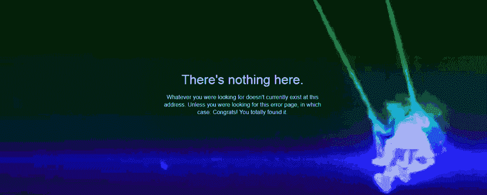

# 嘲讽国安局数字间谍工具的黑社会拍卖商

> 原文：<https://thenewstack.io/mocking-auctioneers-nsas-digital-spying-tools/>

互联网总是有最后的发言权——即使是在政府支持的网络间谍活动方面。

两周前，一个名为“影子经纪人”的神秘在线团体宣布，他们拥有美国国家安全局黑客工具的副本，并将拍卖给出价最高的人。他们的警告既笨拙又草率，但这种真实世界的间谍对间谍的情节继续在各种社交媒体网站上上演。那次对话的片段——有时看起来像是真正的 NSA 黑客工具——都在网上流传，就在众目睽睽之下。

这一切都发生在拍卖商被一群平民智者质问的时候——证明了即使在潜在的重大国家安全漏洞中，仍然会有一些自作聪明的人忍不住开几个玩笑。

最初，影子经纪人联系媒体，指出他们声称的黑客工具的一些细节，他们说这些工具来自 NSA 下属的 Equation Group。

“Shadows Brokers 刚刚发布了另一个#NSA 方程组代号，”一位安全分析师在 Twitter 上开玩笑说。"疯狂的投机"

8 月 13 日，影子经纪人的官方推特发布了正好五个词和一个标签:方程式集团-网络武器拍卖#EQGRP_AUCTION。但也有一个链接指向 Imgur.com 上的一些图片，显示了一个文件夹的截图，列出了他们拍卖的缓存中包含的文件的名称，以及它们的字节大小。

进入互联网聪明的家伙。这条推文被“喜欢”了 24 次，转发了 30 次，还得到了两条回复。一个人回答说，“用[超稀有全息金属 slammer pogs](https://twitter.com/LauriLoveX/status/765282836215627776) 交换，是吗？”

在 Imgur 上，他们的截屏吸引了来自随机网络冲浪者的 23 条评论。

*“在这个帖子里发帖，所以国家安全局把我加入了观察名单。”*

*“只是评论一下拿个 NSA Goodybag。我有一件 M 码的 t 恤，如果里面还有一个咖啡杯就太酷了。”*

影子经纪人毫不担心，继续在 Twitter 上发帖，分享 PasteBin 上一个页面的链接。如今，该网站称该页面“要么已经过期，要么已经被创建者删除，要么已经被 Pastebin 的工作人员删除。”但是该组织的[维基百科页面](https://en.wikipedia.org/wiki/The_Shadow_Brokers)仍然继续提供[在 archive.org](https://web.archive.org/web/20160816040632/http://pastebin.com/NDTU5kJQ)托管的副本的 URL，这样两周后，好奇的网络冲浪者仍然可以呆呆地看着他们不祥的信息。

*！！！注意网络战的政府赞助者和那些从中获利的人！！！！你为敌人的网络武器付了多少钱…？我们发现 stuxnet，duqu，flame 的创造者制造的网络武器。卡巴斯基调用方程组…*

*我们黑掉方程组。我们发现许多许多方程式组网络武器。你看到照片。你看，我们免费给你一些方程组文件。这是很好的证明不是吗？你享受吧！！！你打碎了很多东西。你会发现很多入侵。你写了很多字。但不是全部，我们拍卖的是最好的文件。*

他们的信息还包括一个 Tumblr 页面的链接——这导致了 Tumbler 的标准“页面未找到”信息的厚脸皮文本。Tumblr 古怪的背景图片在你每次重新加载页面时都会改变，在这个高风险的国际事件中提供了一个奇怪的喜剧时刻…

卡巴斯基[的一个分析团队发布了对超过 300 兆字节的“防火墙漏洞、工具和脚本”的评估](https://securelist.com/blog/incidents/75812/the-equation-giveaway/)，其中大多数文件的时间戳都在 2013 年的三个月以上，这才揭示了该组织警告的重要性。他们以“高度的信心”得出结论，这些文件与 NSA 小组的工具有关。但他们也忍不住提供了他们对泄漏情况的评估，称整个事件“真的很奇怪”

很快，伊利诺伊州的一名计算机科学教授加入进来，嘲笑 NSA 黑客工具的作者“代码草率且充满错误”，并称其实现的加密技术“很糟糕”。很不好。”

但是根据 SC 杂志的一篇文章，思科和 Fortinet 证实他们的防火墙受到了攻击的影响，并迅速发布了补丁，该文章还指出，其他防火墙公司，如 Juniper 和 Ixia，仍在努力堵塞漏洞。

“我们把最好的文件拍卖给出价最高的人，”影子经纪人的提议继续说道。"拍卖文件比我们已经给你的免费文件更好."他们提供了一个比特币地址，并指出谁向该地址发送了最多的比特币，“谁就是赢家，我们告诉如何解密。”

一个有趣的变化是，他们保留了所有由失败的投标人发送的比特币，但作为安慰奖，他们承诺如果发送的比特币总数超过 100 万，将会发布更多的文件——免费和不加密的——这个数字大约相当于 5.76 亿美元，或者大约是目前存在的所有比特币的 1/15。

在 Twitter 上，有人指出该组织的比特币拍卖已经成为恶作剧的目标。“有人盗用了#ShadowBrokers #EQGRP_Auction 比特币地址，”另一位名叫 AnonOps 的用户[在推特上写道，展示了一张图片，其中似乎记录了比特币地址中的每个后续条目都包含里克·阿斯特利臭名昭著的歌曲标题中的一个词——“永不”、“将要”、“给予”、“你”和“向上”](https://twitter.com/Anonops_Live/status/766014618972069888)

最初，拍卖[并没有引起太多的兴趣](http://themerkle.com/the-shadow-brokers-release-more-potent-exploits-to-the-public/)，导致该小组发布了一些额外的片段。根据该组织发布的一个常见问题，拍卖没有结束的时间。"继续出价，直到我们宣布赢家。"

美国国家安全局告密者爱德华·斯诺登表示，这可能不是第一次有人入侵美国国家安全局集团使用的服务器，并补充说最有趣的是[他们会公开承认入侵](http://www.businessinsider.com/edward-snowden-shadow-brokers-russia-leaked-nsa-equation-group-files-warning-dnc-hacking-2016-8)。他表示，事实上，这场关于国际比特币拍卖的喧嚣可能真的只是一场精心制作的木偶戏，目的是向美国国家安全机构传递一个信息。

“这次泄露很可能是一个警告，有人可以证明美国对来自这个恶意软件服务器(黑客文件的来源)的任何攻击负责，”斯诺登在推特上评论道。“这可能会对外交政策产生重大影响。尤其是如果这些行动的目标是美国的盟友。”

最后一点讽刺的是，斯诺登称肇事者是“未被发现的黑客，正蹲在美国国家安全局的服务器上”，并指出他们显然在 2013 年失去了访问权限——大约在斯诺登最初泄密的时间。“当我站出来的时候，作为预防措施，NSA 会将攻击性操作迁移到新的服务器上，”斯诺登在一系列推文中指出——讽刺的是，他的信息泄露可能促使 NSA 转移到更安全的服务器上。

他以分享他自己的一句幽默话来结束他的讲话。

<svg xmlns:xlink="http://www.w3.org/1999/xlink" viewBox="0 0 68 31" version="1.1"><title>Group</title> <desc>Created with Sketch.</desc></svg>