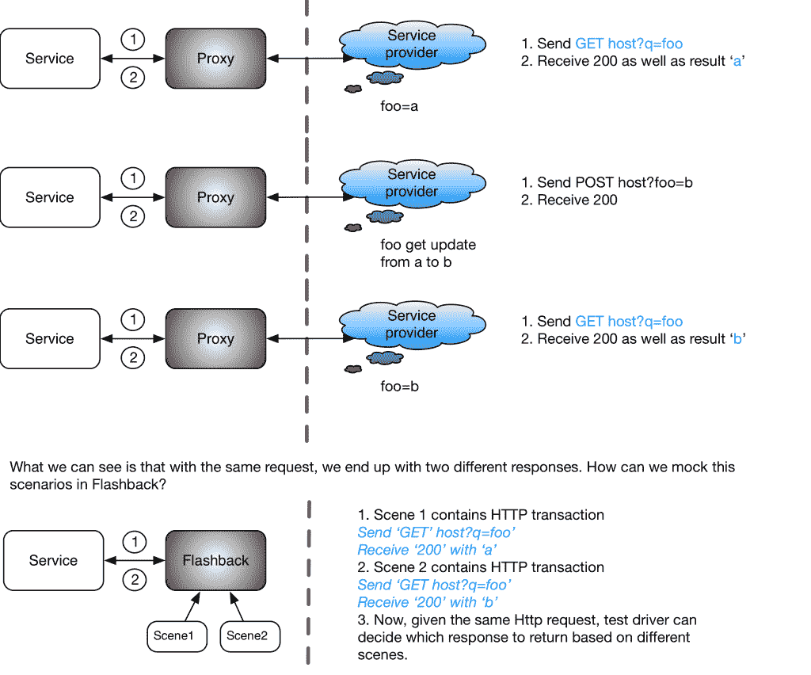

# 用 Flashback 模拟互联网，这是 LinkedIn 的一个新的 WebDev 测试工具

> 原文：<https://thenewstack.io/mocking-internet-flashback-new-tool-linkedin/>

互联网是一个苛刻的情妇。网站在没有通知的情况下关闭、更改，甚至完全消失。网络——你坐下了吗？—不是 100%可靠。这意味着测试一个有外部依赖的项目，事情可能会失败，甚至不是你的错误。软件测试工程师要做什么？！监视

做自己的互联网，就是这样。或者至少有一个网络层模拟系统来处理出站流量，这样就不会有第三方宕机网络问题或其他限制来破坏您的测试。LinkedIn 社交网络服务[的软件工程团队周五在一篇博客文章](https://engineering.linkedin.com/blog/2017/03/flashback-mocking-tool)中宣布，他们已经做到了这一点，建立了一个新的互联网模仿工具，名为 Flashback，以消除测试等式中的不可控变量。

当然，现在已经有各种各样的网络嘲讽工具了。它们的工作原理是拦截由 web 应用程序发起的 HTTP 连接，然后根据需要“重放”它们。换句话说，模仿工具用它以前记录的实例代替了任何 HTTP 交互，在测试中可以根据需要可靠地提供多次。

事实上，LinkedIn 测试团队最初使用的是 [Betamax](https://github.com/betamaxteam/betamax) ，这是一款开源的测试自动化工具。LinkedIn 软件工程师 Yabin Kang 说，该团队喜欢 Betamax 的许多方面，但他们需要的一些功能却没有提供，特别是服务级别集成测试。因此，康和他的同事们[尚尚峰](https://www.linkedin.com/in/shangshangfeng/)和[丹·维涅格勒](https://www.linkedin.com/in/danvinegrad/)利用 Betamax 的开源根构建了一个新的网络层嘲讽系统，名为闪回。

闪回旨在模拟 HTTP 和 HTTPS 资源，如 web 服务和[REST](https://en.wikipedia.org/wiki/Representational_state_transfer)API，用于测试目的。它记录 HTTP/HTTPS 请求并回放先前记录的 HTTP 事务—在闪回中称为“场景”—以便在测试期间不需要外部互联网调用。



“想象一个标准的 LinkedIn 个人资料页面，”康说。“它需要 100 多个下游依赖服务来呈现。如果你在这个页面上只测试一个微小的规范，你真的不想依赖所有那些依赖。尤其是当这些依赖实际上是来自互联网的永恒服务，而你又无法控制的时候。”

Kang 说，确保测试环境一致性的最佳方法是模拟依赖关系。回到我们的 LinkedIn 个人资料页面示例，这些页面使用一种叫做 LinkedIn 摄取服务的东西来获取外部内容——比如 YouTube 视频——以丰富您的 LinkedIn 个人资料。康解释说，典型的三层架构在中间有一个网关服务。“这就是闪回的用武之地——充当代理的中间层。我们的机会是在这一层进行模拟，以测试我们的摄取服务结果，而无需依赖外部提供商。”

闪回处理 HTTP/HTTPS 流量，截取请求和响应，并存储它们以备必要时“重放”。这种完全隔离的测试环境是 Flashback 相对于 Betamax 的主要创新领域，但还有更多。闪回还处理来自第三方网站的身份验证呼叫。“其他开源工具都没有做到这一点，”冯说。“当与互联网对话时，您总是需要处理认证，并且请求中的一些参数通常是不同的。因此，我们希望让用户能够完全满足这一要求。”

HTTP 请求通常包含 URL、方法、头和主体。闪回允许为这些组件的任意组合定义匹配规则。闪回还允许用户向 URL 查询参数、标题和正文添加白名单或黑名单标签。

康和冯指出了以下假设的 OAuth 授权流程，请求查询参数可能如下:

```
oauth_consumer_key="jskdjfljsdklfjlsjdfs",
         oauth_nonce="ajskldfjalksjdflkajsdlfjasldfja;lsdkj",
       oauth_signature="asdfjaklsdjflasjdflkajsdklf",
       oauth_signature_method="HMAC-SHA1",
       oauth_timestamp="1318622958",
       oauth_token="asdjfkasjdlfajsdklfjalsdjfalksdjflajsdlfa",
       oauth_version="1.0"

```

由于 OAuth 要求客户端每次都为 oauth_nonce 生成一个新值，因此这些值中的许多值会随着每个请求而改变。“在我们的测试中，我们需要验证 oauth_consumer_key、oauth_signature_method 和 oauth_version 的值，同时还要确保请求中存在 oauth_nonce、oauth_signature、oauth_timestamp 和 oauth_token。闪回让我们能够创建自己的比赛规则来实现这一目标，”工程师在宣布闪回发布的博客帖子中写道。“这个特性让我们可以测试带有时变数据、签名、令牌等的请求。客户端没有任何变化。”

LinkedIn 团队很高兴[将闪回作为开源工具](https://github.com/linkedin/flashback)提供给任何可能发现它有用的测试团队。闪回是用 Java 编写的，但是可以支持任何使用 HTTP 服务的环境。冯在 2015 年谷歌测试自动化会议上首次展示了闪回的概念证明，之后有很多人询问这个项目是否会开源。“最初我认为这只会在 LinkedIn 内部有用，但这些观众让我意识到这是一个测试场景，许多公司都会用到，”康说。

[https://www.youtube.com/embed/6gPNrujpmn0?feature=oembed](https://www.youtube.com/embed/6gPNrujpmn0?feature=oembed)

视频

该团队在 2016 年期间完善了闪回，并在今天的发布中达到高潮。当然，最终的问题是“作为一名开发人员，这如何让我的生活变得更好？”

LinkedIn 团队报告说，闪回现在帮助他们更快地释放。该公司长期致力于使他们的测试环境尽可能自动化，以及“积极的测试哲学”来适应新代码的快速部署。“当我们能够在可靠的测试基础设施内进行持续集成时，我们就知道一切是否都通过了——我们的服务做得很好，我们可以快速而自信地部署新版本，”Kang 说。

康举例说，“我们过去常常直接从 YouTube 等网站获取数据和内容。有时事情会从源头发生变化——不同的标题或其他变化。这将导致与我们的代码无关的失败。”

他说，闪回就像一个测试框架。“设置完成后，您过去必须做的一切，即以旧方式编写测试以从 YouTube 获取数据，现在都可以通过闪回来处理。”

康补充说:“现在，在集成测试中，你知道你的‘外部’响应将被可靠和一致地服务。”

特征图片:(从左至右)尚尚峰、丹尼尔·维耐加德、亚宾·康(由 LinkedIn 提供。)

<svg xmlns:xlink="http://www.w3.org/1999/xlink" viewBox="0 0 68 31" version="1.1"><title>Group</title> <desc>Created with Sketch.</desc></svg>