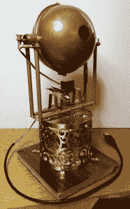
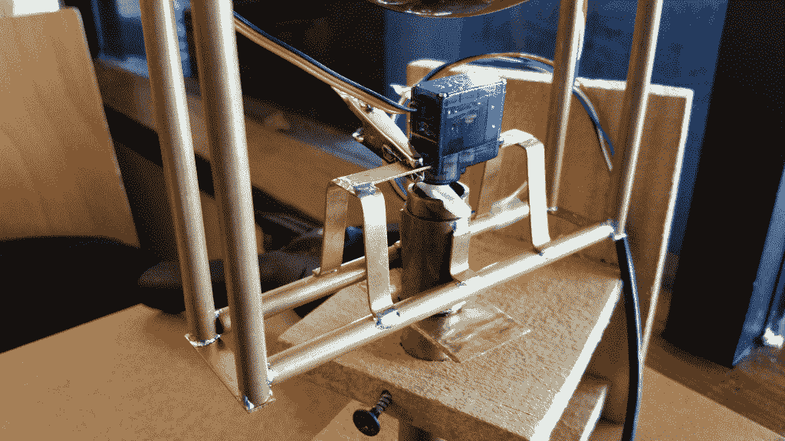
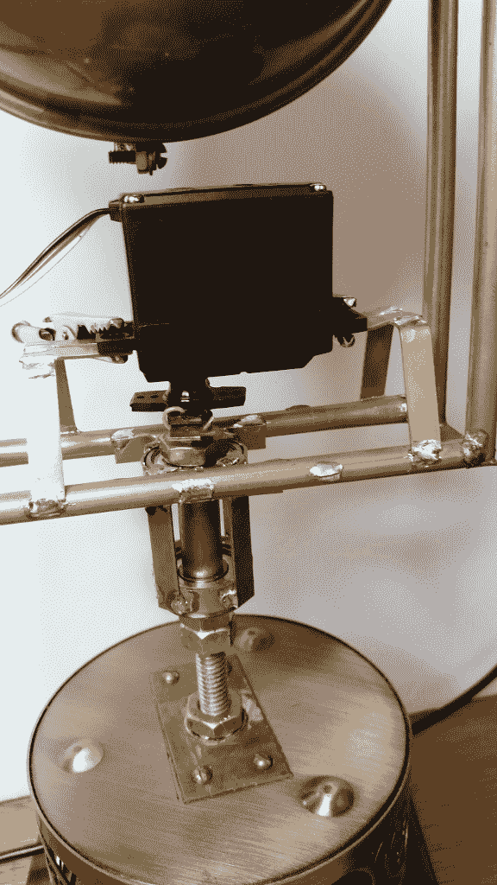
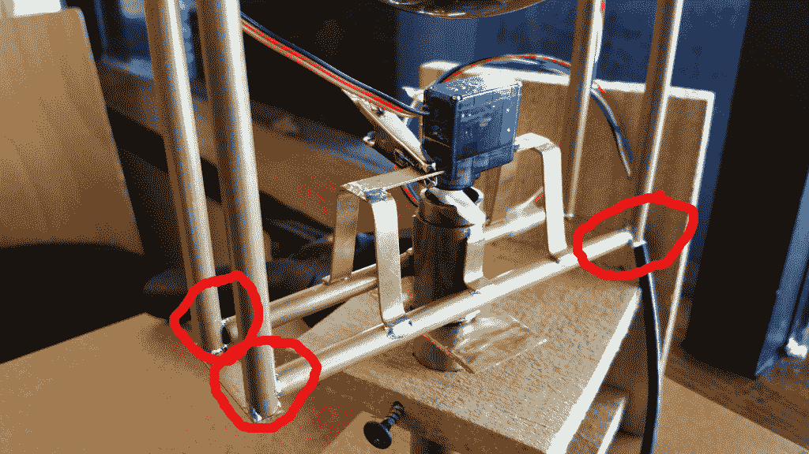
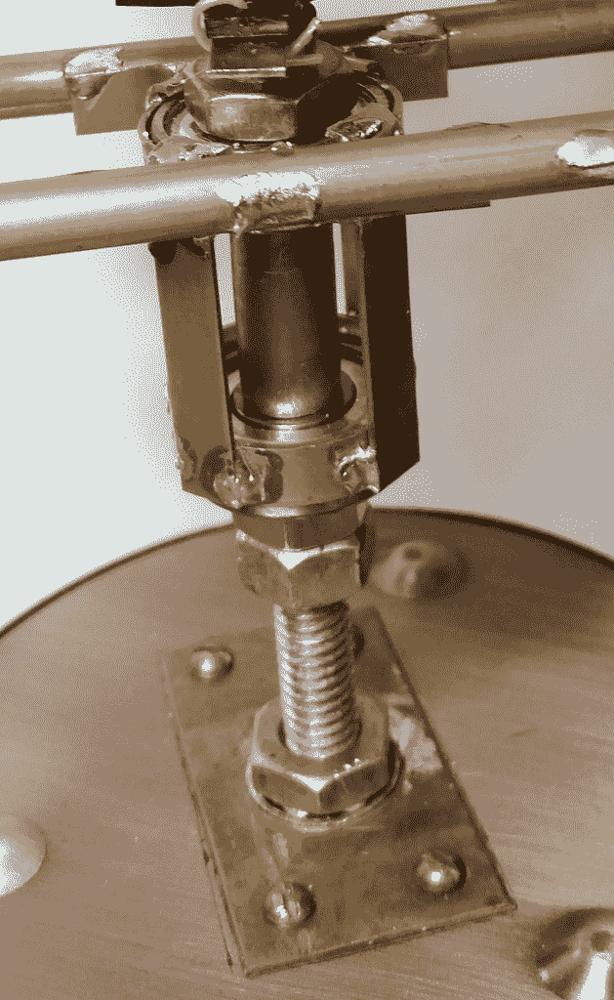
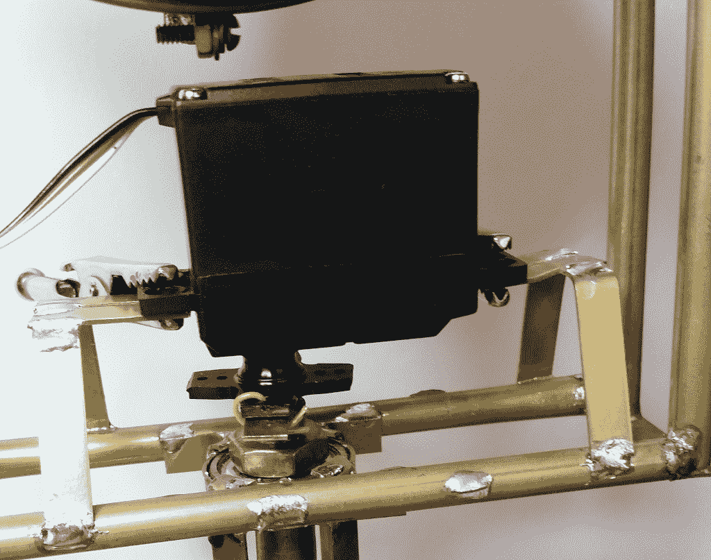
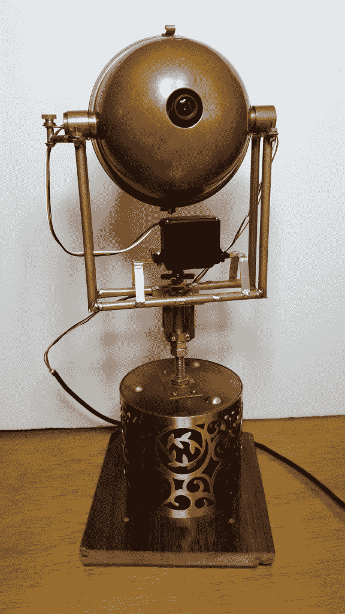

# 现成的黑客:改装蒸汽朋克眼球

> 原文：<https://thenewstack.io/modding-steampunk-eyeball/>

我的[蒸汽朋克眼球](https://thenewstack.io/off-shelf-hacker-behold-steampunk-eyeball-complete-part-5/)前往柏林，作为[新堆栈的小组讨论](https://thenewstack.io/cloudnativecon-kubecon-eu-pancake-breakfast-2017-kubernetes-multi-cloud/)和 Kubecon EU 的煎饼早餐的一部分。不幸的是，尽管行李包装得一丝不苟，它还是带着一个破损的半环形框架回到了美国。显然，这种设计需要对空中旅行更加稳健。

无论如何，它需要一些设计上的修改。潘伺服是边缘从一开始，并通过反复手动调整，最终剥离其微小的小塑料齿轮。事实证明，一个标准的业余爱好伺服适合一些调整。

1.0 版本也使用了微型伺服系统来完成平移和倾斜动作。倾斜伺服机构在眼球球体内部，可以理解需要微型尺寸。没有太多的扭矩，所以现有的工作正常。

原件的组成部分:

*   eFlight S75 伺服系统
*   17 美元(当地)
*   4.8 伏时为 17.2 盎司英寸(1.25 千克厘米)
*   4.8 伏时 0.12 秒/60 度
*   0.90 英寸长 x .45 英寸宽 x .94 英寸高
*   4.8-5.3 伏

蒸汽朋克眼球 v2:

*   双叶 S3003 伺服
*   17 美元(当地)
*   4.8 伏时为 44 盎司英寸(3.2 千克厘米)
*   4.8 伏时 0.23 秒/60 度
*   1.6 英寸(长)x .8 英寸(宽)x 1.4 英寸(高)

潘枢纽安排总是困扰着我。我从来没有得到超平滑的运动，因为在套管轻微绑定。当伺服和软件试图克服粘滞点时，这会导致不稳定的平移运动。

因此，因为我必须修复半圈无论如何，我决定取代潘枢轴衬套与球轴承安装，而我在它。轴承提供了更平稳的操作，同时减少了伺服扭矩负荷。

V1.0:半箍底部，平移伺服和枢轴。

V2.0 的新标准伺服和滚珠轴承安装

## 眼球模型

在下图中，圆圈标记了旅行中分开的关节:

V1.0 运输过程中断裂的半环形接头

我执行了以下步骤来重新设计枢轴和修复半箍框架:

*   移除了将枢轴管定位在倒置烛台底座中的圆形胶合板圆盘。
*   保留半英寸的铜枢轴管，并将其切割成与底座顶部齐平。
*   切下一根 6 英寸长的 5/16 英寸粗螺纹杆，用作新的轴承枢轴。
*   在管的底部使用两个螺母，在顶部使用两个螺母，将 5/16”杆紧贴地安装在半英寸枢轴管内。
*   将杆延伸至基座外壳上方约 3 英寸。
*   用 1/4 英寸 x 1/16 英寸的黄铜扁钢焊接成一个轴承箱。

V2.0 轴承保持架

*   在轴承箱底部使用两个螺母，在顶部使用一个螺母将轴承固定在杆上。
*   展开的轴承是标准滚子叶片类型(外径-. 866 英寸，内径-. 275 英寸，内径 315 英寸)，中间有一个垫片。
*   重建框架，将后管向后移动一点，以便轴承保持架可以固定在半箍管之间。
*   制造新的伺服支架，以适应新的(更大的)标准伺服。

V2.0 标准伺服和安装

*   建造了一个伺服驱动装置——一个平叶片，带有一个套环，可以套在开槽的 5/16”杆端上。用电线把它连接到一个塑料伺服支架上。
*   在枢轴杆的顶部做了一个槽来匹配伺服驱动器。
*   驱动器，伺服和轴承被调整到最小的松弛。一个紧密的系统反应迅速，没有“位置搜索”(随机的来回移动)。

仔细看看照片，你可以看到我是如何建立新的部分。

我在测试时注意到的一件事是，PixyMon 程序中的声相增益可以从大约 600 调回到 150。有了更少的平移轴承摩擦和更强大的伺服系统，软件不需要命令太多的“活力”来围绕水平轴旋转眼球。

## 下一步是什么

蒸汽朋克眼球回来了，比以往任何时候都好。我也正式把它升级到了 2.0 版本。

V2.0 蒸汽朋克眼球与球轴承和更大的潘伺服

仍然有一些零碎的东西需要解决，比如用螺栓将新的伺服系统固定到支架上(并移除鳄鱼夹)，以及在半环形框架上添加一些角撑板。

我们在过去几周开发的基于芯片的 MQTT 代理似乎是添加到眼球基础的一个很好的候选。有了代理的加入，我可能能够很容易地控制和传输来自眼球的数据。也许眼球的跟踪数据可以作为 MQTT 信息发送给我在演示时使用的其他伺服控制灯和小工具。我正在探索使用我的设备与观众进行更多互动的方法。

如果我们把眼球连接到树莓派或 BeagleBone，通过 Python 脚本进行交互，我们会做什么？可能是个主意。

将[现成的](/tag/off-the-shelf-hacker/)部件拼凑在一起，让物理计算变得现实，这很有趣。一定要与你的朋友和全世界分享你的项目故事。

<svg xmlns:xlink="http://www.w3.org/1999/xlink" viewBox="0 0 68 31" version="1.1"><title>Group</title> <desc>Created with Sketch.</desc></svg>