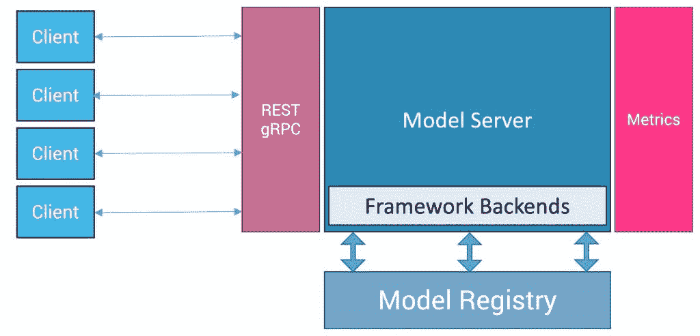

# 模型服务器:MLOps 的关键构件

> 原文：<https://thenewstack.io/model-server-the-critical-building-block-of-mlops/>

当我们想到[机器学习](https://thenewstack.io/category/machine-learning/)时，脑海中浮现的是数据集、算法、深度学习框架和训练神经网络。虽然它们在模型的生命周期中扮演着重要的角色，但是还有更多。典型的机器学习操作(MLOps)实现中最关键的步骤是部署和监控模型，这通常是事后才想到的。

一个常见的误解是，部署模型就像将它们包装在 Flask 或 Django API 层中并通过 REST 端点公开它们一样简单。不幸的是，在操作 ML 模型时，这不是最可扩展或最有效的方法。我们需要一个健壮的基础设施来管理模型的部署和推理。

随着容器成为部署现代应用程序的事实标准，服务模型的基础设施应该与云原生平台(如 Kubernetes 和 Prometheus)很好地集成。

## 什么是模型服务器？

如果你使用过基于云的人工智能服务，如亚马逊 Reckognition、Azure 认知服务和谷歌云人工智能服务，你会欣赏这些 API 的简单和方便。简而言之，模型服务器让您构建一个类似的平台，以服务的形式交付推理。

模型服务器对于机器学习模型就像应用服务器对于二进制文件一样。就像应用服务器为 WAR/JAR 文件、dll 和可执行文件提供运行时和部署服务一样，模型服务器为机器学习和深度学习模型提供运行时上下文。然后，它将部署的模型作为 REST/gRPC 端点公开。

> 模型服务器对于机器学习模型就像应用服务器对于二进制文件一样。

由于模型服务器有效地将推理代码与模型工件解耦，因此与自托管 Flask 或 Django web API 相比，它的伸缩性更好。这种分离使 MLOps 工程师能够部署新版本的模型，而无需更改客户端推理代码。

[TensorFlow Serving](https://www.tensorflow.org/tfx/serving/architecture) 、 [TorchServe](https://pytorch.org/serve/) 、[多模型服务器](https://github.com/awslabs/multi-model-server)、 [OpenVINO 模型服务器](https://github.com/openvinotoolkit/model_server)、 [Triton 推理服务器](https://developer.nvidia.com/nvidia-triton-inference-server#:~:text=Open%2Dsource%20inference%20serving%20software,Download%20Triton)、 [BentoML](https://github.com/bentoml/BentoML) 、 [Seldon Core](https://www.seldon.io/tech/products/core/) 和 [KServe](https://www.kubeflow.org/docs/external-add-ons/kserve/kserve/) 是一些最受欢迎的模型服务器。尽管它们是为特定的框架或运行时设计的，但该架构具有足够的可扩展性，可以支持多种机器学习和深度学习框架。

## 模型服务器架构

典型的模型服务器从一个集中的位置加载模型工件和依赖项，这个位置可以是一个共享文件系统或一个对象存储桶。然后，在将模型公开为 REST/gRPC 端点之前，它将模型与相应的运行时环境(如 TensorFlow 或 PyTorch)相关联。模型服务器还捕获与 API 调用和推理输出相关的指标。这些指标对于监控每个模型的性能以及服务于基础设施的整个模型的健康状况非常有用。

让我们来看看模型服务器的每个组件:

### **客户端**

客户机是一个 web、桌面或移动应用程序，它使用模型服务器通过 API 公开的模型。任何能够发出 HTTP 请求的客户机都可以与模型服务器进行交互。为了提高性能和可伸缩性，客户端可以使用 gRPC 端点来代替 REST。模型服务器还发布了简化 ML APIs 与应用程序集成的客户端 SDK。

### **模型服务器**

模型服务器负责加载模型，读取相关的元数据，然后实例化端点。它将客户端请求路由到模型的适当版本。模型服务器最重要的功能是通过动态映射和取消映射活动模型来有效地管理计算资源。例如，模型服务器可以根据请求队列长度和调用频率从 GPU 加载和卸载模型。这种技术使得在不锁定资源的情况下为多个模型使用相同的 GPU 成为可能。

### **运行时/后端**

模型服务器可以支持一个或多个框架和运行时。它有一个可扩展的架构，可以将新的框架引入堆栈。有了可插拔架构，就有可能实现新的框架和运行时。比如英伟达的 Triton 推理服务器支持多种框架，包括 TensorRT、TensorFlow、PyTorch、ONNX、OpenVINO、XGBoost、Scikit-learn。

### **车型注册处**

模型注册中心是一个集中的持久层，用来存储模型工件和二进制文件。模型服务器访问它来加载客户机请求的模型的特定版本。模型注册中心可以存储多个模型和同一模型的多个版本。每个模型还包含描述运行时需求、输入参数、数据类型和输出参数的附加元数据。它可以有选择地包含一个带有标签的 text/JSON 文件，这些标签可以用来将推理输出与一个有意义的标签相关联。

虽然模型注册中心可以是文件系统上的一个目录，但是对象存储桶是首选的。当运行多个注册表实例时，对象存储层比文件系统更好。

要获得详细的解释和一步一步的教程，请参考我关于使用 [MinIO 作为运行在 Kubernetes 上的 Nvidia Triton 推理服务器](https://thenewstack.io/deploy-nvidia-triton-inference-server-with-minio-as-model-store/)的模型存储的指南。

### **指标**

模型服务器公开了一个度量端点，它可以被度量服务器(如 Prometheus)废弃。除了监控模型服务基础设施的健康状况，度量服务还可以用于跟踪 API 度量，比如并发请求的数量、当前请求队列和延迟。

在接下来的文章中，我们将仔细研究市场上的一些开源和商业模型服务器。敬请关注。

<svg xmlns:xlink="http://www.w3.org/1999/xlink" viewBox="0 0 68 31" version="1.1"><title>Group</title> <desc>Created with Sketch.</desc></svg>