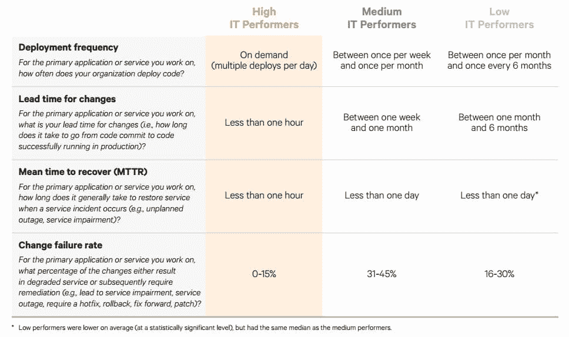

# 对于现代商业来说，这就是“不发展，就灭亡”

> 原文：<https://thenewstack.io/modern-business-devops-die/>

如果您的公司从事软件业务，或者如果软件是您竞争优势的一部分，那么未能采用持续集成和部署(CI/CD)管道将意味着您组织的终结。

“DevOps 是新的常态。IT 优化软件提供商[木偶](https://puppet.com/)的首席执行官 [Luke Kanies](https://twitter.com/puppetmasterd) 在本周于加州山景城举行的 OpenStack 硅谷 2016 大会上表示:“如果你现在是一家大公司，那么不管你愿不愿意，你都是一家软件公司。”。“如果你是一家软件公司，你需要弄清楚如何优化整个端到端的软件生产。”

Kanies 的可怕警告对许多公司高管来说可能不是好消息，他们可能正确地认为，适应 DevOps 所需的成本和文化调整很高，可能对一些人来说太高了。这是不幸的，因为失败将导致他们的灭亡，卡尼兹预测。

在过去的五年里，Puppet [在 IT 领域调查了](http://www.puppet.com/devops)25000 人，关于 DevOps。它发现 DevOps 在许多公司的成功中发挥了重要作用。

Puppet 的调查结果相当令人惊讶，即使你已经在喝 DevOps Kool-Aid 了。调查中表现最好的人在他们的产品代码中部署的变更比平均水平多 200 倍。当需要修复或改进时，它们的反应速度会快 2500 倍。

Kanies 说:“从想法到生产，从发现问题到客户体验到解决问题的好处，这些时间对于表现最好的组织来说要短 2500 倍。”

(这项调查虽然详尽，但也有一些局限性。由于 Puppet 通过他们设定的变量定义了表现最佳的组织，他们的报告没有发现 DevOps 原则和公司业绩之间的直接因果关系。研究作者将在一篇即将发表的学术论文中发表一项统计上严格的分析。)

因为他们更频繁地挑战，这些公司经历的失败比一般组织少三分之一。当他们经历失败时。当他们遇到故障时，他们解决问题的速度可以快 24 倍。

摘自 Puppet 的“2016 年 DevOps 报告”

由于这是一项为期五年的调查，Puppet 发现，顶级绩效组织和一般组织之间的差距正在扩大。换句话说，企业不迁移到 DevOps 的成本正在增加，尤其是那些拥有精通 DevOps 的竞争对手的企业。

> 该调查向 Puppet 指出，成为“伟大的软件公司”的唯一途径是“优化端到端的软件生产”。

“因此，未来十年的成功意味着弄清楚如何进行优化，如何从一家伟大的公司转变为一家伟大的软件公司，”Kanies 说。“你必须承诺。您必须找到一种方法，从构建软件的旧风格转向采用 DevOps 实践的新世界。”

## 愚蠢但重要，还是聪明但无关紧要？

当然，一个公司可能有很多不采用 DevOps 的好理由。尽管本网站的读者可能熟悉新的[微服务](/category/microservices/)和基于容器的敏捷架构，但事实是绝大多数组织仍在运行被认为是遗留的软件(或者被称为“生产软件”)。许多人仍然受困于在虚拟机中运行应用程序和在传统的客户端-服务器架构中运行应用程序之间。

“你不能忽视这个现实，”卡尼兹说。

但是，即使是对流程和工具的微小改变也能带来可观的收益。寻找自动化领域。此外，Kanies 说，一个小的变化可能会带来对整个管道的新的思考方式，这可能会导致效率的大幅度提高。

DevOps 最初的好处来自时间回收。“这一切都是为了找到让时间回到你的一天的方法，”卡尼兹说。它是关于自动化的小任务，以及尽量减少干扰。

“许多人没有时间在一个简单的难题上花费数小时。他们经常被打断，”卡尼兹说。“如果这是你的问题，你需要找到一种方法来消除你一天中的干扰。一旦你有了这些，你就可以利用这些额外的能力去做更有趣的、战略性的工作。”

* * *

在 DevOps 剧变中首当其冲的行业之一是基础设施软件行业本身，在另一场 OpenStack 硅谷会议上，与[电池风险投资](https://www.battery.com/)技术研究员[阿德里安·科克罗夫特](https://twitter.com/adrianco)和[米兰蒂斯](https://www.mirantis.com/)首席营销官[鲍里斯·伦斯基](https://twitter.com/zer0tweets)讨论了该行业的影响。

6 月，Renski 写了一篇博客文章“[基础架构软件已死](https://www.mirantis.com/blog/infrastructure-software-is-dead/)”，讨论了基础架构软件世界如何脱离传统的部署模式，例如 Oracle 和 VMware 等传统企业软件供应商定期打包并发布软件。

当 Mirantis 开始发布其 OpenStack 发行版时，也是以这种预打包的格式开始的，通过发布整个堆栈的定期升级。但是，这并不真正符合客户运行私有云运营的方式，他们越来越多地通过客户的 CI/CD 管道进行持续升级，包括试运行、测试，然后部署到生产环境中。

“这是一种不同的软件交付模式。你实际上是在不断地消耗代码。

对于企业基础设施软件，“购买周期已经崩溃，部署周期已经崩溃，”科克罗夫特同意。升级企业软件(如 SAP 系统)的旧方法是让一个专门的团队来花几个月的时间进行升级，然后继续下一个项目。这种方法以软件的大规模定期更新模型为中心，大约每 18-24 个月更新一次。但是向 CI/CD 的转移意味着更新以更小的块出现，并且更频繁地到达。

“开发者社区基本上已经学会了如何做微服务，将所有东西分成可以独立部署的小块。因此，你最终会陷入这样一种境地:某样东西真的没有版本，”科克罗夫特说。

TNS 研究分析师劳伦斯·赫特对本文有贡献。

特色图片:[加州山景城史蒂文斯溪步道](http://www.mountainview.gov/depts/cs/shoreline/trails/stevens.asp)。

<svg xmlns:xlink="http://www.w3.org/1999/xlink" viewBox="0 0 68 31" version="1.1"><title>Group</title> <desc>Created with Sketch.</desc></svg>