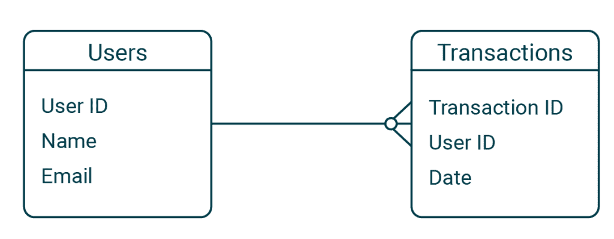
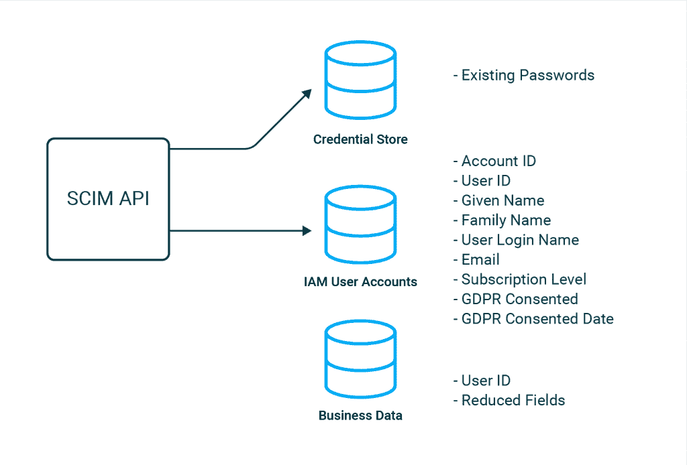
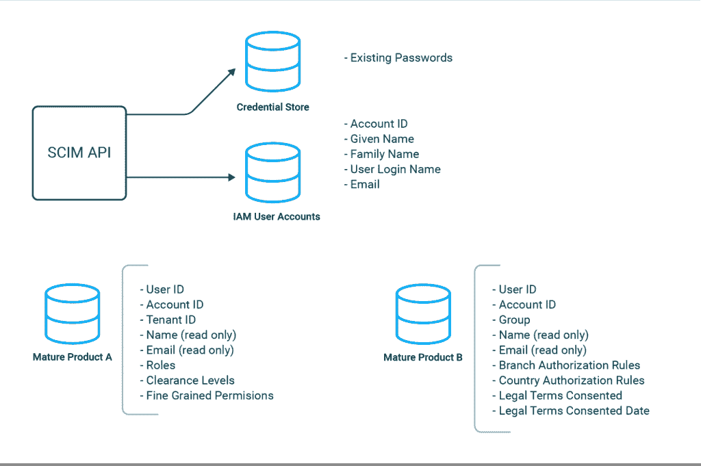
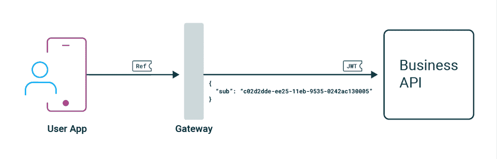
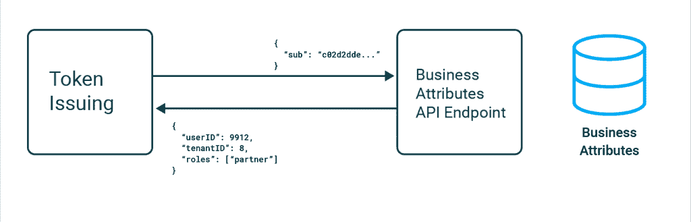
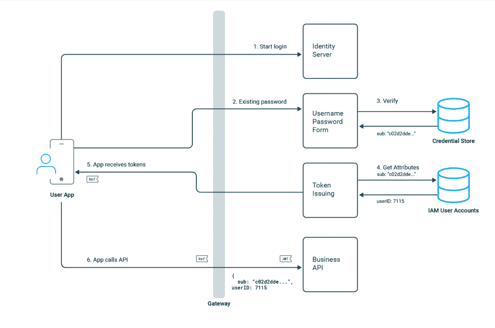
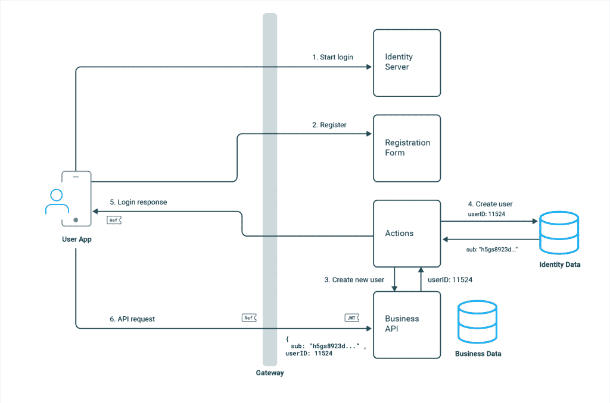
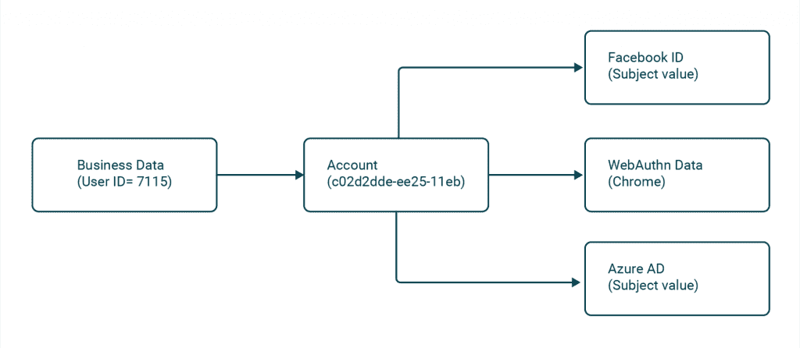
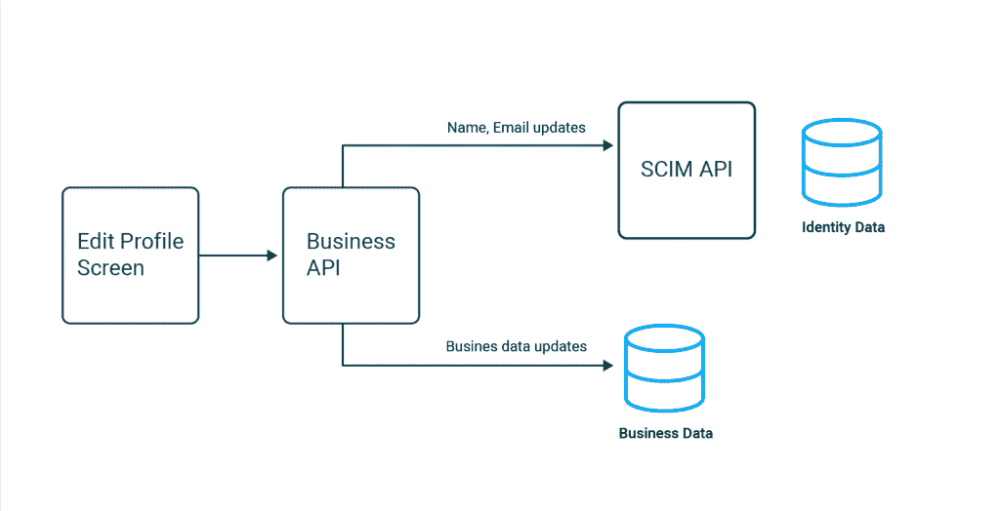

# 现代身份入职必备

> 原文：<https://thenewstack.io/modern-identity-onboarding-essentials/>

加里·阿彻

加里是 Curity 公司的产品营销工程师。20 年来，他一直担任首席开发人员和解决方案架构师。

许多公司希望在其软件中使用现代身份和访问管理(IAM)功能来改善客户体验并保持竞争力。但是用这些高级行为从头构建一个完整的解决方案将是困难和昂贵的。

公司被现代的认证方式所吸引，比如谷歌登录，使用用户不会忘记的密码或者无密码登录方式，比如 [WebAuthn](https://curity.io/resources/learn/webauthn-overview/) 。还需要处理业务用例，例如，使业务合作伙伴能够使用他们自己的 SAML 身份提供者登录，或者使呼叫中心操作人员能够使用[客户端发起的反向通道认证](https://curity.io/resources/learn/ciba-flow/) (CIBA)代表用户安全地操作。

这些特性是通过 [OAuth 系列规范](https://curity.io/product/conformance/)实现的，其中您将困难的安全工作外包给由专家提供的第三方授权服务器。用户验证后，您的 API、web 应用和移动应用会收到令牌，从而简化应用代码，并提供更易于长期扩展的安全行为。

## 商业数据

同时，您的业务域将处理某种形式的用户事务，如购买、保险索赔或医疗记录。这通常根据数据库 id 映射到用户，在某些系统中，这些事务可能已经存在了 10 年或更长时间:



集成 IAM 系统的难点之一是设计应用程序如何从业务术语的 OAuth 标记中识别用户。这需要洞察力，但是一旦拥有了洞察力，您就可以在使用最新安全功能的同时继续增加业务数据。

在这篇文章中，我将深入研究集成业务和 IAM 世界的细节。目标是帮助公司在改变应用程序中的安全代码之前澄清他们的需求。我们将关注端到端流程，并为您的应用程序提供所需的身份数据。

## 开始架构

迁移到 OAuth 的起点因公司而异。过去，网站通常会管理自己的凭证，可能会将散列密码存储在数据库中。或者你可能使用社交登录，通过谷歌或脸书，但仅限于简单的认证。最后，您可能正在使用授权服务器，但是只有基本的功能和麻烦。

软件公司的工程师可能并不总能看到集成 IAM 系统的清晰迁移路径。因此，在下面的小节中，我提出了一些无论源系统的架构如何都可以采取的高级步骤。这些步骤中的每一步都涉及一些设计细节，公司需要理解这些细节并适应它们的特定用例。然后，您将能够以无风险的方式管理迁移。

### 步骤 1:设计用户帐户数据

在 OAuth 架构中，总是有两种用户数据来源:业务数据和身份数据。在一个简单的系统中，您可能会决定将大多数用户字段转移到身份数据中，在那里可以通过内置的 [SCIM API](https://curity.io/docs/idsvr/latest/system-admin-guide/data-sources/scim.html) 来管理身份数据。通常可以在不更改密码的情况下迁移密码:



通常至少会将一些个人身份信息(PII)转移到 IAM 数据中，以便在那里管理和审计[隐私问题](https://curity.io/resources/learn/privacy-and-gdpr/)。然后，应用程序以令牌的形式接收这些数据，在某些情况下，可能会存储这些数据的非规范化只读副本。

根据您的用例，在哪里存储以业务为中心的用户字段可能需要仔细考虑。在我工作过的一些公司平台中，使用了多个大型产品，复杂的业务规则经常变化，因此在业务数据中保留角色和权限被认为更方便。在医疗系统中，可能会在身份验证屏幕中使用患者标识符，但是您可能不希望将该值移动到身份数据中。

另一种选择是只在 IAM 数据中存储有限的用户字段，并将业务数据链接到身份数据。IAM 系统应该允许您以最适合您业务的方式管理用户数据。



### 步骤 2:设计 API 访问令牌

应该通过[幻影令牌模式](https://curity.io/resources/learn/phantom-token-pattern/)安全地处理访问令牌，但是最终每个 API 将接收一个 JWT 访问令牌。默认情况下，这将只通过一个[主题声明](https://datatracker.ietf.org/doc/html/rfc7519.html#section-4.1.2)来标识用户，这通常是一个生成的 UUID(通用唯一标识符)，对以业务为中心的 API 没有用:



为了实现业务连续性，您的 API 将需要接收令牌，这些令牌的声明在业务术语中标识用户，如下例所示:

```
{

“sub”:  “c02d2dde-ee25-11eb-9535-0242ac130005”,

“userID”:  9912,

“subscriptionLevel”:  “gold”

}

{

“sub”:  “c02d2dde-ee25-11eb-9535-0242ac130005”,

“userID”:  9912,
“tenantID”:  8,

“roles”:  [“partner”]

}

```

在令牌发放期间，IAM 系统可能需要安全地访问您的业务数据，以读取特定于域的用户属性。这些随后作为[声明](https://curity.io/resources/learn/scopes-claims-tokens-and-all-the-things-in-between/)发布，您的主要 API 可以信任并使用这些声明进行授权。



### 步骤 3:设计端到端流程

设计好数据后，您必须决定在迁移到 OAuth 系统后端到端流将如何工作。对于现有用户，流程可能如下所示，其中对最终用户没有影响，因为使用了现有密码，对 API 也没有影响，因为提供了用户的现有标识符:



您还需要考虑在迁移到 OAuth 架构之后将加入的新用户。可能还需要在业务数据中创建新用户，一种选择是通过身份验证期间的自定义操作来完成:



IAM 系统很可能会提供开箱即用的用户验证功能，如电子邮件和短信。在自定义身份验证屏幕和自定义操作方面，寻找良好的通用可扩展性，以便在需要时涉及到您的业务数据。

一种常见的可视化方式是医疗或政府系统在身份验证过程中经常显示一系列屏幕。这些屏幕提示输入各种因素，可能包括患者身份或政府 Eid。输入详细信息后，IAM 系统可能需要调用特定于域的 API 来验证提交的值。

另一个需要了解的领域是如何管理对主要身份验证方法的更改，默认情况下，这将复制用户帐户。相反，IAM 系统应该允许您实现下面的画面，其中多种身份验证方法链接到同一个企业身份:



IAM 系统将提供[账户链接](https://curity.io/docs/idsvr/latest/authentication-service-admin-guide/account-linking/index.html)特性来实现这一点，这需要两个高级功能。首先，脚本化操作应该使您能够处理主要帐户和外部系统的属性，以便将它们匹配在一起，例如通过电子邮件。其次，当逻辑不确定时，可以提示用户通过现有的身份验证方法来证明他们的身份，作为新方法的一部分。

### 步骤 4:进行用户更新

一旦理解了端到端流的工作方式，下一步就是用现有用户填充 IAM 系统。这是一个脚本化的 ETL 过程，由三个步骤组成，您应该能够多次运行和重试，对当前系统的影响很小或没有影响。

首先，通过将新的 IAM 系统连接到现有的凭据库来迁移凭据，或者通过 SCIM 导入凭据。接下来，将用户数据迁移到 IAM 系统，这将为每个用户创建一个帐户 ID。最后，如果需要，更新业务数据。

您还需要考虑用户编辑操作，更新现有的用户编辑屏幕以将数据保存到两个数据源是很常见的:



始终确保可以连接两个静态数据源之间的数据。这将确保将来的 IAM 迁移是可能的，在这种情况下，帐户标识符或主题声明将使用来自新提供者的值进行更新。因此，主题声明不应该用作业务数据中的外键。

### 步骤 5:实施概念证明(POC)应用程序

对于以前没有在应用程序中实现 OAuth 和 OpenID Connect 流的团队来说，有一个学习曲线。在这里，演示应用可以为你的旗舰应用铺平道路。这可能包括用几个屏幕编写简单的 ui，并做足够的工作来签署 UX、可靠性和数据集成。

您从 IAM 提供商处获得的应用程序指导和支持也很重要，因为每种类型的应用程序的最佳实践可能有其自身的细微差别，您可能需要帮助。还旨在保持代码的可移植性和基于标准，以避免供应商锁定:

如果操作正确，这将产生简单的应用程序代码和可扩展的安全行为，所有这些都只需重新配置 IAM 系统。随着时间的推移，您将在 IAM 系统中做更多的工作来处理其他安全场景。这将使用所提供的大型构建模块，这些模块会不断为您改进。

### 需求列表

一旦为您的用例完成了前面的设计步骤，并且完成了一些初始工作之后，您将会阐明您对 IAM 系统的需求。一个好的方法是将这些收集到一个列表中，该列表包括与端到端流相关的核心行为、高级安全特性和应用程序指导。

一些 IAM 提供者可能不支持您需要的所有行为，因为最好的 OAuth 解决方案除了支持安全标准之外，还需要良好的可扩展性。因此，在承诺实施之前，请确保您能够解决任何限制，以便能够保证业务连续性。

## 概括起来

将身份集成到您的业务领域需要洞察力，并且可能需要不同的数据流，这取决于您的用例。IAM 系统应该用作一个工具箱，允许您定制重要的区域。

在 Curity，我们每天都在解决身份问题，支持很多标准。不过，我们知道公司也需要可扩展性特性。我们支持这篇文章中的所有行为，并提供广泛的学习资源来帮助你:

<svg xmlns:xlink="http://www.w3.org/1999/xlink" viewBox="0 0 68 31" version="1.1"><title>Group</title> <desc>Created with Sketch.</desc></svg>