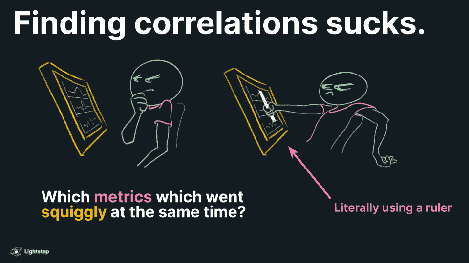
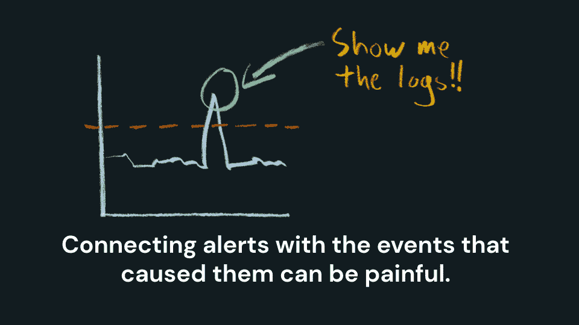
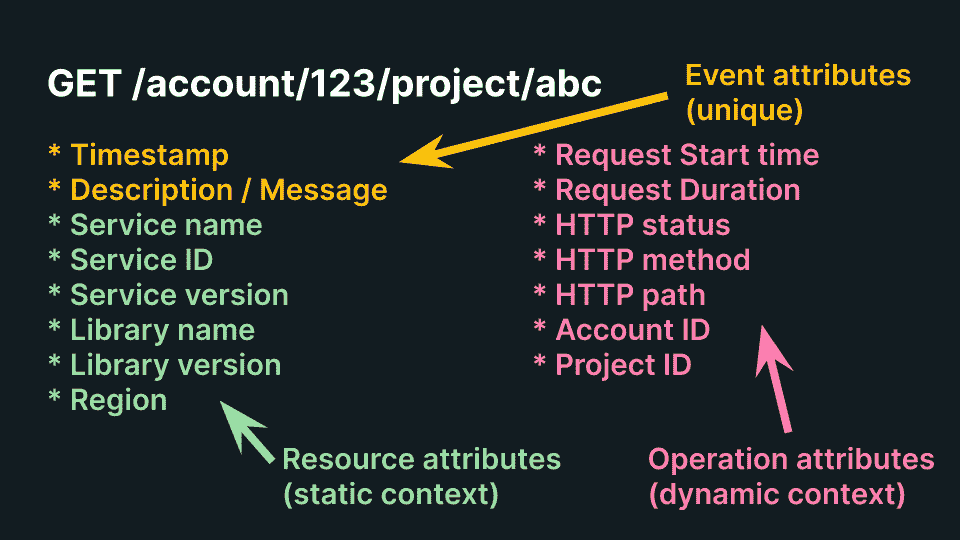
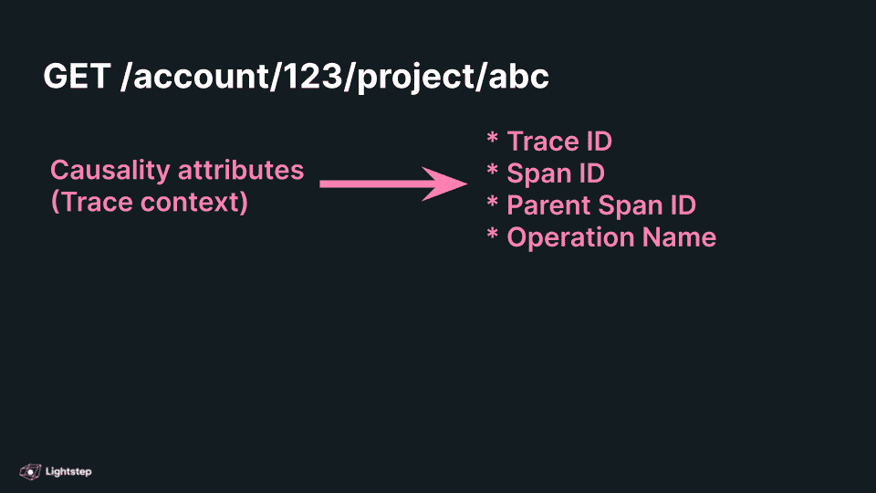
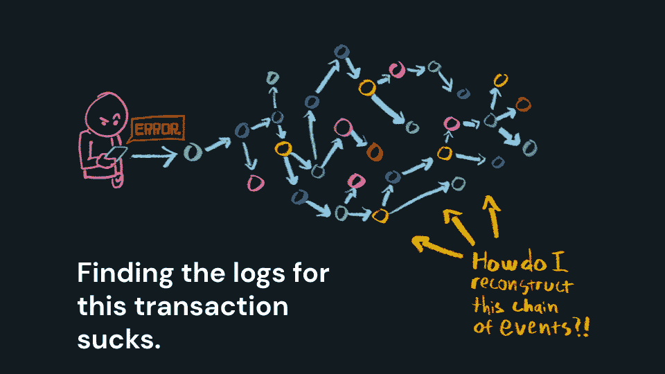
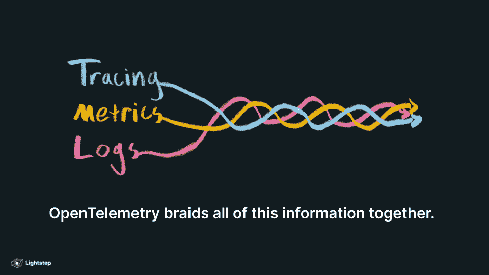

# 现代的可观测性是单一的数据编织

> 原文：<https://thenewstack.io/modern-observability-is-a-single-braid-of-data/>

观察系统总是意味着两件事:识别发生了什么，是什么导致了它的发生。为此，我们一直使用日志和指标。(少数人也用过 [tracing](https://lightstep.com/full-context-tracing) ，不过是作为性能分析的小众工具。)

因此，整个三大支柱的事情。

## 我们过的生活

这种支柱叙事从根本上说是错误的。错，我告诉你！

“三大支柱”的问题在于我们如何使用它们。在观察我们的系统时，我们不会孤立地使用这些工具。为了有用，我们必须把他们聚在一起，就像某种尴尬的家庭集体拥抱。

实际情况是这样的。

由于一个指标变得不规则，所以会出现警报。因此，我们加载了一个仪表板，眯着眼看，试图找到同时出现弯曲的其他指标。实际上，这就是我们所做的。在过去，我甚至在屏幕上放一把尺子或一张纸，看看排好了什么。(如果你也做过这个，击掌和掌纹。)

然后根据这些信息，我们*猜测*问题可能是什么。我们是疯狂的泼妇，我们四处奔忙，搜寻一些日志，试图重建事件链，同时也挖掘 conf 文件，寻找任何令人惊讶的东西。

但是哪些日志呢？哪些会议文件？度量仪表板知道的很少。我们必须推断这些信息，然后查看对我们关心的警报和指标一无所知的独立工具。

## 这就是我们受苦的原因

 [泰德·杨

Ted 是 OpenTelemetry 项目的联合创始人，目前在 Lightstep 担任开发人员教育总监。他住在俄勒冈州波特兰的一个小农场里。](https://www.linkedin.com/in/ted-young/) 

关键是，跨多个数据源关联活动是实际解决问题的先决条件。这是叙述进入树林的地方。这些支柱在我们的数据源之间制造了人为的障碍。

的确，由于传统的监控和应用程序性能管理(APM)工具的实施方式，我们不得不以这种方式工作。但那其实是实现细节，不是佳能。

就当是历史偶然吧。随着时间的推移，我们慢慢地增加了不同的工具，结果，数据碰巧存储在几个不相连的数据存储中，这需要人类将大脑中的所有东西联系在一起。

## 拿两个

但不一定要这样。因此，让我们暂停一分钟，理清思路，以 [OpenTelemetry](https://otel.lightstep.com/) 为指导，从头开始重新评估这种情况。

我们的旅程从**事件**开始。事件是属性的集合。我们希望这些属性是结构化的，以便您可以正确地索引您的事件，并使它们可搜索。我们还希望这些属性以有效的方式构造，以避免发送重复的信息。

其中一些属性是事件所特有的；这些是**事件属性**。事件时间戳、日志消息、异常详细信息等。，都是事件属性。

但是这些并没有你想象的那么多。事实上，大多数属性对于一系列事件来说都是共同的，在每个事件上重复记录这些信息是一种浪费。

我们可以将这些属性提取到事件周围的信封中，在那里可以写一次。让我们称这些信封为**上下文**。

有两种类型的上下文:静态和动态。在 OpenTelemetry 中，这些上下文类型被称为**资源**和**跨度**。

静态环境(资源)是事件发生的地方。这些属性描述了程序在哪里执行以及它是如何配置的。服务名称、版本、地区等。conf 文件中的任何重要信息都可以成为资源。

一旦程序启动，这些资源属性的值通常不会改变。但是对于 span 属性，值在每次操作执行时都会改变。

动态背景(跨度)是事件发生的方式。请求开始时间、持续时间、HTTP 状态和 HTTP 方法都是 HTTP 客户端操作的标准 span 属性的示例。在 OpenTelemetry 中，我们将这些属性称为语义约定(语义约定)(语义约定)(语义约定)(语义约定)(语义约定)(语义约定)(语义约定)(语义约定)(语义约定)(语义约定)(语义约定)(语义约定)(语义约定)(语义约定)(语义约定)(语义约定)(语义约定)(语义约定)是语义约定)的简称，我们试图在记录它们的方式上保持一致。但是也可以有应用程序开发人员添加的特定于应用程序的属性，例如项目 ID 和帐户 ID。

动态环境也是因果关系的来源——我们想知道什么导致了什么。为此，我们需要向我们的跨度添加四个属性: **TraceID** ， **SpanID** ， **ParentSpanID** ，**操作名称**。

这样，我们所有的事件都被组织成一个图表，代表它们的因果关系。这个图表现在可以用多种方式索引，我们稍后会讲到。

## 真实性

这个事件图让我们认识到三个支柱中的两个之间的第一次人为和不必要的分离。跟踪实际上只是用更好的索引进行日志记录。当您将适当的上下文添加到日志中时，您几乎可以根据定义获得跟踪。

现在，因为寻迹有一个小众的历史，也许你们有些人不相信我。所以试试这个思维实验。

假设您正在调查一个事件。当你找到一个相关的日志时，你会怎么做？也许是个错误。你想做的第一件事是什么？您想要找到所有其他相关的日志！

您如何找到所有相关的日志？痛苦和折磨，我的朋友们，痛苦和折磨。

想想你在通过搜索和过滤收集这些日志上投入了多少时间和精力；那是花在收集数据上的时间，而不是花在分析数据上的时间。您需要处理的日志越多——越来越多的机器执行越来越多的并发事务——就越难收集到真正相关的日志。

但是，如果您有 TraceID，收集这些日志只是一次查找。TraceID 索引允许您的存储工具自动为您完成这项工作；找到一个日志，事务中的所有日志就在那里，不需要额外的工作。

有鉴于此，为什么您想要没有这些“跟踪”id 的“日志”呢？

## 让我们来谈谈~~指标~~总量

现在我们已经确定了什么是事件，让我们来讨论一下事件的集合。

我们查看事件、跨度和资源属性的总和来寻找模式。

属性的值可能出现得太频繁，或者不够频繁，在这种情况下，我们希望计算这些值出现的频率。或者该值可能超过某个阈值，在这种情况下，我们希望测量该值如何随时间变化。或者，我们可能希望以直方图的形式查看值的分布。

我们通常称这种分析为“度量”，我们倾向于认为它与日志(也称为事件)是分开的。但重要的是要记住，每一个指标都与实际发生的真实事件相关。事实上，您在典型仪表板中看到的任何指标都可以很容易地从 OpenTelemetry 提供的标准资源、跨度和事件属性中生成。因此，这些支柱之间的分离又一次开始变得模糊不清。

当我们开始考虑相关性时，它真的变得混乱了。

**"高延迟与卡夫卡相关联. node = > 6"**

**"错误率增加与 project.id = > 22"**

**“甲导致乙”**

这种类型的自动相关性检测是一种强大的工具。我们需要这些相关性，因为识别它们通常是我们的第一个真正的线索，并引导我们识别原因和制定解决方案。

在一个跨度中的属性之间可能发生相关性。相关可能发生在轨迹的跨度之间。在踪迹和资源之间可能发生相关性。

因此，单个指标是不够的。我们必须对多个指标进行比较，才能找到这些线索。如果我们的工具是分离的，上下文将会丢失，并将被迫在我们的头脑中进行这种分析。那是大量的工作。

但是，相关性是客观事实。当事件被适当地上下文化为踪迹时，它们可以被集中分析，并且这些关系可以被自动提取。

一旦我们达到这一点，跟踪、日志和度量之间的区别是什么？怎么会有分离呢？

## 把这一切联系在一起

OpenTelemetry 的工作方式是提供所有这些数据的关联。

诚然，OpenTelemetry 将拥有度量、跟踪和日志的接口。然而，在引擎盖下，一切都是自动连接的，因为所有这些仪器共享相同的上下文。

因此，分布式跟踪不是测量延迟的合适工具；这是一个定义背景和因果关系的工具。它是把所有东西粘在一起的胶水。

## 现代可观测性

经常有人问我 OpenTelemetry 将如何真正改变我们对[可观测性](https://lightstep.com/blog/what-is-observability-and-why-should-you-care)的实践。实际上什么是新的？又会有什么不同呢？

**主观信息:基于解释、观点和判断。**

**客观信息:基于事实，可测量，可观察。**

我们都知道围绕人工智能和可观察性会有很多炒作。我们正在谈论的这种人工智能将无法以任何准确度做出主观决定。最终，识别真正的问题只是[停顿问题](https://en.wikipedia.org/wiki/Halting_problem)的又一个表现。那部分还在你身上。

然而，识别相关性并获取所有相关信息以便浏览——这都是客观的决策。电脑完全可以帮你做到这一点！

那么，到底什么是开放式遥测，它是如何代表现代可观测性的？

OpenTelemetry 是支持自动分析的数据结构。

在我们提出假设和验证原因之前，我们花了多少时间去收集数据和确定相关性？

答案是“很多。”很多时间。这么多时间。节省您的时间对改变我们的实践质量意义重大。

这是真正的区别。没有柱子，只有一条结构化数据的辫子。

<svg xmlns:xlink="http://www.w3.org/1999/xlink" viewBox="0 0 68 31" version="1.1"><title>Group</title> <desc>Created with Sketch.</desc></svg>