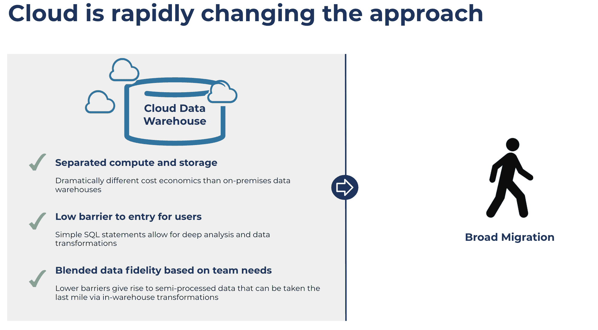
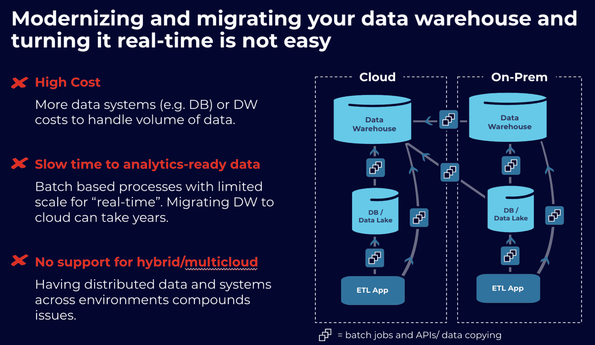

# 利用实时数据实现云数据仓库的现代化

> 原文：<https://thenewstack.io/modernize-your-cloud-data-warehouse-with-real-time-data/>

[Josh Treichel](https://www.linkedin.com/in/josh-treichel-a29b943/)

[Josh 是 Confluent 的全球合作伙伴解决方案工程总监，他领导着一个由工程师、顾问和解决方案架构师组成的团队，与战略合作伙伴一起推动价值。在汇合之前，Josh 曾为许多建立数据管道的初创公司工作，包括 Rocana 和 Networked Insights。](https://www.linkedin.com/in/josh-treichel-a29b943/)

云已经彻底改变了数据分析领域，因为组织已经将存储与计算分离，以便支持从传统商业智能(BI)到机器学习(ML)的新分析。Gartner 预计，到 2022 年，75%的数据库将被部署或迁移到云平台。当组织从现有的内部数据分析平台(Teradata、Cloudera 等)迁移数据时。)，他们越来越多地转向基于云的数据仓库(Snowflake、Databricks、BigQuery、Redshift、Synapse)。

然而，选择云优先的方法是容易的部分。这个旅程可能是漫长的、艰难的和昂贵的，取决于你选择的道路。要了解这是为什么，我们首先必须了解我们是如何走到这一步的。

## **为什么云数据仓库是答案**

数据存储问题始于您的传统内部数据仓库，该数据仓库旨在存储和处理结构化业务数据，但成本太高，无法处理大量数据。这些仓库帮助组织变得更加数据驱动，但随着业务数据的数量、速度和种类的增加，它们的缺点也暴露出来。特别是，它们没有将计算和存储分开，这意味着当您存储数据时，它伴随着耦合的计算资源。因此，企业必须在更好的数据分析和随之而来的高成本之间做出权衡。

数据湖旨在通过创建一个低成本的解决方案来解决这个问题，使公司能够存储、处理和分析大量数据。在将数据转换和加载到数据仓库之前，该湖通常被用作完全保真的中转区，一些企业甚至试图使用该湖来替代传统的仓库。然而，数据湖也有自己的问题:它们需要先进的工程技术来管理和繁重的管理工作。这一点，再加上保留所有数据的趋势，导致许多内部数据湖计划走向负面的“数据沼泽”

这就是云数据仓库改变游戏规则的地方。这些数据仓库将计算和存储分开，客户只需为他们实际使用的存储和计算量付费。虽然这看起来是一个小变化，但存储任意数量的数据并仅在必要时应用计算的能力(并且仅针对您想要分析的数据)极大地改变了这一领域。

为了利用这些优势，组织越来越多地从传统的内部数据存储迁移到云数据仓库。

## **迁移到基于云的数据仓库的挑战**

在这一点上，自然的想法是:如果基于云的数据仓库是答案，为什么不是每个人都这样做？如前所述，到达目的地的旅程可能是漫长、艰辛和昂贵的。首先，驻留在典型企业中的数据量呈爆炸式增长。一般企业有[400 多个系统和应用](https://www.mcafee.com/blogs/enterprise/cloud-security/every-company-is-a-software-company-today/)。简单地说，这意味着大量的数据和数据管道。

为什么这很重要？数据不只是一次性迁移历史数据；需要连接管道，还需要进行转换和预处理，以确保数据可用并可用于生产。值得注意的是，虽然云已经改变了仓储的经济性，但将全保真数据放入云数据仓库并以 ELT(提取、加载和转换)模式持续转换该数据在成本或速度方面仍然不够高效。此外，这些工作在许多情况下是任务关键型的；它们不能突然被破坏和移动。

最后，许多公司希望跨多个云平台工作，以避免供应商锁定，并利用适合其业务的最佳功能。这意味着在整个企业中跨多个云和混合环境创建实时数据管道。

## **经济高效地迁移到云数据仓库**

组织在迁移和更新其基于云的数据仓库时，需要一块垫脚石。具体来说，他们需要一个数据移动平台，既能提供熟悉性和可移植性，又能帮助他们跨任何环境(云或本地)将实时事件流和 ETL 管道导入 DWs。

开放标准，尤其是开放源码软件(OSS)很重要，因为它们是环境不可知的；它们将跨任何混合或多云环境工作，有助于移植和标准化。此外，像 Apache Kafka 这样的 OSS 项目在大多数企业(超过 80%的财富 100 强企业使用该项目)中的熟悉程度和现有足迹，可以使使用该技术的迁移和现代化变得更快、更容易。最后，一个不可知的平台可以帮助标准化数据进入任何云环境的管道。这有助于降低成本并确保高数据质量，从而实现云数据仓库的现代化。

*借助融合，企业现在可以将混合和多云环境中的数据流传输到他们选择的云数据仓库，支持实时分析，同时降低总拥有成本和实现价值的时间。请访问我们的网站了解更多信息。*

<svg xmlns:xlink="http://www.w3.org/1999/xlink" viewBox="0 0 68 31" version="1.1"><title>Group</title> <desc>Created with Sketch.</desc></svg>