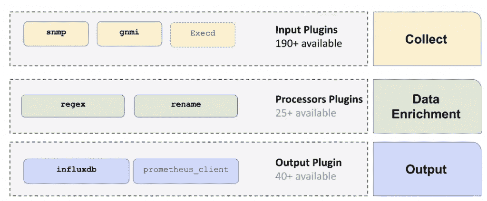
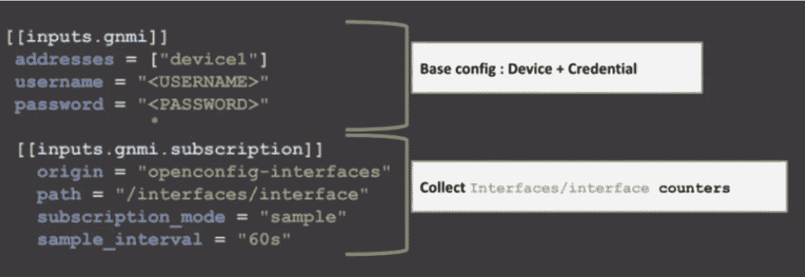
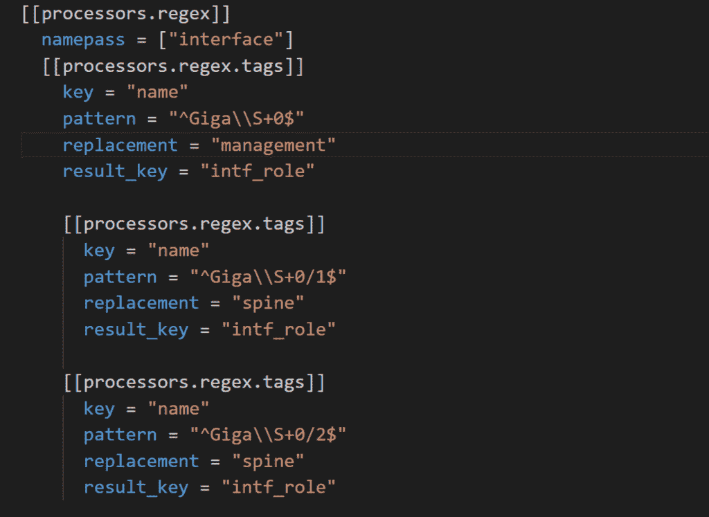
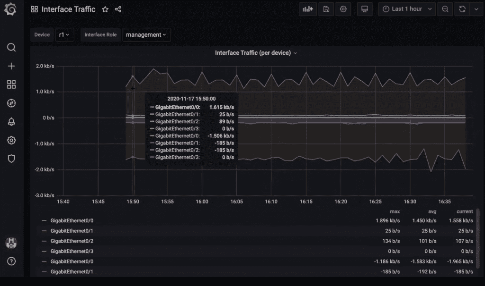

# 利用 InfluxDB 和 Telegraf 实现网络监控的现代化

> 原文：<https://thenewstack.io/modernizing-network-monitoring-with-influxdb-and-telegraf/>

查尔斯·马勒

查尔斯是 InfluxData 网站的技术营销作家。Charles 的背景包括从事数字营销和全栈软件开发。

随着技术环境持续快速变化，企业公司急于赶上并更新其传统 IT 和网络基础设施，以获得新开发工具和最佳实践的优势。

通过采用现代 DevOps 技术，他们可以降低运营成本，提高服务的可靠性，并提高 IT 团队移动的整体速度和敏捷性。

## 背景

[Network to Code](https://www.networktocode.com/) 是一家独立于供应商的网络自动化解决方案提供商，帮助企业为其组织带来现代开发运维实践。“网络到代码”是建立在这样一个理念上的，即通过采用软件工程师使用的技术类型并将这些技术应用到他们的 it 和网络基础设施中，公司将获得巨大的利益。

网络到代码帮助公司转变其网络部署、管理和消费的方式。他们通过应用通常用于软件工程的工具和技术，并把它们带到网络和 IT 基础设施中来实现这一点。Network to Code 提供定制解决方案和培训，帮助企业团队快速启动和运行，同时采用全新的方法来管理其基础架构。

为了做到这一点，网络到代码依赖于许多开源工具，他们可以根据客户的使用情况进行定制。一些最常用的工具是 Ansible、Puppet、Terraform、Telegraf、InfluxDB、Prometheus 和 Grafana。

## 收集遥测数据，无需重新发明轮子

Network to Code 在与新客户合作时面临的最大问题之一就是如何深入了解公司的基础设施。这是因为许多硬件提供商只提供特定于供应商的监控工具。这些工具中的许多也已经过时，无法扩展以提供实时监控和洞察所需的细粒度遥测数据，从而提供商业价值。

在过去，网络监控工具通常只能以一分钟甚至更长的时间间隔提供指标。为了提高网络的可靠性并快速响应问题，网络团队需要在几秒钟而不是几分钟内知道发生了什么。网络编码需要一种方法来有效地从所有这些不同的硬件来源收集数据，而不必为每个客户端创建定制的解决方案。

除了简单地收集遥测数据，网络编码还需要一种方法来存储和查询他们收集的数据。如果您不能快速高效地分析数据，那么世界上所有的数据都是无用的。理想情况下，这个数据存储应该具有足够的可扩展性，可以从客户已经在使用的任何潜在分析工具中访问。

Network to Code 通过 [Telegraf](https://www.influxdata.com/time-series-platform/telegraf/) 和 [InfluxDB](https://www.influxdata.com/products/influxdb/) 找到了遥测数据收集和存储的解决方案。

## 使用 Telegraf 收集遥测数据

Telegraf 是一个开源的、插件驱动的服务器代理，用于从众多来源收集指标和事件。Network to Code 的数据收集管道如下所示:

网络到代码的 Telegraf 管道

Network to Code saw 选择 Telegraf 的一些主要好处:

### 它很容易部署

Telegraf 是作为一个独立的二进制文件部署的，没有外部依赖性。这很重要，因为网络到代码需要能够在他们的客户端硬件上运行他们的指标收集器，而他们不能保证环境会是什么样的。Telegraf 降低了部署流程的时间强度，从而使新客户可以更快地加入。

### 超过 250 个输入插件

Telegraf for Network to Code 的另一个优势是开源社区，它已经创建了超过 [250 个输入插件](https://www.influxdata.com/products/integrations/)。这意味着网络编码不需要重新发明轮子，因为插件已经存在，可以为客户使用的几乎每一种工具或网络协议收集数据。

网络用于编码 gNMI 协议的 Telegraf 配置示例

### 内置数据处理

除了输入和输出插件，Telegraf 还提供创建“处理器”插件的能力，可用于在存储数据之前转换或丰富数据。这些插件使网络代码可以选择使用他们熟悉的工具，如 Python 和 regex 表达式来重命名字段、规范化数据、丰富数据或在存储数据之前修改数据，而无需在管道中执行额外的步骤。

示例正则表达式处理器插件

### 可攀登的

使用 Telegraf 的最后一个好处是可扩展性。虽然 Telegraf 可以部署为处理所有输入硬件指标的单个实例，但 Network to Code 选择为每个单独的客户硬件部署一个 Telegraf 实例。这使得他们的整个设置更加可靠和可伸缩，同时还允许他们更新单个机器上的配置，而不影响任何其他地方的指标收集。

## 使用 InfluxDB 存储和分析遥测数据

网络编码还需要一个数据库来存储遥测数据，一旦这些数据被 Telegraf 收集和转换。一个自然的选择是 InfluxDB，因为它是为他们将要存储的确切类型的[时间序列度量数据](https://www.influxdata.com/what-is-time-series-data/)而设计的。使用 InfluxDB 对代码锯网络的一些主要好处是:

### 查询性能

InfluxDB 是一个时序数据库，这意味着它是为处理时序数据而从头开始设计的。与使用标准关系数据库相比，像获取某个时间范围内的所有指标这样的常见查询更快、更有效。

### 数据可视化

使用 InfluxDB for Network 进行编码的另一个好处是能够可视化数据并使数据易于理解。许多流行的仪表板工具，如 Grafana，提供了与 InfluxDB 的直接集成，用于创建数据可视化。如果您希望使用自己选择的编程语言和图表库更灵活地添加自定义图表和仪表板，InfluxDB 还提供了通过 REST API 对数据的直接访问。

从 InfluxDB 提取数据的仪表板示例

### 降低存储成本

作为专用时间序列数据库的另一个优势是，InfluxDB 可以对传入数据的结构做出假设。这意味着 InfluxDB 可以使用各种压缩算法来减少存储数据的大小。当存储数十亿字节的遥测数据时，这可以显著节约成本。对于网络编码，这意味着他们的客户可以用更少的钱存储更多的历史数据，这意味着他们可以做出更明智的决策。

### 自动化工作流程

InfluxDB 提供了一个集成的任务和警报系统，可用于自动化许多监控任务。可以将查询安排在定义的时间间隔运行，如果结果超出某个阈值，就可以向随叫随到的工程师发送警报以采取措施。

## 结论

通过使用 Telegraf 和 InfluxDB，Network to Code 能够快速有效地为客户建立遥测监控解决方案。这使他们能够更快地行动，并在遥测监控到位并收集业务见解后，开始为客户增加真正的价值。这些数据可用于更快地响应停机，通过识别硬件过度配置的情况来削减成本，并使网络工程团队能够满怀信心地进行部署，因为他们对其基础架构具有完全的可观察性。

<svg xmlns:xlink="http://www.w3.org/1999/xlink" viewBox="0 0 68 31" version="1.1"><title>Group</title> <desc>Created with Sketch.</desc></svg>