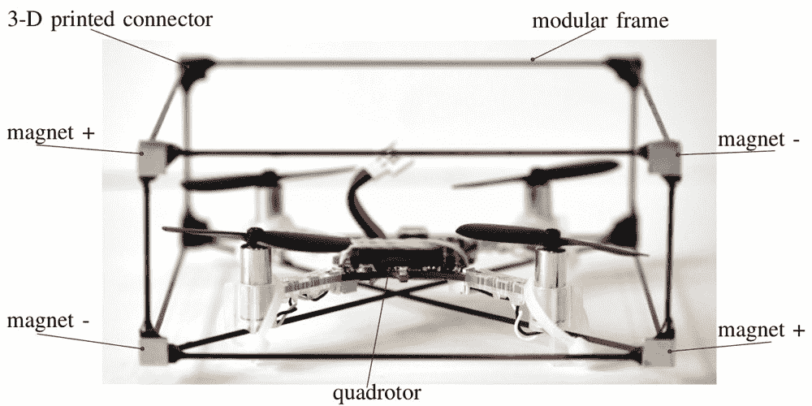
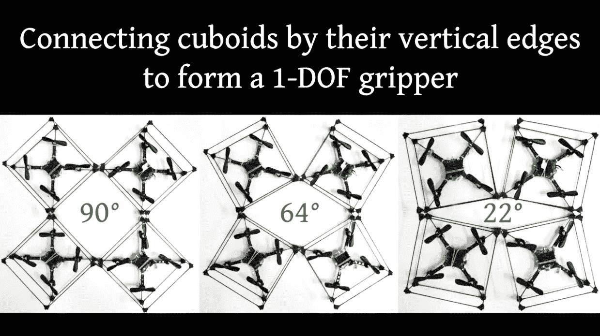
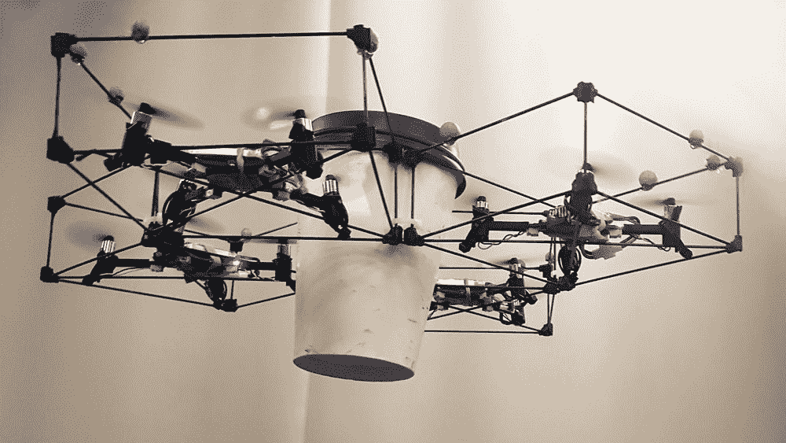

# 这些模块化无人驾驶飞机在半空中自行组装成协作结构

> 原文：<https://thenewstack.io/modular-drones-self-assemble-build-cooperative-structures-mid-air/>

智能机器人的自主群体的想法——无论是协同工作为植物授粉，增加作物产量，还是帮助 T4 监控和保护环境——正在流行起来。但是如果这些机器人也可以聚集在一起建造桥梁或平台之类的结构会怎么样呢？

这是一个诱人的图像，宾夕法尼亚大学的通用机器人、自动化、传感感知实验室(GRASP)正致力于将它变成现实。使用会飞的模块化机器人，那里的一组研究人员开发了一个系统，允许它们在半空中以各种配置自主组装。看看 ModQuad:

[https://www.youtube.com/embed/25zKLyOCA3A?feature=oembed](https://www.youtube.com/embed/25zKLyOCA3A?feature=oembed)

视频

## 分散模块系统

受蚂蚁和蜜蜂群体中自然发现的群集行为以及鸟类群集行为的启发，ModQuad 的设计融入了通常所说的[群体智能](https://en.wikipedia.org/wiki/Swarm_intelligence):分散、自组织系统的集体行为，无论它们是自然的还是人工的。

“在蚂蚁或蜂群这样的生物系统中，集体努力可以解决个体无法有效解决的问题，例如探索、运输食物和建造大型结构，”参与该项目的研究人员之一大卫·萨尔达尼亚在 Bitcraze 上解释道。“一些蚂蚁物种能够通过相互依附来建造生命之桥，并跨越觅食路径的间隙。这种能力允许它们快速连接不相交的区域，以便将食物和资源运送到它们的聚居地。机器人领域最近的工作一直专注于利用群体行为来解决建筑和运输等集体任务。”

ModQuad 系统使用四旋翼飞行器，即 [Crazyflie 2.0](https://www.bitcraze.io/crazyflie-2/) ，选择该飞行器是因为其成本低、重量轻、灵活、可伸缩性以及能够携带相对于其重量更大的有效载荷。每台机器都只配备了一个摄像头和作为传感器的[惯性测量单元](https://en.wikipedia.org/wiki/Inertial_measurement_unit)——这些有助于实时测量飞行器的速度和方向。

机器周围的长方体笼子由碳纤维棒制成，通过八个 3D 打印的 ABS 连接器连接。为了让笼子在运动中紧密地咬合在一起，模块化框架中有一个对接机构，由稀土(钕铁硼)磁体制成，它可以在不需要外部电源的情况下将整个结构锁定在一起。

此外，该团队开发了一种对接软件，允许成对的这些飞行机器人精确对齐，并在半空中动态地相互连接。

“在我们的方法中，我们以分散的方式控制结构的姿态，”萨尔达尼亚写道，“模块化的姿态控制器允许多个连接的机器人稳定地合作飞行。我们控制器中的增益常数不需要随着配置的改变而重新调整。”

根据该团队的说法，该系统的分散模块化姿态控制器增加了稳定性，并允许链接的模块以合作的方式飞行，并在三维环境中集体机动。此外，该系统使用了一种“新的合作定位方案”，允许每架无人机利用其他机器获得的测量结果。

在测试这个系统时，研究人员开发了一些有效的方法来让成对的机器人对接在一起。一种方法是让一台机器在悬停模式下等待，同时第二台机器人执行对接程序。这两种悬停和对接模式都允许多台机器在飞行中对接，似乎是组装三维大型结构的最快途径之一。

在他们的实验中，研究小组还发现，通过改变磁铁的形状，这些模块化机器人可以排列成不同的配置，从而允许运输更轻的物体，如咖啡杯。观看“[飞行手爪](https://www.bitcraze.io/2017/11/a-flying-gripper-based-on-modular-robots/)开始:

[https://www.youtube.com/embed/43RSgWRLhJc?feature=oembed](https://www.youtube.com/embed/43RSgWRLhJc?feature=oembed)

视频

## 涌现智能

正如实验室之前在[精准农业](https://thenewstack.io/bee-inspired-autonomous-robots-improve-crop-yields/)的项目一样，这些模块化机器人的总和大于其组成部分。虽然单个机器人可能只遵循一套简单的规则，而不是由一个集中的指挥中心管理，但当这些单个代理在一个非常复杂的系统中相互交互时，有趣的事情开始发生，导致整个系统中出现了看似“智能”的行为。

蚁群就是这句格言的一个例子:蚂蚁个体本身是蚁群复杂系统中一个相对简单的组成部分。将这些个体蚂蚁放在一起，复杂的行为——如筑巢、觅食、饲养蚜虫“牲畜”、与其他蚁群竞争以及埋葬死者——就会出现。

人们只能想象机器人集体会带来什么。除了给建筑和运输行业或仓库自动化带来潜在的推动，这种自我组装的机器人群体还可以在紧急情况下提供帮助，例如当建筑物着火或自然灾害来袭时。成群的这些智能机器人可以组成一座桥梁，更快地从燃烧或倒塌的建筑中救出幸存者，而不会威胁到人类应答者的生命。当与其他技术结合时，这种系统还可以在空中形成可合并的、[“自我修复”的机器人神经系统](https://thenewstack.io/swarmanoids-modular-robots-assemble-form-artificial-nervous-systems/)，能够快速、自主地适应变化。随着团队努力完善这个模块化机器人系统，更多意想不到的可能性将可能实现。

图片:宾夕法尼亚大学

<svg xmlns:xlink="http://www.w3.org/1999/xlink" viewBox="0 0 68 31" version="1.1"><title>Group</title> <desc>Created with Sketch.</desc></svg>