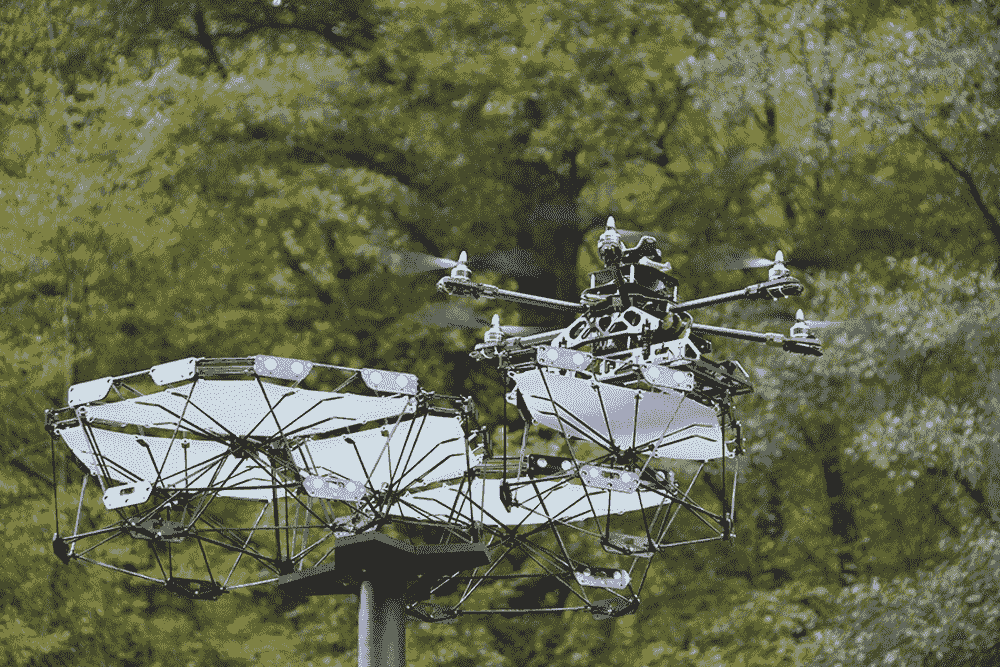

# 模块化结构使用无人机“建设者”自动调整自身

> 原文：<https://thenewstack.io/modular-structure-adapts-itself-autonomously-using-drone-builders/>

无人机最近变得非常多才多艺——它们不仅向偏远地区运送包裹和救生医疗用品，这些无人驾驶飞行器也可能是 T4 打击恐怖主义的重要组成部分，阻止非法偷猎，或者形成控制可编程物质的用户界面的基础。

现在，根据 Stuttgart 大学计算设计和建筑研究所(ICD)和建筑结构和结构设计研究所(ITKE)的一组研究生研究人员的说法，无人机有一天也可以帮助我们建造能够重新配置自己的建筑物，以适应温度、阳光照射等环境变化。看看它是如何工作的:

这个被称为[网络物理宏材料](http://icd.uni-stuttgart.de/?p=23178)的项目是最近由 ICD 的学生 Miguel Aflalo、Behrooz Tahanzadeh 和 Jingcheng Chen 作为硕士论文的一部分构建和测试的。它由一个 2.5 米(8.2 英尺)高的天篷状结构组成，实际上由 20 个单独的模块组成——每个模块都由轻质碳纤维丝制成，以及集成的传感器和通信电子设备。此外，这种适应性强的模块化系统包括两个无人机“建造者”，它们能够根据需要自主和自动操作各个模块。

例如，如果是一个阳光明媚、炎热的日子，无人机制造商可以通过编程来拾取和移动展馆天篷的配置，以创造全天连续的阴影，对天空中太阳的缓慢行进做出响应。

仔细观察模块化单元本身，轻质碳纤维骨架形成了一个六面多面体空间框架，顶部附有聚碳酸酯板。由于一系列钕磁铁点缀在框架的边缘，这些单元可以相互连接。还有传感器和通信设备安装在每个面上，使用 CNC 铣削的连接器板，允许单元之间的数据和功率传输，加上安装在中间的定制电路板。

定制的导航和控制系统被开发来执行分离、携带和连接项目的各种组件所需的精细动作。每个单元都经过称重，并分配有一个电子 ID，这些单元通过分布在整个座舱盖上的分层处理器系统与无人机制造商通信，此外还与一个中央命令处理器相连，该处理器将这些单元、无人机制造商和人类用户联系在一起。此外，该团队开发了一款智能手机应用程序，人们可以用它来指导无人机重新配置座舱盖的布局，这意味着该结构可以自动转换或使用手动输入。

## 灵活、通用的架构

正如该团队所指出的，设计强调可重构性，但也考虑了运输的便利性、成本、功耗、结构强度、可扩展性以及作为建筑元素的表现。很容易看到这样一个系统被放大以创建一种新的“敏捷”架构，这种架构可以实时适应各种环境因素，特别是如果它与大量原始数据和机器学习相结合。

“凭借其在使用过程中不断重建的能力，该系统挑战了工业机器人数字制造和复杂的建筑预制的预先构想，”该团队写道。

多亏了这个系统，研究小组相信，未来的庇护所概念会变得更加敏捷和灵活，甚至能够在大型公共空间中自主移动。建筑物或结构的组件可以在需要时自动部署，或者在不需要时自动移回其他地方——形成一种智能的建筑“行为”模式

“这些行为能够迅速激活公共空间，无视传统的无生气的建筑过程和法规，”研究人员解释说。此外，从这种身体灵活性和分布式智能中，产生了新的人工态度和行为模式。在某一点上，该结构将不仅能够了解其居民，而且能够在空间上探索信息和影响。”

这是一个有趣的观点，关于建筑如何有一天会变成动态的和适应性的，而不是单一的和静态的。正如研究人员所看到的，通过这种方法，我们的建筑环境最终可以根据他们收集的各种数据和用户的偏好，发展自己的“学习行为”,创造一个更具响应性的环境，这无疑需要一些时间来适应。

图片:ICD/斯图加特大学，M. Aflalo，J. Chen，B. Tahanzadeh。

<svg xmlns:xlink="http://www.w3.org/1999/xlink" viewBox="0 0 68 31" version="1.1"><title>Group</title> <desc>Created with Sketch.</desc></svg>