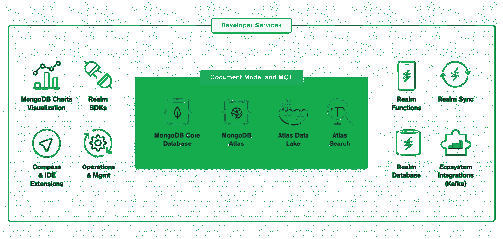

# MongoDB 4.4 承诺减少数据库开发人员的工作量

> 原文：<https://thenewstack.io/mongodb-4-4-promises-less-work-for-database-developers/>

虽然数据库功能的概念仍然很简单，但众所周知，它的实现和设计以及管理仍然很困难。一个组织通常需要跨几个不同的孤立环境的数据持久性，而实现一个具有附加数据分析功能的单一可靠的数据搜索功能可能仍然难以实现。

这也是为什么 MongoDB 自成立以来一直在继续其雄心勃勃的努力，为 DevOps 团队提供更直观的查询语言，更灵活的数据模型和弹性扩展的流功能， [MongoDB](https://www.mongodb.com/) 的首席客户官 [Richard Kreuter](https://www.linkedin.com/in/richardkreuter/) 告诉新堆栈。

随着其核心数据库 MongoDB 版本 4.4 的正式发布，MongoDB 继续追求其作为 NoSQL 数据库提供商的简单而雄心勃勃的目标，“让开发人员轻松使用数据一直是我们的目标，”Kreuter 说。

“开发人员处理数据的地方不仅仅是操作数据库，”Kreuter 说。“人们还需要搜索功能，为他们的应用程序中的数据提供类似谷歌的界面或体验。”

为此， [MongoDB 4.4](https://www.mongodb.com/blog/post/announcing-mongodb-44--mongodb-cloud) 在很大程度上以 [Atlas Data Lake](https://www.mongodb.com/atlas/data-lake) 和 [Atlas Search](https://www.mongodb.com/atlas/search) 为特色，因为数据库提供商将其功能扩展到核心数据库所提供的功能之外。

Atlas Data Lake 的功能是在 MongoDB 4.4 的测试版中宣布的，包括改进的分析、长期运行的 [MongoDB 查询语言(MQL)](https://docs.mongodb.com/datalake/tutorial/run-queries) 查询和改进的来自运营层以外的数据的智能。此外，随着 GA 的发布，Atlas 提供了数据分层，允许将数据从存档的运营数据库转移到位于 [S3](https://aws.amazon.com/s3/) 的数据湖中。Kreuter 说，这使 DevOps 团队能够“解决围绕平衡性能成本的某些问题”，在将数据存储在运营数据库中与将查询发送到控制器的单个端点之间进行“跨所有数据的分析”，无论是运营数据库还是数据湖。

企业管理协会(EMA) 的分析师 [Torsten Volk](https://www.linkedin.com/in/torstenvolk) 说，该版本展示了一些承诺，有助于自动化和消除开发人员否则将不得不设计集成来自不同环境的数据库管理的手动流程。“开发人员讨厌做他们以前做过几十次的商品工作，但他们仍然不能使用他们的旧代码，因为它不太适合新的应用程序架构、数据源或使用的查询语言，”Volk 说在联邦查询中，我可以对 Atlas 数据湖和 S3 档案馆中的数据使用单个查询，这种简单性是开发人员会喜欢的。"

Volk 说，事实上，DevOps 团队经常发现自己在搜索、移动同步、内容归档或“即使管理数据存储中的一堆自定义对象似乎也总是需要大量时间来完成”上花费了过多的时间。“这个版本承诺创建一个统一的基础，允许开发人员自动集成不同的数据源和功能，否则开发人员将不得不手工编码，”Volk 说。“它提供了跨云和内部位置的统一查询语言和 API 层，因此开发人员无需不断浪费时间去重新发明轮子。”

MongoDB 还为移动平台的 MongoDB 云提供了普遍可用的 [Realm](https://realm.io/) ，这是它在去年收购 Realm 时获得的，从而扩大了它的移动覆盖范围。Kreuter 说，这意味着通过 MongoDB 云，Realm 数据库可以扩展到移动边缘设备，而 Realm sync 服务可以使所有设备与数据保持同步。它通过使用后台同步解决方案来实现这一点，该解决方案通过冲突检测和解决将所有数据存储在 Atlas 中，“以及所有不同设备上的所有好东西，”Kreuter 说。“这从根本上减少了开发人员开发移动应用的时间，他们还必须管理数据，”Kreuter 说。

MongoDB 还为 MongoDB 4.4 版本提供了以下新功能:

*   **联合**:提高分析能力，同时减少对 ETL 过程和数据仓库的依赖。
*   **可细化的分片密钥**:根据应用和业务需求不断修改数据位置的能力。
*   **边缘读取**:通过向多个副本提交读取请求，并在最快的节点做出响应时立即向客户端返回结果，提高了性能的可预测性，例如当节点可能无法以最佳状态工作时。

如上所述，MongoDB 一直在寻求“让开发人员更容易使用面向文档的数据模型”，因为 DevOps 团队经常试图结合一系列数据库需求，从“从刚性到灵活性的范围”，Kreuter 说。

“开始或输入数据非常容易，所以如果你只想快速开始并开始原型制作，就不必为预先设计模式而烦恼，”Kreuter 说。

MongoDB 是新堆栈的赞助商。

通过 Pixabay 的特征图像。

<svg xmlns:xlink="http://www.w3.org/1999/xlink" viewBox="0 0 68 31" version="1.1"><title>Group</title> <desc>Created with Sketch.</desc></svg>