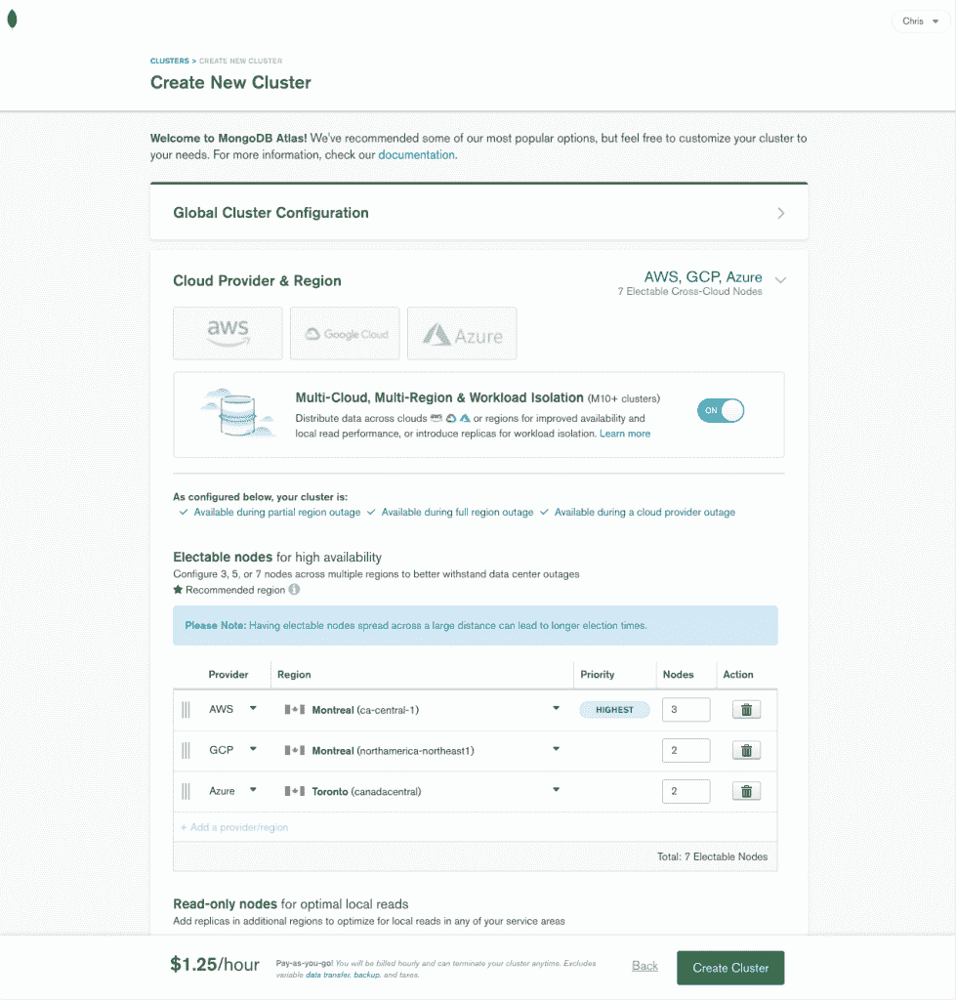

# MongoDB 集群现在可以跨多个云运行

> 原文：<https://thenewstack.io/mongodb-clusters-can-now-be-run-across-multiple-clouds/>

MongoDB Atlas 用户现在可以跨多云环境部署单个集群，消除了在不同云环境中单独管理数据库带来的许多管理限制和挑战，MongoDB 说。

由于这一新特性，组织可以依靠 MongoDB Atlas 在不同的云环境中共享数据和应用程序。例如，以前，数据和应用程序在亚马逊网络服务(AWS)、谷歌云和 Azure 上各自的部署中保持孤岛状态。

“自 2017 年以来，客户已经能够在所有三种云上使用 MongoDB Atlas，并获得一致的体验，”MongoDB 云产品副总裁 Andrew Davidson 告诉新堆栈。“但是，应用程序在传统上仍然是孤立的，仅限于一家云提供商，无法无缝地跨云共享数据或迁移应用程序。”

Davidson 说，由于能够在同一个集群中使用多个云提供商，即组成 MongoDB 部署的一组节点，开发人员可以利用不同的云提供商环境，而不必依赖手动控制它们之间的数据移动。同时，通过这种方式，开发者也可以使用相同集群的工具和服务，例如 [AWS Lambda](https://aws.amazon.com/lambda/) 功能、 [Google Cloud AI/ML](https://cloud.google.com/products/ai) 产品和 [Azure Cognitive Services](https://azure.microsoft.com/en-us/services/cognitive-services/) 工具，戴维森说。

Davidson 说，多云集群涵盖了组织的四个具体用例。这些包括移动性、高可用性、灵活性和功能性。他说，每种方法都“能够利用每个云提供商的最佳工具，而无需手动移动或复制数据”。

可以说，MongoDB Atlas 据称提供的移动性优势是功能的子集，可以解决特定的业务案例需求，例如当一个组织收购另一家公司时，必须设法合并来自不同云环境的不同数据库和应用程序。

“很多时候，我们看到组织在经历了 M&A 之后希望进行云供应商整合，或者实施新的业务连续性法规，或者公司决定转换平台以获得更好的长期合同，”Davidson 说。“使用多云集群的优势在于，IT 经理将能够避免花费数月或数年时间来准备和执行两个云环境之间的复杂数据迁移。”

在灵活性方面，MongoDB Atlas 可以帮助组织应对在某些地理区域不可用的应用程序，或者客户只能与某些云供应商合作，但同时又不想管理不同环境的单独数据库部署。“虽然我们在美国被三家云供应商的多个区域宠坏了，但在许多国家可能只有一家云提供商和数据中心可用，”Davidson 说。

通过跨不同云环境的自动化应用和数据迁移功能，MongoDB 旨在帮助组织在特定云提供商的环境中发生中断时构建更多冗余。“我们从许多客户那里听说，他们希望多云集群降低潜在停机的风险，并建立跨云弹性，”Davidson 说。“在过去的一年里，所有主要的公共云提供商的云服务都遭遇了重大中断，从容量限制到全面中断。对于业务关键型应用程序来说，停机是灾难性的。”

[NoSQL](https://en.wikipedia.org/wiki/NoSQL) 数据结构的优势之一是，它促进了 MongoDB 在部署于不同服务器的数据库实例之间构建冗余的能力。如果服务器出现故障，群集将继续运行。如果没有足够的服务器容量可用，群集数据将保持只读模式，直到网络或服务器问题得到解决。Davidson 说，这种能力现在扩展到了多云集群中,“有了 Atlas，你不需要做额外的工作来促进跨云的数据复制。

Davidson 说，多云集群不仅能够跨越多个地区，而且能够跨越多个云提供商，这极大地提高了集群的可用性，并降低了 MongoDB“需要在一致性和可用性之间做出选择”的可能性。

考虑到数据库的计算复杂性——以及通常的管理——MongoDB Atlas 可能看起来适合拥有多云和跨国业务的大公司。与此同时，一个小型组织可能也需要开发其数据库功能，但其 DevOps 团队成员可能会担心他们缺乏利用 MongoDB Atlas 等高性能解决方案的经验，即使他们已经在多云环境中部署和管理应用程序，例如在 SaaS 平台上。

然而，Davidson 说，小型组织的 DevOps 团队需要“很少甚至没有”数据库管理专业知识 DevOps 才能开始，并且只需首先查阅 [MongoDB Atlas](https://www.mongodb.com/cloud/atlas) [文档](https://docs.atlas.mongodb.com/getting-started/)就可以开始采用。“MongoDB 的美妙之处在于，Atlas web 控制台中的一切都是可用的，您可以通过相同的熟悉的集群生成器选择和删除云提供商，并获得对数据库性能和健康状况的相同深度可见性，”Davidson 说。“在高可用性用例中，我们希望客户设计并运行一个多云应用程序层，但好消息是，随着跨所有云平台的一致应用程序编排框架(如 Kubernetes)的兴起，这不再是一件难事。”

<svg xmlns:xlink="http://www.w3.org/1999/xlink" viewBox="0 0 68 31" version="1.1"><title>Group</title> <desc>Created with Sketch.</desc></svg>