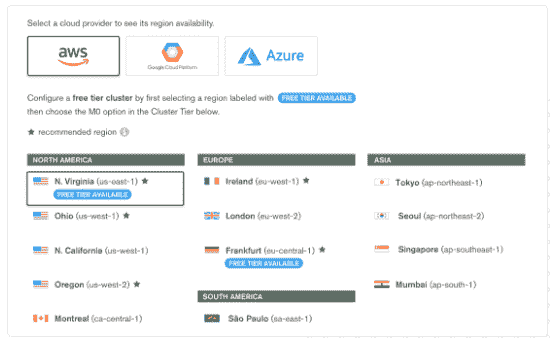

# MongoDB 作为合作伙伴和竞争对手扩展了对 AWS 的数据库支持

> 原文：<https://thenewstack.io/mongodb-extends-database-support-for-aws-as-both-a-partner-and-competitor/>

MongoDB 既是亚马逊网络服务的客户，也日益成为亚马逊网络服务的竞争对手，它增加了一些特性，使得在 AWS 上运行和管理 [MongoDB Atlas](https://www.mongodb.com/cloud/atlas/lp/general/try) 数据库服务变得更加容易。

[在 AWS 今年早些时候发布了](https://www.mongodb.com/)[亚马逊 DocumentDB](https://aws.amazon.com/documentdb/) 之后，MongoDB 继续扩大其为 AWS 以及微软 Azure 和谷歌云平台(GCP)用户提供的数据库产品，这是一个缩小版的 MongoDB 的替代产品，云巨头声称它完全兼容 MongoDB。AWS 的推出引发了人们的担忧，即亚马逊可能对开源软件制造商采取了过于激进的行动，而不一定像它从中受益那样支持开源社区。

然而，MongoDB 的云产品总监 Andrew Davidson 告诉新堆栈 MongoDB Atlas 现在“在多个层面上更加无缝地结合到 AWS 开发者体验中。”Davidson 说，AWS 部署的这些新 Atlas 功能包括 AWS PrivateLink 的私有传递访问和 AWS KMS 的客户端字段级加密，通过 AWS CloudFormation 的代码基础设施，亚马逊 EventBridge 功能和通过 Atlas 触发器的模式注册表。

“新的集成和功能旨在为我们在 AWS 上运行 MongoDB Atlas 的客户提供更无缝的体验，并继续致力于使 Atlas 成为最安全的数据库，”戴维森说。

事实上，虽然 MongoDB 确实与亚马逊竞争，但“谁没有呢？”MongoDB 的首席产品官 Sahir Azam 说。“MongoDB 大约在 AWS 推出的同时成立，”Azam 说。"从那以后，MongoDB 的大部分使用都是通过公共云进行的."

Amazon DocumentDB 主要由关系数据库 Aurora 和 AWS 的 API 组成。MongoDB 市场总监马克·惠勒说，AWS 的产品“模仿了旧版本 MongoDB 的外观和感觉”。“这是一种微妙的关系——我们走向市场，与这些云提供商公司合作销售，同时我们也与他们直接竞争，”惠勒说。

鉴于两家公司的商业模式非常不同，[企业管理协会(EMA)](https://www.enterprisemanagement.com/) 的分析师 [Torsten Volk](https://www.linkedin.com/in/torstenvolk) 说，MongoDB 并不担心 AWS 可能会夺取数据库管理市场份额。“Atlas 的价值在于它是一种托管服务，AWS、谷歌云或 Azure 客户可以简单地将其添加到现有的云环境中，”Volk 说。“Atlas 负责设置和第二天的操作，它为客户提供了在三个超大规模机上一致运行 MongoDB 的选择，使迁移到不同的云变得更加简单，或者像许多企业一样，在所有三个超大规模机上运行他们的应用程序。”

与此同时，MongoDB 继续扩展其数据库功能，以便在主要云提供商提供的平台上使用。“我们的客户希望在 AWS 上运行 MongoDB，以及微软 Azure 和谷歌云，我们为他们提供了这种能力。正如有多个数据库供应商一样，也有多个云提供商，”Azam 说。“虽然多云使用还处于早期阶段，但许多客户对供应商锁定感到紧张，而使用 MongoDB Atlas 在任何地方运行的能力为他们提供了这一点。我们将继续与 AWS 以及微软和谷歌集成，为我们的客户提供他们选择的任何云上的最佳体验。"

事实上，MongoDB Atlas 版本的主要组成部分是“客户端字段级加密如何普遍适用于所有 MongoDB Atlas 客户，”Davidson 说。戴维森说:“我们相信这在安全能力方面是一个游戏规则的改变者。”在本月发布之前，该公司一直在与测试测试版的客户合作。

戴维森说，客户端字段级加密的工作原理类似于 Signal 或 WhatsApp 等内置端到端加密的消息应用程序。因此，当数据在互联网上传输时，加密技术会对数据进行加密，只向发送方和接收方透露。“在这种‘客户端’加密方案中，利用客户端字段级加密的数据库不仅需要系统登录，而且还需要特定的密钥来处理和解密用户设备上的特定数据块，”戴维森说。“这意味着 MongoDB 本身以及 AWS、微软和 GCP 等云提供商将无法访问客户数据，数据库管理员或远程管理人员也不需要访问一切。”

TNS 记者迈克·梅兰森对此文有贡献。

MongoDB 和 AWS 是新堆栈的赞助商。

通过 Pixabay 的特征图像。

<svg xmlns:xlink="http://www.w3.org/1999/xlink" viewBox="0 0 68 31" version="1.1"><title>Group</title> <desc>Created with Sketch.</desc></svg>