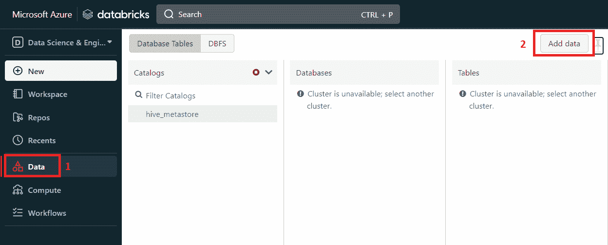
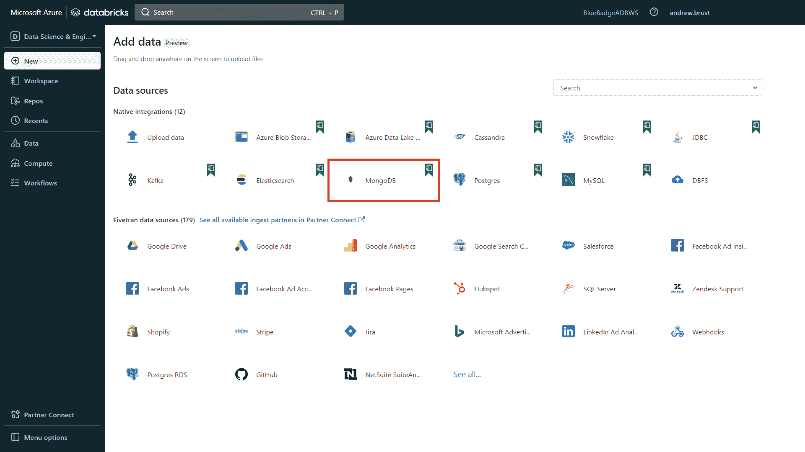
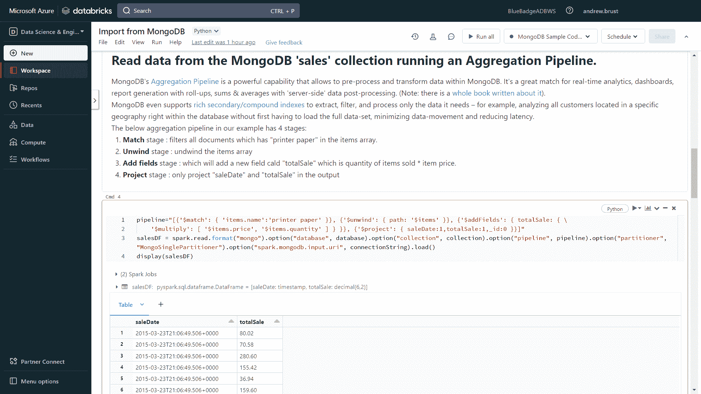
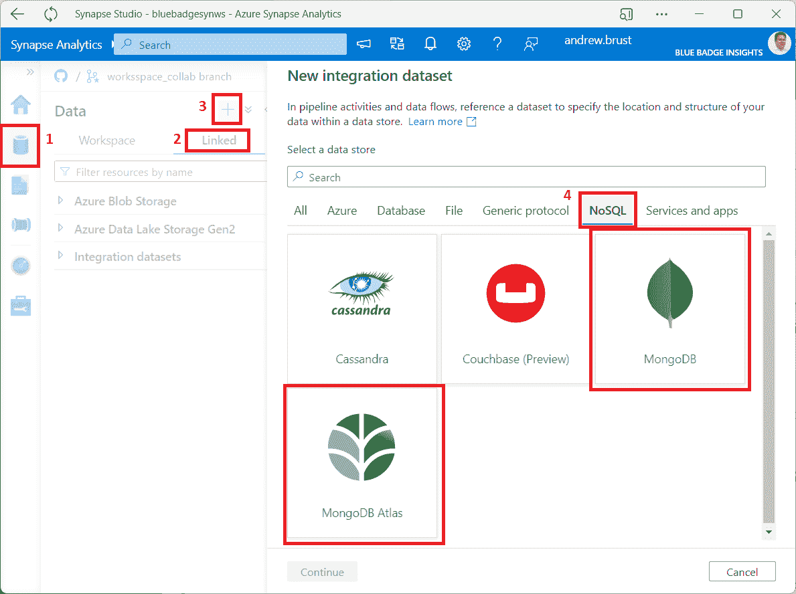

# MongoDB 与 Databricks 合作进行应用驱动的分析

> 原文：<https://thenewstack.io/mongodb-partners-with-databricks-for-app-driven-analytics/>

上个月，现代操作数据库玩家 [MongoDB](https://www.mongodb.com/home) 宣布与 [Databricks](https://www.databricks.com/) 建立密切合作关系，后者的平台专注于数据工程、人工智能和分析，并创造了“数据湖屋”这个术语这种伙伴关系的动机是客户和技术驱动的，应该对简化许多客户自己打造的平台集成有很大帮助。

MongoDB 的 [Matt Asay](https://www.linkedin.com/in/mjasay/) 、 [Dana Groce](https://www.linkedin.com/in/dana-groce/) 和 [Ariel Amster](https://www.linkedin.com/in/arielamster/) 在博客中谈到他们自己的公司和数据块时说,“我们观察到，多年来，大量且不断增长的共同客户使用[MongoDB Connector for Apache Spark](https://www.mongodb.com/docs/spark-connector/current/)，使我们两个平台之间的数据流能够运行实时业务，并实现应用驱动的分析世界。所以我们问自己:我们如何才能为这些客户提供更无缝、更优雅的体验？”

新的 Stack 与几位 [MongoDB](https://thenewstack.io/mongodb-atlas-finally-gets-a-command-line-interface/) 高管谈论了合作关系，包括 [Alan Chhabra](https://www.linkedin.com/in/alanchhabra/) 、EVP、全球合伙人；[安德鲁·戴维森](https://www.linkedin.com/in/andrewad/)，SVP 产品；以及 [Jeff Sposetti](https://www.linkedin.com/in/jsposetti/) ，产品副总裁，分析&企业工具。这三者共同提供了关于合作伙伴关系、MongoDB 的分析工作负载方法以及与数据/分析领域其他平台集成的深入背景。

## 为什么是 Databricks？

正如你可能对处于他这种位置的人所期望的那样，查布拉信奉一种非常强烈的合作精神，包括与看似竞争的公司合作:“我相信许多客户和分析师认为我们都在相互竞争，我不认为这是一种审慎的策略。我觉得像 MongoDB 和 Databricks 这样的公司应该合作得很好……而其他试图自己构建一切的公司将提供糟糕的产品，客户将会受到影响。”

查布拉说 [Databricks](https://thenewstack.io/databricks-brings-data-pipeline-service-to-ga/) 是那种 MongoDB 客户希望看到公司追求更大的技术整合的合作伙伴，这也是他的团队追求这种关系的原因。“你看到我们所做的是追求某些技术合作伙伴，我们的客户希望我们更好地合作，”Chhabra 说。“今年早些时候，我们与[汇流](https://www.confluent.io/)在流媒体领域建立了联盟。在过去的六个月里， 我们一直在兴奋地思考如何利用 [AI/ML](https://thenewstack.io/pytorch-takes-ai-ml-back-to-its-research-open-source-roots/) 和数据仓库做得更好。我们认为，Databricks 是对 MongoDB 的一个很好的补充。”

Chhabra 表示，客户希望这两个领域更加紧密:“如果我为大量的数据科学家提供服务，或者我需要确保我为某些人工智能用例运行分析，我也希望能够为实时应用程序提供服务。因此，客户希望这两个在历史上被分开的流能够融合在一起。这就是为什么您会看到分析和运营数据合二为一的两种用例的可操作化。因此，在数据库的现代应用程序开发中的领导者，至少我们是这样认为的，是 MongoDB，而我们认为分析、数据仓库、AI/ML 的领导者是 Databricks。这就是为什么您看到我们启动了这一战略合作伙伴关系……”

MongoDB 的戴维森认为，这两家公司一方面有重叠的客户名单，另一方面在功能方面有互补的平台。“我们看到 Databricks 在一些方面与我们正在做的事情高度协同，”他说。“两家公司都瞄准了高度技术化的人物角色。但是你知道，就日常从业者而言，重叠稍少。我们看到这些从业者越来越紧密地合作，所以我们想确保他们有一个很好的联合解决方案。”

## 它是如何工作的？

集成基于 MongoDB 的 [Apache Spark](https://spark.apache.org/) 连接器，它允许使用 [Spark SQL](https://spark.apache.org/sql/) 和[Spark data frame](https://spark.apache.org/docs/latest/sql-programming-guide.html)API 查询 MongoDB。但是 Databricks 集成更进一步，一直扩展到 UI 中:只需单击导航栏左侧的“数据”项和出现的“添加数据”按钮，Databricks 开发人员就可以选择 MongoDB 作为数据源。这些步骤如下图所示。

在数据块中添加数据源。(要查看完整尺寸的图像，请右键单击并选择“在新标签中打开图像”选项，以便在浏览器中查看。)

在 Databricks 中选择 MongoDB 数据源

单击 MongoDB 数据源选项后，Databricks 开发人员会立即进入一个样例笔记本，其中包含预先编写的查询 MongoDB 的代码。我能够在我自己的 [Azure Databricks](https://azure.microsoft.com/products/databricks/) 环境中运行所有这些，这篇文章中的所有图片都是我从自己的机器上截取的截图。因此，我可以验证一旦连接建立，用户就能够使用 Spark SQL 和 DataFrame 技能在 MongoDB 中查询数据，然后在笔记本中可视化这些数据。

MongoDB 中的特殊特性使得更强大的分析成为可能。例如，[聚合管道](https://www.mongodb.com/docs/manual/core/aggregation-pipeline/)及其[展开](https://www.mongodb.com/docs/manual/reference/operator/aggregation/unwind/)和[项目](https://www.mongodb.com/docs/manual/reference/operator/aggregation/project/)阶段可以一起将 MongoDB 文档中的分层数据展平为数据分析师更熟悉的表格结构。该技术在示例笔记本中有明确的演示，如下图所示。

MongoDB 的数据块示例笔记本，带有一个聚合框架查询及其结果

该笔记本还展示了如何将聚合数据以类似于 [Delta Lake](https://delta.io/) 的格式写入托管 Spark 表，甚至写回 MongoDB 数据库中的新集合。

## 界限在哪里？

在 MongoDB 中查询数据的能力确实引出了一个问题:SQL 是否可以完全替代 MongoDB 自己的 API 和查询语言 MQL。MongoDB 的分析节点的可用性可能表明数据仓库或 lakehouse(包括 Databricks)是不必要的。这些与专用分析平台的重叠使得有必要确定在哪里使用什么。

下面是 Andrew Davidson 的观点:“我们绝对没有看到开发人员因为各种原因而放弃 MongoDB 的查询语言。但是我们会想到我们所有的伙伴角色…使用 Spark 的数据专业人员、数据工程师或数据科学家，其中一些人我们希望使用 Spark connector 直接针对 MongoDB 运行 Spark。如果这些人能够利用 SQL，我们希望他们不那么害怕。我们不反对这一点。”

Mongo 认为运营数据分析的世界分为几个关键场景。第一种，该公司称之为“应用内分析”，涉及在应用中提供分析功能，有时也被称为嵌入式分析。这里的想法是为应用程序用户提供上下文分析，而不强迫他们转移到专用的 BI 平台。MongoDB 的本地 API 在这里最为贴切。

第二个领域，该公司称之为“实时业务可见性”，需要将运营数据库中的数据暴露给分析师进行外部分析。这是 SQL 访问和分析节点发挥最大作用的地方，因为它们的结合使用优化了分析师的访问，而不会增加操作数据库基础架构的负担。

这是第二个场景(将操作数据库中的数据暴露给分析师)，Databricks 笔记本场景适合于此。在这里，数据量可能较小，但数据是新鲜的，因此，分析可能非常有价值。这种方法避免了数据移动，最大限度地减少了数据转换的需求，并使开发人员和分析人员最紧密地合作。

第三个领域是“集中式分析”，这是使用外部分析数据存储(数据仓库、数据湖和数据湖库)及其查询代理最有意义的地方。

## 更广阔的生态系统

Databricks 不是这里唯一的合伙人。Mongo 与其他分析平台深度集成。考虑到这一点，在我们的讨论中，查布拉提出了一个问题“我们如何更好地与云提供商集成，无论是…[【Azure】Synapse](https://azure.microsoft.com/en-us/products/synapse-analytics/)，还是微软的 [Power BI](https://powerbi.microsoft.com/en-us/) ，还是谷歌的 [BigQuery](https://cloud.google.com/bigquery/) ，还是 AWS 的功能，如 [Kinesis](https://aws.amazon.com/kinesis/) 、 [Redshift](https://aws.amazon.com/redshift/) …?"

关于 Synapse Analytics，该平台方便了基于 MongoDB 中的数据创建集成数据集，甚至为 [Atlas](https://www.mongodb.com/atlas) 和客户管理的 MongoDB 提供了单独的连接器，如下图所示。所有这些都非常适合第三种(“集中式分析”)场景，即运营数据分析。

在 Azure Synapse Analytics 中添加 MongoDB 集成数据集

MongoDB 在多种用例的覆盖方面投入了很多。除了提供独立的分析节点集群，MongoDB 还增加了时间序列数据功能，宣布了增加列存储索引功能的计划，等等。

Mongo 的 Sposetti 是这样解释的:“所以我们在过去的三年里建立了…很多…我们说越来越多的开发人员正在处理时间序列数据，所以我们专门在我们的核心数据库中添加了关于时间序列数据的功能。”他补充道:“这只是我们看到的一个例子，开发者通过将单点解决方案融入到他们的应用程序中来解决需求。我们说，‘看，开发者已经承诺将 MongoDB…作为他们的核心数据库。我们也能帮助他们解决这个问题吗？”他说，MongoDB 对围绕搜索的需求做出了类似的回应，在 [Apache Lucene](https://lucene.apache.org/) 之上创建了 [Atlas Search](https://www.mongodb.com/atlas/search) 。

Sposetti 补充道:“开发人员不应该看着 MongoDB 说‘这对于文档建模很棒，对于我应用程序中的业务领域建模也很棒，但是一旦我需要对一堆文档进行聚合，我就必须找到不同的解决方案。’我们希望确保这对他们有好处，他们可以在 MongoDB 内部解决这个问题。”

## 回复:发明相关性

MongoDB-Databricks 宣布合作的时机很好，就在亚马逊网络服务的 [re:Invent](https://reinvent.awsevents.com/) 活动前一周，因为两家公司都是高度云驱动的，并且都是 AWS 的长期密切合作伙伴，Databricks 和 MongoDB Atlas 都是首先在亚马逊的云上推出的。

MongoDB 的戴维森解释了历史先例:“AWS 实际上是在 MongoDB 推出的同一年推出的，从那以后就一模一样了。原因是，如果你想一想早期发生的事情，那就是云商品硬件首次作为服务提供的起源和时刻。在那个时候，开发人员需要分布式系统软件来使 IaaS 变得有用。因此，MongoDB 提供了这个…[我们的]文档数据模型…[它]使您能够从第一天起就在一系列分布式 IaaS 基础架构之上进行抽象…在我看来，允许我们成为一个开发人员数据平台，将云中的一系列计算机变成对开发人员有用的东西，这对 AWS 来说非常具有战略意义…AWS 上许多最大的工作负载从第一天起就构建在 MongoDB 上。”

当然，随着来自 AWS 的产品，如[Apache Spark on Elastic MapReduce](https://aws.amazon.com/emr/features/spark/)([EMR](https://aws.amazon.com/emr/))和 [DocumentDB](https://aws.amazon.com/documentdb/) 中的 MongoDB 兼容性，Databricks 和 MongoDB 也面临着来自 AWS 的一些竞争压力。因此，这两家公司更有理由实现紧密集成，并教会客户如何使用它。

## 教它；不要只是建造它

在客户教育的问题上，MongoDB 在过去十年里对其 MongoDB 大学在线培训平台进行了大量投资，最近还对其进行了改进。“这些年来，我们有超过 100 万人通过 MongoDB 大学，”查布拉说。“我有很多系统集成商想要获得认证和 MongoDB 培训，以帮助他们为客户实现现代化。因此，我们在去年对 MongoDB U 进行了改进，该团队在新的 LMS[学习管理系统]上重新推出了它。”

11 月，该公司宣布了对该平台的增强，包括增强的学习者体验、扩展的课程目录、简化的开发人员认证、24/7 考试访问、动手 Atlas 实验室和外语支持。此外，新的“学习字节”视频教程，每个长度不超过 20 分钟，将涵盖 MongoDB 特性的最新更新，因为它们已经发布。

这对该公司来说是一项明智的投资，因为它使与其他平台的集成尽可能无摩擦。平台集成可以带来巨大的价值，但客户自己也很难做到。如果 MongoDB 能够建立联盟、生产样本并开发所需的学习材料，使拥有 MongoDB 技能的专业人员能够做更多的事情，那么它将继续在开发人员社区中建立其民间英雄般的形象，并且不可避免地被用于越来越多的新应用程序实现。

<svg xmlns:xlink="http://www.w3.org/1999/xlink" viewBox="0 0 68 31" version="1.1"><title>Group</title> <desc>Created with Sketch.</desc></svg>