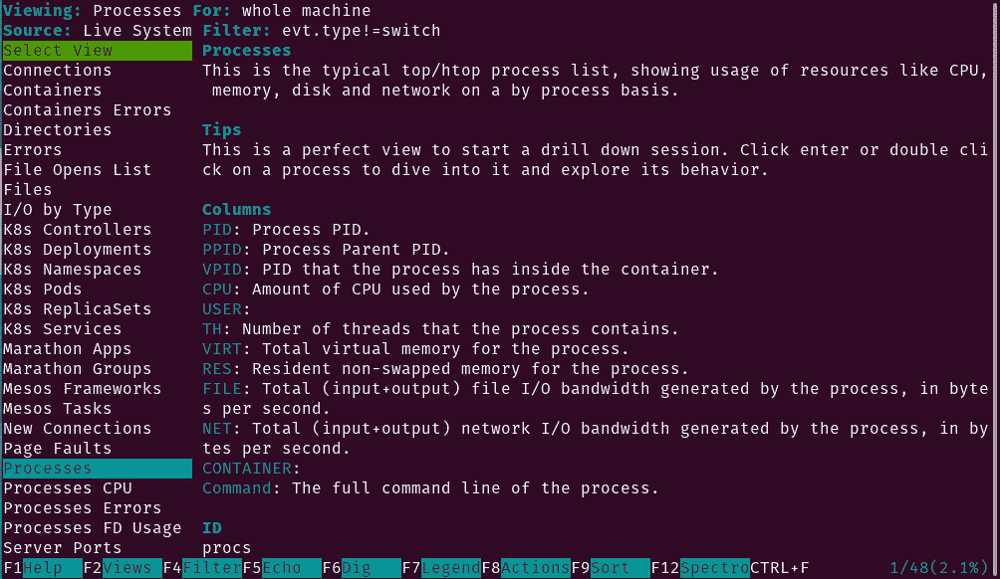

# 用 Sysdig 监控你的容器

> 原文：<https://thenewstack.io/monitor-your-containers-with-sysdig/>

快点。你的集装箱现在在做什么？你知道吗？他们表现如何？哪些系统调用和事件与您部署的微服务相关联？如果你不知道，那就认为自己有点落伍了。

不要担心，有一些工具可以帮助你挖掘细节，这样你就可以在指尖得到你需要的每一点信息。一个这样的工具是 [Sysdig](https://sysdig.com/) 。根据设计，sysdig 直接从 Linux 内核收集系统调用和事件[(而不是/proc ),并(自己)做 strace、tcpdump、htop、iftop、lsof 和 Wireshark 做的事情。换句话说，你可以使用一个工具，](https://thenewstack.io/no-agents-needed-to-monitor-containers-says-sysdig-just-linux-kernel-changes/)[而不是六个](https://thenewstack.io/sysdig-hones-in-on-unifying-security-and-monitoring/)。更好的是，从 2015 年开始，Sysdig 就意识到了容器。因此，当您需要对 Linux 上的那些微服务进行故障排除时，Sysdig 会支持您。虽然 Sysdig 是一个命令行工具，但是它包含了一个 ncurses 用户界面，使得查看这些信息更加容易。

我将带你在我选择的服务器操作系统 Ubuntu Server 20.04 上安装和使用 Sysdig。当然，Sysdig 可以安装在基于 Debian 或基于 Red Hat 的发行版上。要做到这一点，你需要一个正在运行的 Ubuntu Server 实例，以及一个拥有 sudo 权限的用户。您还需要一个容器运行时引擎(这样您就可以部署和监控容器)。我将使用 Docker 引擎和 WordPress 部署进行演示。

## 安装 Sysdig

我们要做的第一件事是安装 Sysdig。为此，请登录到您的 Ubuntu 服务器并发出以下命令:

`curl -s https://s3.amazonaws.com/download.draios.com/stable/install-sysdig | sudo bash`

这应该会安装所有的依赖项以及 Sysdig 的最新版本。

## 部署 WordPress Docker 容器

让我们部署一个 WordPress Docker 容器，这样我们就有东西可以监控了。这比部署一次性容器要复杂一些，但是知道如何做是值得的。

首先，拉动 MariaDB 容器:

`sudo docker pull mariadb`

接下来，用命令创建存放 WordPress 数据(用于持久存储)的必要文件夹:

`sudo mkdir /opt/wordpress`

`sudo mkdir -p /opt/wordpress/database`

`sudo mkdir -p /opt/wordpress/html`

创建 MariaDB 容器:

`docker run -e MYSQL_ROOT_PASSWORD=PWORD1 -e MYSQL_USER=wpuser -e MYSQL_PASSWORD=PWORD2 -e MYSQL_DATABASE=wordpress_db -v /opt/wordpress/database:/var/lib/mysql --name wordpressdb -d mariadb`

其中，PWORD1 和 PWORD2 是唯一/强密码。

下载 WordPress 的最新版本:

`docker pull wordpress:latest`

部署 WordPress 容器:

`docker run -e WORDPRESS_DB_USER=wpuser -e WORDPRESS_DB_PASSWORD=PWORD2 -e WORDPRESS_DB_NAME=wordpress_db -p 8081:80 -v /opt/wordpress/html:/var/www/html --link wordpressdb:mysql --name wpcontainer -d wordpress`

其中“PWORD 2”是您在前面的 *docker run* 命令中为 wpuser 设置的密码。

现在你可以将浏览器指向 http://SERVER:8081(其中 SERVER 是托管服务器的 IP 地址)并完成 WordPress 的安装。

## 如何使用 Sysdig

现在我们有了要监控的东西，让我们看看 Sysdig 是如何使用的。我更喜欢使用`ncurses`命令行界面，所以不使用 sysdig 命令，我们将使用 csysdig。

首先，让我们获得当前运行的容器列表，包括:

`sudo csysdig -vcontainers`

如果您只部署了 WordPress 站点的容器，您应该会看到两个容器正在运行:

该清单还将告诉您每个容器使用了多少 CPU、相关进程、线程、虚拟内存、常驻内存、文件、正在使用的引擎以及容器 ID 的数量。因此，我们已经看到了使用 Sysdig 的价值。

要退出该视图，请使用[Ctrl]+键盘快捷键。

让我们获得更多的信息。要查看与容器相关联的每个进程，请发出以下命令:

`sudo csysdig -pc`

这将列出(找到的每个进程):

*   PID(进程 ID)
*   PPID(父流程标识)
*   VPID(虚拟进程 ID)
*   CPU(容器使用的 CPU)
*   用户(启动容器的用户)
*   虚拟内存
*   分配的常驻内存
*   文件(容器使用的文件)
*   Net(容器使用的总网络 I/O)
*   容器(容器名称)
*   命令(容器使用的命令)

上述命令的问题是它可能会给你太多的信息。比方说，您只想查看与一个特定容器相关的信息(在我们的例子中，容器名为 wpress。为此，您可以发出以下命令:

`sudo sysdig -pc -c topprocs_cpu container.name=wpcontainer`

从该命令中，您应该会看到下列内容:

*   CPU%
*   过程
*   主机 _pid
*   容器 _pid
*   容器.名称

也许您需要检查特定容器的网络 I/O。再次坚持我们的例子，问题:

`sudo sysdig -pc -c topprocs_net container.name=wpcontainer`

或者

`sudo sysdig -pc -c topprocs_net container.name=wordpressdb`

上述命令将列出:

*   字节
*   过程
*   主机 _pid
*   容器 _pid
*   容器.名称

关于上面的命令需要知道的一件事是，只有在有实际网络流量的情况下，您才能看到数据。

如果您想查看与 WordPress 容器的 I/O 相关的文件，该怎么办？对于该问题，命令:

`sudo sysdig -pc -c topfiles_bytes container.name=wpcontainer`

同样，这是另一个只在文件被使用时才显示输出的命令。

您可能还想在 csysdig 中切换视图。查看上述命令之一时，按 F2 打开现有 csysdig 视图的菜单(**图 1** )。

图 csysdig 视图的菜单允许改变视图。

您应该看到以容器为中心的视图，如容器、容器错误、K8s 控制器、K8s 部署、K8s 名称空间等。

但是不要认为您必须首先知道如何发出 csysdig 命令，并且必须记住必要的参数和选项。事实上，您可以简单地发出:

`sudo csysdig`

命令运行后，按 F2 键(在键盘上)选择您想要的视图。这使得使用该命令更加容易(无需记住可用的选项和开关)。

## 结论

Sysdig 和 csysdig 是功能强大的工具，可以帮助您从终端窗口监视容器部署并对其进行故障排除。安装和使用都很简单。要了解 csysdig 能为您做些什么，可以发出以下命令:

`man csysdig`

或者

`man sysdig`

<svg xmlns:xlink="http://www.w3.org/1999/xlink" viewBox="0 0 68 31" version="1.1"><title>Group</title> <desc>Created with Sketch.</desc></svg>