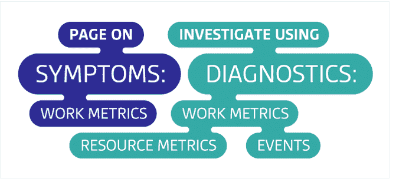

# 监控 101:对重要的事情发出警报

> 原文：<https://thenewstack.io/monitoring-101-alerting-on-what-matters/>

这篇文章是有效监控系列文章的一部分

[Datadog website](https://www.datadoghq.com/lpg/?utm_source=Advertisement&utm_medium=Advertisement&utm_campaign=TheNewStack-SponsorPost2015)

。请务必查看该系列的其余部分:“

[Collecting the Right Data](https://www.datadoghq.com/blog/2015/06/monitoring-101-collecting-data/)

和“调查性能问题”(即将推出)。

自动警报对于监控至关重要。它们允许您发现基础架构中任何地方的问题，以便您可以快速确定问题的原因，并最大限度地减少服务降级和中断。

但是警报并不总是像它们应该的那样有效。特别是，真正的问题往往被淹没在嘈杂的警报声中。本文描述了一种有效报警的简单方法，无论涉及的系统规模如何。简而言之:

1.  充分警惕；明智地传呼。
2.  页面上的症状，而不是原因。

这一系列文章来源于我们为客户监控大规模基础设施的经验。它还借鉴了[布伦丹·格雷格](http://dtdg.co/use-method)、[罗布·埃瓦舒克](http://dtdg.co/philosophy-alerting)和巴龙·施瓦茨的作品。

## 何时提醒某人(或不提醒任何人)

警报应该用简单的语言传达一些关于您的系统的具体信息:“两个 Cassandra 节点关闭”或“90%的 web 请求需要 0.5 秒以上的时间来处理和响应。”通过在尽可能多的系统中自动发出警报，您可以对问题做出快速响应并提供更好的服务，同时还可以将您从持续的手动指标检查中解放出来，从而节省时间。

## 警报紧急程度

并非所有警报都具有相同的紧急程度。有些需要立即的人工干预，有些需要最终的人工干预，还有一些指向将来可能需要注意的区域。至少应将所有警报记录到一个中心位置，以便与其他指标和事件进行关联。

### 作为记录的警报(低严重性)

许多警报与服务问题无关，因此人们可能根本不需要意识到它们。例如，当支持面向用户的服务的数据存储开始处理查询时，速度比平时慢得多，但还不足以对整体服务的响应时间产生明显的影响，这应该会生成一个低紧急性警报，记录在您的监视系统中，以供将来参考或调查，但不会中断任何人的工作。毕竟，像网络堵塞这样的暂时性问题通常会自行消失。但是如果出现重大问题——比方说，如果服务开始返回大量超时——基于警报的数据将为您的调查提供宝贵的背景信息。

### 作为通知的警报(中等严重性)

下一层紧急警报是针对需要干预但不是立即干预的问题。也许数据存储的磁盘空间不足，应该在未来几天内扩展。发送电子邮件和/或在服务负责人的聊天室发布通知是传递这些警报的完美方式，这两种消息类型都非常明显，但不会在半夜吵醒任何人或中断工程师的工作流程。

### 作为页面的警报(高严重性)

最紧急的警报应接受特殊处理，并升级到页面(如“[寻呼机](https://en.wikipedia.org/wiki/Pager)”)，以紧急请求人工关注。例如，您的 web 应用程序的响应时间应该有一个内部服务水平协议(SLA ),它至少应该和您最严格的面向客户的 SLA 一样严格。任何超过内部 SLA 的响应时间实例都值得立即关注，不管是什么时候。

【T2

## 何时让睡着的工程师躺着

每当您考虑设置警报时，问自己三个问题，以确定警报的紧急程度以及应该如何处理:

1.  **这个问题是真的吗？**这似乎是显而易见的，但如果问题不真实，通常不会产生警报。下面的例子可以触发警报，但可能不是真正问题的症状。对这类事件发出警报(更糟的是寻呼)会导致警报疲劳，并可能导致更严重的问题被忽略:
    *   测试环境中的度量是越界的。
    *   单个服务器的工作速度非常慢，但它是集群的一部分，可以快速故障转移到其他机器，而且它会定期重启。
    *   计划内升级导致大量机器报告为离线。
2.  如果问题确实存在，应该会发出警报。即使警报没有链接到通知，也应该记录在您的监控系统中，以供以后分析和关联。
3.  这个问题需要注意吗？如果您可以合理地自动响应问题，您应该考虑这样做。把某人从工作、睡眠或私人时间中叫出来会有很大的成本。如果问题是真实的，需要引起注意，它应该生成一个警报，通知可以调查和解决问题的人。至少，通知应通过电子邮件、聊天或票务系统发送，以便收件人可以优先考虑他们的回复。
4.  **这个问题紧急吗？**并非所有问题都是紧急事件。例如，可能比正常百分比稍高的系统响应非常慢，或者可能稍高的查询份额返回陈旧数据。这两个问题可能都需要尽快解决，但不是在凌晨 4 点。另一方面，如果一个关键系统以可接受的速度停止工作，工程师应该立即进行检查。如果症状是真实的，需要注意，而且很紧急，它应该生成一个页面。

## 症状页面

页面值得特别一提:它们在传递信息方面非常有效，但是如果过度使用，或者如果它们与设计不良的警告链接在一起，它们会造成很大的破坏。一般来说，当您负责的系统在可接受的吞吐量、延迟或错误率下停止做有用的工作时，寻呼是最合适的警报。这些都是你想立即知道的问题。

您的系统停止做有用的工作这一事实是一个症状，也就是说，它是一个问题的表现，这个问题可能有许多不同的原因。例如，如果您的网站在过去三分钟内响应非常慢，这就是一个症状。可能的原因包括高数据库延迟、应用服务器故障、Memcached 关闭、高负载等等。只要有可能，围绕症状而不是原因来构建你的页面。请参阅我们关于数据收集的姊妹文章，了解有助于区分症状和原因的度量框架。

症状分页显示真实的、经常是用户面临的问题，而不是假设的或内部的问题。将症状(如网站响应缓慢)的分页与症状的潜在原因(如 web 服务器上的高负载)的分页进行对比。如果网站仍然快速响应，您的用户将不会知道或关心服务器负载，并且您的工程师将会因为一些只有内部才注意到的事情而感到烦恼，这些事情可能会在没有干预的情况下恢复到正常水平。

### 持久警报定义

关于症状的另一个很好的理由是，症状触发的警报往往是持久的。这意味着，无论底层系统架构如何变化，如果系统停止正常工作，即使不更新警报定义，您也将获得适当的页面。

### 规则的例外:早期预警信号

即使系统运行良好，有时也有必要提醒人们注意少量的指标。早期预警指标反映了严重症状很快发展并需要立即干预的不可接受的高概率。

磁盘空间就是一个经典的例子。与用完可用内存或 CPU 不同，当您用完磁盘空间时，系统不太可能恢复，在系统硬停止之前，您可能只有几秒钟的时间。当然，如果你能提前足够的时间通知某人，那么就没有必要在半夜叫醒任何人。更好的是，您可以预测磁盘空间不足的情况，并根据您能够擦除的数据(如日志或其他地方存在的数据)构建自动修复。

## **结论:认真对待症状**

*   仅当检测到系统工作中的紧急问题症状时，或者即将达到关键的有限资源限制时，才发送页面。
*   设置您的监控系统，以便在检测到基础架构中的实际问题时记录警报，即使这些问题尚未影响整体性能。

我们希望听到您将这一框架应用到自己的监控实践中的经验。如果运行良好，请[在 Twitter 上告诉我们](https://twitter.com/datadoghq)！问题、更正、补充、投诉等？请[在 GitHub](https://github.com/DataDog/the-monitor/blob/master/monitoring-101/monitoring_101_alerting_on_what_matters.md) 上告诉我们。

Alexis lê-quc 是 Datadog 的联合创始人兼首席技术官，data dog 是新堆栈的赞助商。在创建 Datadog 之前，Alexis 担任无线一代的运营总监。Alexis 很早就参与了 DevOps 运动，他认识到了应用开发和运营之间的紧密联系，并在世界各地的会议上发表了关于云监控和服务器性能的演讲。

<svg xmlns:xlink="http://www.w3.org/1999/xlink" viewBox="0 0 68 31" version="1.1"><title>Group</title> <desc>Created with Sketch.</desc></svg>