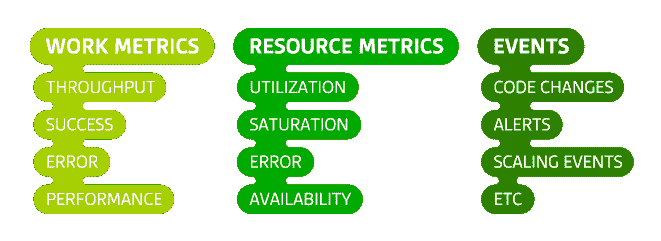

# 监控 101:收集正确的数据

> 原文：<https://thenewstack.io/monitoring-101-collecting-right-data/>

监控数据有多种形式——一些系统持续不断地输出数据，而另一些系统只在罕见的事件发生时才产生数据。有些数据对*识别*问题最有用；有些主要是对*调查*问题有价值。这篇文章介绍了要收集哪些数据，以及如何对这些数据进行分类，以便您可以:

1.  接收针对潜在问题的有意义的自动化警报。
2.  快速调查并彻底了解性能问题。

无论您的监控数据采取何种形式，统一的主题是:

收集数据是便宜的，但是当你需要它的时候没有它可能是昂贵的，所以你应该测量一切，并且合理地收集所有有用的数据。

这一系列文章来源于我们为[我们的客户](https://www.datadoghq.com/customers/)监控大型基础设施的经验。它还借鉴了布伦丹·格雷格、罗布·埃瓦舒克和巴龙·施瓦茨的作品。

## 韵律学

指标捕获与您的系统在特定时间点相关的值*—*例如，当前登录到 Web 应用程序的用户数量。因此，通常每秒收集一次指标，每分钟收集一次指标，或者以其他固定的时间间隔收集指标，以便随着时间的推移监视系统。在我们的框架中有两个重要的度量类别:工作度量和资源度量。对于作为软件基础设施一部分的每个系统，考虑哪些工作度量和资源度量是合理可用的，并收集它们。

### 工作指标

工作度量通过测量有用的输出来指示系统的顶级健康状况。当考虑您的工作指标时，将它们分成四个子类型通常会有所帮助:

*   吞吐量是单位时间内系统所做的工作量。吞吐量通常被记录为一个绝对数字。
*   成功度量表示成功执行的工作的百分比。
*   错误度量捕获错误结果的数量，通常表示为每单位时间的错误率，或者通过吞吐量标准化以产生每单位工作的错误。当有几个潜在的错误源时，错误度量通常与成功度量分开捕获，其中一些错误源比其他错误源更严重或更容易引起错误。
*   性能度量量化了组件工作的效率。最常见的性能指标是延迟，它表示完成一个工作单元所需的时间。延迟可以表示为平均值或百分比，例如“99%的请求在 0.1s 内返回”。

下面是两种常见系统的所有四个子类型的工作度量示例:Web 服务器和数据存储。

工作指标示例:Web 服务器(世界协调时 2015-04-24 08:13:01)

工作指标示例:数据存储(世界协调时 2015-04-24 08:13:01)

### 资源度量

您的软件基础设施的大多数组件都是作为其他系统的资源。有些资源是低级的，例如，服务器的资源包括 CPU、内存、磁盘和网络接口等物理组件。但是，如果另一个系统需要更高级别的组件来产生工作，那么更高级别的组件，比如数据库或地理定位微服务，也可以被认为是一种资源。

资源度量对于问题的调查和诊断尤其有价值。对于系统中的每个资源，尝试收集涵盖四个关键领域的指标:

1.  利用率是资源繁忙时间的百分比，或者是正在使用的资源容量的百分比。
2.  饱和度是对资源还不能服务的请求工作量的度量，通常排队。
3.  错误表示在资源产生的工作中可能看不到的内部错误。
4.  可用性表示资源响应请求的时间百分比。该指标仅适用于可以主动和定期检查可用性的资源。

以下是一些常见资源类型的示例指标:

### 其他指标

还有一些其他类型的度量标准，它们既不是工作度量标准，也不是资源度量标准，但是在诊断问题的原因时可能会派上用场。常见的例子包括缓存命中或数据库锁的计数。当有疑问时，获取数据。

## 事件

除了或多或少连续收集的指标之外，一些监控系统还可以捕获事件:离散的、不经常发生的事件，这些事件可以为理解系统行为中的变化提供重要的上下文。一些例子:

*   变更:内部代码发布、构建和构建失败。
*   警报:内部生成的警报或第三方通知。
*   缩放事件:添加或减去主机。

一个事件通常携带足够的信息，可以单独解释，不像单个指标数据点，通常只在上下文中有意义。事件捕捉在*时间*的某个点*发生了什么*，以及可选的*附加信息*。例如:

事件有时用于生成警报—应该通知某人发生了上表中第三个示例所示的事件，这表明关键工作失败了。但更常见的是，它们用于调查问题和跨系统关联。总的来说，把事件想象成度量——它们是有价值的数据，只要可行就可以收集。

## 好的数据是什么样的

您收集的数据应该具有四个特征:

*   很好理解。您应该能够快速确定每个指标或事件是如何被捕获的，以及它们代表了什么。在停机期间，您不会想花时间弄清楚您的数据意味着什么。尽可能保持您的度量和事件简单，使用上述标准概念，并清楚地命名它们。
*   粒状的。如果您收集指标的频率太低，或者在很长的时间窗口内取平均值，您可能会丢失有关系统行为的重要信息。例如，如果将资源利用率为 100%的时间段与利用率较低的时间段进行平均，则这些时间段将会变得模糊。以不隐藏问题的频率收集每个系统的指标，但不要收集得太频繁，以免监控对系统造成明显的负担([观察者效应](https://en.wikipedia.org/wiki/Observer_effect_(information_technology)))或在监控数据中产生噪音，因为采样时间间隔太短，无法包含有意义的数据。
*   按范围标记。您的每台主机同时在多个作用域中运行，您可能希望检查这些作用域或它们的组合的总体运行状况。例如:总体生产情况如何？美国东北部的生产情况如何？特定的软件/硬件组合如何？保留与您的数据相关联的多个范围非常重要，这样您就可以从任何范围发出问题警报，并快速调查停机情况，而不受固定的主机层次结构的限制。
*   长寿。如果您过早地丢弃数据，或者如果一段时间后您的监控系统聚合您的指标以降低存储成本，那么您将丢失有关过去发生的事情的重要信息。将原始数据保留一年或更长时间，可以更容易地知道什么是“正常”，尤其是当您的指标有月度、季度或年度变化时。

## 警报和诊断数据

下表将本文中描述的不同数据类型映射到另一篇文章中概述的不同级别的警报紧急程度。简而言之，*记录*是一个低紧急警报，它不会自动通知任何人，但会记录在监控系统中，以防对以后的分析或调查有用。通知是一种中等紧急程度的警报，它以不中断的方式(如电子邮件或聊天)通知可以解决问题的人。一个*页面*是一个紧急警报，它会打断接收者的工作、睡眠或个人时间，无论什么时候。请注意，根据严重性，通知可能比页面更合适，反之亦然:

## 结论:全部收集起来

*   测量一切，并合理地收集尽可能多的工作指标、资源指标和事件。
*   以足够的粒度收集指标，以使重要的峰值和谷值可见。具体的粒度取决于您正在测量的系统、测量的成本以及指标变化之间的典型持续时间，如内存或 CPU 指标的秒数、能耗的分钟数等等。
*   为了最大化数据的价值，用几个范围标记指标和事件，并以完整的粒度保留它们至少一年。

我们希望听到您将这一框架应用到自己的监控实践中的经验。如果它运行良好，请[在推特上告诉我们](https://twitter.com/datadoghq)！问题、更正、补充、投诉等？请[在 GitHub](https://github.com/DataDog/the-monitor/blob/master/monitoring-101/monitoring_101_collecting_the_right_data.md) 上告诉我们。

Datadog 是新堆栈的赞助商。

<svg xmlns:xlink="http://www.w3.org/1999/xlink" viewBox="0 0 68 31" version="1.1"><title>Group</title> <desc>Created with Sketch.</desc></svg>