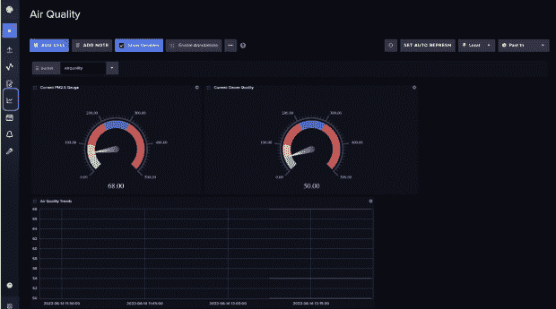

# 用 InfluxDB 和 Telegraf 监测空气质量

> 原文：<https://thenewstack.io/monitoring-air-quality-with-influxdb-and-telegraf/>

[Anais dot is-乔治乌](https://www.linkedin.com/in/anais-dotis-029623113/)

 [Anais 是 InfluxData 的开发者倡导者，热衷于使用数据分析、人工智能和机器学习来美化数据。她收集数据，进行综合研究、探索和工程设计，将数据转化为功能、价值和美感。当她不在屏幕后面时，你可以发现她在外面画画、伸展身体、登船或追逐足球。](https://www.linkedin.com/in/anais-dotis-029623113/) 

如果你住在北半球，你可能很高兴经历夏天。然而，夏季是火灾多发季节，所以记住你能做些什么来降低野火的风险是很重要的。如果你住在一个容易发生野火的地区，监测空气质量来保护自己免受烟雾的伤害是明智的。

今天，我们将使用时间序列平台 InfluxDB 来监测空气质量，并设置警报，以便我们可以在烟雾达到危险水平时得到通知。具体来说，我们将使用[空气质量模板](https://github.com/influxdata/community-templates/tree/master/airquality)来轻松开始使用 InfluxDB。

InfluxDB 模板是预先打包的配置，在平台中设置了一堆资源。空气质量模板包括一个仪表板，可轻松显示空气质量数据，还包括一个 Telegraf 配置，可将空气质量数据写入 InfluxDB 实例。 [Telegraf](https://www.influxdata.com/time-series-platform/telegraf/?utm_source=vendor&utm_medium=referral&utm_campaign=2022-08_spnsr-ctn_monitoring-air-quality_tns) 是一个用于度量和事件的开源收集代理。我们的 Telegraf 配置将使用 http 输入插件从 [AirNow API](https://github.com/influxdata/community-templates/pull/311) 写入数据。

## 先决条件

这篇文章假设你已经完成了以下步骤:

1.  首先，在这里得到 [InfluxDB。我推荐注册 InfluxDB Cloud，因为这是入门 InfluxDB 最简单的方法。](https://www.influxdata.com/get-influxdb/?utm_source=vendor&utm_medium=referral&utm_campaign=2022-08_spnsr-ctn_monitoring-air-quality_tns)
2.  安装 Telegraf 代理。在这里找到你喜欢的下载方式[。](https://portal.influxdata.com/downloads/?utm_source=vendor&utm_medium=referral&utm_campaign=2022-08_spnsr-ctn_monitoring-air-quality_tns)

## 安装空气质量模板

要安装空气质量模板，请导航至左侧导航栏上**设置、**下的**模板页面**。

复制粘贴以下网址，点击**查找模板**:
[https://github . com/influx data/community-templates/blob/master/air quality/air quality . yml](https://github.com/influxdata/community-templates/blob/master/airquality/airquality.yml)

接下来，点击**安装模板**添加所有相关资源。

## 设置 AirNow

根据自述文件中的说明，首先，到[https://docs.airnowapi.org/account/request/](https://docs.airnowapi.org/account/request/)请求 [AirNow AP](https://github.com/influxdata/community-templates/pull/311) 的账户访问。接下来，转到[https://docs.airnowapi.org/forecastsbyzip/query](https://docs.airnowapi.org/forecastsbyzip/query)，如下建立你的网址:

1.  输入感兴趣的邮政编码。
2.  从**格式**下拉菜单中选择 application/json。
3.  点击**构建**。
4.  复制 URL 字符串。
5.  通过删除日期来编辑 URL 字符串(例如，“日期=2022-06-14”)。

从 AirNow 中复制生成的 URL，并删除“& date=2022-06-14”，然后将其添加到您的 Telegraf 配置文件中。

删除日期后，您的 URL 应该是这样的。

``yaml``

 `[https://www.airnowapi.org/aq/forecast/zipCode/?format = application/JSON&zip code = 99999&distance = 25&API _ KEY = a1 B2 C3 d 4-a1 B2-a1 B2-a1 B1-a1 B2 C3 d 4 e 5 f 6](https://www.airnowapi.org/aq/forecast/zipCode/?format=application/json&zipCode=99999&distance=25&API_KEY=A1B2C3D4-A1B2-A1B2-A1B1-A1B2C3D4E5F6)"

 `## 设置 Telegraf

接下来，您需要编辑 Telegraf 配置文件。安装后点击 **airquality** 模板，展开资源下拉菜单，点击 **airquality-telegraf** 配置，即可轻松导航至正确的 Telegraf 配置文件。

这将带您进入“加载数据”页面。在这里，您可以单击配置名称进行编辑。

现在，我们可以将编辑过的 AirNow URL 粘贴到第 17 行，并单击**保存更改**。

现在，单击**设置说明**(在配置名称旁边)，以此配置运行我们的 Telegraf 代理，并将空气质量指标写入 InfluxDB。

## 空气质量仪表板

空气质量仪表板是空气质量模板中包含的另一个资源。

让 Telegraf 运行一会儿，然后访问仪表板页面下的预建仪表板。从左侧导航栏导航到仪表板页面。确保选择我们想要从中创建可视化效果的合适的存储桶 airquality。它包括两种仪表可视化:

1.  当前 PM2.5:该仪表显示最新的细颗粒物(PM2.5)水平。
2.  当前的臭氧质量:这个量表显示最近的臭氧水平。

该图显示了按严重程度划分的空气质量指数(AQI)。

## 向空气质量模板添加警报

我们可以轻松地向空气质量模板添加警报，以便在 AQI 达到危险水平时得到通知。您可以使用 InfluxDB 向包括 Slack 在内的各种不同的端点发送警报。导航到**警报**页面并点击 **+创建**来创建一个新的检查。接下来，使用**查询构建器**查询您的数据。设置一个时间间隔，以确定检查数据是否超过阈值的频率。最后，设置您的通知端点。要了解如何配置 Slack 通知端点，请关注[这篇文章](https://www.influxdata.com/blog/tldr-influxdb-tech-tips-configuring-slack-notification-with-influxdb/?utm_source=vendor&utm_medium=referral&utm_campaign=2022-08_spnsr-ctn_monitoring-air-quality_tns)。

这是一个如何设置阈值检查的示例，以便使用 InfluxDB UI 获得关于不安全 AQI 的通知。

## 最后的想法

我希望这篇文章能激励你利用 InfluxDB 在这个夏天保持健康。我也鼓励你看一看 [Enviro+ Raspberry Pi 空气质量模板](https://www.influxdata.com/influxdb-templates/air-quality-monitor/?utm_source=vendor&utm_medium=referral&utm_campaign=2022-08_spnsr-ctn_monitoring-air-quality_tns)来构建你自己的空气质量传感器。

<svg xmlns:xlink="http://www.w3.org/1999/xlink" viewBox="0 0 68 31" version="1.1"><title>Group</title> <desc>Created with Sketch.</desc></svg>``