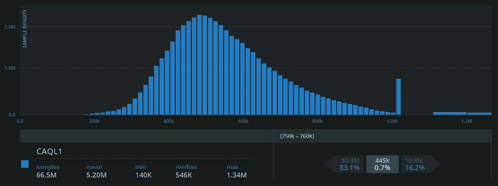
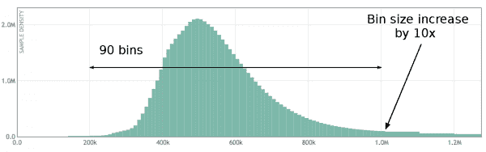
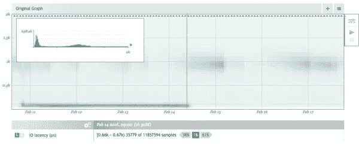

# 发布后监控 API 延迟:要避免的 4 个错误

> 原文：<https://thenewstack.io/monitoring-api-latencies-after-releases-4-mistakes-to-avoid/>

 [西奥·施洛斯纳格

西奥于 2010 年创立 Circonus，并继续担任其首席建筑师。20 年来，他一直在设计、编码、构建和操作可扩展系统。作为一名连续创业者，他已经创建了四家公司，并帮助发展了无数的工程组织。西奥是*可扩展互联网架构(Sams)* 的作者，是 *Web Operations* (O'Reilly)和 *Seeking SRE* (O'Reilly)的撰稿人，也是全球 IT 会议的常客。他是 IEEE 会员和 ACM 杰出会员。](https://www.linkedin.com/in/postwait/) 

在我们这个快速发布周期的时代，工程师们经常进行 API 更新，努力不断改善用户体验。但是，虽然更新的设计考虑到了用户的利益，但它们也可能产生新的性能问题。

在发布新的更新时，确保您的 API 满足性能要求和服务级别目标(SLO)取决于正确监控 API 延迟。从最基本的意义上来说，API 是一个编程接口，它向远程服务发出用户请求，API 延迟是为每个用户请求提供服务所需的时间。

监视 API 延迟是复杂的，因为成千上万甚至数百万的用户正在发出多个不同的请求。工程师必须持续收集和分析所有这些数据，尤其是在每个新版本发布后，以确保更新不会影响性能。直方图是监控 API 延迟的最佳工具，通常由工程师使用。不幸的是，它们经常被不正确地使用，导致不正确的分析。在本文中，我分享了工程师在使用直方图来监控不同版本的 API 延迟时会犯的四个常见错误。

## 第一个错误:没有问正确的问题

工程师在决定如何跟踪 API 延迟时有几个考虑因素。如何定义不同或相似的请求？不同的请求需要不同的时间吗？请求响应是成功的，还是有错误？

您可能有一百万个这样的 API 请求，您有它们的延迟数，并且您还有围绕它们的其他维度或子组。如果您不是统计学家，大多数工程师都不是，那么要知道从您收集的所有这些延迟信息中开始收集见解，甚至要问哪些问题都是一项挑战。

通常，当比较 API 延迟来检测版本之间的变化时，工程师可能会检查数据，如第 99 百分位中的平均速度差异。然而，这并没有提供您需要的洞察力。事实上，许多次的平均会导致错误的结论，因为一些异常值会扭曲结果。在比较不同版本的 API 延迟数据直方图时，要问的更复杂的问题包括:

*   形状不同吗？
*   数据的浓度不同吗？
*   数据的集中会移动吗？
*   直方图有多少个数据浓度？
*   数据集中在哪里？

新的数据集中表明，您的新版本可能已经创建了新的工作负载，因为用户开始提出不同的请求。或者，您的版本中有一个实现更改，导致某些请求以不同的方式或更慢的速度得到服务，因此您的直方图中有一个新的“凸起”，或数据集中。无论这种工作负载变化是由最终用户引起的还是由某个较低级别的系统引起的，现在都需要考虑这种工作负载变化。在下面的直方图中，Y 轴代表样本大小，X 轴代表样本值(微秒)。“凸起”的最高点代表最大的数据密度。

## **错误 2:计算总延迟的错误**

新的 API 版本经常会导致新的错误，并且错误经常会很快出现。我们看到的一个常见错误是，工程师在他们的延迟统计数据中包含错误，因此这些错误会导致人为的小延迟，使您认为您满足了服务级别要求，而实际上您并没有。毕竟，您的 SLO 不是在 1 秒内为 99%的请求提供服务，而是在 1 秒内为所有成功的请求提供服务。

为了防止这种错误，您应该创建几个直方图:一个包含所有内容，一个只存储成功的请求，一个只存储失败的请求或错误。您可能还需要存储特定端点的成功请求的直方图。这样，您可以确保 API 延迟分析的准确性，然后根据需要对数据进行分割。

## **错误 3:不正确地设置箱子边界**

直方图将所有样本数据分成一系列区间，称为仓。不幸的是，糟糕的直方图宁滨是测量 API 延迟时最常见的错误之一，并且经常导致非常不准确的分析。

在分析新 API 版本的延迟时，您希望能够将当前数据与以前版本的历史延迟数据进行比较。为此，您组织中的所有直方图都需要公共的条柱边界。这样，您可以聚集直方图并轻松识别变化。

然而，对于组织来说，在它们的直方图中使用不同的柱边界，甚至在不同版本之间改变它们是很常见的。聚合具有不同宁滨的直方图会降低直方图的质量，从而影响数据分析。

在 Circonus，我们使用对数线性直方图，它通常具有对数增长的仓大小。然而，我们在所有直方图中使用相同的宁滨边界方案。

## **错误 4:抽样而不是收集所有数据**

测量 API 延迟的最大问题是人们没有记录监控和分析所必需的数据。监控行业一直在争论采样问题，即没有必要收集所有数据。虽然取样还可以，但并不完美。显然，如果你不收集数据，那么它就永远丢失了。收集所有数据可以提高准确性，使用直方图，您可以在相对没有开销的情况下进行 100%的采样，因此没有理由不这样做。

对于您服务的每个 API，您应该测量每个公开端点上的每个请求的延迟。你谈过的微服务？测量那里的延迟。您用来通信的网络协议？测量每个方向发送的每个包裹的大小。那个卡珊德拉星团？测量面向客户端的延迟，还要测量每个节点上每个磁盘轴(或 EBS 卷，或临时 SSD)上每个磁盘操作的 I/O 延迟。当然，这听起来像是很多数据。但我们生活在未来，分析系统现在能够每秒处理十亿次测量，同时保持经济性。

上图显示了 Circonus 的一个核心数据库节点上每个 I/O 操作的完整分布。分线盒中的直方图显示了三种不同的模式:两种紧密耦合的模式位于左侧峰值，一种较小的模式位于延迟谱的更远处。在 2 月 14 日上午 9 点之后，我们还可以看到行为上的根本差异。当我们查看一周的数据时，每个垂直时间片都是 1 小时 30 分钟。由垂直灰色细线突出显示的切片显示在左上角的转接框中；仅它就代表了将近 1200 万个数据点。完整的图表代表了大约 12 亿次测量，从 Circonus 时间序列数据库中获取这些数据仅用了 48 分钟。

## **对你的分析有信心**

API 更新旨在让您的用户更开心，但它们经常会导致新的性能问题。在新版本发布后监控 API 延迟就是为了解决这个问题，但是这些错误经常会导致不准确的分析。因此，您可能有延迟问题而没有意识到，或者认为您有延迟问题，而实际上您没有。通过解决以上四个常见的问题，你可以对你的分析的准确性和你根据它做出的决定更有信心。

<svg xmlns:xlink="http://www.w3.org/1999/xlink" viewBox="0 0 68 31" version="1.1"><title>Group</title> <desc>Created with Sketch.</desc></svg>