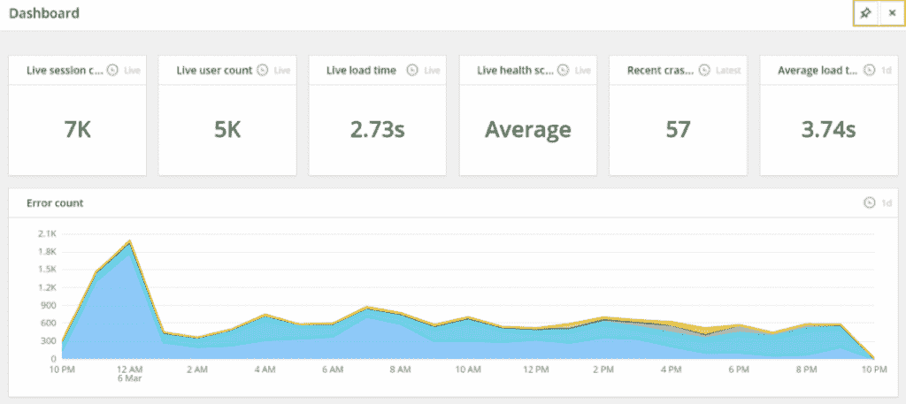

# 您不能忽视的监控指标

> 原文：<https://thenewstack.io/monitoring-metrics-you-cant-afford-to-ignore/>

[Raygun](https://raygun.com/) 赞助本帖。

 [戴夫·法里内利

戴夫是 Raygun.com 的一名作家，他是一名拥有八年多经验的高级软件工程师。他的专长是为金融、医疗保健和保险领域提供开发运维及实施解决方案，重点是改善流程和交付。](https://raygun.com/) 

随着 DevOps 运动的兴起，人们开始关注 web 应用程序监控工具。这是一件伟大的事情。监控 web 应用程序(尤其是在生产环境中)通常是事后才想到的——它通常是在发生一些事件后才开始的。到那个时候，价值已经失去了——无论是由于崩溃、糟糕的性能还是安全缺陷。

拥有一个强大的监控策略可以收集关于 web 应用程序健康状况的信息。在对应用程序的问题进行故障排除时，有硬信息作为指导会产生奇迹。然而，好事也会有过犹不及的时候。信息太多会导致信息疲劳，这和信息不够一样糟糕。如果你的申请中有太多的信息，很可能最终会被忽略。当这种情况发生时，就相当于没有监控。

在本文中，我将讨论一些监控时需要考虑的最重要的指标。此外，我们将回顾用于无缝提供信息的信息表示方法。让我们开始吧。

## 挑选最重要的指标

如上所述，任何不能付诸行动的信息都是你消耗的心理重量。在最好的情况下，您将忽略这些信息，在最坏的情况下，它将您的监控变成一团乱麻，没有提供多少价值。一个好的起点是过滤信息，只显示关键指标，无论这意味着减少信息还是构建监控策略。

让我们考虑几个关键指标:

### 错误处理

有几种方法可以处理应用程序中的监控错误:

*   使用像 [Raygun 的崩溃报告](https://raygun.com/platform/crash-reporting) 这样的工具，可以很容易地将 web 应用程序中出现的任何错误可视化。这个工具提供了一个解决方案来确定应用程序中出现的错误，包括频率和优先级；
*   为适当的环境使用内置指标报告。例如，如果你使用 Microsoft Azure 进行托管，你可以设置指标，向你发送关于服务器上可能发生的任何类型的 5xx 错误的电子邮件；
*   将错误处理构建到您的应用程序中。这通常是最经济、最简单的方法，但是很容易失控(同时，确保您的错误处理不会产生自己的错误)。

### 应用程序性能监控:内部工作方式

其次，应用程序性能监控(APM)是应用程序的一个关键指标。APM 工具提供了一种监控应用程序内部工作的方式。最有用的功能是确定应用程序中出现的任何瓶颈。应用程序性能管理包括两组主要指标:

1.  应用程序最终用户体验到的性能。这包括加载时间、请求量等等；
2.  应用程序使用的计算资源。这允许确定应用程序中的任何硬件瓶颈。

例如，假设性能正在成为您的应用程序的一个问题，用户开始体验到缓慢。这类问题可能变得非常模糊，难以发现。与应用程序中出现的错误不同，性能问题更像是一个滑动标尺。可能只是网速慢是因为网速差？也许用户只会责怪自己？因为性能不是绝对的，所以用户的门槛会有所不同。

就像错误处理一样，有几种方法可以处理应用程序性能管理:

*   像 Raygun 的 APM 这样的现成工具作为 APM 可能是一项相当大的任务，这是一种无需太多工作就能立即从监控中获得大量价值的简单方法。
*   手动将性能日志添加到您的应用程序中。这包括为查询语句、计算时间等添加调试语句。

到目前为止，我们已经指出了用于您的应用程序的两个关键指标。这将有助于减少信息疲劳，只查看最关键的信息，以保持您的 web 应用程序处于完美状态。下一步是查看这些信息，在评估您的 web 应用程序的状态时，一个演示文稿会带来很大的不同。

## 演示:有效地消化信息

与指标同样重要的是，管理监控能力的另一个关键方面是接收信息。理想的交付方法是不需要做大量工作来收集所需信息的方法。我倾向于用两种方式来思考这个问题:

1.  尽快把重要信息交给我。像一个应用程序停止运行或者一个严重的错误就符合这种条件；
2.  获得所有应用程序状态的高级视图。我应该能够很快看到这一点，并获得应用程序的工作状态，如果需要的话，可以更深入地挖掘。

让我们逐一看一下:

### #1:关键信息警报

正确理解监控信息的第一个方面是获取紧急情况的警报。与所有涉及优先级的事情一样，区分紧急问题和非紧急问题非常重要。信息过载在这里成为一种风险——如果你开始收到数百封关于系统错误的电子邮件，下一个合乎逻辑的步骤就是过滤掉这些电子邮件。这就让你回到了以前的状态，没有很好的监控。

有一种简单的方法来设置有效的警报:

*   需要立即关注的关键问题是什么？停机时间、安全问题或性能下降超过 SLA 都是很好的候选；
*   被提醒的最好方式是什么？如果您的团队正在使用时差，获得时差通知可能是立即联系您的最佳方式。也许是短信？电子邮件也始终是一个选项，尽管很难将这些警报与其他电子邮件区分开来。

重新回顾前面提到的 Raygun 产品，有一个 [系列集成](https://raygun.com/docs) 可以使警报方法简单实现。无论您认为接收警报的最佳方法是什么，Raygun 都应该能够涵盖它。

### #2:仪表板

最后，让我们看看在管理监控功能时消化数据的最后一个方面。仪表板提供了在任何给定时间查看应用程序状态的视觉效果。

让我们来看看 Raygun 在其崩溃报告应用程序中提供的仪表板:

快速浏览一下，我可以看到如下数据:

*   应用程序当前的实时用户数；
*   平均装载时间；
*   最近崩溃的次数。

所有这些都以一种易于呈现的方式提供了关于应用程序性能的硬数据。如果性能由于开发工作而提高，你将能够以一种有意义的方式展示出来。

## 争夺您的监控能力

现在您已经阅读了本指南，您应该已经掌握了需要监控的关键信息以及接收这些信息的最佳方式。您是否淹没在无法有效使用的指标中？考虑过滤掉你的度量标准，只使用上面探索的那些，看看它是否有帮助。

通过 Pixabay 的特征图像。

<svg xmlns:xlink="http://www.w3.org/1999/xlink" viewBox="0 0 68 31" version="1.1"><title>Group</title> <desc>Created with Sketch.</desc></svg>