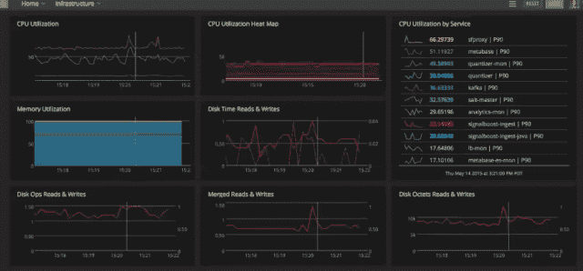

# 监控现代应用是一个只有分析才能解决的问题

> 原文：<https://thenewstack.io/monitoring-modern-apps-is-a-problem-only-analytics-can-solve/>

监控是一个分析问题，尤其是在使用微服务和其他工具(如容器技术)的现代分布式架构中。这一点在与现代应用监控服务 SignalFx 的首席执行官兼创始人 Karthik Rau 等人交谈时显而易见。

[https://www.youtube.com/embed/2NlqQzRrV6M?feature=oembed](https://www.youtube.com/embed/2NlqQzRrV6M?feature=oembed)

视频

SignalFx 技术的根源来自联合创始人菲利普刘(Phillip Liu)在担任软件工程师时的工作，当时他所在的团队为快速增长的社交网络开发系统管理工具。在那些日子里，脸书的大部分经验来自于开发他们自己的工具来管理不断增长的分布式架构。他们遇到的问题和今天很多公司面临的问题类似。

SignalFx 使用流分析方法来识别趋势。在一个演示中，Rau 展示了 SignaFx 交互式分析管道，该管道可以从多个数据源获得聚合数据的实时视图，这些数据源通过标准 API 进行检测和拉入。可以使用来自 collectd、StatsD、Metrics 或任何其他东西的指标，或者客户可以直接向 SignalFx [API](https://support.signalfx.com/hc/en-us/articles/201270489) 写入。SignalFx 还提供了 collectd 和 Java 客户端库的简化配置，以获得即时可见性。它还[与 AWS](https://support.signalfx.com/hc/en-us/articles/204422055-Integrate-with-Amazon-Web-Services) 集成，以获取 CloudWatch 指标和 AWS 元数据。还有与提供出站警报和通知的[page duty](https://support.signalfx.com/hc/en-us/articles/202860715-Integrate-with-PagerDuty)、 [HipChat](https://support.signalfx.com/hc/en-us/articles/204485485-Integrate-with-HipChat) 、 [Slack](https://support.signalfx.com/hc/en-us/articles/204100519-Integrate-with-Slack) 和 webhooks 的集成。

管道提供了这样一种能力，即看问题就像，例如，早上 6 点出现的趋势是正常的或者应该被探究。客户发送允许过滤的数据以进行比较，例如不同地区的延迟或延迟与事务请求的比较。大多数客户尽可能多地使用仪器来获得完整的图片。

SignalFx 将指标分为基础设施、应用或业务指标:

### 基础设施

*   服务器的 CPU 百分比。
*   可用磁盘空间的字节数。
*   网络接口上传输的字节数。

### 应用程序

*   API 调用的响应时间(毫秒)。
*   服务中使用的内部缓存的缓存命中率。
*   JVM 实例花费在垃圾收集上的时间百分比。

### 商业

*   过去一天登录的唯一用户数。
*   前一小时注册的新客户数量。
*   收入的周增长率。

SignalFx 处理指标数据和相关事件(如代码推送)，客户使用这些数据和事件在图表或仪表板上进行注释或覆盖。

可以分析特定的实例类型，并即时重新渲染。它提供了一个聚合视图，允许您发送聚合指标警报，例如增长率。

客户部署和管理的应用数量意味着对微服务的兴趣更大。使用多个微服务的客户可以使用 SignalFx 监控上游和下游的依赖关系。每个服务可能有几十个组件，需要一个聚合视图，而不是一次检查一个组件。

SignalFx 是新堆栈的赞助商。

<svg xmlns:xlink="http://www.w3.org/1999/xlink" viewBox="0 0 68 31" version="1.1"><title>Group</title> <desc>Created with Sketch.</desc></svg>