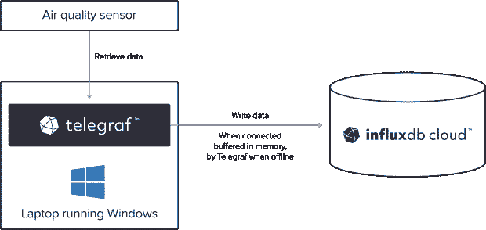
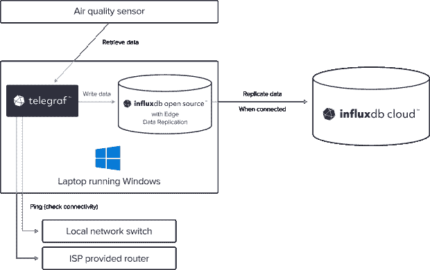

# 监控边缘和云中的网络中断

> 原文：<https://thenewstack.io/monitoring-network-outages-at-the-edge-and-in-the-cloud/>

监控间歇性断电和/或连接中断的位置可能会很困难。在本文中，我将展示如何使用 InfluxDB(一个开源时间序列数据库)、InfluxDB Cloud 和 [Edge 数据复制](https://www.influxdata.com/products/influxdb-edge-data-replication/?utm_source=vendor&utm_medium=referral&utm_campaign=2022-10_spnsr-ctn_monitoring-network-outages_tns)在本地存储数据，并尽可能将其发送到一个中心位置。我还将使用 Telegraf，一个开源数据收集代理，来检索一些为此目的所需的数据。

## 连通性问题

在这种情况下，我与一台运行 Windows 的笔记本电脑共享一个远程位置的小壁橱。这台机器允许我的朋友打印和扫描文件，我用它来收集空气质量数据。该设置在大多数情况下运行良好；然而，偶尔断电和断网限制了我朋友处理文档的能力，也限制了我收集空气质量数据的能力。

失败可能有多种原因。第一个明显的问题可能是电脑关机。这里最可能的根本原因是停电，但其他因素也可能起作用，例如其他硬件或软件问题。此外，网络设备可能也有问题。最初的设置包括由互联网服务提供商(ISP)提供的本地交换机和路由器。

我怀疑停电导致了最初的问题，这造成了连接问题，并最终导致笔记本电脑电池耗尽。然而，我需要更多的数据来验证我的假设。

我着手更新我的设置有两个原因:1)避免或尽量减少停电时的数据丢失，2)收集更多的数据来验证我对根本原因的假设。为此，我决定收集笔记本电脑电池及其与交换机和路由器连接的数据。

## 以前的设置

最初，笔记本电脑运行 [Telegraf](https://www.influxdata.com/time-series-platform/telegraf/?utm_source=vendor&utm_medium=referral&utm_campaign=2022-10_spnsr-ctn_monitoring-network-outages_tns) 并将数据发送到 [InfluxDB Cloud](https://cloud2.influxdata.com/signup/?utm_source=vendor&utm_medium=referral&utm_campaign=2022-10_spnsr-ctn_monitoring-network-outages_tns) 。但我改变了设置，以改善它和解决这些连接问题。默认情况下，Telegraf 在可以访问互联网时发送数据，并在连接失败时将数据缓冲在内存中。然而，如果网络中断，停电了，那会耗尽笔记本电脑的电池，我会丢失所有的数据。

以下是之前的设置:



## 新的设置

为了补救这种情况，笔记本电脑现在运行一个本地实例 [InfluxDB 2.0](https://www.influxdata.com/get-influxdb/?utm_source=vendor&utm_medium=referral&utm_campaign=2022-10_spnsr-ctn_monitoring-network-outages_tns) (OSS)。Telegraf 过去将指标直接输出到 InfluxDB Cloud，现在将所有数据发送到 InfluxDB 的本地实例。我为[边缘数据复制](https://www.influxdata.com/blog/edge-data-replication/?utm_source=vendor&utm_medium=referral&utm_campaign=2022-10_spnsr-ctn_monitoring-network-outages_tns)配置了本地 InfluxDB 实例，这允许我设置一个桶，以便在有连接时自动将桶中的数据发送到 InfluxDB 云的实例。

这种设置对断电更有弹性。Telegraf 现在将数据发送到本地 InfluxDB OSS 实例，因此它立即保存在笔记本电脑上。OSS 然后将这些数据发送到我的 InfluxDB 云账户，在那里我可以很容易地通过互联网查询数据，并在此基础上建立警报。

这是新的设置，包括边缘数据复制:



该图表还包括有助于解决原始问题的其他数据。

## 配置新设置

笔记本电脑开机后会自动登录并启动多个应用程序，包括 Telegraf。

我按照 InfluxDB [下载页面](https://portal.influxdata.com/downloads/?utm_source=vendor&utm_medium=referral&utm_campaign=2022-10_spnsr-ctn_monitoring-network-outages_tns)上的说明设置了我的 InfluxDB OSS 实例和 InfluxDB CLI，并将其安装到 C:\ Program Files \ influx data \ influx db。

然后我在启动文件夹新建了一个快捷方式(比如**C:\ Program data \ Microsoft \ Windows \ Start Menu \ Programs \ Startup**或者**C:\ Users \ % USERNAME % \ AppData \ Roaming \ Microsoft \ Windows \ Start Menu \ Programs \ Startup**)运行**cmd.exe/C " C:\ Program Files \ influxda \ InfluxDB \ influxd 2 _ Windows _ amd64 \ influxd . exe "**并设置**运行**

为了开始设置 InfluxDB，我手动运行了快捷方式。使用我之前安装的 InfluxDB CLI，我运行了`influx setup`**命令来设置本地实例。我提供了我的本地用户、组织 ID、bucket 名称和密码。**

 **我已经有了一个 InfluxDB 云帐户，所以我为所有复制的数据创建了一个新的存储桶。我还[在我的云帐户中创建了一个 API 令牌](https://docs.influxdata.com/influxdb/cloud/security/tokens/?utm_source=vendor&utm_medium=referral&utm_campaign=2022-10_spnsr-ctn_monitoring-network-outages_tns)，它可以对这个新的 bucket 进行写访问。稍后设置复制时，我将需要该令牌。

接下来，我需要设置 Edge 数据复制(EDR ),以便将我本地存储桶中的所有数据复制到我在云帐户中创建的存储桶中。

此时，我需要创建一个“remote ”,告诉我的本地 InfluxDB 实例关于我希望它写入数据的 InfluxDB 云实例。对于这个远程，我需要提供一个 URL、我的云帐户的组织 ID(一个 16 位十六进制数)和我之前创建的 API 令牌。执行此操作的命令是:

`influx remote create --name cloud --remote-url https://eu-central-1-1.aws.cloud2.influxdata.com --remote-api-token "...." --remote-org-id ....`

在这种情况下，我的云帐户在欧盟中部地区的 AWS 上。显然，这将因其他地区或不同云提供商的 InfluxDB 云帐户而异。

重要说明:`remote-org-id`**必须是 InfluxDB 云帐户的组织 ID，而不是来自**流入设置**步骤的本地组织 ID。**

 **执行 remote 命令输出关于新创建的遥控器的信息。复制**远程 ID** (16 位十六进制数)很重要，因为我们将在下一步需要它。

至此，我们已经具备了创建复制所需的一切。这里，我在我的本地 InfluxDB OSS 实例上指定了一个 bucket 来复制到我的 InfluxDB 云帐户。命令是:

`influx replication create --name cloud-mybucket --remote-id .... --local-bucket-id ....--remote-bucket-id ....`

`**remote-id**`值必须是上面`**influx remote create**`命令输出的 ID。`**local-bucket-id**`和`**remote-bucket-id**`的值需要分别是 InfluxDB OSS 和 InfluxDB Cloud 中存储桶的 id(16 位十六进制数)。您可以在 InfluxDB UI 中找到 bucket ID。只需转到“加载数据”部分，然后单击“存储桶”选项卡。

## 数据复制正在进行

有了一个更具弹性的设置，我就可以收集关于停机的数据，并有希望获得更多关于潜在问题的数据。

所以，除了空气质量数据，我也开始收集网络数据。我将 [Ping 输入插件](https://www.influxdata.com/integration/ping/?utm_source=vendor&utm_medium=referral&utm_campaign=2022-10_spnsr-ctn_monitoring-network-outages_tns)添加到我的 Telegraf 中，以定期检查以下各项的连接性:

*   连接机柜和大楼其他部分的交换机(交换机有自己的 IP 地址)
*   提供互联网连接的路由器的本地 IP 地址
*   互联网服务提供商的远程 IP 地址

我将 Ping 输入插件配置更新如下:

```
[[inputs.ping]]
  urls  =  ["(switch IP)",  "(ISP local ip)",  "(ISP remote IP)"]
  count  =  3
  timeout  =  2.0
  deadline  =  10
  interval  =  "300s"

```

它每五分钟检查一次到所有三个 IP 地址的连接，并将结果存储在 InfluxDB 的本地实例中。EDR 将这些数据复制到云中。

我还开始收集关于笔记本电脑的电量和电池状态的数据。我可以知道笔记本电脑是否连接了交流电源，电池是否耗尽，以及还剩多少电池。Telegraf 没有提供在 Windows 上检索这些数据的内置方法；然而，我所要做的就是编写一个 PowerShell 脚本，查询 Windows Management Instrumentation(WMI)并将这些数据报告给 Telegraf。

这种方法非常通用，您可以使用它来监控任何自定义指标或数据，您可以从 PowerShell 查询这些指标或数据。使用 [Exec Telegraf Input](https://github.com/influxdata/telegraf/tree/master/plugins/inputs/exec) 插件将这些指标发送到 InfluxDB。

我们可以使用 **PowerOnline** 属性，从 **BatteryStatus** 类中检索表明笔记本电脑当前是否使用交流电源的数据。

我们可以从[**Win32 _ Battery**](https://docs.microsoft.com/windows/win32/cimwin32prov/win32-battery)WMI 类和**EstimatedChargeRemaining**属性中获取关于电池的数据，该属性返回剩余电池寿命的百分比。

为了确保该脚本支持多电池笔记本电脑，我编写了它来迭代所有行。

PowerShell 脚本如下:

```
# Determine if at least one battery reports that it is on AC power
$power  =  0
Foreach  ($row in  @(Get-CimInstance  -class  "BatteryStatus"  -namespace root\wmi))  {
  if  ($row.PowerOnline  -eq  $true)  {
    $power  =  1
  }
}

# Calculate sum of percentage of all batteries and divide by number of batteries
$battery  =  0
$count  =  0

Foreach  ($row in  @(Get-CimInstance  -classname Win32_Battery  -property EstimatedChargeRemaining))  {
  $battery  =  $battery  +  $row.EstimatedChargeRemaining
  $count  =  $count  +  1
}

$battery  =  $battery  /  $count

# Write results as very minimal implementation of line protocol
Write-Output  ("batterystatus online={0}i,battery={1}"  -f  @($power,$battery))

```

可以通过 PowerShell 手动调用脚本:

```
PS>  PowerShell  .\batterystatus.ps1
batterystatus online=1i,battery=100

```

注意:PowerShell [执行策略](https://docs.microsoft.com/powershell/module/microsoft.powershell.core/about/about_execution_policies)可能不允许文件运行。如果是这种情况，使用[Unblock-File](https://docs.microsoft.com/powershell/module/microsoft.powershell.utility/unblock-file)PowerShell 命令允许运行单个文件。

要将这个脚本添加到 Telegraf，我们需要在其配置中添加一个 inputs.exec 语句，例如:

```
[[inputs.exec]]
  interval  =  "60s"
  commands  =  ["powershell C:/trex/batterystatus-telegraf.ps1"]
  data_format  =  "influx"

```

它每分钟运行一次脚本，将结果存储在本地并复制到 InfluxDB Cloud。

## 结果

经过几周的数据收集和几次中断，我能够获得有意义的数据:

*   此设置检测到的事件中，五分之四是由机柜断电引起的。
*   在所有的停电中，开关也停止了工作。这是互联网连接问题的根本原因。
*   ISP 层的网络问题导致一次中断，ISP 的本地和远程 IP 地址都没有响应 ICMP ping。
*   四分之二的断电持续时间足以完全耗尽笔记本电脑的电池，导致其关机。
*   没有出现笔记本电脑在没有先耗尽电量的情况下停止收集数据的问题，排除了计算机或操作系统的任何问题。

有了这些数据，确定下一步就容易多了。本地交换机和打印机现在在不间断电源(UPS)的支持下运行，这解决了大部分问题，让我朋友的生活更轻松。

至于笔记本电脑关机，不幸的是，没有好的解决方案。此笔记本电脑的 BIOS/UEFI 设置不提供交流电源恢复后自动重启的设置。

对我来说，我学会了如何设置 EDR，以及如何使用 WMI 监控 Windows 设备。我的空气质量数据也更加完整，因为在笔记本电脑关机的情况下，数据复制可以防止数据丢失。

<svg xmlns:xlink="http://www.w3.org/1999/xlink" viewBox="0 0 68 31" version="1.1"><title>Group</title> <desc>Created with Sketch.</desc></svg>****