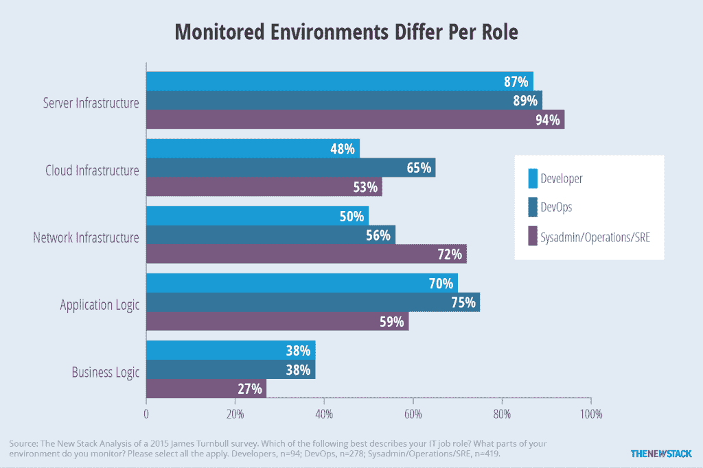

# 重新思考集装箱作业的监控

> 原文：<https://thenewstack.io/monitoring-reset-containers/>

编者按:文章修改于 2017 年 1 月 26 日。删除了以“传统监测方法”开始的段落。

监控并不是一个新概念，但是对于需要监控的系统和负责监控的团队来说，已经发生了很多变化。过去，监控就像检查计算机是否仍在运行一样简单。[cobe . io](https://twitter.com/cobecto)的首席技术官戴夫·查理斯记得监控是产品附带的简单仪器。

正如 [James Turnbull](https://twitter.com/kartar) 在“[监控的艺术](https://www.artofmonitoring.com/)”中解释的那样，大多数小型组织没有自动化监控，而是专注于最大限度地减少停机时间和管理物理资产。在实际拥有 IT 人员的公司，运营团队使用简单的工具来检查磁盘、中央处理器(CPU)和内存使用情况，但主要侧重于处理与可用性相关的紧急情况。大型组织最终用利用仪表板的自动化监控系统取代了手动方法。所有这些组织的共同点是，能够读取和接收指标意味着服务是可操作的。

即使没有引入容器，最近的思想领袖也主张监控应该更主动地寻找提高性能的方法。为了更好地了解监控环境，我们回顾了 Turnbull 在 2015 年进行的一项调查。尽管这是已经倾向于关心监控的人的快照，但它提供了许多相关的见解:

[![Survey ResultsAnalysis Nagios was the most widely used tool, followed by Amazon CloudWatch and New Relic. A second tier of products included Incinga, Sensu, Zabbix, Datadog, Riemann and Microsoft System Center Operations Manager. The data confirms a conventional approach, with Nagios used for monitoring infrastructure and New Relic used for application performance monitoring. Since the survey was conducted, we expect that Datadog and AWS CloudWatch usage has increased. Server infrastructure was monitored by 81 percent of the respondents. Cloud infrastructure, network infrastructure, and applications were monitored less often. Although DevOps practitioners care about infrastructure, they will not use the same metrics as those valued by traditional IT operations teams. collectd, StatsD and New Relic were the most common products used to collect metrics. That data is being stored most often with Graphite. Although used less often, time series databases InfluxDB and OpenTSDB were also represented in the study. We expect that container-related agents like Sysdig will show up more often. New monitoring tools like Prometheus have a custom-built time series database at their core. Grafana was most used for visualization, followed by Graphite. Notably absent from the list is Kibana, which is a commonly used part of the ELK Stack, now called Elastic Stack by its corporate parent.](img/f4b16e3bb1dfe1cff3506209aa100e65.png)](https://thenewstack.io/monitoring-reset-containers/analysiscirca2015/)

表 1:与常用的 Nagios 和 Graphite 应用相比，新的监控解决方案更具优势(点击放大)。

对监控所需时间和精力的预期正在发生变化。随着当前自动化系统的普及，用户通常希望减少设置监控工具和试图在堆栈中找到问题所需的时间。虽然监控可能总是相对耗时，但有一些方法可以改善整体体验。

## 容器有什么不同

为了理解如何监控容器及其相关的基础设施，您需要理解容器的不同之处。集装箱化环境的某些方面改变了以前建立的监控实践和传统监控解决方案的效率。了解这些变化将有助于解释供应商如何转变以创建新产品来应对不断变化的指标和参与监控的新的、多样化的用户团队。容器带来的监控变化可以从五个方面来解释:

1.  容器短暂的本质。
2.  要跟踪的对象、服务和指标的激增。
3.  服务是监控的新焦点。
4.  更加多样化的监控最终用户群体。
5.  新的思维方式产生了新的方法。

## 容器的短暂性和规模

云原生架构已经提出了新的挑战。容器和虚拟机实例的临时性质提出了跟踪挑战。由于容器一起操作来提供微服务，它们实际上是一个分布式系统。虽然分布式系统在较大范围内不一定是暂时的，但它们需要以许多移动部件为目标。这需要新的监测方法来观察他们的健康状况。由于它们短暂的性质和不断增长的规模，跟踪单个容器的健康状况是没有意义的；相反，您应该跟踪容器和服务的集群。

[cyclone slider id = " ebook-5-赞助商"]

过去，人们会查看服务器以确保它正在运行。他们会查看 CPU 利用率和分配的内存，并跟踪 I/O 操作的网络瓶颈。IT 操作员将能够知道机器在哪里，并且能够容易地做两件事情中的一件。

首先，他们可以将仪器指向特定位置并收集数据。在监控语言中，这被称为轮询机器。或者，可以在服务器上安装代理，然后将数据推送到监控工具。这种推送方法之所以流行，是因为容器和虚拟实例的短暂性使得工具很难找到和轮询它们。它还减少了对应用程序的入侵或污染。这种监控方法受益于容器的关键可观察性特征，并使解决方案能够高效、无缝地运行，而不会干扰容器的执行。

## 要跟踪的对象、服务和指标激增

生成的数据爆炸是一个众所周知的现象。十年前，人们关心的是如何存储所有这些数据。最近，人们开始关注如何在不存储所有数据的情况下最好地利用这些数据。随着物联网(IoT)传感器的兴起和容器的采用，现在要监控的对象比以往任何时候都多。虽然有一种本能试图将所有这些对象纳入一个监控系统，但其他人正在尝试确定更具可操作性和更容易跟踪的新测量单位。

需要跟踪的大量数据点、指标和对象是一个严重的问题。流数据为实时分析提供了许多机会，但它仍然需要处理和存储。有一些技术解决方案可以处理这种规模，但在财务和性能方面的成本都很高。虽然 NoSQL 和其他下一代数据库已经在 IT 生态系统中确立了自己的地位，但它们并没有针对这种使用情形进行优化；时序数据库是一种潜在的存储解决方案。然而，公司不能只是无限期地存储他们的日志数据；许多数据从未被使用过。一些较旧的日志文件从未被查看过，这促使用户减少对日志管理工具的关注，而更多地关注指标，即汇总或定期收集的数据。

容器在数据激增方面存在两个问题。与传统堆栈相比，每台主机有更多的容器需要监控，每台主机的指标数量也有所增加。正如软件监控公司 CoScale 的首席执行官 Stijn Polfliet 所描述的，传统上每台主机有 150 个指标需要跟踪:100 个关于操作系统，50 个关于应用程序。对于容器，您将为主机上的每个容器和每个编排器添加额外的 50 个指标。考虑一个场景，其中一个集群在两个底层主机上运行 100 个容器，需要跟踪超过 10，000 个指标。

表 2:容器意味着比传统堆栈更多的指标(点击放大)。

“指标通常是按时间间隔汇总的，这牺牲了有关单个事件的宝贵细节，以换取廉价的存储。大多数公司都淹没在指标中，其中大多数再也不会被关注，”[写道](https://honeycomb.io/blog/2016/10/why-honeycomb--black-swans-unknown-unknowns-and-the-glorious-future-of-doom/)工程师[慈善专业](https://twitter.com/mipsytipsy)，他是[蜂巢](https://honeycomb.io/blog/)的联合创始人，这是一家专注于监控软件的初创公司。"没有上下文，你无法追踪复杂的交叉根本原因，度量标准也缺乏上下文."

尽管度量解决了许多运营问题，但是仍然有太多的问题，并且只有在实际使用时才有用。

## 服务是新的焦点

随着对实际需要监控的内容的重新关注，有三个焦点领域:容器集群的健康状况；微服务；和应用程序。

评估容器群(而不是单个容器)是基础设施经理了解服务将产生的影响的更好方式。虽然应用程序经理确实可以终止和重启单个容器，但他们更感兴趣的是了解哪些集群是健康的。有了这些信息，他们就可以将群集部署到不同的基础架构，或者添加额外的资源来支持其最佳运行。容器编排解决方案通过允许在主机集群上高效调度容器来提供帮助。

许多微服务是由多个容器组成的。一个常见的例子是由五个不同容器组成的微服务，每个容器运行不同的进程。如果一个倒下了，另一个会在它的位置上出现。然而，如果这种失败是一种长期的持续模式，那么服务质量将会下降。将微服务视为一个单元可以让您深入了解整个应用程序的运行情况。

[cyclone slider id = " ebook-5-赞助商"]

据 [Dynatrace](https://www.dynatrace.com/) 云技术负责人 [Alois Mayr](https://twitter.com/mayralois) 在[对新堆栈的采访](https://thenewstack.io/consider-making-shift-toward-multi-cloud/)中称，在考虑应用程序监控时，“你最感兴趣的是运行在容器内部的服务，而不是容器本身。这种以应用程序为中心的信息确保了组件容器所服务的应用程序是健康的。”不是只看 CPU 利用率，而是要看基于特定应用或服务的 CPU 时间；通过查看数据库查询以及吞吐量和响应时间来监控服务的运行效率；并跟踪跨容器和主机的微服务之间的通信。

## 更加多样化的监控最终用户群体

关注监控应用而不仅仅是基础设施有两个原因。首先，一群新的人参与到监控中。其次，应用程序与整体业务绩效更相关。

尽管近年来取得了进展，但监测总体上仍然是被动的。它专注于管理实际基础架构的 It 团队的目标。这种心态对开发人员不利，因为他们通常从二手资料中获取数据。一旦应用程序投入生产，开发者就越来越需要对其负责。正如[托德·德克帕](https://twitter.com/appperfeng)和[谢恩·埃文斯的](https://twitter.com/ShaneEvansLR) [有效性能工程](http://www.effectiveperformanceengineering.com/get-the-book/)所指出的，开发人员被要求“交付最高质量和性能的产品，并提供持续的反馈和优化建议，以便其他团队能够以全自动的方式快速交付。”DevOps 运动的兴起，至少在某种程度上，是对开发人员希望在整个应用程序生命周期中增加可见性的响应。现在，DevOps 角色通常是应用程序的完整堆栈管理者和操作员。

不同的角色关注监控过程的不同部分。我们对前面提到的 Turnbull 对关注监控的 IT 专业人员的调查分析表明，除了服务器之外，他们的兴趣领域也有很大差异。数据显示了开发人员和开发人员角色之间的差异。

根据调查，48%的开发人员监控云基础架构，这大大低于 DevOps 角色报告的 65%。最大的区别在于 DevOps 和其他 IT 人员之间。数据显示，72%的系统管理员和 IT 运营人员负责监控网络基础设施，比开发人员和开发运维团队高出约 20 个百分点。另一方面，70%的开发人员和 75%的开发运维人员负责监控应用程序逻辑，相比之下，只有 59%的 IT 运维人员负责监控。

图 1:与专注于 IT 运营的同事相比，DevOps 角色更关心监控云基础架构(65%)和应用程序逻辑(75%)。

DevOps 角色对应用程序的关注程度不亚于对基础架构的关注程度，但他们更关注性能而非可用性。

正如特恩布尔在“[监控的艺术](https://www.artofmonitoring.com/)”中写道:

*“将您的关注点放在可用性而不是质量和服务上，将 IT 资产视为纯粹的资本和运营支出。它们不是提供价值的资产，它们只是需要管理的资产。将 IT 视为成本中心的组织往往乐于限制或削减预算、外包服务，并且不投资新项目，因为他们只看到成本，而看不到价值。”*

幸运的是，在过去几年中，我们已经看到了一种趋势，即 IT 不再是成本中心，而是收入中心。对性能的日益关注涉及到 IT 和业务本身。就 IT 而言，存储或 CPU 资源的利用率是相关的，因为它们有相关的成本。从业务本身的角度来看，IT 过去只关心可用性和平均解决时间(MTTR)。虽然可用性和可解决性仍然很重要，但面向客户的新指标也很重要。

与开发运维一起，现场可靠性工程(SRE)的实践将影响监控工具的使用方式。从这个角度来看，监控仍将主要由运营团队管理，但确保新应用程序和服务受到监控的责任可能会委托给应用程序开发人员。

[云分析公司 Netsil 的联合创始人 Shariq Rizvi](https://twitter.com/shariqrizvi) 在接受 New Stack 采访时表示，SREs 和 DevOps 的工程师与软件工程师不同。他认为 SRE 团队应该将服务的管理分开，从而创造更多的专业化。[服务智能软件提供商](https://twitter.com/dturchin) [Neva](https://twitter.com/neva_ai) 的联合创始人兼首席产品官丹·图尔钦在接受 New Stack 采访时表示，他认为 DevOps 的职位正在取代网络运营中心(NOC)的工程师，这些工程师传统上是从数据中心的角度来看待问题的。如果老派的网络统计正在被云基础设施指标所取代，那么这可能是真的。

市场正在对这种变化做出反应。 [Sysdig](https://sysdig.com/) 在其监控软件中增加了 [teams](https://sysdig.com/blog/introducing-sysdig-teams/) 功能，管理员可以根据团队对仪表盘、警报和数据的需求来控制对团队的访问，如其编排系统所定义的那样。虽然这可能会解决安全问题，但主要的监控好处是它简化了被审查的数据的范围，从而让人们专注于他们履行职责所需的数据。基于角色的监控的另一个例子是在 [Kubernetes](/category/kubernetes/) 容器编排引擎的世界中，该项目根据应用程序开发人员、应用程序操作人员和集群操作人员的不同需求重新设计了它的仪表板。

## 新思维，新方法

虽然监控正在改变以满足不同工作角色的需求，但它也正在转向更全面的方法。正如 Majors [在她的博客](https://honeycomb.io/blog/2016/10/why-honeycomb--black-swans-unknown-unknowns-and-the-glorious-future-of-doom/)中所写的，人们不应该依赖于一套固定的问题和检查，而应该朝着她所说的系统的“可观察性”前进。出现这种情况的原因是，这些固定的数据点无法单独提供所需的洞察力。需要新的工具来跟上步伐，并提供预测什么将会崩溃的能力。这些工具中有许多使用了人工智能技术。

可观察性认识到测试并不总是能识别问题。因此，梅杰斯认为“测试和单元测试一样重要。运行复杂的系统意味着你不能在头脑中对整个事情建模。”除了仪器的变化，她建议集中精力使监测系统始终可以理解。这意味着实际定义数据所代表的内容，并使用与组织内外的同行相同的定义。此外，还存在滚动浏览多个静态仪表板的需求。作为回应，供应商正在制造更直观、更具交互性的仪表板。公司甚至使用人工智能来确定每项服务的信息显示时间。

## 应对新现实的方法

提高自动化和预测能力是应对新的监控挑战的常用方法。

自动化程度的提高以减少部署和运行监控解决方案所需的时间为中心。据软件监控公司 [Dataloop 的创始人兼首席技术官](https://www.dataloop.io/) [Steven Acreman](https://www.linkedin.com/in/stevenacreman/) 称。IO ，在与新堆栈的访谈中，组织越大，就越有可能需要定制的解决方案来收集和集成来自所有输入和应用的数据。供应商正试图减少设置过程中所需的步骤。这可能意味着一旦主机上安装了监控代理，您就不必考虑它了。更有可能的是，这意味着工具能够自动发现新的应用程序或容器。

您还希望自动化您对问题的响应方式。目前，自动化某些任务和将人类完全排除在外的自动化是有区别的。监控系统继续创建自动警报，但现在警报更加复杂。正如 Turnbull 在他的[书](https://www.artofmonitoring.com/)中所说的，警报将被标注上上下文和升级建议。系统可以减少不重要警报的数量，从而减轻警报疲劳，增加重要警报得到处理的可能性。目前，重点是让警报变得更加智能。因此，当有人收到警报时，他们会看到最有可能识别问题的相关显示。目前，对于一个人来说，在逐个案例的基础上查看数据和处理情况更快、更有效。

自动化容器部署过程还与您如何监控它有关。能够跟踪由您的配置管理生成的设置是很重要的。这就是容器编排器可以提供帮助的地方。Kubernetes、Mesos 和 Cloud Foundry 都支持自动扩展。

正如自动缩放可以节省时间一样，自动识别模式也可以节省时间。[大熊猫](https://bigpanda.io/)，CoScale， [Dynatrace](https://www.dynatrace.com/) ， [Elastic Prelert](https://www.elastic.co/what-is/elasticsearch-machine-learning) ， [IBM Bluemix](https://www.ibm.com/cloud-computing/bluemix/) ， [Netsil](http://netsil.com/) 和 [SignalFx](https://signalfx.com/) 只是使用人工智能来识别模式和检测异常的公司中的少数几家。一个常见的结果是，旧的监控方法产生的大部分噪声被抑制了。CoScale 的 Peter Arijs 在接受新堆栈采访时表示，异常检测意味着您不必过多关注仪表盘。该系统应该通过识别不同服务、应用程序和基础设施的行为模式来提供早期预警。

Dynatrace 还使用人工智能来查看关闭的服务或应用程序，以确定问题的根本原因。查看受影响的服务，它会自动测量该服务的比较基准，不同的微服务具有不同的阈值。如果超过了阈值，则监控系统的用户要么得到警告，要么在仪表板中得到可能的解决方案。

## 寻找最相关的指标

可以跟踪的容器相关指标的数量急剧增加。由于系统更加复杂和分离，为了理解整个系统，需要跟踪更多的东西。这极大地改变了人们监控和排除系统故障的方法。传统上，主机的可用性和利用率是根据 CPU、内存、I/O 和网络流量来衡量的。尽管这些对于管理 IT 基础设施仍然很重要，但它们并没有为评估收集哪些指标提供最佳的参考框架。

虽然在这个 IT 环境中有许多不同的层次，但是服务是一个关键的观察单位。服务健康和性能与应用程序性能直接相关。服务可以用通用名称来定义，它们的运行状况和性能随着时间的推移而进行基准测试。可以跨集群跟踪服务，包括在容器中运行的微服务。观察服务集群类似于查看应用程序的组件。

谷歌关于[网站可靠性工程](https://www.amazon.com/Site-Reliability-Engineering-Production-Systems/dp/149192912X/)的书声称，在衡量服务的健康和性能时，有四个关键信号要看:延迟、流量、错误和饱和度。延迟描述了处理请求所需的时间。在一个容器中，观察 API 调用的处理速度会很有帮助。流量和错误通常都被跟踪，并且涉及服务的通信和联网以及错误的频率。饱和度描述了服务的“充分”程度，并强调了最受限制的资源。因为服务性能随着接近高饱和度而降低，所以它成为测量系统利用率的更流行的方法。

[cyclone slider id = " ebook-5-赞助商"]

使用这个观点，我们可以看到在整个 IT 环境中什么类型的指标是最重要的。关于容器的信息本身并不是目的。相反，容器活动与跟踪基础设施利用率以及应用程序和基础设施的性能相关。关于容器内请求的饱和度和延迟的度量是最相关的。关于单个容器的健康状况的度量将继续是相关的。然而，就管理容器而言，测量容器集群的健康状况将变得更加重要。

重要的是要记住，您不仅仅是在监控容器，还在监控它们运行的主机。主机 CPU 和内存的利用率水平有助于优化资源。正如 [Sematext](https://thenewstack.io/sematext-monitoring-logs-together/) DevOps 布道者[斯蒂芬·提斯](https://twitter.com/seti321) [所写的](https://sematext.com/blog/2016/06/28/top-docker-metrics-to-watch/)，“当资源使用被优化时，高 CPU 利用率实际上可能是预期的，甚至是期望的，并且警报可能只有在 CPU 利用率下降(服务中断)或增长超过某个最大限制(例如，85[百分比])的较长时间时才有意义。”

过去，可以根据主机上运行的应用程序数量来对主机性能进行基准测试。如果环境不是动态的，虚拟实例上下旋转，那么就有可能计算运行的容器数量，并将其与历史性能进行比较。唉，在动态环境中，集群管理器自动调度工作负载，所以这种方法是不可能的。相反，观察更大的 IT 环境中的异常正在成为检测问题的一种方式。

[![ Questions Sample Metrics Microservice In general, there is one process to track per container. · Where are new services deployed? · What percentage of time is the service reachable? · How many requests are enqueued? · Average percentage of time a request-servicing thread is busy. · Number of enqueued requests. · Percentage of time a service is reachable. Application Multiple microservices running simultaneously constitute an application. · Do the databases respond quickly? · Are the message queues fast enough? · How does heap memory usage change over time? · Are my application services responsive? · Query execution frequency, response time and failure rate. · Response time, failure rate. Container Separate from the underlying process being run within it, containers are also monitored. · How responsive are the processes within the container? · Which images have been deployed? · Are specific containers associated with over-utilization of hosts? · CPU throttle time. · Container disk I/O. · Memory usage. · Network (volume, dropped packets). Container Cluster Multiple containers deployed to run as a group. Many of the metrics for individual containers can also be summarized. · Are your clusters healthy and properly sized? · Can applications be effectively run using fewer nodes? · Percentage of clusters remaining operational compared to those originally deployed. Host Also called a node, multiple hosts can support a cluster of containers. · Do changes in utilization indicate a problem with a process or application? · Percentage of total memory capacity in use. · Percentage of time CPUs are utilized. Infrastructure Broadly speaking, this is the cloud in which the hosts are running. · How much does it cost to run each service or deployment? · What is the ratio of microservices and/or containers per instance? · Network traffic. · Utilization of databases, storage, and other shared services. End User The end goal of the entire system is to serve this group. · What is the average web response time experienced by users per region? · Response time. · Number and percentage of user actions that failed.](img/3811b8463c6029d757e1b8d93df2fe18.png)](https://thenewstack.io/monitoring-reset-containers/questions-to-ask/)

表 3:在监控基于微服务的应用时，饱和度和延迟相关指标最为重要。仪表板和警报不应该关注单个的服务和容器，而应该关注它们的总体操作。

## 下一步？

IT 监控中最大的变化是涉及的新团队和他们使用的新指标。IT 运营仍然关心可用性和成本优化。DevOps 和应用程序开发人员关注服务的性能。每个人，尤其是首席信息官，都关心对业务运营和客户互动的影响。

当然，还有新的指标需要监控。我们的文章"[用于监控容器的工具和过程](https://thenewstack.io/identifying-collecting-container-data/) *"* 概述了如何收集这些数据。所有这些指标都可以通过不同的方式收集。另一篇 TNS 文章"[容器监控的类别](https://thenewstack.io/classes-container-monitoring/) *"* 详细介绍了有效监控堆栈的不同组件。从收集到记录到可视化，监控容器和微服务面临独特的技术挑战。当读者查看后续步骤时，“[合适的工作工具:选择监控解决方案](https://thenewstack.io/right-tool-job-picking-monitoring-solution/)*”*提供了需要考虑的重要标准。

<svg xmlns:xlink="http://www.w3.org/1999/xlink" viewBox="0 0 68 31" version="1.1"><title>Group</title> <desc>Created with Sketch.</desc></svg>