# 用 InfluxDB 监控 Ruby on Rails

> 原文：<https://thenewstack.io/monitoring-ruby-on-rails-with-influxdb/>

像 InfluxDB 这样的时间序列数据库是专门处理[时间序列数据](https://www.influxdata.com/what-is-time-series-data/?utm_source=vendor&utm_medium=referral&utm_campaign=2022-05_spnsr-ctn_ruby-and-influxdb_tns)的数据库，时间序列数据是按时间索引的数据。与传统数据库不同，[时序数据库](https://www.influxdata.com/time-series-database/?utm_source=vendor&utm_medium=referral&utm_campaign=2022-05_spnsr-ctn_ruby-and-influxdb_tns)针对读写数据进行了优化，较少考虑更新或删除数据的性能。

 [阿尼基特·巴塔查里亚

Aniket 是一名正在攻读数学硕士学位的学生，对计算机和软件充满热情。他喜欢探索与编码相关的各种领域，是一名使用 Ruby on Rails 和 Vue.JS 的 web 开发人员。](https://www.linkedin.com/in/heraldofsolace/?originalSubdomain=in) 

由于时间序列数据的时间依赖性，时间序列数据库对于应用程序监控非常方便。如果你有一个 [Ruby on Rails](https://rubyonrails.org) 应用程序，监控应用程序的性能以确保它平稳运行是至关重要的。

使用时序数据库，您可以存储来自应用程序的指标，如处理的请求数、消耗的内存量和生成响应所需的时间。在本文中，您将了解如何使用 InfluxDB 来监控 Ruby on Rails 应用程序。

如果你想克隆这个项目并在你自己的编辑器中跟随，这里有到 [GitHub repo](https://github.com/heraldofsolace/InfluxDB-Rails-Demo) 的链接。

## 先决条件

要跟随本教程，您需要以下内容:

1.  [Docker](https://www.docker.com/) 安装并设置在你的电脑上。您将需要 Docker 来运行 InfluxDB 服务器。或者，如果你不想在你的电脑上安装任何东西，你可以使用 [InfluxDB Cloud](https://www.influxdata.com/products/influxdb-cloud/?utm_source=vendor&utm_medium=referral&utm_campaign=2022-05_spnsr-ctn_ruby-and-influxdb_tns) 来获得一个 InfluxDB 的免费运行实例。
2.  安装在你电脑上的最新版本的 Ruby on Rails。你可以运行`rails -v`来检查 Rails 是否安装正确。

## 设置 InfluxDB

在本文中，您将使用 Docker 运行一个本地 InfluxDB 实例。首先，使用以下命令启动 InfluxDB 容器:

```
bash

docker run  --name influxdb  -d  -p  8086:8086  influxdb:2.1.1

```

在浏览器中访问`http://localhost:8086`,进入 InfluxDB 欢迎屏幕。您需要提供用户名和密码，并创建一个新的组织和存储桶。

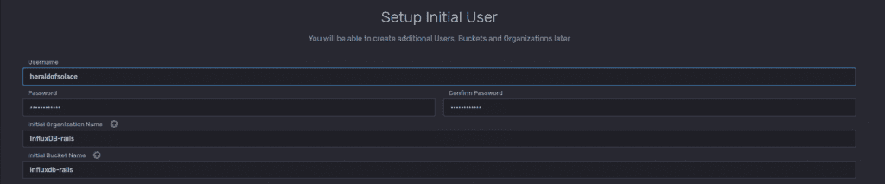

点击“**稍后配置**进入仪表板。

在左侧栏中，您会看到一个名为“**数据**的菜单项单击它并选择“ **API 令牌**”选项卡。在那里，您会发现一个由 InfluxDB 创建的默认令牌。将这个令牌保存在安全的地方，以便在本教程的后面部分可以再次访问它。

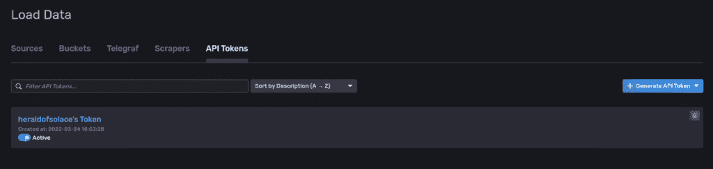

## 设置 Rails 应用程序

接下来你需要用`rails new`命令创建一个新的 Rails 应用程序:

```
bash

rails new influxdb-demo

```

然后进入`influxdb-demo`目录:

请注意，这个应用程序使用 SQLite 数据库，因为这只是出于演示目的，但你也可以使用 [PostgreSQL 或 MySQL](https://guides.rubyonrails.org/configuring.html#configuring-a-database) 。

接下来，您需要用`rails db:create`命令:
创建数据库

由于您将在应用程序中检测数据库交互，您需要一些与数据库交互的东西。您可以使用 Rails 的 scaffold 特性快速生成一个全功能的 CRUD API，而无需编写一行代码:

```
bash

rails  g  scaffold post title:text body:text

```

这将生成一个`Post`模型，具有`title`和`body`属性以及必要的 CRUD 端点。

通过运行`rails db:migrate`来迁移数据库。

InfluxDB 有一个 [influxdb-rails](https://github.com/influxdata/influxdb-rails) gem，可以自动检测 rails 应用程序，但是在撰写本文时它还不支持 InfluxDB 2.0，所以您将使用 [influxdb-client](https://github.com/influxdata/influxdb-client-ruby) gem。打开`Gemfile`并添加下面一行:

```
ruby

gem  "influxdb-client",  "~> 2.3.0"

```

然后运行`bundle install`安装 gem。

## 设置仪器

您可能想知道，“我到底如何从 Rails 应用程序中收集指标？”令人欣慰的是，和 Rails 中的其他东西一样，仪器也是内置的。[Active Support Instrumentation API](https://guides.rubyonrails.org/active_support_instrumentation.html)为您提供了无数的动作控制器、活动存储、动作邮件程序、活动记录、动作视图和其他您可以订阅的事件。它还为您提供了检测自定义事件的能力。

要订阅一个事件，您需要使用`ActiveSupport::Notifications.subscribe`和一个在事件被触发时被调用的块。该块接收事件的名称、开始和结束时间、触发该事件的仪器的唯一 ID 以及包含取决于该事件的不同信息的有效载荷。例如，下面的代码订阅了`process_action.action_controller`事件，每当 Rails 应用程序处理请求时都会触发该事件:

```
ruby

ActiveSupport::Notifications.subscribe  "process_action.action_controller"  do  |name,  started,  finished,  unique_id,  data|
Rails.logger.info  "#{name} Received! (started: #{started}, finished: #{finished})"

end

```

在本文中，您将订阅以下事件，但是您可以添加任意多个事件:

1.  `process_action.action_controller`:处理请求时触发
2.  `render_template.action_view`:渲染模板时触发
3.  `sql.active_record`:执行 SQL 查询时触发
4.  `instantiation.active_record`:实例化一个或多个活动记录对象时触发

创建一个新的`config/initializers/influxdb.rb`文件，您最终将在其中添加逻辑。

现在，您需要通过实现以下代码实例化一个 InfluxDB 客户端:

```
ruby

client  =  InfluxDB2::Client.new(
 'http://localhost:8086',
 'YOUR_TOKEN',
 bucket:  'YOUR_BUCKET',
 org:  'YOUR_ORGANIZATION',
 precision:  InfluxDB2::WritePrecision::NANOSECOND,
 use_ssl:  false
)
write_api  =  client.create_write_api

```

用从 InfluxDB 获得的令牌替换`YOUR_TOKEN`，用存储桶名称替换`YOUR_BUCKET`，用组织名称替换`YOUR_ORGANIZATION`。如果您使用的是云帐户，您还需要将本地主机 URL 替换为您的云区域 URL。

现在，我们需要订阅第一个事件。以下代码设置订阅:

```
ruby

ActiveSupport::Notifications.subscribe  "process_action.action_controller"  do  |name,  started,  finished,  unique_id,  data|
# Send data to influxdb

end

```

在块内，您需要设置数据点以发送到 InfluxDB。你可以使用四种数据格式。这里，您将使用一个散列:

```
ruby
ActiveSupport::Notifications.subscribe  "process_action.action_controller"  do  |name,  started,  finished,  unique_id,  data|
 hash  =  {
      name:  "process_action.action_controller",
      tags:  {
 method:  "#{data[:controller]}##{data[:action]}",
 format:  data[:format],
 http_method:  data[:method],
 status:  data[:status],
 exception:  data[:exception]&.first
      },
      fields:  {
 time_in_controller:  (finished  -  started)  *  1000,
 time_in_view:  (data[:view_runtime]  ||  0).ceil,
 time_in_db:  (data[:db_runtime]  ||  0).ceil,
      },
      time:  started
      }
      write_api.write(data:  hash)
end

```

在上面的代码中，`name`键表示测量的名称，它被设置为事件的名称。`tags`键设置[标签](https://docs.influxdata.com/influxdb/v2.1/reference/key-concepts/data-elements/#tags)。

在代码中，使用了五个标记:

1.  被调用的 Ruby 方法。这将是处理请求的控制器类的一个方法。
2.  请求的格式(html/json/xml)。
3.  HTTP 方法(GET、POST、PUT 等。)的请求。
4.  响应的 HTTP 状态代码。
5.  发生的异常(如果有)。

`fields`键保存用于测量的[字段](https://docs.influxdata.com/influxdb/v2.1/reference/key-concepts/data-elements/#fields)，使用以下三个字段:

1.  处理请求所花费的总时间(以毫秒计)。
2.  呈现视图所花费的总时间(毫秒)。
3.  查询数据库所花费的总时间(毫秒)。

最后，`time`键用于设置数据的时间戳。该键的值是事件被触发的时间。

一旦设置了数据点，`write_api.write`用于将数据写入 InfluxDB。

第二个订阅是针对`render_template.action_view`事件:

```
ruby

ActiveSupport::Notifications.subscribe  "render_template.action_view"  do  |name,  started,  finished,  unique_id,  data|
 hash  =  {
      name:  "render_template.action_view",
      tags:  {
 identifier:  data[:identifier],
 layout:  data[:layout],
 exception:  data[:exception]&.first
      },
 fields:  {
 duration:  (finished  -  started)  *  1000
      },
      time:  started
      }
      write_api.write(data:  hash)

end

```

这次唯一的区别在于`tags`和`fields`键。`identifier`标签告诉我们呈现了哪个模板，而`layout`标签告诉我们应用了哪个布局。`duration`字段表示渲染模板花费了多长时间(毫秒)。

第三个订阅是针对`sql.active_record`事件:

```
ruby

ActiveSupport::Notifications.subscribe  "sql.active_record"  do  |name,  started,  finished,  unique_id,  data|
 hash  =  {
      name:  "sql.active_record",
      tags:  {
 name:  data[:name],
 statement_name:  data[:statement_name],
 exception:  data[:exception]&.first
      },
      fields:  {
      duration:  (finished  -  started)  *  1000
      },
      time:  started
 }
 write_api.write(data:  hash)

end

```

这里，`name`标签保存操作的名称，`statement_name`标签保存 SQL 语句的名称。`duration`字段计算查询执行的时间(以毫秒为单位)。

最终订阅的是`instantiation.active_record`字段:

```
ruby

ActiveSupport::Notifications.subscribe  "instantiation.active_record"  do  |name,  started,  finished,  unique_id,  data|
 hash  =  {
      name:  "instantiation.active_record",
      tags:  {
 class_name:  data[:class_name],
 exception:  data[:exception]&.first
      },
      fields:  {
 duration:  (finished  -  started)  *  1000,
 record_count:  data[:record_count]
      },
      time:  started
 }
write_api.write(data:  hash)

end

```

`class_name`标签表示被实例化的活动记录对象的类名。`duration`字段表示实例化对象花费的时间(以毫秒为单位),而`record_count`字段表示实例化了多少条记录。

这就是设置！现在，您可以开始使用该应用程序来生成指标。

## 生成指标

一旦设置好工具，就该使用应用程序生成一些指标了。通过运行`rails s`并访问`http://localhost:3000/posts`来启动 Rails 服务器。你会看到文章索引页面:

点击`New post`创建新帖子。

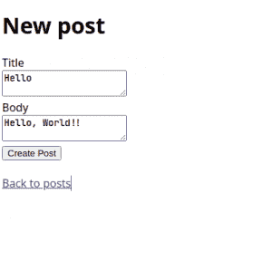输入标题和正文，点击**创建文章**

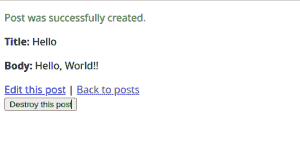点击`Back to posts`返回帖子列表。

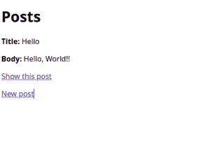点击任意帖子下的`Show this post`，在单独的页面上查看该帖子。

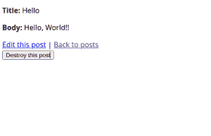点击`Edit this post`进行编辑，或点击`Destroy this post`进行删除。

现在你可以创建、编辑和删除任意多的帖子。满意后，返回 InfluxDB 仪表板以可视化数据。

## 可视化数据

在 InfluxDB 仪表板中，单击“ **Explore** ”选项卡。在这里，您将看到一个交互式查询构建器，它可以让您可视化您选择的数据。让我们从可视化创建一个帖子花费了多少时间开始。

首先，在选项卡的**中选择您的铲斗:**

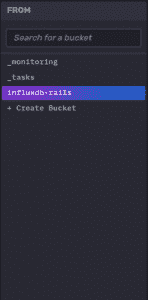

随后的选项卡将让您选择如何过滤数据。

确保在下一个选项卡中选择`_measurement`,并从列表中选择`process_action.action_controller`:

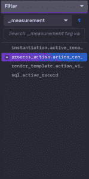

在下面的滤镜面板中选择`method`作为键，选择`PostController#create`作为标签:

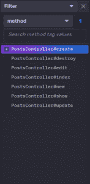

最后，在`_field`过滤器中选择三个字段:

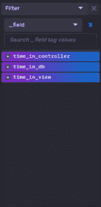

从右侧的下拉菜单中选择一个合适的时间范围(即“过去 15 分钟”)，然后点击“**提交”。**“你会看到一个闪亮的新数据图表:

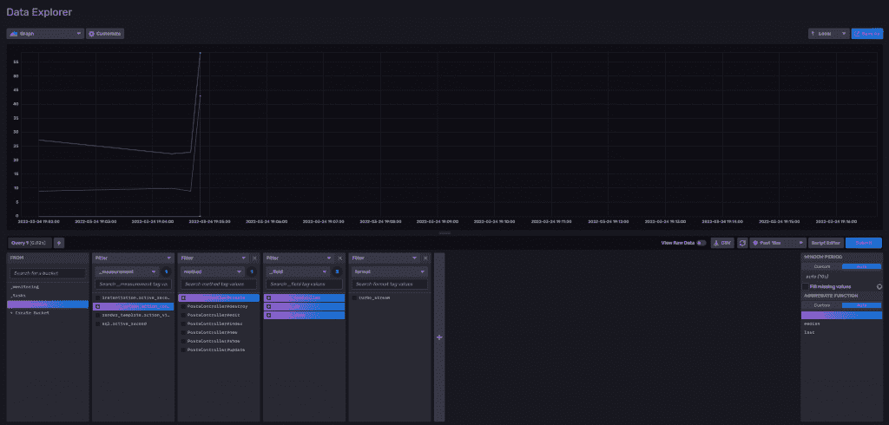

现在，让我们想象一下渲染视图所花费的时间。这一次，您将使用 [Flux](https://docs.influxdata.com/influxdb/v2.1/query-data/get-started/) 来查询数据。

点击“**脚本编辑器**，这将打开一个编辑器窗口，您可以在其中编写通量查询。然后粘贴以下查询:

```
from(bucket:  "influxdb-rails")
 |>  range(start:  -20m)
 |>  filter(fn:  (r)  =>  r["_measurement"]  ==  "render_template.action_view")
 |>  filter(fn:  (r)  =>  r["_field"]  ==  "duration")
 |>  aggregateWindow(every:  30s,  fn:  mean)

```

点击**提交**，你会看到数据以图形显示。

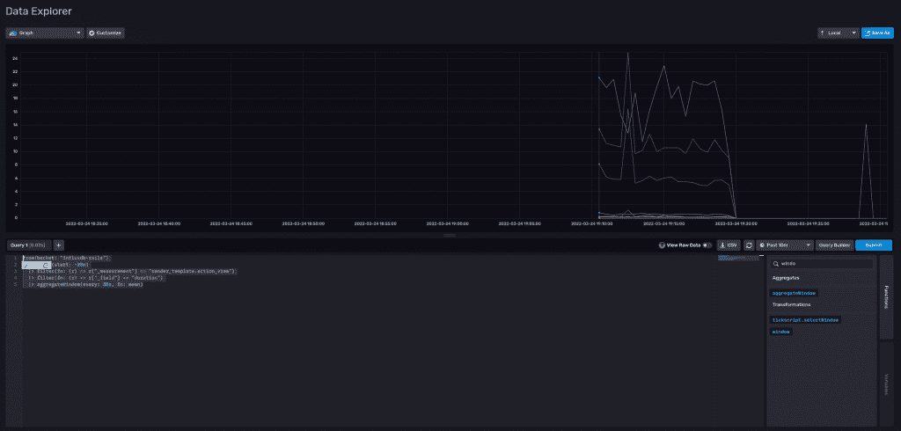

继续使用您收集的所有不同指标。

## 结论

InfluxDB 使得从 Ruby on Rails 应用程序中收集和可视化工具数据变得很容易。使用 active support instrumentation API，您可以从应用程序中收集不同的指标，并将它们存储在 InfluxDB 中。

本文只向您展示了一小部分可以收集的指标。您可以在这里找到[指标的完整列表。如果没有适合您需求的内置指标，您还可以创建自己的](https://guides.rubyonrails.org/active_support_instrumentation.html#rails-framework-hooks)[指标](https://guides.rubyonrails.org/active_support_instrumentation.html#creating-custom-events)。天空是无限的！

<svg xmlns:xlink="http://www.w3.org/1999/xlink" viewBox="0 0 68 31" version="1.1"><title>Group</title> <desc>Created with Sketch.</desc></svg>