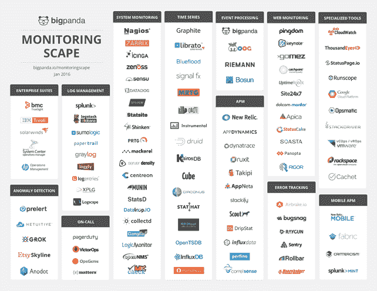

# 监控软件:市场界限模糊

> 原文：<https://thenewstack.io/monitoring-software-market-lines-blurry/>

谁是 IT 监控领域的市场领导者？你不会在这篇文章中找到那个问题的答案。

由于为多种受众提供了广泛的功能，我们的首要任务是明确谁想要什么。新的堆栈看到了两种矛盾的模式。许多公司都在尝试创建一整套监控服务，但也希望有一个可组合的基础设施。

我们相信这些趋势将会继续。基础设施和应用程序监控之间的界限将继续模糊，但特定于任务的工具将变得更加突出。也许这些变化如何展开的最大因素是使用监控软件的人的工作角色。

BigPanda 的[监控图](https://bigpanda.io/monitoringscape/)显示了不同监控市场参与者的功能细分，尽管有明显的重叠。

监控实际上是跟踪 KPI 和指标的一系列活动。在我们关于 Docker 和容器生态系统的第五本[电子书](https://thenewstack.io/ebookseries/)中，Prometheus 的联合创作者 [Brian Brazil](https://github.com/brian-brazil) 将这些活动组织成类，查看度量、日志管理以及像分布式跟踪这样的活动。

就指标而言，这里有几个包括以下内容的示例:

1.  集合( [StatsD](https://github.com/etsy/statsd) )
2.  摄入([阿帕奇卡夫卡](https://kafka.apache.org/))
3.  存储( [InfluxDB](https://www.influxdata.com/time-series-platform/influxdb/) )
4.  处理和报警([事件。穆格](https://www.moogsoft.com/product/)
5.  可视化( [Grafana](http://grafana.org/) )

添加日志管理和分析( [Splunk](http://www.splunk.com/en_us/products/splunk-enterprise.html) )和错误跟踪( [Sentry](https://sentry.io) )和追踪( [Lightstep](http://lightstep.com/) )。

利润动机以及满足客户需求的努力推动了全堆栈产品的发展。供应商自然会试图扩大他们在每个客户身上的钱包份额。

例如，New Relic 开始做应用性能管理(APM ),但现在[提供服务器和基础设施监控。](https://thenewstack.io/new-relic-adds-infrastructure-mobile-app-tracking/) [Datadog](https://www.datadoghq.com/) 从基础设施开始，现在提供 APM。同样，Splunk 已经从安全日志管理转向信息安全智能分析，现在正试图向整个企业销售。另一个例子是 Elastic，该公司正在出售 [Elastic Stack](https://www.elastic.co/v5) ，它将托管服务与企业警报和报告结合到其 X-Pack 中。

试图创建一个完整的堆栈并不意味着公司将试图货币化一切。例如， [InfluxData](https://influxdata.com) 有自己的 TICK 包(Telegraf、InfluxDB、Kapacitor、Chronograf)，但只计划通过许可和托管其时间序列数据库以及通过定制咨询来赚钱。这个模型假设人们想要创建一个可组合的架构，允许他们集成他们所有的系统和工具。

许多站点可靠性工程师(sre)和 DevOps 中的工程师想要创建他们自己的定制工具，但这并不意味着这就是市场的发展方向。事实上，许多其他监控工具的用户想要一个捆绑产品。

Docker 和 New Relic 是新堆栈的赞助商。

*通过像素的特征图像。*

*<svg xmlns:xlink="http://www.w3.org/1999/xlink" viewBox="0 0 68 31" version="1.1"><title>Group</title> <desc>Created with Sketch.</desc></svg>*