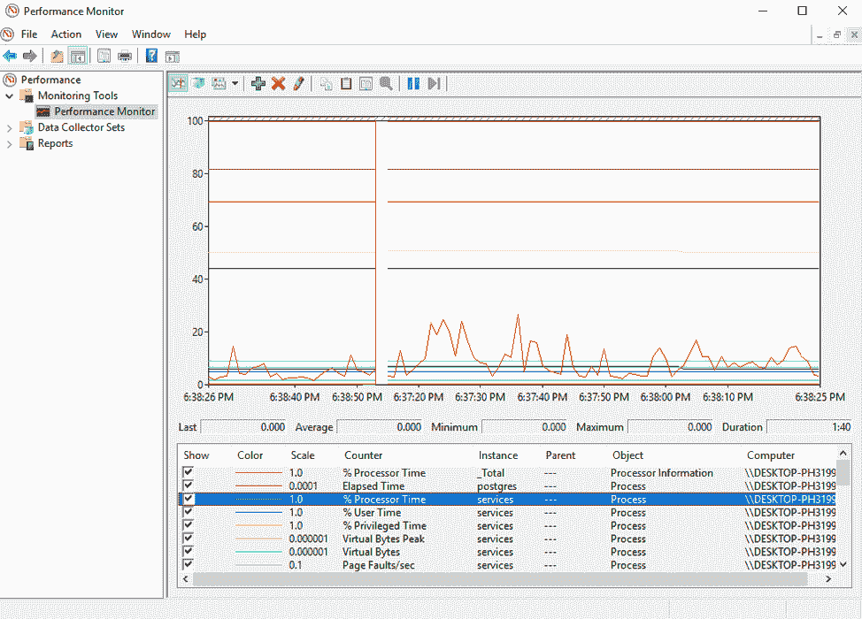

# 使用 Grafana、InfluxDB 和 Telegraf 监控 Windows 服务

> 原文：<https://thenewstack.io/monitoring-windows-services-with-grafana-influxdb-%e2%80%8eand-telegraf/>

[InfluxData](https://www.influxdata.com/) 赞助了这篇文章。

如果您是 Windows Server 管理员或 Windows 实例的超级用户，您可能已经体验过服务无缘无故关闭带来的巨大挫败感。


最糟糕的是，当你碰巧发现得太晚时，会给你的团队带来明显的无用成本。

本教程的目标是帮助你结束这种令人抓狂，但最终可以避免的资源浪费。此外，我们还展示了如何为 DevOps 工程师构建一个完整的堆栈来监控 Windows 服务，并在其中一项服务出现故障时获得警报。

## 你将学到什么

 [安托万·索尔尼金

Antoine 是卢森堡的一名经验丰富的软件工程师和有抱负的企业架构师。他每天都参与设计、开发和维护具有复杂需求的大型工业项目。他专门研究围绕消息传递模式构建的分布式系统，利用 Kafka 或 ActiveMQ 等工具来满足苛刻的业务需求。](https://www.influxdata.com/) 

在直接进入技术实现之前，如果您按照教程学习到最后，这里列出了您将要学习的所有内容:

*   掌握“经典”监控架构以及工具如何相互作用；
*   安装最先进的 DevOps 工具，如 Grafana v 6 . 1 . 4(2019 年发布)、InfluxDB v1.7.3 和 tele graf 1 . 10 . 3；
*   了解什么是性能计数器以及如何与性能监视器交互；
*   建立一个完整的仪表板，具有 Grafana 的最后功能，如仪表盘；
*   了解提醒如何与 Grafana 一起工作。

现在你已经知道了你将要获得的技能，让我们先快速介绍一下 Windows 机器上的性能计数器。

## 什么是性能计数器？

Windows 机器上的性能计数器是记录和监视机器上各种工具的数据的本机组件，这些工具包括:CPU、磁盘、进程、数据库(如果您正在运行一些工具，如 MySQL)甚至 ASP.NET 应用程序。

Windows 公开了一个任何工具都可以查询的 API，以便从性能计数器中检索统计信息。还为您提供了可视化工具来实时查看指标。可视化工具的一个例子是性能监视器，它直接安装在每台 Windows 机器上。


通过“开始”菜单访问性能监视器。

如果打开性能监视器，可以导航到左侧菜单中的监视工具>性能监视器。

在那里，通过单击绿色的 add 按钮，您将看到您的计算机上可用的一组高级指标。

可以将进程、物理磁盘、逻辑磁盘和数据库等指标添加到定期刷新的图表中。



低价 Grafana。

使用性能监视器已经是一种了解可以监视什么的好方法。在直接进入 Telegraf 之前，您可能想尝试一下性能监视器。

现在，您对性能计数器有了更多的了解，让我们来看看我们将如何构建我们的监控体系结构。

## 构建经典监控架构

在构建供个人使用的监控架构时，大多数情况下，您希望重新组合三个组件:

*   监控代理:它可以是 Telegraf、CollectD、StatsD、Datadog 或任何能够收集指标的工具；
*   一个时间序列数据库:在这种情况下，InfluxDB，但许多其他存在；
*   可视化工具:Grafana 或 Chronograf。


在这种情况下，Telegraf 将定期查询 Windows 性能计数器 API，并将结果发送到 InfluxDB。这些结果将可在 Grafana 访问和探索。


## 安装不同的工具

现在我们已经确切地知道了我们要构建什么，让我们安装我们需要的不同工具。

### 答:安装 InfluxDB

在配置任何监视代理之前，首先拥有一个时序数据库是很重要的。

在没有 InfluxDB 的情况下启动 Telegraf 会导致许多不太相关的错误消息。

安装 InfluxDB 非常简单，前往[下载页面](https://portal.influxdata.com/downloads/)并保存结果。在你电脑的某个地方压缩。

保存后，将内容解压缩到任何需要的地方，启动命令行并导航到存储二进制文件的文件夹(在我的例子中，直接在程序文件中)。在那里，您将看到几个文件:

*   exe:一个 CLI 可执行文件，用于在数据库和测量中轻松导航；
*   用于在您的计算机上启动 InfluxDB 实例；
*   exe:用于在您的计算机上运行压力测试的可执行文件；
*   influx_inspect:用于检查 InfluxDB 磁盘和碎片(与我们的例子无关)。

在我们的例子中，您希望运行 influxd 可执行文件。紧接着，您应该看到您的 InfluxDB 实例正在运行。


在 Windows 上启动 InfluxDB。

InfluxDB 还没有作为服务发布，即使在 Windows 上将其配置为用户定义的服务是完全可行的。

### b:安装电话

在 Windows 上安装 Telegraf 可能有点棘手。

要下载 Telegraf，请浏览 [InfluxDB 下载页面](https://portal.influxdata.com/downloads/)，点击最新版本的 Telegraf。

Telegraf 安装应在 Program Files 文件夹中完成，该文件夹名为 Telegraf。

以管理员身份启动 Powershell 实例。前往程序文件文件夹并运行:

删除这里下载的可执行文件，运行:

```
telegraf.exe  –service install

```

因此，Telegraf 应作为一项服务安装，并可在 Windows 服务中使用。Telegraf 配置文件应配置为从您的 CPU 和磁盘检索指标。要测试它，运行:

要检查它，请转到 InfluxDB 文件夹(您放置可执行文件的地方)并运行 influx.exe。

您应该会看到一个 CLI，在这里您可以输入您的第一个 IFQL 查询。

```
&gt;  show databases;
# You should see a list of your databases, including telegraf&gt; use telegraf;
# Navigating in your telegraf database&gt; show measurements;
# Getting the list of your measurements&gt; SELECT * FROM win_cpu
# Seeing your CPU metrics

```

如果你不熟悉 InfluxDB 的基础知识和 IFQL 是什么，请查看我的[初学者 InfluxDB 终极指南](http://devconnected.com/the-definitive-guide-to-influxdb-in-2019/)。它包含了关于你需要知道的一切的很好的解释。

### c:安装 Grafana

对于本教程，我们将使用全新的 Grafana v6。

前往 [Grafana 下载页面，](https://grafana.com/grafana/download?platform=windows) 下载 zip 文件并将其解压缩到您想要的位置。与使用 InfluxDB 类似，转到存储可执行文件的文件夹，运行 Grafana 服务器(grafana-server.exe 在 bin 文件夹中)。

默认情况下，Grafana 将在端口 3000 上运行。默认凭证是 *admin/admin* (系统会提示您在引导时直接修改它们)。

完成后，会要求您配置数据源。默认情况下，InfluxDB 实例在端口 8086 上运行。以下配置应该可以解决问题:


现在所有的工具都配置好了，是时候开始监控 Windows 服务了。

## 配置电话

在创建我们的 awesome 仪表板之前，我们需要配置 Telegraf，以便它查询我们在第一章中描述的性能计数器 API。

这将通过使用 Telegraf 的 win_perf_counters 插件来完成。插件需要在配置文件的输入部分声明。看起来是这样的:

```
[[inputs.win_perf_counters]]
[[inputs.win_perf_counters.object]]
# Processor usage, alternative to native, reports on a per core.
ObjectName  =  “Processor”
Instances  =  [“*”]
Counters  =  [“%  Idle Time”,  “%  Interrupt Time”,  “%  Privileged Time”,  “%  User Time”]
Measurement  =  “win_cpu”

```

object name 属性需要与性能监视器完全相同的名称。当您对在 Windows 上可以查询什么有疑问时，您可以:


在我们的例子中，我们希望监控流程对象名称，即我们感兴趣的服务的 ElapsedTime 计数器:postgres(对于本例)。

我们还可以添加 *%*

最终的 Telegraf 配置将是:

```
[[inputs.win_perf_counters]]
[[inputs.win_perf_counters.object]]
# Processor usage, alternative to native, reports on a per core.
ObjectName  =  “Process”
Instances  =  [“*”]
Counters  =  [“Elapsed Time”,  “%  Processor Time”]
Measurement  =  “win_services”

```

现在一切都配置好了，让我们前往 Grafana 并构建我们的仪表板。

## 构建一个令人敬畏的仪表板

这就是乐趣的开始。

我们将在 Grafana v6.0 中构建我们的仪表板。

提醒一下，这是我们今天要构建的控制面板。


在 Grafana 中，通过单击左侧菜单上的加号图标创建一个新的仪表板。

我们选择“运行时间”指标来衡量服务是运行还是停止。

然而，我们必须对数据进行转换，因为运行时间函数理论上是一个永无止境的增长函数。

正如我在关于 [systemd services](http://devconnected.com/monitoring-systemd-services-in-realtime-with-chronograf/) 的文章中所做的那样，我将为您提供小部件和查询，以便您重现这个仪表板。

### 答:建立性能指标


如果您想为仪表获得相同的输出，请转到可视化面板:在“值面板”中，显示“最后”值并选择“百分比”单位。

### b:构建“可用性”图


这里的关键是差分算子。

它给图表一个“心跳”的外观，避免有一个不断增长的图表，重新调整永久。

如果你想有完全相同的输出，前往“可视化”面板，并点击“楼梯”选项。

这个仪表板的其他框只是带有一些 CSS 颜色的纯文本面板，这里没有什么特别的。

当然，您可以调整示例以监视您感兴趣的服务，和/或修改查询以采用您认为更适合您需求的操作符。

现在我们的可视化已经准备好了，是时候在每次服务失败时警告我们的 DevOps 团队了。

## 提醒 DevOps 团队服务失败

可视化服务失败是伟大的，但你不想每一秒都盯着 Grafana，等待服务失败。

理想情况下，您可能希望通过 Slack 得到通知，以便对故障立即采取措施。

这正是我们将要在 Grafana: Slack alerts 上配置的内容。

在 Grafana 中，您可以只为图表面板创建一些警报。两步就搞定了。

### 答:创建通知渠道

在创建实际的警报之前，我们必须创建一个通知通道。在左侧菜单中，指向小铃铛图标，点击“通知频道”

当你到达那里时，你会看到一些你必须填写的字段。举个例子，我给你我自己的配置。


### b:创建警报

现在我们的通知通道已经创建好了，是时候在图形面板上构建我们的最终警报了。

前往您的仪表板，编辑其中一个图表面板，并单击类似于左侧菜单中的小铃铛。

同样，我将提供一个关于我如何建立我的提醒的全面截图。


此警报声明它将评估您之前为最后一分钟定义的查询所提供的最后一个值。

如果它没有值，则会发出警报。警报评估每 10 秒进行一次。

您也可以将“For”参数减少到 10 秒，让您的警报更具反应性。

### c:模拟服务关闭

让我们假设你的 Telegraf 服务无缘无故地被关闭了(当然，这在现实生活中从来不会发生)。)

以下是 Grafana 中的图形结果，以及 Slack 中发出的警报:


搞定了。我们终于得到了辛勤工作的回报。恭喜你！

## 结论

通过本教程，我们学到了很多东西:首先，Windows 有一个完整的内置 API，我们可以根据自己的需要加以利用。

我们看到了如何使用 Telegraf、InfluxDB 和 Grafana 等现代工具来建立快速高效的应用监控方式。

在本教程中，我们采用了 Windows 服务的具体示例，但它可以应用于 Windows 向其用户公开的几乎所有性能计数器。

IIS 监控、ASP.NET 应用程序、Web 服务，一切都可以通过性能计数器进行监控，因此可以在 Telegraf 中实现。

了解了您现在可以做的一切，您将在您的系统上监控哪些指标？

你认为它能给你的公司带来什么价值？

在这篇博文上留下评论，分享你对这个项目的看法。

如果你想阅读更多关于这个主题的文章，请务必在这里 阅读 InfluxData 博客 [上的精彩文章。](https://www.influxdata.com/blog/category/usecase/devops/)

它们都包含对 DevOps 行业有价值的信息。

在那之前，一如既往地玩得开心。

<svg xmlns:xlink="http://www.w3.org/1999/xlink" viewBox="0 0 68 31" version="1.1"><title>Group</title> <desc>Created with Sketch.</desc></svg>