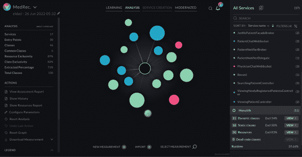
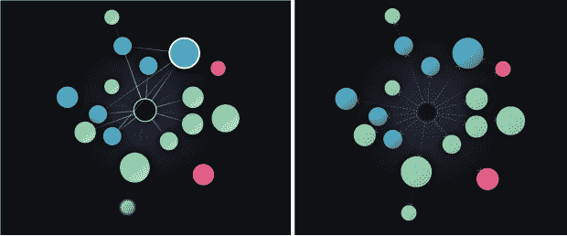
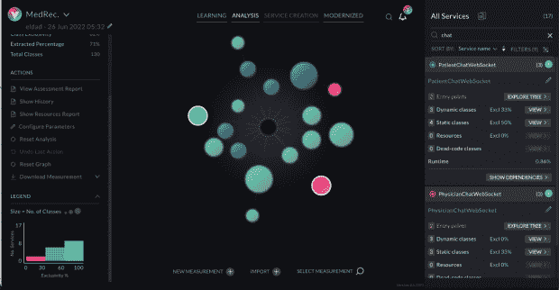
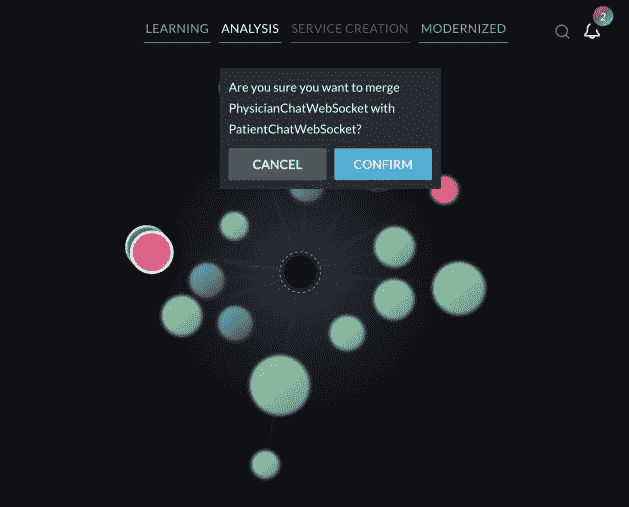
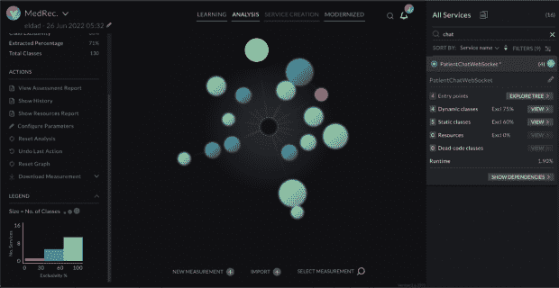
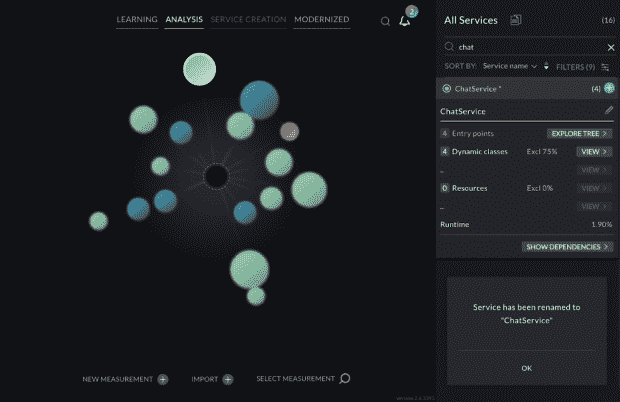
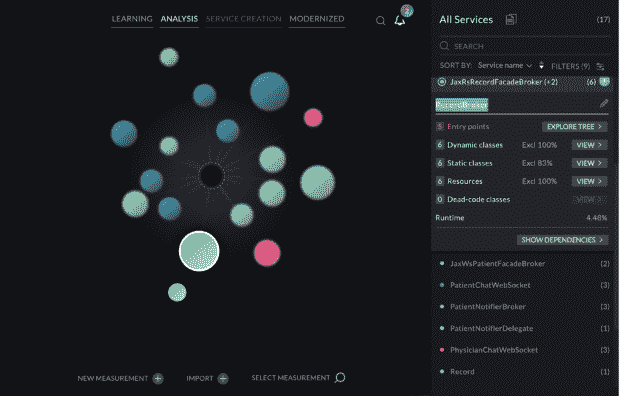
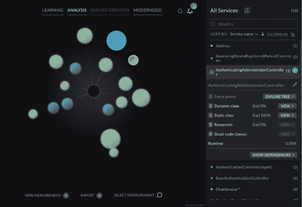
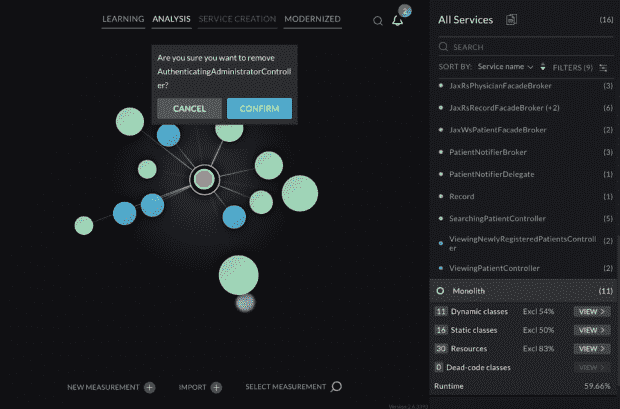

# 从单片到微服务:4 个现代化最佳实践

> 原文：<https://thenewstack.io/monoliths-to-microservices-4-modernization-best-practices-2/>

当谈到将单片应用程序重构为微服务时，大多数工程团队都不知道从哪里开始。此外，最近的一项调查显示 [79%的现代化项目失败](https://vfunction.com/resources/report-wakefield-why-app-modernization-projects-fail/)，平均成本为 150 万美元，耗时 16 个月。

 [奥利弗·怀特

奥利弗·j·怀特是 vFunction 的社区关系总监。自 2007 年以来，他一直在帮助 ZeroTurnaround(被 Perforce 收购)和 Lightbend 等公司和初创公司讲述他们的技术故事，并建立数字内容社区。](https://cz.linkedin.com/in/thinkingoutloud) 

在其他文章中，我们讨论了以数据驱动的方式发展[评估您的应用前景](https://thenewstack.io/3-must-have-modernization-competencies-for-application-teams/)的能力的必要性，以帮助您优先考虑您的第一个重大步骤。在盲目着手现代化项目之前，了解技术债务积累、创新和拥有成本、复杂性和风险等因素非常重要。

事件风暴练习、领域驱动设计(DDD)、扼杀者 Fig 模式和其他概念在这里都是有用的概念，但是作为一名架构师或开发人员*实际上做了什么*来将单片应用重构为微服务呢？

完成这项工作有大量的最佳实践，在本帖中，我们将关注一些将你的整体智能分解为微服务的具体行动。

这些操作包括识别服务域、将两个服务合并为一个、将服务重命名为更准确的名称，以及移除作为微服务提取候选的服务或类。最棒的部分:我们将使用人工智能(AI)和自动化来实现我们的目标，而不是试图手动完成这些工作。

## 最佳实践#1:自动识别服务和域

调查显示，使用白板上的便利贴手动分析整块石头耗时太长，成本太高，而且[很少以成功告终](https://vfunction.com/resources/report-wakefield-why-app-modernization-projects-fail/)。您团队中的哪个架构师或开发人员有时间和能力停下手头的工作，手动审查数百万行代码和数万个类？大型整体式应用程序需要一种自动化的、数据驱动的方式来识别潜在的服务边界。

### 现实世界的方法

让我们选择一个现成的、真实的应用程序作为平台，在这个平台上我们将探索这些最佳实践。作为 Java 开发人员的教程示例， [Oracle 提供了](https://docs.oracle.com/cd/E11035_01/wls100/medrec_tutorials/webappdd.html)一个医疗记录(MedRec)应用程序，也称为 Avitek 医疗记录应用程序，这是一个使用 WebLogic 和 Java EE 的传统整体。

使用 vFunction，我们将启动一个“学习”阶段，使用动态分析、静态分析和基于调用树和系统流的机器学习来识别理想的服务域。

图 1:这个服务图显示了为提取而标识的单个服务

在图 1 中，我们看到一个服务图，其中服务显示为不同大小和颜色的球体，以及连接它们的线(边)。每个领域代表一个服务，vFunction 已经自动识别出该服务与一个特定的领域相关。屏幕右侧列出了这些服务的名称和详细信息。

球体的大小表示服务中包含的类的数量。颜色代表每个服务中的类别“排他性”级别，指的是只存在于该服务中的类别的百分比，而不是跨多个服务共享的类别。

红色代表低度专属，蓝色代表中度专属，绿色代表高度专属。更高的类排他性表明服务之间的边界更好，相互依赖性更少，代码重复更少。综上所述，这些特征表明，将高度排他的服务重构为微服务将变得不那么复杂。

图 2 和图 3:实线和虚线代表服务之间的不同关系

这里的实线代表跨服务共享的公共资源(图 2)。公共资源包括 beans、同步对象、只读数据库事务和表、读写数据库事务和表、websockets、文件和嵌入式文件等。虚线表示服务之间的方法调用(图 3)。

中间的黑色球体表示仍然在 monolith 中的类，monolith 包含不特定于任何特定领域的类和资源，因此没有被选为提取的候选。

通过使用自动化和人工智能来分析和揭示之前包含在整体黑盒中的新服务边界，您现在可以开始在建议的参考架构内操作服务，这为基于数据驱动的分析做出更好的决策扫清了道路。

## 最佳实践#2:整合功能并避免重复

当所有的东西都在巨石柱里时，你的可见性就有些有限了。如果您能够公开建议的服务边界，那么您就可以开始做出决策并测试设计概念——例如，识别多个服务中的重叠功能。

### 现实世界的方法

何时将具有相似功能的不同服务整合到单个微服务中是有意义的？最基本的例子是，作为一名架构师，您可能会看到将两个看似重叠的服务组合在一起的机会——我们可以根据类名和类排他性级别来识别这些服务。

图 4:两个相似的服务已经被确定合并

在服务图(图 4)中，我们看到两个相似的聊天服务用一个白色的圆环勾勒出来: **PatientChatWebSocket** 和 **PhysicianChatWebSocket** 。我们可以看到，医生聊天服务(红色)的动态排他性为 0%，患者聊天服务(蓝色)的排他性稍高，为 33%。

这两个服务都没有使用任何共享资源，这表明我们可以将它们合并到一个服务中，而不会被我们的操作所纠缠。

图 5:确认合并服务的决定可以通过一个按钮立即回滚

通过合并两个相似的服务，您能够合并重复的功能，并且增加新合并的服务中的类的排他性(图 5)。由于我们在本例中使用了 vFunction Platform，逻辑绑定这些服务所需的一切都得到了处理——类、入口点和资源都得到了智能更新。

图 6:一个新合并的单一服务现在代表两个以前的聊天服务

合并服务就像将一个服务拖放到另一个服务上一样简单，在 vFunction Platform 重新计算对这个动作的分析后，我们看到球体现在是绿色的，动态排他性为 75%(图 6)。这表明新合并的服务在类级别上的互连性较低，这给了我们以较低的复杂度提取该服务的机会。

## 最佳实践#3:为服务创建准确且有意义的名称

我们都知道给事物命名很难。当处理整体服务时，我们真的只能使用类名来弄清楚发生了什么。仅凭这些信息，很难准确地识别哪些类和功能可能属于某个特定的领域。

### 现实世界的方法

在我们的示例中，vFunction 已经从图 7 中屏幕右侧的类名中自动派生出服务域名。作为一名架构师，您需要能够根据您的偏好和需求来重命名服务。

图 7:将合并的服务重命名为更准确的名称

现在让我们回到上一节中合并的两个聊天服务。以前我们有一个服务，同时提供病人和医生的聊天，现在我们有一个单一的服务，代表两个配置文件，所以名字 **PatientChatWebSocket** 不再准确，可能会引起将来从事这项服务的其他开发者的误解。我们可以决定选择一个更好的名字，比如 **ChatService** (图 7)。

图 8:将自动识别的服务重命名为更有意义的名称

在图 8 中，我们可以看到另一个名为**JaxRSRecordFacadeBroker(+2)**的服务。这里的(+2)部分表示我们有属于多个类的入口点。您可能会发现这个名称没有必要描述，所以您可以简单地将其更改为 **RecordBroker** 。

通过以更准确和更有意义的方式重命名服务，您可以确保您的工程团队能够以直接的方式快速识别和使用未来的微服务。

## 最佳实践#4:识别不应该是独立微服务的功能

哪些品质表明以前包含在整体结构中的功能值得成为微服务？并不是所有的东西都应该成为微服务，那么什么时候你会想要删除一个服务作为分离和提取的候选呢？

好吧，你可能决定一些服务实际上不属于一个单独的域，例如，一个仅仅过滤消息的过滤器类。因为这不是任何特定服务独有的，所以将来您可以决定将它移动到一个公共库或另一个服务。

### 现实世界的方法

当删除将来作为微服务提取的候选功能时，您决定不将该类视为接收流量的单个入口点。让我们看看**认证管理控制器**服务(图 9)，这是一个简单的控制器类。

图 9:删除一个非常简单的非特定服务

在图 9 中，我们可以通过红色看到所选的类具有低排他性，并且它是一个非常小的服务，仅包含一个动态类、一个静态类，并且没有资源。您可以决定这不应该是一个单独的服务，并通过将它拖放到中间的黑色球体上来删除它(图 10)。

通过将该类重新定位到 monolith，我们决定该特定功能不满足成为单独微服务的要求。

在这篇文章中，我们展示了一些最佳实践，架构师和开发人员可以遵循这些实践来将一个整体应用程序重构到有界限的上下文和精确的域中，以便将来提取微服务。

通过使用 vFunction 平台，许多繁重的提升和手动工作已经通过人工智能和数据驱动的分析实现了自动化。这确保了架构师和开发团队可以将时间集中在基于智能建议的参考架构的改进上，而不是花费数千小时手动分析没有适当“大图”上下文的小块代码来获得成功。

<svg xmlns:xlink="http://www.w3.org/1999/xlink" viewBox="0 0 68 31" version="1.1"><title>Group</title> <desc>Created with Sketch.</desc></svg>