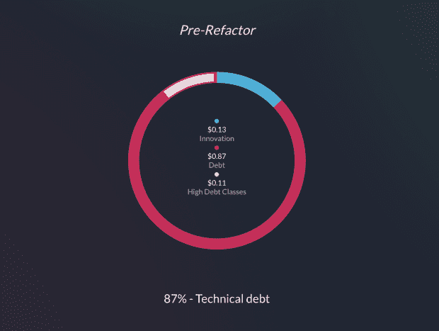
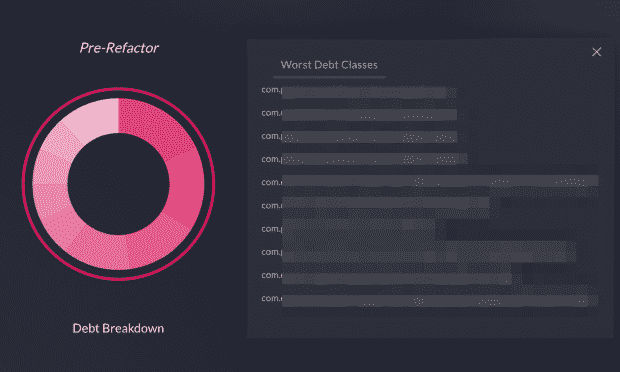
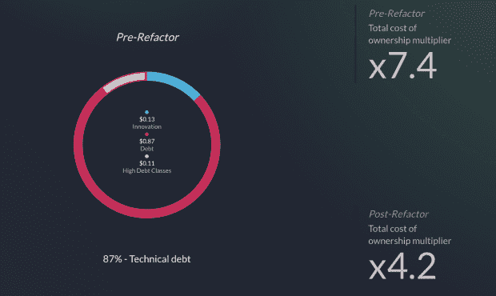
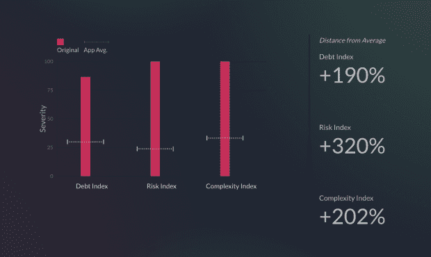
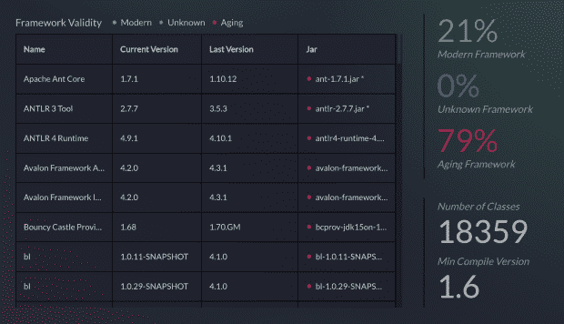
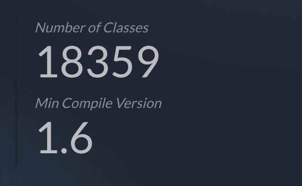

# 从单片到微服务:需要了解的 8 个技术债务指标

> 原文：<https://thenewstack.io/monoliths-to-microservices-8-technical-debt-metrics-to-know/>

奥利弗·j·怀特

奥利弗是 vFunction 的社区关系总监。自 2007 年以来，他一直在帮助 ZeroTurnaround(被 Perforce 收购)和 Lightbend 等公司和初创公司讲述他们的技术故事，并建立数字内容社区。

技术债务是许多企业创新和发展速度的主要障碍。它在哪里？我们如何解决这个问题？我们能否以一种有助于我们区分应用程序现代化工作优先级的方式来计算它？

如果没有数据驱动的方法，您可能会发现您的团队陷入了 79%的组织中，他们的应用程序现代化计划以失败告终。在[其他文章](https://thenewstack.io/using-machine-learning-to-measure-and-manage-technical-debt/)中，我们已经讨论了识别、计算和管理技术债务的挑战。

在本文中，我们回顾了基于技术债务的八个具体指标，这些指标对于评估和规划整个应用环境中的应用现代化计划非常重要。

## 简而言之，它是如何工作的

出于这些目的，我们将使用由[v function Assessment Hub Express](https://app.vfunction.com)生成的指标，该工具可免费用于多达三个 Java 应用程序。作为整个 vFunction 平台的一部分，Assessment Hub 采用静态分析和机器学习(ML)算法，这些算法根据应用程序类之间的依赖关系图来衡量应用程序的技术负债。

这些计算测量:

*   图中顶点的平均/中值外向度。
*   图中任意节点的前 N 个出度。
*   班级间最长的路径。

使用图中的标准聚类算法，我们可以识别图中的类社区，并测量它们的附加度量，例如识别的社区的平均外向度以及社区之间的最长路径。

考虑到这一点，让我们看看该分析揭示的指标，以及它们如何帮助架构师和开发人员制定业务案例和要现代化的应用程序的优先级列表。

## 指标 1:创新成本(每花费 1 美元)

如何判断整体应用程序中的技术债务实际上是否损害了您的业务？

决定应用程序现代化计划背后的投资决策的最重要指标之一是“保留它需要多少成本？”

图 1:用于创新的预算与技术债务

创新成本指标(图 1)显示了对执行决策者有意义的分解。每一美元中，有多少是用于维护应用程序的，又有多少是用于创新新特性和新功能的？

在这个例子中，我们可以看到这个应用程序 87%的预算用于维护累积的技术债务，只有 13%用于创新工作，比如构建新功能。在技术债务类别中，分析中提到了第三个指标——高债务类别，这是我们要研究的下一个指标。

## 指标 2:十大最高债务类别

您的应用程序是否有造成技术债务的罪魁祸首？

在上面的图 1 中，我们看到每一美元中有 0.11 美元被归类为高负债类别。也就是说，每一美元中，有 11%是用于维持这些高负债阶层的。上面提到的静态分析和 ML 算法基于对整个代码库的分析，确定了应用程序中负债最多的前 10 个类。

图 2:通过静态分析确定的十大最糟糕的债务类别(出于隐私考虑，此处隐藏)

在图 2 中，我们看到了这个特定应用程序中十大最差债务类别的细分，出于隐私考虑，这些细分被隐藏起来了。这提供了一个最有问题的类的清晰视图，这些类一起构成了应用程序中积累的最多的技术债务。有了这些信息，架构师和开发人员就可以在重构工作开始之前开始了解应用程序的总拥有成本(TCO ),这将引导我们进入下一个指标。

## 指标 3:重构前后的总拥有成本

单纯关注负债最严重的前 10 个阶层会有多大不同？

在上面的第一个指标中，我们看到了创新、债务和高债务类别的细分。有了这些数字，我们使用简单的数学来提供另一个指标，帮助决策者快速确定在广泛的应用资产中现代化工作的优先级:应用的正式 TCO，包括重构前和重构后的工作(图 3)。

图 3:十大高负债类别的当前总拥有成本与重构后总拥有成本的对比

在图 3 的右上方，重构前的 TCO 乘数显示了当前仅维护一个现有应用程序就花费了多少。右下角的重构后指标代表了仅重构前 10 个最差债务类别时适用的 TCO 的降低。仅仅关注这 10 个最糟糕的债务类别，就能从 7.4 倍提高到 4.2 倍，这是说服决策者实现应用程序现代化的有力指标。

## 指标 4、5、6:总体债务、风险和复杂性

就复杂性和风险而言，您正在评估的应用程序与您的其他应用程序相比如何？

在图 4 中，我们看到一个代表各种指数的图表，这些指数有助于决策者了解被评估应用的债务、风险和复杂性。在图 4 的右侧，我们测量了您的应用程序测量值与平均值相比高出或低于多少。(同样，我们采用静态分析结合机器学习来确定这些指标。)

图 4:债务、风险和复杂性度量

**第四项指标:**债务指数衡量应用程序整体债务的严重程度，还显示您的投资组合中评估的所有其他应用程序的平均值。在本例中，我们针对由 vFunction 评估的其他应用进行测量。该指标结合了复杂性和风险指数，如下所述。

**指标 5:** 风险指数与依赖关系的长度相关。这分析了应用程序中一个部分的变化影响应用程序下游看似不相关的部分的可能性。代码依赖性是应用程序现代化工作中的主要障碍——变更的风险把事情搞得如此糟糕，以至于导致非自愿的职业转变，这是大多数工程师不愿意做的事情。

**指标 6:** 复杂度指标衡量的是类依赖之间相互纠缠的程度，降低了代码的模块化程度。这影响了架构师在未来分离功能和创建独立、隔离的微服务的能力。(提醒一下，vFunction 现代化中心使用人工智能和自动化来解决这些依赖关系，比手动操作的风险要小得多)。

其他代表风险和复杂性的指标在 vFunction Modernization Hub、Assessment Hub 或 Assessment Hub Express 中的分析过程中进行计算，并提供对可立即采取行动的领域的见解，如我们的下一个指标。

## 指标 7:老化的框架和库

您的应用程序中的框架和库是否给您的现代化工作带来了额外的风险和挑战？

老化的框架给企业带来了风险，这不仅是因为技术上的债务积累，还因为安全性问题。例如, [2020 HIMSS 网络安全调查](https://www.himss.org/sites/hde/files/media/file/2020/11/16/2020_himss_cybersecurity_survey_final.pdf)指出，80%的医疗保健机构没有在其现有系统中使用最新的工具和实践。然而，由于这些系统是在安全威胁远没有那么复杂和频繁的时代创建的，老化的应用程序特别容易受到现代网络安全威胁的攻击。

图 5:老化的框架代表了一种安全风险，并导致了技术债务

在图 5 中，我们可以看到在分析过程中确定的框架和库的列表。基于对当前框架版本和最新可用版本的查询，颜色对应于应用程序中使用的现代、老化和未知的框架。“modern framework”标签表示该应用程序至少共享相同的主要版本(例如 2.0+)和次要版本(例如 2.4)。

如果这是您的应用程序，并且 79%的框架被认为是老化或过时的，那么这个度量标准提供了一个重构的起点，这将作为在您的团队中加强安全策略的快速胜利。

## 指标 8:类的数量和最低编译版本

您的应用程序有多大，有多复杂？

我们将在图 6 中看到的最终指标包括被评估的应用程序的类数量和最低编译版本(在本例中是 Java 1.6)。因此，在现代化工作开始之前，确保未来的兼容性至关重要。升级该应用程序的 JVM 版本可能会带来进一步的优势，如更快的开发速度、更强的安全性，甚至性能的提高。

图 6:应用程序中的类数量和最低编译 JVM 版本

在这个应用程序中，有超过 18，000 个 Java 类，这是一个相当大的数量，代表了工程师们可能称之为“一个巨大的整体”这个度量标准给出了现代化计划的潜在范围的预览:在这个整体中的一个大类可以很容易地覆盖一个功能范围，在未来，这个功能范围将代表整个服务域(一旦分解为一个微服务)。

这就是[v function Modernization Hub](https://vfunction.com/products/modernization-hub/)接手自动建议参考架构的重任的地方，您可以交互地提炼和提取该参考架构作为微服务，与 Docker 和 Kubernetes 一起部署到 AWS、Microsoft Azure、Google Cloud Platform、Red Hat OpenShift 等云提供商。

## 底线

将单片应用程序现代化为微服务并非易事。了解技术债务、应用程序复杂性、风险和老化框架对于获得高管的认可和其他团队对未来工作的支持至关重要。

如果没有对单个整体进行有信心的评估，更不用说您的整个应用程序生态系统了，现代化工作很可能会陷入[那种令人担忧的大多数失败的计划](https://vfunction.com/resources/report-wakefield-why-app-modernization-projects-fail/)，平均成本为 150 万美元，浪费了 16 个月的工作时间。

有了这些度量标准，架构师和开发人员就可以为现代化工作提供一个明智的、数据驱动的方法。这就是我们来这里的目的，对吗？

<svg xmlns:xlink="http://www.w3.org/1999/xlink" viewBox="0 0 68 31" version="1.1"><title>Group</title> <desc>Created with Sketch.</desc></svg>