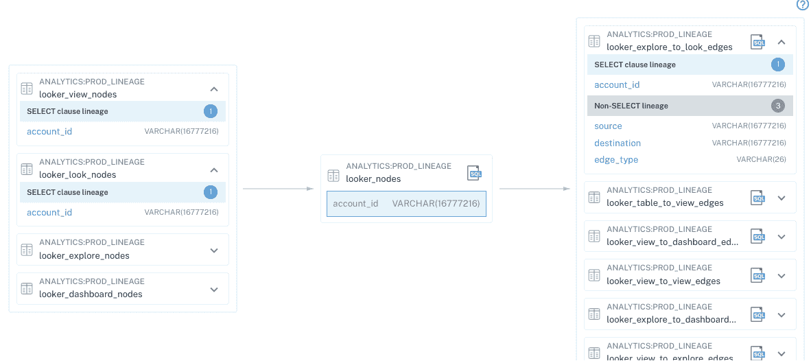

# 蒙特卡洛“洞察”根据重要性和影响对数据进行排序

> 原文：<https://thenewstack.io/monte-carlo-insights-ranks-data-by-importance-and-impact/>

如今，由于数据源数量的快速增长以及每个数据源的海量数据，企业都面临着数据的冲击。因此，对于数据驱动型组织来说，仅仅保留数据清单是不够的。他们还需要对其进行分类并保持一个优先的分类。为了满足这一需求，数据可观察性领域的先驱[蒙特卡洛](https://www.montecarlodata.com/)在其[核心平台](https://www.montecarlodata.com/product/)的基础上，引入了一个新模块——[蒙特卡洛洞察](https://www.montecarlodata.com/monte-carlo-insights/)——它不仅能帮助客户不可诊断地监控数据，还能帮助客户了解其数据资产中哪些资产最重要、最有影响力。

## 数据观测站

让我们先回顾一下，这样我们就可以了解该产品背后的平台。数据可观察性是一个相对较新的数据管理学科。虽然乍听起来有点深奥，但深入研究后会发现它是一个简单明了且符合逻辑的类别。想象一种从数据质量、运营监控和性能管理中借用概念的技术，您会很好地理解数据可观察性是什么。

来自核心蒙特卡罗数据可观测性平台 Credit:蒙特卡罗的数据谱系可视化

数据可观察性通过将数据质量管理与元数据、谱系甚至应用性能管理(APM)的某些原则结合起来，提供了数据生产和数据可靠性的整体视图。这种组合有助于用户解决数据问题，了解它们的影响，并在不同的用户组之间进行有效的沟通。它还有助于确保仪表板和建立在被观察数据上的机器学习模型的功能性和准确性。考虑到这一点，蒙特卡洛数据平台的目标是数据工程师、数据分析师、数据科学家和管理数据团队的人。

## 太元了

11 月 3 日发布的 Monte Carlo Insights 旨在为组织提供对其自身数据平台的分析和见解。该产品本质上提供了对用于产生商业分析的数据的运营分析，或许我们可以称之为元分析。Insights 通过对数据仓库或数据湖中的所有表进行分析，然后根据它们对业务的重要性进行排序来实现这一点。

这种排名是一项重大创新，它利用了机器学习，并基于一些标准，如上游和下游依赖关系，人们查询表格的频率以及谁在查询它们，表格的使用范围以及表格驱动的报告。Insights 跟踪关键资产排名之外的其他数据集。这些包括一段时间内的运营趋势，以监控服务水平协议(SLA)的合规性；已解决的数据质量问题的影响程度；和成本趋势。Insights 还提供易于共享的高级报告；它可以通过其 API 和用户界面使用，也可以通过[雪花安全数据共享](https://docs.snowflake.com/en/user-guide/data-sharing-intro.html)使用。

## 止血

当然，Insights 解决的不仅仅是数据使用智能本身。它提供的排名有助于组织关注其数据质量和可靠性计划以及正在进行的工作。反过来，这可以减轻影响并降低与不良数据相关的成本，2017 年 [Gartner 研究](https://www.gartner.com/smarterwithgartner/how-to-stop-data-quality-undermining-your-business)称，不良数据平均每年给公司带来 1500 万美元的成本。因此，Monte Carlo Insights 开始为管理数据平台的人员(例如，数据管理员、首席数据官和 IT 主管)提供数据健康的整体视图，并阐明可靠性和成本管理应关注的内容。

Insights 的目标是最大限度地减少寻找可靠和重要数据的时间，同时提高用户对自己平台的了解。为此，蒙特卡洛的联合创始人 [Lior Gavish](https://www.linkedin.com/in/lgavish) 告诉新堆栈“数据团队向营销、销售、产品和运营等业务的各个部分提供分析，但实际上，他们了解自己的平台是如何工作和执行的吗？借助蒙特卡洛的洞察力，他们能够跟踪自己的可靠性、性能、成本、技术债务，甚至工作的影响。”

## 首先，但不仅仅是？

数据质量差会导致决策失误、错失机会和收入损失。揭示最重要的数据可以帮助企业客户摆脱“数据驱动”的陈词滥调，建立实质性的数据战略。我们预计 Monte Carlo Insights 不会是这种类型的唯一产品。

<svg xmlns:xlink="http://www.w3.org/1999/xlink" viewBox="0 0 68 31" version="1.1"><title>Group</title> <desc>Created with Sketch.</desc></svg>