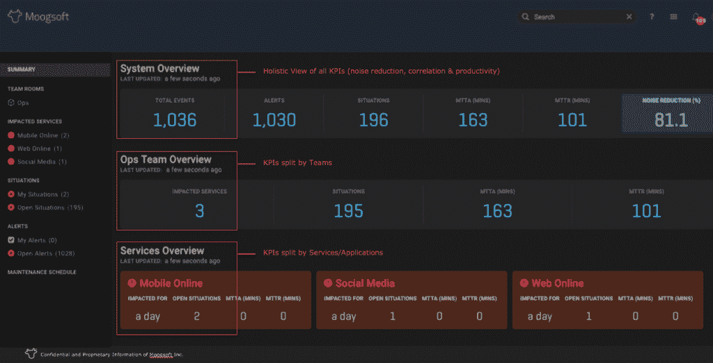

# Moogsoft 推进了 IT 运营分析的艺术

> 原文：<https://thenewstack.io/moogsoft-advances-art-operations-analytics/>

企业对解决问题会产生新问题的想法并不陌生。例如，针对基于云的应用程序的新形式的应用程序性能监控会产生一大堆需要持续跟踪的日志、异常和警报。Moogsoft 希望将算法分析引入日益严重的信息过载问题。该公司的旗舰 IT 运营分析(ITOA)平台将于 4 月 12 日发布第 6 版，届时[将焕然一新](https://www.moogsoft.com/blog/aiops/introducing-new-moogsoft-aiops)。

最大的变化集中在将 Moogsoft 的工作流程塑造成现代企业、[看板](https://en.wikipedia.org/wiki/Kanban_(development))风格的环境。

在这一更新的背后，是 Moogsoft 在 ITOA 空间中日益增长的相关性。这家公司是由连续的科技企业家迈克·西尔维共同创立的。如今，他是 Moogsoft 的执行副总裁。在过去的生活中，他共同创立了 [Micromuse](http://www-03.ibm.com/press/us/en/pressrelease/19247.wss) ，一家被 IBM[收购并整合到其](http://www.ibm.com) [Tivoli](https://www.ibm.com/software/tivoli) 产品线中的公司。

Silvey 说，IT 组织目前很难解析所有传入的数据。Silvey 说，在像 [AppDynamics](https://www.appdynamics.com/) 和 [NewRelic](https://newrelic.com/) 这样的应用程序性能监控(APM)工具、像 [Splunk](https://www.splunk.com/) 这样的大型系统日志聚合工具以及介于这些资产之间的数千个其他系统之间，很容易失去整体性能和异常森林。

Silvey 说，与其期望 IT 工作者注意到多个监控系统的趋势，不如通过算法来观察这些信息流更有意义。虽然这个想法不一定是新的，但新奇之处在于系统的实时速度，以及规则配置的删除。

“这是 Moogsoft 的重大创新，”西尔维说。“传统上，你必须说，‘当这个低于这个水平时，就会引发事故。’传统上是你写规则。问题是，使用[持续部署]，频率意味着你不能足够快地编写足够多的规则。"

Silvey 说，Moogsoft 已经建立了非常快速地执行像负矩阵分解这样的事情的能力，这使得异常趋势出现时能够立即浮出水面。

来自 [451 Research](https://451research.com/) 、[的应用和基础设施性能开发高级分析师 Nancy Gohring](https://www.linkedin.com/in/nancygohring) 认为世界已经进入了 ITOA 2.0 时代。她说，这些产品的第一次迭代大多来自传统玩家，并且只在他们自己的数据域内工作。

她说，较新的工具正专注于机器学习和对云基础设施中无数工具生成的传入日志文件的算法分析。她说，这意味着当前的 ITOA 工具实际上能够影响运营效率，这意味着前几代工具无法满足用户的需求。

“第一批 ITOA 工具主要是由传统供应商提供的，并且通常局限于该供应商收集的数据，”Gohring 说。“他们的关联版本是一个带有工具的仪表板，因此您可以直观地将它们关联起来。这些不是很有用，所以没有被广泛使用。”

西尔维说，包括 Moogsoft 在内的新一波 ITOA 工具的好处是，可以更清楚地看到哪些问题出现在哪里，以及如何找到解决这些问题的方法。他认为 Moogsoft 的主要优势在于大大减少了可起诉的罚单和缩短了补救时间。

这很好，因为戈林说，脸书目前每天捕获 26 万亿个数据点。人类不可能理解如此大量的信息，更不用说实时理解了。

*想了解更多戈林对 ITOA 的看法，请看我们最近的 TNS 分析师播客:*

[#131:变形监测市场分析:APM、日志、定价和分析](https://thenewstack.simplecast.com/episodes/131-analyzing-the-morphing-monitoring-market-apm-logs-pricing-and-analytics)

特征图片:一个穆格金牛座踏板集。与 Moogsoft 无关([照片维基百科](https://upload.wikimedia.org/wikipedia/commons/0/01/Moog_Taurus_3.jpg)， [CC BY-SA 2.0](http://creativecommons.org/licenses/by-sa/2.0) )。

<svg xmlns:xlink="http://www.w3.org/1999/xlink" viewBox="0 0 68 31" version="1.1"><title>Group</title> <desc>Created with Sketch.</desc></svg>