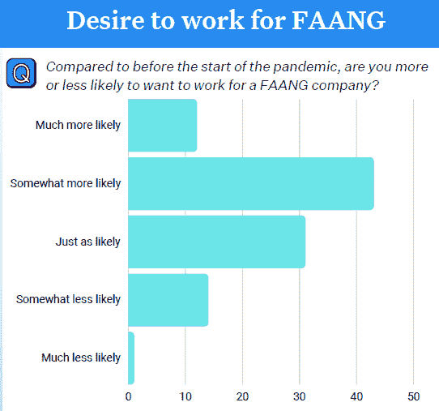

# 越来越多的数据工程师渴望工作

> 原文：<https://thenewstack.io/more-data-engineers-crave-faang-jobs/>

根据 Wakefield Research 的一项新调查，与新冠肺炎疫情开始时相比， [55%的数据工程师表示，他们更有可能希望为 FAANG 公司](https://www.montecarlodata.com/state-of-data-quality/)——科技巨头脸书、[、亚马逊、](https://aws.amazon.com/?utm_content=inline-mention)—苹果、网飞和谷歌工作，而只有 15%的人不太可能有这种感觉。

对 300 名美国[数据](https://thenewstack.io/category/data/)工程师的研究是代表蒙特卡洛进行的，蒙特卡洛是一个[数据可观测性](https://thenewstack.io/what-is-data-observability-and-why-does-it-matter/)平台。该报告的数据收集时间为 4 月 28 日至 5 月 11 日。

来源:“数据质量状况”，韦克菲尔德研究公司

Wakefield 是 2021 年数据工程调查背后的同一家研究机构，[显示](https://thenewstack.io/the-benefits-and-drawbacks-of-dataops-in-practice/)数据责任对一些人来说压力很大，但对数据工程师来说没有其他工作角色那么大。

2022 年的报告提供了似乎支持这一评估的统计数据。超过一半的受访者表示，每月的数据事件数量有所增加，并且需要四个多小时才能确定事件发生的时间。

其他发现包括:

*   41%的调查参与者表示，他们每天花 4 个多小时处理数据质量问题
*   47%的人还表示，决策者或利益相关者的决策在大多数时间或所有时间都会受到数据质量问题的影响。

由于数据基础设施的成败关系重大，为 FAANG 公司工作的愿望可能是有道理的。

较小的公司可能需要像那些被调查的数据工程师那样的多面手，这可能是相当有压力的。也许调查受访者认为，为脸书、苹果、亚马逊、网飞或谷歌工作会让他们专注于自己选择的职业道路。

如果 FAANG 公司一贯表现出社会责任感，并适应员工倦怠的迹象，他们就不会失去他们正在招聘的下一代技术人才。

除此之外，蒙特卡洛的平台[根据数据的重要性和影响](https://thenewstack.io/monte-carlo-insights-ranks-data-by-importance-and-impact/)对数据进行排名。7 月，苏珊·霍尔在《新堆栈》中写道，该公司的竞争对手[汽水](https://thenewstack.io/soda-io-checks-to-keep-your-data-in-line/)如何检查以保持你的数据一致。蒙特卡洛的另一个竞争对手 BigEye 的首席执行官告诉我们的读者为什么[数据可靠性工程](https://thenewstack.io/its-time-for-data-reliability-engineering/)很重要。请在不久的将来在我们的网站上寻找更多关于数据管理主题的报道。

<svg xmlns:xlink="http://www.w3.org/1999/xlink" viewBox="0 0 68 31" version="1.1"><title>Group</title> <desc>Created with Sketch.</desc></svg>