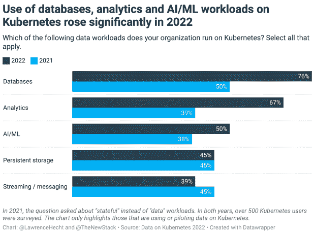

# 2022 年，更多数据库、分析工作负载在 Kubernetes 上运行

> 原文：<https://thenewstack.io/more-database-analytics-workloads-ran-on-kubernetes-in-2022/>

根据 Kubernetes (DoK)社区数据的一项新调查，与去年相比，2022 年在 Kubernetes 上运行数据库的组织的百分比跃升了 26 个百分点。

超过四分之三(76%)的调查参与者现在承认在 Kubernetes 上使用数据库，比去年的 50%有所上升。报告称，分析工作负载也大幅增加，从 39%增加到 67%。

抽象地说，实际运行有状态的应用程序(包括保存到持久磁盘存储器的数据)并不常见。一年前，[云本地计算基金会的](https://cncf.io/?utm_content=inline-mention) [2021 年用户调查](https://www.cncf.io/reports/cncf-annual-survey-2021/)中有 55%的人在这么做。然而，根据 DoK 的报告，使用 Kubernetes 上的数据的应用类型的组合似乎正在增长。

这份新报告调查了 500 多名在 Kubernetes 上运行数据工作负载的 Kubernetes 用户。一致性和易管理性是在 Kubernetes 上运行数据工作负载背后的主导因素，这两个因素对于确保能够处理容器的广泛生产使用都是至关重要的。

值得注意的是，在 Kubernetes 上使用数据的用户中，对持久存储的利用没有增加，而流媒体或消息工作负载实际上有所下降。

## Kubernetes 上的数据是第 2 天的运营问题

DoK 报告的其他主要发现包括:

*   大多数(72%)受访者在一年多前开始在 Kubernetes 上运行数据工作负载。有了一些处理第 2 天操作(生产)的经验，调查参与者对 Kubernetes 上运行的不同类型的有状态工作负载普遍表示满意。
*   自动化应用供应和配置管理是人们在 Kubernetes 上管理数据工作负载时最常提到的挑战。
*   三分之二的调查受访者(66%)使用运营商在 Kubernetes 上运行数据，这可以解决一些数据管理挑战，但前提是他们还可以处理第二天的其他问题，如可观察性和管理存储生命周期。

![Bar chart showing the Challenges of Managing Data Workloads on Kubernetes. Survey participants could choose more than one option. Automating app provisioning and config management 53% App life cycle management, storage life cycle 47% Observability, with metrics, alerts, log processing and workload analysis 45% Securing the environment 40% Autopilot capabilities (horizontal/vertical scaling, tuning, abnormal detection) 40% Upgrading, patching 34% Source: Data on Kubernetes 2022 Report, Data on Kubernetes Community](img/5698fe4e474f01758fc93fcadbdf4daf.png)

## 对组织的变革性影响

该调查揭示了一个共识，即在 Kubernetes 上运行数据工作负载对组织具有变革性影响。对价值的认知很高，但可能高估了实际利益。

*   三分之一的受访者(33%)认为在 Kubernetes 上运行数据正在对生产力产生变革性的影响，另有 51%的人指出至少有显著的积极影响。当被问及对收入的影响时，这些数字仅略低。
*   67%的受访者表示，在采用 Kubernetes 管理数据工作负载后，他们的组织和/或开发人员的工作效率至少提高了 50%。这比去年 DoK 调查的 57%有所上升。然而，这与实际的生产力基准是不可比的，至少现在还不能。
*   54%的人声称他们组织超过 10%的收入可以归因于在 Kubernetes 上运行数据的能力。退一步说，我们认为以这种方式将 Kubernetes 与收入联系起来是站不住脚的。52%的组织表示，超过一半的数据工作负载运行在 Kubernetes 上。但是使用 Kubernetes 基础设施运行生产工作负载与这些工作负载实际产生收入并不是一回事。

<svg xmlns:xlink="http://www.w3.org/1999/xlink" viewBox="0 0 68 31" version="1.1"><title>Group</title> <desc>Created with Sketch.</desc></svg>