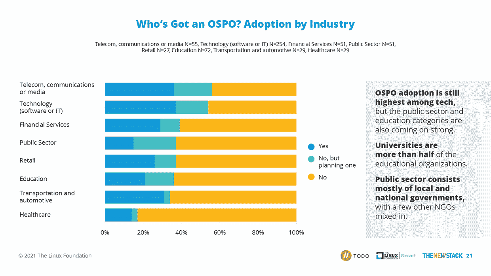
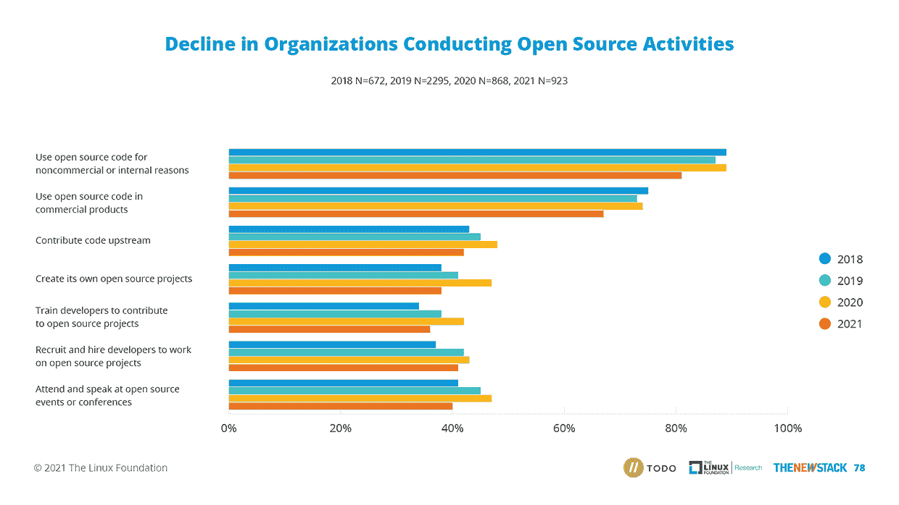

# 越来越多的组织报告了开源程序的好处

> 原文：<https://thenewstack.io/more-organizations-report-benefits-of-open-source-programs/>

编者按:阅读为什么您的组织需要一个开源项目办公室

[here](https://thenewstack.io/why-your-organization-needs-an-open-source-program-office/)

.

根据 New Stack、 [Linux Foundation Research](https://training.linuxfoundation.org/training/course-catalog/?utm_content=inline-mention) 和 TODO Group 的一项新调查，63%拥有开源项目办公室的组织表示，这些项目对他们的工程和产品团队的成功非常或非常关键。

这一数字比 2020 年的 54%有所上升，表明年度调查参与者越来越意识到开源项目办公室(OSPOs)的好处。

此类项目的资金前景似乎也准备好了上升:51%的受访者表示，鉴于宏观经济状况，本财年他们组织对开源计划的财政支持很可能会增加。在去年的报告中，只有 38%的人这么说。

根据调查结果，电信和技术公司最有可能在 2021 年拥有或计划拥有 OSPOs，医疗保健组织最不可能。然而，新堆栈的研究主管[劳伦斯·赫克特](https://thenewstack.io/author/lawrence-hecht/)对调查历史数据的分析显示，与其他行业相比，人们对政府和教育机构(尤其是大学)的兴趣变得更强了。

以下是调查结果如何按行业对已经或计划实施 OSPO 的组织进行细分:

2021 年开源项目办公室调查由 Linux 基金会研究和新堆栈于 2021 年 6 月 10 日至 6 月 29 日进行。目标是评估 OSPOs 的创建，并更好地理解开源项目办公室的成功策略。

这是该研究连续第四年进行。虽然受访者代表的技术公司比过去几年少，但更广泛的行业参与趋势仍在继续。

调查对象是通过社交媒体以及来自 Linux 基金会、TODO Group 和新堆栈订户列表的直接电子邮件征集的。总体而言，1，141 名调查参与者构成了最终数据集。

## 专业化和机遇

今年的调查结果显示，OSPOs 的职业素养稳步提升，同时也有机会向组织传授他们的价值观。

58%的调查参与者(高于 2020 年的 54%)表示，他们的开源项目是正式结构化的，有专门的员工时间、职称等。

但在那些没有或不打算开发 OSPO 的受访者中，49%的人表示他们相信他们的组织将从正式的开源项目中受益，这表明他们对此持开放态度。几乎同样多的人(42%)说他们不知道他们的组织是否会从 OSPO 中受益。

关于没有开源项目办公室或计划的调查参与者的其他发现表明了进一步教育的空间:

*   在没有 OSPO 的组织中，35%的参与者说这是因为他们没有考虑过。
*   28%的人说他们看不到商业价值。
*   19%的人说他们从未听说过 OSPOs。

托多集团 OSPO 项目经理 [Ana Jiménez Santamaría](https://www.linkedin.com/in/ana-jim%C3%A9nez-santamar%C3%ADa) 在接受《新堆栈》采访时说:“我看到的是，人们对 ospo 的兴趣越来越大，远远超出了传统科技公司的范围。”。“这个新的 OSPO 时代带来了最大的挑战。组织需要更多关于如何在不同行业建立 OSPOs 的教育和指导。”

Linux 基金会和其他开源组织正在满足填补知识缺口的需求。她补充说，“基金会可以发挥重要作用，帮助组织以高效、透明和健康的方式理解和参与开源社区。”

## 开源活动的减少

调查也呈现了一些不太乐观的发现。与前一年相比，2021 年经常使用或贡献开源软件，或参与有助于构建开源社区的活动的组织的比例有所下降，

81%的调查参与者表示，他们的组织经常或有时出于内部目的使用开源软件，67%的人表示他们将开源软件用于商业目的；与 2020 年相比，这两个数字都有所下降，分别为 89%和 74%。

此外，42%的受访者表示，他们组织的工程师经常或有时为开源项目做出上游贡献，低于 2020 年的 48%。36%的人说他们培训工程师为开源项目做贡献，低于前一年的 42%。

与 2020 年相比，报告拥有正式或非正式开源项目或计划建立开源项目的组织的百分比也有所下降:34%的组织表示他们拥有开源项目，低于去年的 42%，13%的组织计划建立开源项目，低于去年的 17%。

在大型公司中，拥有开源项目办公室的组织的下降幅度最小。超过 10，000 名员工的组织中有 60%报告有开源程序，低于 2020 年的 64%。

那么，如何解释这种下降呢？Hecht 分析了调查数据并得出了关键结论，他认为，报告的开源活动减少的部分原因可能是调查(现已进入第四年)包括了比过去更广泛的行业。

Jiménez 说，事实上，参与调查的行业种类越来越多，这可能是该运动获得新动力的一个迹象。

她在一次电子邮件采访中说，“也许这告诉我们，OSPOs 甚至在传统技术领域之外也被视为更重要的资产，现在其他行业也开始了解开源的价值，愿意投资和实施新的举措，以培养与组织和开源生态系统的关系。”

Jiménez 说:“由于这些新兴的操作系统平台刚刚起步，它们可能处于开源之旅的早期阶段。”她补充说，这些公司在社区中相对较新的地位也可能解释了操作系统活动的整体下降。

## OSPO 的优势

尽管调查显示今年拥有 OSPOs 并参与开源活动的组织的比例下降了，但它也表明从业者继续压倒性地看到了所产生的商业价值

57%的受访者表示，他们使用 OSPO 来促进战略关系和建立伙伴关系。在特定情况下，这一比例甚至更高:

*   77%的受访者的 OSPOs 向 CTO 报告。
*   经常往上游投稿的占 77%。
*   75%的调查参与者为小型科技公司工作。

一位受访者写道，包括文档在内的代码质量有所提高:“许多项目最终在新兴公司之间产生了协同效应，这些公司共同努力解决一个共同的问题，并将项目提升到更高的质量水平。”

OSPOs 的好处因赞助组织的规模而异。最大的企业(拥有超过 10，000 名员工的企业)更有可能报告其产品在许可证合规性和更快上市时间方面的优势。

相比之下，调查中最小的公司(拥有 2 到 50 名员工的公司)最有可能报告说，他们的 OSPO 帮助他们实现了更好的安全测试，并提高了他们的产品或服务的市场采用率。

希门尼斯指出，调查中有很大一部分参与者表示，他们的组织还没有创建 OSPO 的计划。“我花了几年时间为意识到 OSPO 好处的公司工作，但他们只是还没有准备好，”她说。"大多数时候，主要问题是在内部实现开源文化."

她说，在这种情况下，她认为除非文化转变首先发生，否则创建开源程序的进程就会停滞不前。

对于那些公司缺乏正式程序的开源倡导者，她的建议是“从简单开始”。也许开始在内部团队之间开放某些项目，并在组织内部推广开源文化。一旦掌握了这一点，该组织将在其开源游戏中取得进展，并可能准备开启 OSPO 计划。”

在调查参与者的评论中，一些人提出了创建 OSPO 的详细想法。一些人承认，高层管理人员的认同是为这一事业获得资源和预算的关键。

一位受访者写道:“我公司内部的主要问题是向管理层推销它。”。“我将从流程中可能的效率改进、自动化潜力、研究/实施中的风险降低、创新增加、标准化和更好的发展招聘前景等方面来证明这一点。有数字会有所帮助。”

## OSPOs 做什么

研究发现，在过去的四年里，OSPOs 的主要职责已经发生了变化。不到 69%的开源项目调查参与者表示，培养开源文化是他们项目的首要责任；2018 年，这一数字为 75%。

第二个最常提及的职责是维护操作系统许可证合规性审查和监督，这一比例从四年前的 75%下降到 2021 年的不到 60%。

与开发人员社区的互动从 2018 年的不到 51%上升到当前调查的 56%。这些努力取得了成果。当这是主要责任时，认识到以下好处的 OSPOs 的百分比会发生变化:

*   外部或第三方贡献者对内部开源项目的贡献增加(38%到 47%)
*   开源项目的市场采用率增加(34%到 43%)。
*   参与外部开源项目的比例增加(43%到 57%)。
*   开放社区来源的影响力更大(42%对 58%)。

此分析所基于的完整数据集可在[这里](https://github.com/todogroup/osposurvey/tree/master/2021)找到。

<svg xmlns:xlink="http://www.w3.org/1999/xlink" viewBox="0 0 68 31" version="1.1"><title>Group</title> <desc>Created with Sketch.</desc></svg>