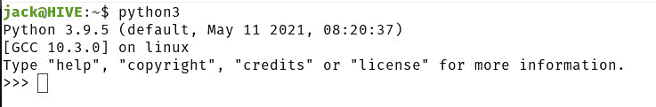

# 面向非程序员的更多 Python

> 原文：<https://thenewstack.io/more-python-for-non-programmers/>

因此，在“[面向非程序员的 Python 介绍](https://thenewstack.io/an-introduction-to-python-for-non-programmers/)”的帮助下，您已经迈出了使用 Python 的第一步您了解 Python 是什么，为什么它是一种高级的通用语言，并且您甚至已经用该语言编写了您的第一个应用程序。

太令人兴奋了。但是还有很多东西要学。幸运的是，这种语言非常容易掌握(尽管要真正掌握还需要一段时间)。这一次我想做的是，让你在语言方面向前迈进一点，同时确保你作为一个非程序员理解这些概念。

教一个牢牢掌握代码概念的人真的很容易。但是当你对这个游戏完全陌生的时候，这些概念会在你的脑海中掠过。

让我们确保这不会发生。

在第一部分中，我解释了什么是函数，并向您展示了如何在一个简单的 Hello，World 中使用 *print()* 函数！申请。我们将在此基础上进行构建，但首先我想向您展示一种从 Python 控制台测试您的函数技能的简单方法。

## 什么是 Python 控制台？

还记得如何在 Hello，World 中使用`print()`函数吗？app？提醒一下，该应用程序使用的文件是:

```
#Print out the text "Hello, New Stack!".
print('Hello, New Stack!')

```

该文件由一个注释(第一行)和使应用程序运行的代码组成。要运行这个应用程序(名为 **hello-newstack.py** )，命令应该是:

`python3 hello-newstack.py`

你还记得吧。好吧，如果你想先确定你知道如何正确地写这个函数，而不是把它添加到文件中，那该怎么办？为此，您可以打开 Python 控制台，这是一种测试和执行 Python 命令的快速而简单的方法。

比方说，你想创建一个 Python 应用程序，但是在你添加一行新的代码之前，你想确保代码工作正常。让我们以`print()`为例。

要访问 Python 控制台，请打开一个终端窗口(在安装了 Python 的计算机上)并发出命令:

`python3`

现在，您应该会发现自己在 Python 控制台中(**图 1** )。



**图 1:**Python 控制台已经准备好测试和执行您的命令。

通过发出以下命令返回到`print()`功能:

`print('Hello, New Stack!')`

你应该看到*你好，新栈！*打印在控制台上。

要退出控制台，您必须键入另一个函数，它是:

`exit()`

按下键盘上的回车键，你将回到电脑的终端窗口。

## 如何在 Python 中使用变量

现在您已经知道了如何创建一个非常基本的 Python 应用程序以及执行 Python 命令的不同方式，让我们创建一个新的应用程序，一个包含变量的应用程序。什么是变量？就编程而言，变量用于存储将在代码中引用的特定信息。

这里有一个非常简单的例子。假设您需要在程序中使用一个日期。您可以将日期设置为如下所示的变量，而不是总是键入必要的日期:

`date = "Thursday November 18, 2021"`

我们现在已经设置了变量。让我们在一个应用程序中使用它。使用以下命令创建一个新文件:

`nano date.py`

在该文件中，我们将通过添加上面的行来设置变量，因此:

```
date  =  "Thursday November 18, 2021"

```

我们的程序只使用数据变量集不会有太大的好处。让我们使用`print()`函数将变量打印出来，如下所示:

我们的完整应用程序如下所示:

```
date  =  "Thursday November 18, 2021"
print(date)

```

保存并关闭文件。使用以下命令执行程序:

`python3 date.py`

您应该会在终端窗口中看到“2021 年 11 月 18 日星期四”字样。

让我们详述一下。就目前而言，如果我们在 2021 年 19 日星期五运行我们的应用程序，它不会有任何好处，因为它会打印出昨天的日期。我们可以使用一个函数将今天的日期存储为日期变量，而不是显式设置数据变量。那个功能就是`date.today()`。使用该函数，我们将变量设置为:

上面一行将使用`date.today()`函数将日期变量设置为应用程序运行时的日期。

然而，已经有一个问题了。不先加载`date.today()`函数就无法使用。我们如何做到这一点？简单。我们所做的是从 DateTime 模块中导入日期函数，代码行为:

```
from datetime import date

```

有了文件顶部的那一行，任何调用它的函数都可以使用 date。目前为止，我们的新应用程序看起来是这样的:

```
from datetime import date

date  =  date.today()

```

杰出。接下来，我们将添加实际打印出信息的行，这使得我们的小应用程序很有用。但是，我们并不只是打印出日期变量的结果，而是添加文本行“今天的日期是:”`print()`行看起来像是:

```
print("Today's date is:",  date)

```

我们的整个应用程序应该是这样的:

```
from datetime import date

date  =  date.today()
print("Today's date is:",  date)

```

让我们添加注释，这样我们就知道每个部分是做什么的了:

```
#Import date function from datetime module.
from datetime import date

#Set date variable using date.today() function.
date  =  date.today()

#Print today's date.
print("Today's date is:",  date)

```

保存并关闭文件。运行我们的新应用:

`python3 date.py`

输出应该是:

`Today's date is: 2021-11-18`

当然，输出中的日期会发生变化，这取决于您运行应用程序的日期。

好了，你已经向 Python 编程语言迈出了下一步。下一次我们访问这个主题时，我们将创建一个接受用户输入的应用程序。

<svg xmlns:xlink="http://www.w3.org/1999/xlink" viewBox="0 0 68 31" version="1.1"><title>Group</title> <desc>Created with Sketch.</desc></svg>